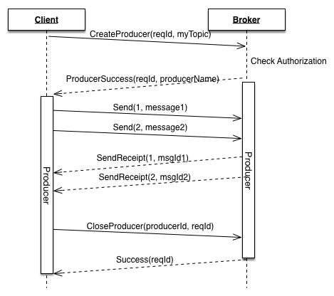

# Pulsarのバイナリプロトコルの仕様

<!-- TOC depthFrom:2 depthTo:3 withLinks:1 updateOnSave:1 orderedList:0 -->

- [フレーミング](#フレーミング)
- [メッセージ・メタデータ](#メッセージメタデータ)
	- [バッチ・メッセージ](#バッチメッセージ)
- [インタラクション](#インタラクション)
	- [接続の確立](#接続の確立)
	- [Keep Alive](#keep-alive)
	- [Producer](#producer)
	- [Consumer](#consumer)
- [サービスディスカバリ](#サービスディスカバリ)
	- [トピックのルックアップ](#トピックのルックアップ)
	- [パーティションドトピックのディスカバリ](#パーティションドトピックのディスカバリ)

<!-- /TOC -->

PulsarはProducer/ConsumerとBrokerの通信に独自バイナリプロトコルを利用しています。
プロトコルは転送と実装の最大効率を保証しながら、
要求される全ての特徴 (例: Ack、フロー制御) をサポートするようにデザインされています。

クライアントとBrokerは互いに *コマンド* を交換します。
コマンドは[Protocol Buffers](https://developers.google.com/protocol-buffers/)によるバイナリメッセージの形式です。

Protocol Buffersによるコマンドの仕様は`PulsarApi.proto`
 ([pulsar-common/src/main/proto/PulsarApi.proto](https://github.com/yahoo/pulsar/blob/master/pulsar-common/src/main/proto/PulsarApi.proto)) に記述されています。

異なるProducerとConsumerのコマンドは同じ接続を介して
制限なく送信、インターリーブできます。

全てのコマンドはenum型と全ての可能なサブコマンドをオプショナルフィールドに含むProtocol Buffersのオブジェクト
[`BaseCommand`](https://github.com/yahoo/pulsar/blob/master/pulsar-common/src/main/proto/PulsarApi.proto#L335)
に埋め込まれています。
いかなる時も、1つの`BaseCommand`は1つのサブコマンドしか設定できません。

## フレーミング

Protocol Buffersはメッセージ・フレームのソートを提供していないため、
Protocol Buffersのデータの前に4バイトのフィールドを追加しています。

1つのフレームの最大サイズは5 MBです。

Pulsarのプロトコルには以下の2つのタイプのコマンドがあります:
 1. ペイロードを持たないシンプルなコマンド。
 2. メッセージの配送や発行に使われるペイロードを持つコマンド。
    このケースではそのコマンドのデータの後に、他のProtocol Buffersのメタデータが追従します。
    効率的な理由からペイロードはProtocol Buffersの外側でRaw形式で渡されます。

全てのサイズは4バイト符号なしビッグエンディアン整数として渡されます。

#### シンプルなコマンド

```
[TOTAL_SIZE] [CMD_SIZE] [CMD]
```

 * `TOTAL_SIZE` → *(4バイト)* フレームのサイズ。その後に続く全てのデータを数える。
 * `CMD_SIZE` → *(4バイト)* シリアライズされたProtocol Buffersのコマンドのサイズ。
 * `CMD` → バイナリ形式にシリアライズされたProtocol Buffersのオブジェクト。

#### ペイロードを持つコマンド

 ```
 [TOTAL_SIZE] [CMD_SIZE][CMD] [MAGIC_NUMBER][CHECKSUM] [METADATA_SIZE][METADATA] [PAYLOAD]
 ```

 * `TOTAL_SIZE` → *(4バイト)* フレームのサイズ。その後に続く全てのデータを数えます。
 * `CMD_SIZE` → *(4バイト)* シリアライズされたProtocol Buffersのコマンドのサイズ。
 * `CMD` → バイナリ形式にシリアライズされたProtocol Buffersのオブジェクト。
 * 実際に永続化されたあとに受け取るデータ。
    * `MAGIC_NUMBER` → *(2バイト)* `0x0e01` 現在のフォーマットを特定するマジックナンバー。
    * `CHECKSUM` → *(2バイト)* この後に続くデータに対するCRC32-Cチェックサム。
    * `METADATA_SIZE` → *(4バイト)* メッセージ・メタデータのサイズ。
    * `METADATA` → バイナリのProtocol Buffers形式のメッセージ・メタデータ。
    * `PAYLOAD` → フレームの残りの部分はペイロードとみなされます。
		   任意のバイト列を含めることができます。

## メッセージ・メタデータ

メッセージ・メタデータは、アプリケーションに指定されたペイロードとともに、
シリアライズされたProtocol Buffersオブジェクトとして保存されます。

メタデータはProducerに作成され、変更されることなくConsumerに渡されます。

フィールド:
 * `producer_name` → メッセージを発行したProducerの名前。
 * `sequence_id` → Producerから割り当てられたメッセージのシーケンスID。
 * `publish_time` → 発行時のタイムスタンプ (UTCで1970年1月1日からのミリ秒単位の経過時間) 。
 * `properties` → アプリケーションに定義された`Pair<String, String>`形式のデータ (Pulsarの動作には影響を与えないKey-Value) 。
 * `replicated_from` → *(任意)* メッセージがレプリケートされたものかを表し、
    レプリケートされたものである場合レプリケート元のクラスタ名。
 * `partition_key` → *(任意)* パーティションドトピックでpubulishされる間、
    キーが存在すれば、そのハッシュをパーティションの選択に利用します。
 * `compression` → *(任意)* ペイロードが圧縮されているか、
    どの圧縮ライブラリが使用されているか。
 * `uncompressed_size` → *(任意)* 圧縮されている場合、
    Producerはこのフィールドに元のペイロードサイズを記述する必要があります。
 * `num_messages_in_batch` → *(任意)* このメッセージが複数のメッセージのバッチである場合は、
    含まれているメッセージの数が記述されている必要があります。

### バッチ・メッセージ

バッチ・メッセージを利用する時、ペイロードはエントリのリストを含んでいます。
それらは`SingleMessageMetadata`により定義された固有のメタデータを持ちます。

1つのバッチのペイロードは以下の通りです:

```
[MD_SIZE_1] [MD_1] [PAYLOAD_1] [MD_SIZE_2] [MD_2] [PAYLOAD_2] ...
```

ここで:
 * `MD_SIZE_X` → シリアライズされたProocol Buffers形式のシングル・メッセージ・メタデータのサイズ。
 * `MD_X` → シングル・メッセージ・メタデータ。
 * `PAYLOAD_X` → アプリケーションから渡されたメッセージペイロード。

`SingleMessageMetadata`のフィールド:
 * `properties` → アプリケーションが定義したプロパティ。
 * `partition_key` → *(任意)* ハッシュによりパーティションを特定するためのKey。
 * `payload_size` → バッチ内の1つのメッセージについてのペイロードのサイズ。

圧縮が有効な場合、バッチ全体が一度に圧縮されます。

## インタラクション

### 接続の確立

BrokerへのTCPコネクションの確立後、クライアントはセッションを開始しなければなりません。
通常これには6650番のポートが利用されます。


Brokerから`Connected`という応答を受け取ると、クライアントは
接続準備完了とみなします。もしBrokerが
クライアントの認証を検証できなれければ、代わりに`Error`コマンドを返し
TCPコネクションをクローズします。

例:

```json
CommandConnect {
   "client_version" : "Pulsar-Client-Java-v1.15.2",
   "auth_method_name" : "my-authentication-plugin",
   "auth_data" : "my-auth-data",
   "protocol_version" : 6
}
```

フィールド:
 * `client_version` → フォーマットの強制されていないString形式の識別子。
 * `auth_method_name` → *(任意)* 認証が有効な場合は認証プラグインの名前。
 * `auth_data` → *(任意)* プラグイン固有の認証データ。
 * `protocol_version` → クライアントのサポートするプロトコルのバージョン。
    Brokerは指定されたバージョンより新しいプロトコルのコマンドを送りません。
		Brokerは最低限のバージョンを要求する可能性があります。

```json
CommandConnected {
   "server_version" : "Pulsar-Broker-v1.15.2",
   "protocol_version" : 6
}
```

フィールド:
 * `server_version` → BrokerのバージョンのString形式の識別子。
 * `protocol_version` → Brokerがサポートするプロトコルのバージョン。
    クライアントは指定されたバージョンより新しいプロトコルのコマンドを送ることができません。

### Keep Alive

クライアントとBrokerの長期のネットワークのパーティションやリモートエンドでの
TCPコネクションを終了しないままマシンがクラッシュした場合
(例: 停電、カーネルパニック、ハードリブート) を識別するため、
リモートピアのアベイラビリティステータスを調べる仕組みが備わっています。

クライアントとBrokerは`Ping`コマンド定期的に送信し、
タイムアウト時間内 (Brokerが使用するデフォルトの値は60秒)に`Pong`レスポンスを受け取らなければ
ソケットをクローズします。

Pulsarクライアントの実装において、`Ping`の送信は必須ではありません。
しかし、Brokerから強制的にTCPコネクションを終了されないために、`Ping`を受け取った場合は
迅速な返答が必要です。

### Producer

メッセージを送るために、クライアントはProducerを作成する必要があります。
Producerを作成する時、Brokerは最初にそのクライアントがトピックへの発行を
認可されているかを検証します。

クライアントがProducerの作成を完了すると、ネゴシエートされたProducer IDを参照して
Brokerにメッセージを発行できます。



##### Producerコマンド

```json
CommandProducer {
  "topic" : "persistent://my-property/my-cluster/my-namespace/my-topic",
  "producer_id" : 1,
  "request_id" : 1
}
```

パラメータ:
 * `topic` → Producerを作成したいトピックの完全な名前。
 * `producer_id` → クライアントが生成した同一接続内で一意に定まるProducerの識別子。
 * `request_id` → レスポンスのマッチングに用いる同一接続内で一意に定まるリクエストの識別子。
 * `producer_name` → *(任意)* Producer名が指定されていればそれが利用され、
    そうでなければ、Brokerが一意に定まる名前を生成します。生成されたProducer名は
		グローバルで一意に定まることが保証されます。Producerが最初に作成された時、
		Brokerに新しいProducer名を作成させ、再接続後にProducerを再作成する時は再利用するという
		実装が期待されます。

Brokerは`ProducerSuccess`コマンドか`Error`コマンドを返します。

##### ProducerSuccessコマンド

```json
CommandProducerSuccess {
	"request_id" :  1,
	"producer_name" : "generated-unique-producer-name"
}
```

パラメータ:
 * `request_id` → `CreateProducer`リクエストのID。
 * `producer_name` → 生成されたグローバルで一意に定まるProducer名、
    もしくはクライアントにより指定された名前。

##### Sendコマンド

`Send`コマンドは既に存在するProducerのコンテキスト内で新しいメッセージを
発行する時に使用されます。このコマンドはコマンドだけでなくペイロードを含むフレーム内で
使用されます。ペイロードは[ペイロードコマンド](#ペイロードコマンド) セクションに記されている
完全なフォーマットで記述されます。

```json
CommandSend {
	"producer_id" : 1,
	"sequence_id" : 0,
	"num_messages" : 1
}
```

パラメータ:
 * `producer_id` → ProducerのID。
 * `sequence_id` → 各メッセージは関連する0からカウントが始まるような
    実装が期待されるシーケンスのIDを持ちます。メッセージの効果的な発行を承認する。
		`SendReceipt`は、シーケンスIDによってメッセージを参照します。
 * `num_messages` → *(任意)* バッチ・メッセージが発行される時に使用されます。

##### SendReceiptコマンド

メッセージが設定されたレプリカの数に応じて永続化されたあと、
BrokerはProducerにメッセージを受け取ったことを示すAck (確認応答) を返します。

```json
CommandSendReceipt {
	"producer_id" : 1,
	"sequence_id" : 0,
	"message_id" : {
     "ledgerId" : 123,
     "entryId" : 456
  }
}
```

パラメータ:
 * `producer_id` → ProducerのID。
 * `sequence_id` → pubulishされたメッセージのシーケンスのID。
 * `message_id` → システムに割り当てられた1つのクラスタ内で一意に定まるメッセージのID。
    メッセージIDは`ledgerId`と`entryId`の2つのlong値から構成されます。
		これらの値はBookKeeperのLedgerに追加された時に割り振られたIDに基づいています。

##### CloseProducerコマンド

**注**: *このコマンドはProducerとBrokerの両方から送信される可能性があります*。

Brokerが`CloseProducer`コマンドを受け取った時、BrokerはProducerからそれ以上のメッセージの受信を
停止し、ペンディング中の全てのメッセージが永続化されるまで待ち、クライアントに`Success`を返します。

Brokerは、正常なフェイルオーバー
(例: Brokerの再起動中、またはトピックが別のBrokerに転送されるようにロードバランサによってアンロードされている場合など)
を実行している時、クライアントに`CloseProducer`コマンドを送ることができます。

Producerが`CloseProducer`コマンドを受け取った時、クライアントはサービスディスカバリ・ルックアップを通じて
Producerを再作成することが期待されます。
この際TCPコネクションは影響を受けません。

### Consumer

Consumerはサブスクリプションへの接続とそこからのメッセージのconsumeに利用されます。
接続後、クライアントはトピックを購読する必要があります。
もしサブスクリプションがそのトピックになければ、新しく作成されます。


#### フロー制御

Consumerの準備が整ったあと、クライアントはBrokerにメッセージをプッシュするための
*パーミッションを与える* 必要があります。これは`Flow`コマンドによって成されます。

`Flow`コマンドは追加の *パーミッション* を与えます。
一般的なConsumerの実装では、アプリケーションがメッセージをconsumeする
準備が整うまでのメッセージの蓄積にキューを利用します。

アプリケーションがメッセージをデキューしたあと、Consumerは
Brokerに対してさらなるメッセージをプッシュするパーミッションを送ります。

##### Subscribeコマンド

```json
CommandSubscribe {
	"topic" : "persistent://my-property/my-cluster/my-namespace/my-topic",
	"subscription" : "my-subscription-name",
	"subType" : "Exclusive",
	"consumer_id" : 1,
	"request_id" : 1
}
```

パラメータ:
 * `topic` → Consumerを作成したいトピックの完全な名前。
 * `subscription` → サブスクリプション名。
 * `subType` → サブスクリプションタイプ: Exclusive, Shared, Failover
 * `consumer_id` → クライアントが生成した同一接続内で一意に定まるConsumerの識別子。
 * `request_id` → レスポンスのマッチングに用いる同一接続内で一意に定まるリクエストの識別子。
 * `consumer_name` → *(任意)* クライアントはConsumer名を指定できます。
    この名前は、ステータス上で特定のConsumerを追跡するのに利用されます。
    また、サブスクリプションタイプがFailoverの時、この名前はどのConsumerが *master* (メッセージを受け取るConsumer) となるかを
		決めるのに使用されます。ConsumerはConsumer名によってソートされ、最初のものが
		masterとして選ばれます。

##### Flowコマンド

```json
CommandFlow {
  "consumer_id" : 1,
  "messagePermits" : 1000
}
```

パラメータ:
  * `consumer_id` → ConsumerのID。
  * `messagePermits` → Brokerに対して追加でプッシュを許可するメッセージの数。

##### Messageコマンド

`Message`コマンドはBrokerが、与えられたパーミッションの制限内で
Consumerにメッセージをプッシュする際に使用されます。

このコマンドはコマンドだけでなくペイロードを含むフレーム内で
使用されます。ペイロードは[ペイロードコマンド](#ペイロードコマンド) セクションに記されている
完全なフォーマットで記述されます。

```json
CommandMessage {
	"consumer_id" : 1,
	"message_id" : {
    "ledgerId" : 123,
    "entryId" : 456
  }
}
```


#### Ackコマンド

`Ack`コマンドは与えられたメッセージがアプリケーションによって正しく処理され、
Brokerによる破棄が可能であるというBrokerへの信号です。

加えて、Brokerは`Ack`の返されたメッセージに基いて
Consumerの購読位置を管理します。

```json
message CommandAck {
	"consumer_id" : 1,
	"ack_type" : "Individual",
	"message_id" : {
    "ledgerId" : 123,
    "entryId" : 456
  }
}
```

パラメータ:
 * `consumer_id` → ConsumerのID。
 * `ack_type` → Ackのタイプ: `Individual` もしくは `Cumulative`
 * `message_id` → メッセージのID。
 * `validation_error` → *(任意)* Consumerが次の理由のためメッセージを
    破棄したことを示します: `UncompressedSizeCorruption`,
   `DecompressionError`, `ChecksumMismatch`, `BatchDeSerializeError`

##### CloseConsumerコマンド

***注***: *このコマンドはConsumerとBrokerの両方から送信される可能性があります*。

このコマンドは[`CloseProducer`](#closeproducerコマンド)と同様の振る舞いをします。

##### RedeliverUnacknowledgedMessagesコマンド

ConsumerはBrokerに、特定のConsumerにプッシュしたがまだ`Ack`が返っていないメッセージの
再配送を要求できます。

そのProtocl BuffersオブジェクトはConsumerが再配送してほしい
メッセージのIDのリストから構成されます。リストが空の場合は、
Brokerはペンディング中の全てのメッセージを再送します。

再配送において、メッセージは同一のConsumer、あるいはサブスクリプションタイプがSharedの場合は
全ての利用可能なConsumerに送信されます。

## サービスディスカバリ

### トピックのルックアップ

トピックのルックアップはクライアントがProducer, Consumerを作成、再接続する度に必要となります。
ルックアップはどの特定のBrokerが、利用しようとしているTopicを提供しているかを見つけるのに使用されます。

ルックアップは[admin API](AdminTools.md#トピックのルックアップ)で
説明されているREST APIのコールで行うことが可能です。

Pulsar-1.16からは、バイナリプロトコルで行うことも可能です。

例として、サービスディスカバリコンポーネントを`pulsar://broker.example.com:6650`で
起動していると仮定します。

個別のBrokerは`pulsar://broker-1.example.com:6650`,
`pulsar://broker-2.example.com:6650`, ...で起動しています。

クライアントはサービスディスカバリへの接続を`LookupTopic`コマンドを
送るために利用できます。レスポンスは接続すべきBrokerのホスト名、あるいは
ルックアップをリトライするためのBrokerのホスト名のどちらかです。

`LookupTopic`コマンドは`Connect` / `Connected`の最初のハンドシェイクを終えた
接続で使用されなければなりません。


```json
CommandLookupTopic {
	"topic" : "persistent://my-property/my-cluster/my-namespace/my-topic",
	"request_id" : 1,
	"authoritative" : false
}
```

フィールド:
 * `topic` → ルックアップするトピックの名前。
 * `request_id` → レスポンスとともに受け取るリクエストのID。
 * `authoritative` → 最初のルックアップリクエストではfalse、その後に続くリダイレクトのレスポンスでは
   クライアントはレスポンスに含まれているものと同じ値を渡すべきです。

##### LookupTopicResponse

成功時のレスポンス例:

```json
Command LookupTopicResponse {
  "request_id" : 1,
  "response" : "Connect",
  "brokerServiceUrl" : "pulsar://broker-1.example.com:6650",
  "brokerServiceUrlTls" : "pulsar+ssl://broker-1.example.com:6651",
  "authoritative" : true
}
```

リダイレクト時のレスポンス例:

```json
Command LookupTopicResponse {
  "request_id" : 1,
  "response" : "Redirect",
  "brokerServiceUrl" : "pulsar://broker-2.example.com:6650",
  "brokerServiceUrlTls" : "pulsar+ssl://broker-2.example.com:6651",
  "authoritative" : true
}
```

後者の場合、`LookupTopic`コマンドリクエストを`broker-2.example.com` に対して再発行する必要があります。
このBrokerはルックアップリクエストに対して決定的なレスポンスを返すことができます。

### パーティションドトピックのディスカバリ

パーティションドトピックのメタデータのディスカバリはトピックがパーティションドトピックかどうか、
いくつのパーティションがセットアップされているかを調べるのに利用されます。

トピックがパーティションドである場合、クライアントは`partition-X`というサフィックスを用いて
各パーティションにつき一つのProducerあるいはConsumerを作成することが期待されます。

この情報は最初にProducerあるいはConsumerが作成される時のみに利用されます。
再接続後は必要ありません。

パーティションドトピック・メタデータのディスカバリはトピックのルックアップと非常によく似た働きをします。
クライアントはサービスディスカバリに対してリクエストを送り、レスポンスには実際のメタデータが含まれます。

##### PartitionedTopicMetadataコマンド

```json
CommandPartitionedTopicMetadata {
  "topic" : "persistent://my-property/my-cluster/my-namespace/my-topic",
  "request_id" : 1
}
```

フィールド:
 * `topic` → パーティションのメタデータを確認するトピック。
 * `request_id` → レスポンスに渡されるリクエストのID。

##### PartitionedTopicMetadataResponseコマンド

メタデータ付きのレスポンスの例:

```json
CommandPartitionedTopicMetadataResponse {
  "request_id" : 1,
  "response" : "Success",
  "partitions" : 32
}
```
