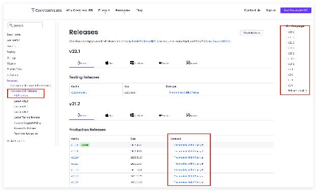

# PIP-148: Create Pulsar client release notes

* **Status**: WIP
* **Initiator**: Anonymitaet
* **Contributor**: Anonymitaet, urfreespace (feel free to add your names if missing)
* **Initial mailing list discussion**: click [here](https://lists.apache.org/thread/nhf2dbdxr3vp25hbm6kgo06vdtmcjoh3)
* **Design proposal, solution, implementation progress, and all details**: click [here](https://docs.google.com/document/d/1o6MWV3GvXQgKw1ZpL86y43xjnYvaUKrl6HxJKZnQyEU/edit)

# **Pain point**

For [Pulsar release notes](https://pulsar.apache.org/release-notes/#2.8.1), we had these issues for a long time:

* All contents are on a single Pulsar release note page. No navigations. It's easy to get lost and hard to understand which changes belong to which Pulsar version.
* Java, C++, Python, and WebSocket clients do not have independent release notes, they belong to parts of Pulsar release notes. It is hard to find and use.
* Go, Node.js, C\# clients’ changelog are hosted in their own GitHub repos and not shown on Pulsar websites. Users need more clicks to get the info.

Besides, we received some negative feedback from users:

The ones that are included with Pulsar Releases are not specified in an explanatory way. Like for example the link below will take me to C++ Client release notes for Pulsar Version 2.8.1 and 2.8.2 so I cannot give them a single landing page for C++ Client Release notes Only, they have to go on Pulsar Release notes page and find what clients have fixes or improvements for which Pulsar release also the link I specified below has numbering like client-1 and client-2 that also doesn’t help me to understand which Pulsar release it is referring to unless I Scroll all the way to see that. And then the Page we have created to point our users to Release notes we have to go and specify Pulsar version in front of them as I have shown below which not much user friendly.
So the ask here is that If we can get a single URL for each client release documents and on that page they can see what Pulsar version has fixes for this particular client and may be some Pulsar version doesn’t have any fixes
[https://pulsar.apache.org/release-notes/\#c-client-2](https://pulsar.apache.org/release-notes/#c-client-2) \--\> Pulsar Version 2.8.1
[https://pulsar.apache.org/release-notes/\#c-client-1](https://pulsar.apache.org/release-notes/#c-client-1) \---\> Pulsar Version 2.8.2

# **Solution**

## **Summary**

Here are [mockups](https://docs.google.com/spreadsheets/d/1MT8vt0620Cy4tggKk3gDVPbnhH7GVakld-5aDYCGAko/edit#gid=0).

\- Create a "Release notes" chapter to docs, which shows all releases changes and release timeline.

\- Add necessary explanations, such as time-based release plan, release frequency, semantic versioning, maintenance life cycle, etc.

\- Create independent release notes for all clients.

\- Automate the process of generating all release notes, which is relevant to [PIP 112: Generate Release Notes Automatically](https://docs.google.com/document/d/1Ul2qIChDe8QDlDwJBICq1VviYZhdk1djKJJC5wXAGsI/edit#heading=h.i6xzdu60m1fw).

\- Add navigations, etc.

## **Idea solution details**

* Create an independent webpage

In the new Pulsar doc IA, the [release note belongs to the Reference chapter](https://docs.google.com/spreadsheets/d/1Zl7OUlh4McGOgkeePWP46HqMDEyG5GF8k0B3C5D5T7w/edit#gid=958558547&range=E40), so we can create an independent webpage for the release note.

* Add left and right navigation

  [https://docs.pingcap.com/tidb/stable/release-notes](https://docs.pingcap.com/tidb/stable/release-notes)

* Add timeline table, including version NO., release date, download link, release naming conventions.

[https://docs.pingcap.com/tidb/stable/release-timeline](https://docs.pingcap.com/tidb/stable/release-timeline)

[https://www.cockroachlabs.com/docs/releases/index.html](https://www.cockroachlabs.com/docs/releases/index.html)

* On the release note page for each version, create the right navigation.

[https://docs.pingcap.com/tidb/stable/release-5.4.0](https://docs.pingcap.com/tidb/stable/release-5.4.0)

* Make each release has its own .md file

  Some engineers complain that it is time-consuming to open and edit the release-note.md since all release note content is stored in one release-note.md and it contains 3600+ lines.

## **Workarounds**

### **Solution 1: Add version NO. to release note URL.**

I’ve discussed with engineers:

* Many of them pay attention to URLs when scanning websites.
* Note: if we implement this enhancement, version NO. is only shown after clicking the link icon, or else (eg. scrolling up and down but not clicking anything) it is not shown

### **Solution 2: add version NO. after headings**

We deprecated it since:

* ⬇️ readability. A little redundant.
* time-consuming
* involves much manual work

### **Solution 3: add right navigation**

We deprecated it temporary since it is more difficult to implement (compared with solution 1\)

[https://docs.konghq.com/gateway/changelog/](https://docs.konghq.com/gateway/changelog/)

## **Deprecated**

We’re considering changing 2-level headings to multiple tabs to improve readability, but it “reduces searchability” since all content is not shown at a glance.

##

# **Progress**

Mar 4, 2022
Create PIP 148 and submit initial discussion to community
[https://lists.apache.org/thread/nhf2dbdxr3vp25hbm6kgo06vdtmcjoh3](https://lists.apache.org/thread/nhf2dbdxr3vp25hbm6kgo06vdtmcjoh3)

# **Issues**

The following issues are to be resolved:

- [ ] Wordings
      - [ ] CPP → C++
      - [ ] Node → Node.js
      - [ ] Websocket → WebSocket
- [ ] Add version NO. on each client release note page
- [ ] On the Node.js release note page
      - [ ] Change the format of “version.NO. \- release date” (headings) → running text
      - [ ] Show heading 1 on the right navigation panel
