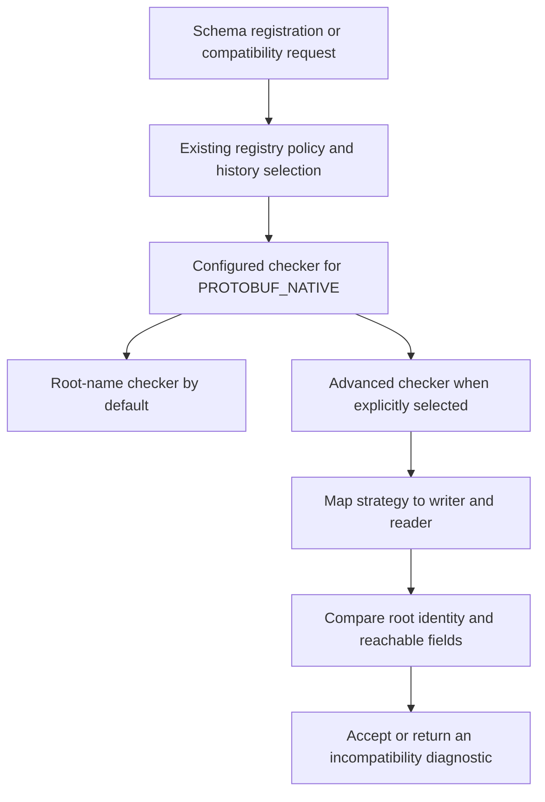

# PIP-246: Improve PROTOBUF_NATIVE schema compatibility checks without avro-protobuf

# Background knowledge

Pulsar's schema registry stores schema versions for a topic and checks whether a proposed schema
can coexist with previously registered versions. A compatibility strategy determines the direction
of the check. `BACKWARD` asks whether a new reader can read data written with the previous schema;
`FORWARD` asks whether the previous reader can read data written with the new schema; `FULL` requires
both. Their transitive variants compare against all versions selected by the registry, rather than
only the latest version.

`PROTOBUF_NATIVE` stores a Protobuf schema as a serialized `FileDescriptorSet`, the root file name,
and the root message's fully qualified name. The descriptor set contains the message definitions and
their dependencies. The broker can reconstruct these descriptors without loading application classes
or converting the schema to Avro. This representation is distinct from Pulsar's legacy `PROTOBUF`
schema type.

Protobuf binary messages identify fields by number and encoding, rather than by field name.
Compatibility also depends on required fields, repeated fields, message types, enums, maps, and
`oneof` groups. A `oneof` allows only one of its member fields to be set at a time. A closed enum
exposes only its declared numeric values through the field; an open enum can also represent
unrecognized numeric values.

Protobuf supports `proto2`, `proto3`, and Editions. Editions express behaviors such as field presence,
enum openness, and repeated-field encoding through inherited feature settings. Consequently, comparing
syntax strings or raw field labels is insufficient to determine compatibility. Further background is
available in the [Protobuf language guide](https://protobuf.dev/programming-guides/proto3/#updating)
and [Editions feature documentation](https://protobuf.dev/editions/features/).

The existing `PROTOBUF_NATIVE` compatibility checker requires equal root message full names for the
six directional strategies. It does not compare fields. Checkers are selected through the broker's
`schemaRegistryCompatibilityCheckers` configuration, with one checker per schema type.

# Motivation

Two schemas can retain the same root message name while making incompatible changes to their fields.
For example, changing `Order.id` from `int64` to `string` at field number `1` passes the root-name
check. The schemas describe different encodings, and a reader may no longer obtain the expected
field value.

Even a successful parse does not establish safe evolution. Changing an integer field's width can
truncate values, and combining independent fields into a `oneof` can discard a value. The registry
does not know application value restrictions or the order in which every producer and consumer will
be upgraded, so it cannot establish the additional conditions needed to permit such changes.

This proposal introduces field-level compatibility checks using Protobuf descriptors directly,
while retaining the existing checker as the default. It permits ordinary field additions without
an explicit default and changes between packed and expanded representations of the same repeated
scalar field. It rejects changes whose safety depends on assumptions the broker cannot verify.

# Goals

## In Scope

- Provide an opt-in broker checker for `PROTOBUF_NATIVE`, including native schemas used as the key
  or value of a `KEY_VALUE` schema.
- Define directional binary reading rules for fields reachable from the root message, including
  nested and recursive messages, required fields, maps, real `oneof` groups, and enums.
- Support `proto2`, `proto3`, Edition 2023, and Edition 2024 within the feature boundaries below.
- Reuse the existing descriptor storage format, schema registry strategies, and checker extension
  point, without Avro conversion or modifications to upstream Protobuf.
- Provide bounded diagnostics that identify incompatible changes and unsupported constructs.
- Preserve the existing checker as the default and support coordinated activation and rollback.

## Out of Scope

- Compatibility of generated source APIs, ProtoJSON, text format, RPC services, or application
  semantics such as units and business meaning.
- Validation of each published message, preservation of every unknown field through arbitrary
  read/write cycles, or a guarantee of lossless whole-message round trips.
- Client Protobuf runtime upgrades, generated-class compatibility, shading, and changes to the
  legacy `PROTOBUF` schema type.
- Changes to the registry's consumer compatibility strategy mapping.
- A new schema storage format, wire protocol, public validator SPI, or external registry dependency.
- Repairing existing schema histories, automatically migrating topics, or changing the default
  checker in this PIP.
- Extension payload compatibility, MessageSet, and schemas of dynamically embedded payloads that
  are not identified by the root descriptor graph.

# High Level Design

Introduce an advanced checker as an opt-in alternative to the existing root-name checker. Operators
will select it through `schemaRegistryCompatibilityCheckers`. The two checkers are alternatives;
only one will handle `PROTOBUF_NATIVE` in a broker.

The registry will continue to select the historical schemas to compare. The advanced checker will
reconstruct their root descriptors and interpret each comparison as a writer and a reader. It will
compare fields by number, follow referenced message and enum types, and apply the directional rules
below. A comparison will either succeed or identify an incompatible change or unsupported construct.



The proposal changes schema compatibility decisions at registration and compatibility-check time.
It adds no validation to message publication or dispatch. JSON, Avro, External, and deployment-specific
checkers will retain their existing selection and behavior.

# Detailed Design

## Design & Implementation Details

Define `canRead(writer, reader)` as whether values written in the declared fields of a valid writer
message can be read according to the reader under the rules in this proposal. Writer messages are
assumed to satisfy the writer's required-field and `oneof` constraints. Arbitrary raw bytes or unknown
fields carried forward from another schema are not evidence of what the writer descriptor guarantees.

This is a conservative policy for binary reading. A schema may add or remove ordinary fields, so
acceptance does not promise that every field remains visible to every application. For fields present
on both sides, the checker will reject the unsafe conversions and combinations defined below. Root
identity, default-value stability, and detectable renumbering are additional Pulsar policy constraints.
All scalar type changes will be rejected, including conditionally wire-compatible conversions.

The baseline is Protobuf binary schema semantics, with runtime-dependent enum and UTF-8 behavior
interpreted according to the Java runtime bundled with Pulsar. Acceptance will not certify every
client language or runtime, nor establish application-level semantic compatibility.

The supported language set will be `proto2`, `proto3`, Edition 2023, and Edition 2024. Support requires
that the broker can reconstruct the descriptors and resolve the features used by these rules.
A dependency upgrade will not automatically expand this set. A later Edition or an uninterpretable
feature will produce `UNSUPPORTED_FEATURE` when a comparison is required.

The comparison scope starts at the declared root message and follows field references, including map
values and imported message and enum types. Root messages may themselves be nested. Both reachable
graphs must satisfy the supported-feature boundary, including fields without a match in the other
schema. Feature settings inherited from containing messages also apply, even when those containing
messages are not otherwise reachable through fields.

Unreachable declarations will impose no additional evolution rules. The root file and its imported
dependencies must nevertheless be valid for descriptor reconstruction. Source comments, services,
and options that do not affect binary reading will not constrain compatibility.

| Construct | Proposed behavior |
| --- | --- |
| Ordinary fields, nested messages, recursion, maps, and real `oneof` groups | Apply the directional rules below. |
| Groups and Editions delimited messages | Compare the effective message encoding and the contents. Reject a change between delimited and length-prefixed encoding. |
| Reachable messages with extension ranges or MessageSet encoding | Return `UNSUPPORTED_FEATURE`; ordinary-field comparison cannot establish compatibility of their complete payloads. |
| Enum fields whose Java legacy closed-enum behavior differs from the declared enum behavior | Return `UNSUPPORTED_FEATURE`. |
| `google.protobuf.Any` | Compare its declared wrapper fields without resolving `type_url` or inspecting the embedded payload. |
| Application data encoded inside `bytes` or `string` | Compare the declared field only. |
| Ordinary custom options | Do not infer application validation or serialization behavior from them. |
| Unknown feature fields or extensions, including unknown fields within Java feature options | Return `UNSUPPORTED_FEATURE`. |

Descriptor reconstruction will use the existing stored representation and preserve the standard Java
feature options needed to determine binary reading behavior. Missing root files, unresolved or cyclic
file imports, and invalid root message names will be rejected. A root message must resolve to its
stored full name within the declared root file, including its package and any containing messages.
These requirements will apply to shared native descriptor reconstruction, including callers using the
default checker. They will not enable field-level compatibility rules in that checker or change the
stored representation. Recursive message references remain valid and are distinct from cyclic file
imports.

For schema registration or a general compatibility request comparing an existing schema `S` with
a proposed schema `N`, the required directions will be:

| Strategy | Required comparison |
| --- | --- |
| `BACKWARD` | `canRead(S, N)` |
| `FORWARD` | `canRead(N, S)` |
| `FULL` | Both directions |
| `BACKWARD_TRANSITIVE` | `canRead(Si, N)` for every historical `Si` selected by the registry |
| `FORWARD_TRANSITIVE` | `canRead(N, Si)` for every selected `Si` |
| `FULL_TRANSITIVE` | Both directions for every selected `Si` |

History selection and deleted-history handling will remain the registry's responsibility. The checker
will compare the supplied schemas without fetching additional history or inferring a latest version
from collection order. An empty selected history requires no directional comparison.

`ALWAYS_COMPATIBLE` will bypass evolution constraints without disabling existing schema-data validation
during registration. `ALWAYS_INCOMPATIBLE` will reject evolution when a comparison is required.
An unexpected strategy will be rejected explicitly. First registration and reuse of an already
registered schema will retain their existing shortcuts; enabling the checker will not certify every
stored schema. A `KEY_VALUE` schema will use the configured checker for each component's schema type,
with the direction and history selected by the registry.

Consumer compatibility will retain the existing strategy mapping. Let `C` be the consumer schema,
`L` the latest active schema, and `Si` each active historical schema selected by the registry:

| Configured strategy | Strategy passed to the checker | Selected history | Required comparison |
| --- | --- | --- | --- |
| `BACKWARD` | `BACKWARD` | Latest | `canRead(L, C)` |
| `FORWARD` | `BACKWARD` | Latest | `canRead(L, C)` |
| `FULL` | `BACKWARD` | Latest | `canRead(L, C)` |
| `BACKWARD_TRANSITIVE` | `BACKWARD_TRANSITIVE` | All selected versions | `canRead(Si, C)` for every `Si` |
| `FORWARD_TRANSITIVE` | `BACKWARD` | Latest | `canRead(L, C)` |
| `FULL_TRANSITIVE` | `FULL_TRANSITIVE` | All selected versions | Both `canRead(Si, C)` and `canRead(C, Si)` for every `Si` |
| `ALWAYS_COMPATIBLE` | Checker bypassed | None | No evolution check |
| `ALWAYS_INCOMPATIBLE` | `ALWAYS_INCOMPATIBLE` | All selected versions | Reject when the checker is invoked |

This mapping includes a policy restriction beyond consumer readability: `FULL_TRANSITIVE` requires
the reverse direction as well, while `FULL` checks only whether the consumer can read the latest
schema. `FORWARD_TRANSITIVE` also retains its latest-only consumer check.

For example, suppose every selected producer schema declares `required int32 id = 1`, and a consumer
declares `optional int32 id = 1` with the same effective default. The consumer can read those producer
messages. It passes the required-field rule under consumer `FULL` and `BACKWARD_TRANSITIVE`, but fails
under `FULL_TRANSITIVE`: a hypothetical writer using `C` could omit `id`, so `canRead(C, Si)` fails.
This enforces the retained registry policy rather than indicating that the consumer cannot read the
producer's messages.

Existing schema-equality shortcuts and missing-schema behavior will remain at their current registry
boundaries. In particular, a transitive consumer request does not inherit the registration shortcut
for reuse of an identical schema. Changing consumer strategy mapping is outside this proposal because
it would affect registry semantics shared with other schema types.

For each writer/reader message pair, fields will be matched by number within their containing messages.
The following rules will apply:

| Condition | Result |
| --- | --- |
| Root message full names differ | Reject, preserving the Pulsar root identity constraint. |
| A writer field has no corresponding reader field | Allow it to be unknown to the reader. |
| A reader field has no corresponding writer field | Allow if the reader field is not required. No explicitly declared default is necessary. |
| A reader field is required | The corresponding writer field must also be required, and the other rules must pass. |
| A field keeps its number but changes its name | Allow if the other rules pass. |
| A field keeps its name but changes its number within the corresponding message | Reject as a detectable field-number change. |
| A matched field changes its scalar type, or changes between scalar, enum, and message kinds | Reject, including conversions that share a wire type. |
| A matched field changes between singular and repeated | Reject in either direction. |
| A packable repeated field keeps its type but changes packed/expanded encoding | Allow. |
| A matched singular scalar or enum field changes its effective default value | Reject as a conservative policy constraint. |
| A matched field refers to a message | Compare its effective encoding and the referenced message pair. |
| A matched field is a map | Both sides must be maps with the same key type; apply the scalar, enum, or message rules to the value. |
| A map changes to or from a repeated entry message | Reject, even if the wire representation is similar. |
| A matched string field adds UTF-8 validation that the writer does not guarantee | Reject. Removing that validation does not by itself reject the direction. |
| A field changes between implicit and explicit presence without becoming required | Allow if the default, enum, `oneof`, and other field rules pass. |

For referenced message and enum types, a type-name change alone will not reject a comparison. Their
structures and effective behaviors will determine compatibility. The full-name identity requirement
applies specifically to the root message.

Default comparison will use the effective value, regardless of whether it was explicitly declared.
For example, an explicit numeric default of `0` and the same implicit default are equivalent. Enum
defaults will be compared by number, bytes by contents, and floating-point defaults by a comparison
that treats NaN defaults consistently and distinguishes positive and negative zero. Repeated and
message fields will not receive scalar default-value comparisons.

Declaration reordering will be allowed when effective behavior is preserved. For example, changing
`enum State { A = 1; B = 2; }` to `enum State { B = 2; A = 1; }` in proto2 changes the implicit default
of `optional State state = 1` from `1` to `2`. An absent field then yields a different value, so the
default-value rule rejects the comparison. If both fields explicitly retain `[default = A]`, their
effective default remains `1`, and the reordering alone is allowed.

Requiredness will be directional. Changing an optional field to required fails `BACKWARD` because
the previous writer may omit it, but passes this rule under `FORWARD` because the proposed writer
guarantees it. `FULL` fails. Reversing the change reverses the directional results. The same rule
applies to Editions `LEGACY_REQUIRED`.

For each real reader `oneof`, consider its member field numbers also present in the writer. If there
are two or more, they must belong to the same real writer `oneof`. Otherwise the writer can supply
multiple fields that the reader would make mutually exclusive. This permits moving one independent
field into a new `oneof`, or splitting a writer `oneof` in the reader, when the remaining rules pass.
The reverse direction can fail. Renaming a `oneof` does not change its exclusivity constraints.
Synthetic `oneof` declarations used to represent proto3 optional presence will be excluded from
this relationship rule.

Enum comparison will use numeric values, deduplicating aliases. Let `W` and `R` be the sets of declared
numbers in the writer and reader enums:

| Writer behavior | Reader behavior | Rule |
| --- | --- | --- |
| Closed | Closed | Require `W` to be a subset of `R`. |
| Closed | Open | Allow, subject to the default-value and other field rules. |
| Open | Open | Allow, subject to the other rules; unrecognized numeric values remain representable. |
| Open | Closed | Reject: the writer may produce a number absent from `R`, even if the declared sets are equal. |

The numeric-set rule applies to the full signed 32-bit enum range. Renaming a value or adding an alias
for the same number does not change binary interpretation. Changing the number assigned to an
existing named value will be rejected as detectable renumbering. Moving an unrecognized value into
an unknown-field set is insufficient to establish readability: it can hide a singular value, remove
repeated elements, or remove map entries.

A reachable enum field will be unsupported if its Java legacy closed-enum behavior differs from the
declared openness of its enum. This includes the legacy treatment of a proto3 enum referenced by a
proto2 field and an Editions Java override that creates the same mismatch. This restriction applies
to either graph even when the field is unchanged or has no match in the other schema. It avoids
assuming agreement between conflicting runtime interpretations; it does not establish that the
proposed field change itself would prevent reading.

Compatibility will use effective feature settings after inheritance, rather than syntax strings or
raw labels alone. Relevant settings include field presence, enum openness, repeated-field encoding,
UTF-8 validation, and message encoding. Feature settings on files, messages, fields, `oneof` groups,
enums, and enum values will participate where applicable, including enclosing scopes of referenced
nested types.

Unknown fields and extensions within feature metadata will be rejected, including unknown numeric
feature values and unknown fields inside Java feature options. Explicit `*_UNKNOWN` values for
`field_presence`, `enum_type`, `repeated_field_encoding`, `utf8_validation`, and `message_encoding`
will also be rejected. The same applies to Java `features.(pb.java).utf8_validation`. An omitted
setting will instead inherit its enclosing or Edition default. This explicit-value restriction
concerns the listed binary features; it will not impose the same rule on known JSON, naming, or
code generation settings that do not affect binary reading.

For a matched string field, effective UTF-8 validation can depend on proto2 `java_string_check_utf8`,
Editions `features.utf8_validation`, or Java `features.(pb.java).utf8_validation`. A writer without
validation can produce bytes rejected by a validating reader, so enabling validation in the reader
will reject that direction. The reverse direction will remain subject to the other field rules.

The default-value and detectable-renumbering restrictions are conservative policy choices, rather
than claims that parsing necessarily fails for every such change. A descriptor pair cannot reliably
distinguish a rename combined with renumbering from an intentional deletion and addition, or detect
changed application meaning at an unchanged number. Authors should reserve removed field numbers
and avoid reusing them. Transitive checks can detect conflicting definitions in older versions that
latest-only checks miss.

Recursive and mutually recursive message graphs must terminate under comparison. A descriptor may
participate in multiple ordered writer/reader pairs, each with its own compatibility obligations.
Comparison state will be isolated between requests. Work will depend on the actual descriptor graphs,
fields, enum values, and selected history, rather than the magnitude of the largest field number.
No network lookup or application class loading will be required to compare schemas.

## Public-facing Changes

### Public API

No client, REST, or checker interface method signatures will change. Selecting the advanced checker
will introduce stricter acceptance through existing incompatibility responses. Applications that
rely on the root-name-only check may therefore encounter registration or consumer compatibility
failures after activation.

A comparison diagnostic will identify the requested strategy, the actual comparison direction, a
rule, the message or field path and number where applicable, and concise writer/reader descriptions.
It will identify the existing schema by the SHA-256 fingerprint of its stored schema bytes. Registry
version numbers will not be inferred from collection order. For example, with the fingerprint
abbreviated:

```text
TYPE_CHANGED: strategy=BACKWARD, direction=BACKWARD, existingSchemaSha256=<64 hex digits>,
path=example.Order.items.price, field=3, writer=INT64, reader=INT32
```

Other rule identifiers will include `ROOT_MESSAGE_CHANGED`, `FIELD_NUMBER_CHANGED`,
`REQUIRED_FIELD_NOT_GUARANTEED`, `MAP_CHANGED`, `CARDINALITY_CHANGED`, `DEFAULT_CHANGED`,
`UTF8_VALIDATION_ADDED`, `ONEOF_CONFLICT`, `ENUM_VALUE_NOT_READABLE`, and `UNSUPPORTED_FEATURE`.

Failures before descriptor comparison will have separate diagnostics. `ALWAYS_INCOMPATIBLE` and
`UNKNOWN_STRATEGY` will identify strategy rejection. If reconstruction fails and readable metadata
identifies an unsupported language or feature, the result will be `UNSUPPORTED_FEATURE`; other
reconstruction failures will produce `SCHEMA_RECONSTRUCTION_FAILED`. These failures will not include
a comparison direction, field path, or schema fingerprint.

Comparison diagnostics will report the first failure and be limited to 2,048 characters. Error text
will remain human-readable rather than becoming a new machine-readable response format. Complete
descriptors and message payloads will not be included.

### Configuration

The default value of `schemaRegistryCompatibilityCheckers` will remain unchanged. To opt in, replace:

```text
org.apache.pulsar.broker.service.schema.ProtobufNativeSchemaCompatibilityCheck
```

with:

```text
org.apache.pulsar.broker.service.schema.ProtobufNativeSchemaAdvancedCompatibilityCheck
```

For the standard checker list, the resulting configuration will be:

```properties
schemaRegistryCompatibilityCheckers=org.apache.pulsar.broker.service.schema.JsonSchemaCompatibilityCheck,org.apache.pulsar.broker.service.schema.AvroSchemaCompatibilityCheck,org.apache.pulsar.broker.service.schema.ProtobufNativeSchemaAdvancedCompatibilityCheck,org.apache.pulsar.broker.service.schema.ExternalSchemaCompatibilityCheck
```

Deployment-specific checker entries should be preserved. Exactly one checker will be selected for
`PROTOBUF_NATIVE`; checkers for the same schema type will not form a validation chain.

When the advanced checker is explicitly selected, broker startup will fail if another checker also
handles `PROTOBUF_NATIVE`, including the default checker or a custom checker. Startup will also fail
if schema storage is unavailable or schema registry initialization fails, including initialization
of another configured checker. The broker will not silently fall back to an empty schema registry
and disable the requested policy. Configurations that do not select the advanced checker will retain
their existing initialization behavior.

This will be a broker-wide choice through an existing startup setting. No new dynamic switch or
per-topic checker setting is proposed. Topic, namespace, and broker compatibility strategies will
continue to control direction and history scope. Changing the checker will require restarting
brokers with a consistent selection across all brokers that can own the affected topics.

# Monitoring

Operators should monitor schema incompatibility results, schema registry request latency, and
producer or consumer connection failures during activation. Compare these with the deployment's
baseline and use the returned rule and path to investigate rejected changes. Unsupported constructs
should be distinguished from incompatible evolution.

Existing schema registry metrics will continue to provide operation counts and request duration.
No new metrics or labels are proposed. Schema names, field paths, and fingerprints will not become
metric labels; the diagnostic will provide that detail.

# Security Considerations

The checker will operate on schema data supplied through existing authenticated and authorized paths.
It will add no endpoint, privilege, network lookup, or cross-tenant history access. In particular,
`Any` type URLs will not be fetched, and application classes will not be loaded to inspect a schema.

Descriptors will remain untrusted input subject to existing schema validation and request limits.
Recursive message graphs must not cause unbounded traversal, and sparse field numbers must not cause
resource use proportional to the maximum tag. Diagnostics will be bounded and contain only information
from schemas involved in the authorized operation. Complete schema contents and message payloads
must not be logged.

# Backward & Forward Compatibility

The default checker selection and its root-name policy will remain unchanged, as will schema storage,
message encoding, and the Pulsar binary protocol. No schema-data migration will be required. Shared
descriptor reconstruction will preserve Java features and validate imports and root identity for all
callers, including those using the default checker.

Selecting the advanced checker will intentionally tighten evolution acceptance and schema registry
initialization. This will be an operator-controlled behavior change. First-registration and reuse
shortcuts will remain, so activation will not scan history, disconnect existing clients, or revalidate
every stored schema.

## Upgrade

1. Upgrade broker binaries while retaining the existing native checker. Upgrading alone must not
   enable field-level compatibility rules.
2. Review retained schema versions and representative producer/consumer schemas with the advanced
   checker and the intended strategies before activation. Include the supported-feature boundary
   and all history relevant to transitive checks. Consumer `FULL_TRANSITIVE` can reject a consumer
   whose reading direction passes, and an unsupported field can block an otherwise ordinary addition.
3. Resolve incompatible evolution or plan application/topic migrations. Registering a new schema
   does not repair unreadable data or make previously accepted versions compatible.
4. Coordinate checker selection across all brokers that may own the topics. Control schema evolution
   during rolling activation until configuration is consistent, since topic movement or client
   reconnection between differently configured brokers can change compatibility decisions.
5. Resume schema evolution after configuration is consistent and monitor compatibility outcomes
   and registry latency.

## Downgrade / Rollback

Replace the advanced entry with `ProtobufNativeSchemaCompatibilityCheck` and restart brokers with a
consistent configuration. Restore this configuration before starting an older binary that does not
contain the advanced checker. Stored schemas will not need to be rewritten.

Rolling back the checker will restore the weaker acceptance policy. It will not undo registrations
or repair application compatibility. A binary downgrade must separately account for whether the older
Protobuf runtime can reconstruct every schema in use, especially Editions and their features. An
unchanged storage format does not guarantee support for newer schema-language features.

## Pulsar Geo-Replication Upgrade & Downgrade/Rollback Considerations

Coordinate broker versions, checker selection, and compatibility strategies across clusters that
share replicated topics. Review each cluster's retained schema history, since histories can differ.
A schema accepted in one cluster can be rejected by an operation invoking the advanced checker in
another cluster with different history or configuration.

Complete binary upgrades before activating the advanced checker across participating clusters.
Control schema evolution during the transition and monitor replication, schema registration, and
consumer reconnection outcomes. Rollback should restore the default checker consistently before
any binary downgrade, subject to the schema-language/runtime constraints above. No replication
protocol change is proposed.

# Alternatives

1. **Keep the root-name-only check.** It preserves existing acceptance behavior but cannot identify
   incompatible field changes. It will remain available for existing deployments.
2. **Convert Protobuf schemas to Avro.** This introduces a second schema model and does not naturally
   preserve Protobuf field numbers, `oneof`, and Editions features. Native descriptors already carry
   the information needed for this proposal.
3. **Compare custom field models or raw descriptor equality.** A separate model duplicates Protobuf
   semantics; equality rejects harmless differences and cannot express directional reading.
4. **Accept all conditionally wire-compatible conversions.** Their safety depends on application
   values or upgrade order that the registry cannot establish. This proposal uses conservative rules.
5. **Add another registry or schema linter as a broker dependency.** Its compatibility scope and
   integration model may differ from the directional root-message contract. No such dependency is
   needed to compare native descriptors.
6. **Replace the default checker.** This would tighten acceptance for existing deployments without
   an explicit activation step. Any default change requires separate migration planning and review.

# General Notes

Operator documentation will describe checker selection, the compatibility contract, supported-feature
limits, diagnostics, and coordinated activation and rollback. It belongs in the Pulsar website
repository. Support for additional Editions or relaxed compatibility rules should be proposed
explicitly rather than inferred from a Protobuf dependency upgrade.

# Links

- Mailing List discussion thread: To be added.
- Mailing List voting thread: To be added.
- Protobuf references: [proto2 evolution](https://protobuf.dev/programming-guides/proto2/#updating),
  [proto3 evolution](https://protobuf.dev/programming-guides/proto3/#updating),
  [enum behavior](https://protobuf.dev/programming-guides/enum/),
  [field presence](https://protobuf.dev/programming-guides/field_presence/), and
  [Editions features](https://protobuf.dev/editions/features/).
