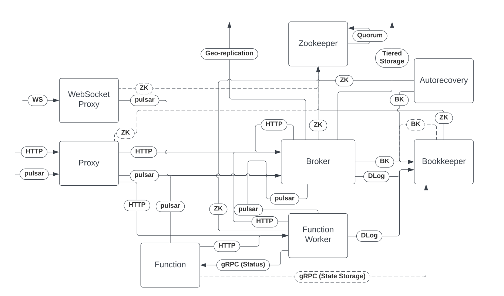

# PIP 273: Enable hostname verification by default

# Background knowledge

When using TLS to secure a network connection from client to server, hostname verification is the step where the client verifies that the server's certificate contains the expected Subject Alternative Name or the Common Name. This step is essential for preventing man in the middle attacks where a malicious server presents a certificate that is cryptographically valid but was intended for a different hostname than the one the client is trying to connect to.

[RFC 2818](https://datatracker.ietf.org/doc/html/rfc2818#section-3.1) provides additional details on the hostname verification process as a part of the TLS handshake and why a client must verify the identity of the server.

It is very helpful to understand the network topology of a Pulsar Cluster when looking to enable hostname verification. Here is a diagram I created. It is possibly incomplete:

# Motivation

The primary motivation is to improve the security of Pulsar by making it secure by default for hostname verification.

Pulsar currently disables hostname verification by default, which led to some security issues in the past. For example, [CVE-2022-33682](https://github.com/apache/pulsar/wiki/CVE-2022-33682) happened because there was no way to enable hostname verification within the broker or the proxy. If hostname verification had been enabled by default, the lack of configurability would not have been a security concern but a usability concern.

# Goals

## In Scope

* Enable hostname verification by default for all clients in the Pulsar ecosystem.
* Make it possible to configure hostname verification per geo-replicated cluster.
* Consolidate the name of the hostname verification configuration option across all server components.

## Out of Scope

* This PIP does not seek to enable TLS by default, which is relevant because hostname verification only takes affect when TLS is enabled.
* Client configuration names will not be renamed because that would introduce binary incompatibility.
* Tiered storage clients
* ETCd client configuration -- it enables hostname verification by default already
* Zookeeper client configuration -- it enables hostname verification by default already
* Function worker's gRPC client to function instances -- TLS is not configurable for this connection
* Function state storage to bookkeeper -- TLS is not configurable for this connection
* Pulsar SQL worker's hostname verification configuration name, which is `pulsar.tls-hostname-verification-enable`

# High Level Design

* Enable hostname verification by default for all (official) clients in the Pulsar ecosystem.
* Enable hostname verification by default for all server components in the Pulsar ecosystem.
* Make it possible to configure hostname verification per geo-replicated cluster.
* Consolidate names by using `tlsHostnameVerificationEnabled` for all server components.

# Detailed Design

## Design & Implementation Details

### Impacted configurations

* The official Pulsar clients will be impacted.
* The broker's internal pulsar admin client, pulsar client, and replication clients
* The broker's bookkeeper client and dlog bookkeeper client
* Autorecovery's bookkeeper client
* Bookkeeper's bookkeeper client
* Proxy's pulsar client and pulsar admin client (used for brokers and function workers)
* WebSocket Proxy's pulsar client
* Function Worker's dlog bookkeeper client, pulsar client (used for broker), and pulsar admin client (used for broker and for other function workers)
* Function instance pulsar client and pulsar admin client (including the function worker client used to download the function)

## Public-facing Changes

All changes in this PIP are public facing.

### Public API

### Binary protocol

N/A

### Configuration

There are two name changes. For function worker config, I propose we replace `tlsEnableHostnameVerification` with `tlsHostnameVerificationEnabled` to match the other server components. For the client.conf config which is used by CLI tools, I propose we change `tlsEnableHostnameVerification` to `tlsHostnameVerificationEnabled`.

### CLI

### Metrics

N/A

# Monitoring

N/A

# Security Considerations

This PIP will improve Pulsar's security by making it secure by default for hostname verification.

# Backward & Forward Compatibility

## Revert

Users and operators can opt out of these changes by setting the following configurations to `false`:

| Component                        | Configuration                                                                    |
|----------------------------------|----------------------------------------------------------------------------------|
| Pulsar Client                    | `tlsHostnameVerificationEnabled=false` or `enableTlsHostnameVerification(false)` |
| Pulsar Admin Client              | `tlsHostnameVerificationEnabled=false` or `enableTlsHostnameVerification(false)` |
| Broker                           | `tlsHostnameVerificationEnabled=false`                                           |
| Broker's BK Client               | `bookkeeper_tlsHostnameVerificationEnabled=false`                                |
| Bookkeeper                       | `tlsHostnameVerificationEnabled=false`                                           |
| Autorecovery                     | `tlsHostnameVerificationEnabled=false`                                           |
| Proxy                            | `tlsHostnameVerificationEnabled=false`                                           |
| WebSocket Proxy                  | `tlsHostnameVerificationEnabled=false`                                           |
| Function Worker                  | `tlsHostnameVerificationEnabled: false`                                          |
| Function Worker's BK/DLog Client | `bookkeeper_tlsHostnameVerificationEnabled=false`                                |
| Function Instance                | TODO                                                                             |

## Upgrade

Ensure your certificates will correctly pass hostname verification.

# Alternatives

The primary alternative is to make no changes.

# General Notes

Here are the current draft PRs for implementing this PIP:

* https://github.com/apache/pulsar/pull/20268
* https://github.com/apache/pulsar/pull/20269

# Links

* Mailing List discussion thread:
* Mailing List voting thread:
