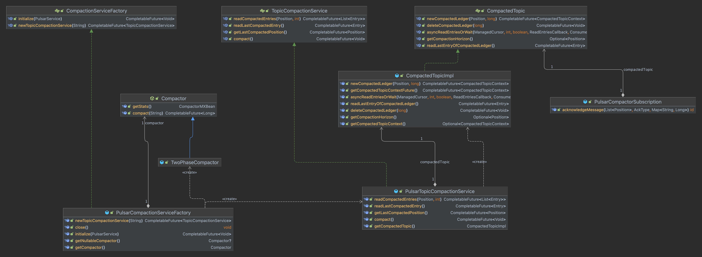

# Background knowledge

Apache Pulsar is a distributed messaging system that supports multiple messaging protocols and storage methods. 
Among them, Pulsar Topic Compaction provides a key-based data retention mechanism that allows you only to keep the most recent message associated with that key to reduce storage space and improve system efficiency.

Another Pulsar's internal use case, the Topic Compaction of new load balancer changed the strategy of compaction, it will only to keep the first value of the key. More detail please see: [PIP-215](https://github.com/apache/pulsar/issues/18099)

More topic compaction details can be found in [Pulsar Topic Compaction](https://pulsar.apache.org/docs/en/concepts-topic-compaction/).

# Motivation

Currently, the implementation of Pulsar Topic Compaction is fixed and does not support custom strategy, which limits users from using more Compactor policies in their applications.

For example, current topic compaction can work with pulsar format data in KoP, but it can't work with Kafka format data since the data written to the entry is in Kafka format. 
The Pulsar compactor doesn't aware of Kafka format data. And it doesn't make sense to support Kafka format data handling in Pulsar. We need implement a pluggable compactor to support Kafka format data handling in KoP.

Another long-term consideration is that we may need to support write the compacted data anywhere, S3, in columnar format, or even partitioning.

So we need to make  the whole topic compaction service (include Write API & Read API) pluggable to support more customize compaction service implementation.

# Goals

## In Scope

* Abstract topic compaction service interface and support topic compaction service pluggable.

* Migrate the current implementation to a new interface implementation.

* Makes existing tests compatible with new implementations.

## Out of Scope

* For CompactorMetrics, keep the current implementation and don't define related method in topic compaction service interface, in the future will use the `Otel` interface or other mertics API instead.

* For `StrategicTwoPhaseCompactor`, it's out of the scope for regular compaction. It's only used for the load balancer. So it won't change.


# High Level Design

To make the whole topic compaction service pluggable, we need to abstract `TopicCompactionService` interface, it can provide the capability that the compactor has and provide the read API to read entries from compacted data.

We should combine `CompactedTopicImpl` and `TwoPhaseCompactor` to pulsar implementation of topic compaction service and make behavior with the current implementation consistent.

Class Diagram of core class:


# Detailed Design

## Design & Implementation Details

* Define a standard TopicCompactionService interface.

  ```java
  public interface TopicCompactionService {
      /**
       * Compact the topic.
       * Topic Compaction is a key-based retention mechanism. it will keep the most recent value for a given key and
       * user will read compacted data from TopicCompactionService.
       *
       * @return a future that will be completed when the compaction is done.
       */
      CompletableFuture<Void> compact();

      /**
       * Read the compacted entries from the TopicCompactionService.
       *
       * @param startPosition         the position to start reading from.
       * @param numberOfEntriesToRead the number of entries to read.
       * @return a future that will be completed with the list of entries, this list can is null.
       */
      CompletableFuture<List<Entry>> readCompactedEntries(@NonNUll Position startPosition, int numberOfEntriesToRead);

      /**
       * Read the last compacted entry from the TopicCompactionService.
       *
       * @return a future that will be completed with the compacted last entry, this entry can is null.
       */
      CompletableFuture<Entry> readLastCompactedEntry();

      /**
       * Get the last compacted position from the TopicCompactionService.
       *
       * @return a future that will be completed with the last compacted position, this position can is null.
       */
      CompletableFuture<Position> getLastCompactedPosition();
  }
  ```

* Define a standard CompactionServiceFactory interface to manage `TopicCompactionService`.

  ```java
  public interface CompactionServiceFactory extends AutoCloseable {
  
      CompletableFuture<Void> initialize(PulsarService pulsarService);
  
      CompletableFuture<TopicCompactionService> newTopicCompactionService(String topic);
  }
  ```

* Implement `PulsarCompactionServiceFactory` and `PulsarCompactionService`

* Combining `CompactedTopicImpl` and `TwoPhaseCompactor` to `PulsarTopicCompactionService`

* Rename `CompactorSubscription` to `PulsarCompactorSubscription`, since it is only applicable to the implementation of Pulsar.

* For CompactorMetrics keep the current implementation, and it only supports `PulsarTopicCompactionService` currently, in the future will use the `Otel` API or other metrics API instead, and customize TopicCompactedService should implement it.

* Fix tests and makes them compatible with new implementations.

## Public-facing Changes


### Configuration

broker.conf
```
compactionServiceFactoryClassName=org.apache.pulsar.compaction.PulsarCompactionServiceFactory
```

# Backward & Forward Compatability

## Revert


## Upgrade


# Alternatives

* Only make the compactor pluggable
* Make the compaction data serializer and deserializer pluggable in current pulsar implementation.

But they will introduce some short-term configurations and interfaces, so they are not good for the long-term view of Pulsar.
For a discussion of alternatives see: [PIP-278](https://github.com/apache/pulsar/pull/20493)


# General Notes

# Links

* Mailing List discussion thread: https://lists.apache.org/thread/ox2bot3p9j9fydqkw3v5gt5twc8jslvd
* Mailing List voting thread: