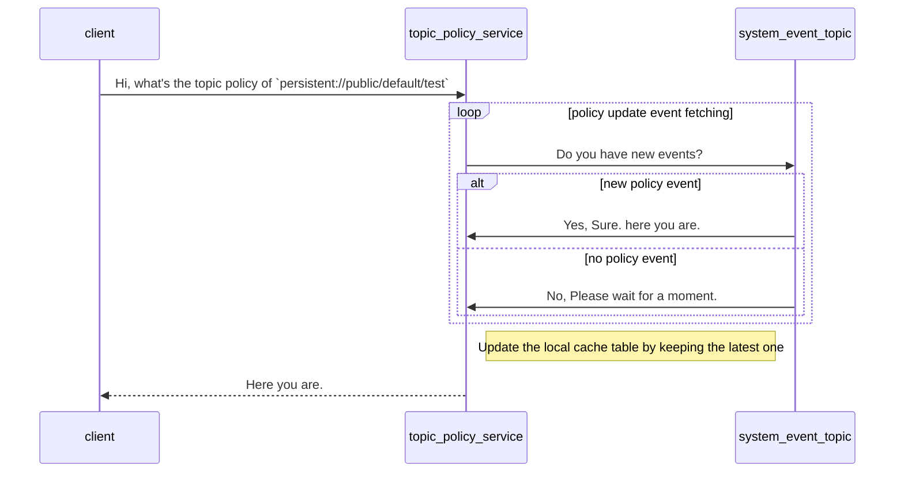

# PIP-284: Migrate topic policies implementation to use TableView

# Background knowledge

Apache Pulsar introduced the topic-level policies by [PIP-39](https://github.com/apache/pulsar/wiki/PIP-39%3A-Namespace-Change-Events).
It uses the reader API to read messages and relies on compaction to implement table-like logic in the memory.

[PIP-104](https://github.com/apache/pulsar/issues/12356) Introduced new consumer type `TableView` to support the same logic by
Public Stable API.

# Motivation

Due to a lot of problems caused by the complex topic policy logic is as follows. we can use a new stable `TableView` API instead of
previous one.

- https://github.com/apache/pulsar/pull/20763
- https://github.com/apache/pulsar/pull/20613
- https://github.com/apache/pulsar/pull/19746
- etc...

# Goals

## In Scope

- Reduce complex logic.
- Reuse the public stable API to improve the project quality.

## Out of Scope

none.

# High Level Design

# Detailed Design

## Design & Implementation Details

The new implementation will continue reuse the previous system topic `namespace/__change_event` to store the topic policy data.
and it will change the reading logic from the raw reader to TableView to enhance the robustness.

## Public-facing Changes

none.

### Public API

none.

### Binary protocol

none.

### Configuration

none.

### CLI

none.

### Metrics

none.

# Monitoring

none.

# Security Considerations

none.

# Backward & Forward Compatibility

Without backward compatibility since we will reuse the same system topic `namesapce/__change_event`.

## Revert

none.

## Upgrade

none.

# Alternatives

none.

# General Notes

none.

# Links

none.

* Mailing List discussion thread:  https://lists.apache.org/thread/9v00sfpfxjpm775vgltkjoxwnllsgskg
* Mailing List voting thread: https://lists.apache.org/thread/gx43mzh88xp5ttz2gqghfqpz1yq51k60
