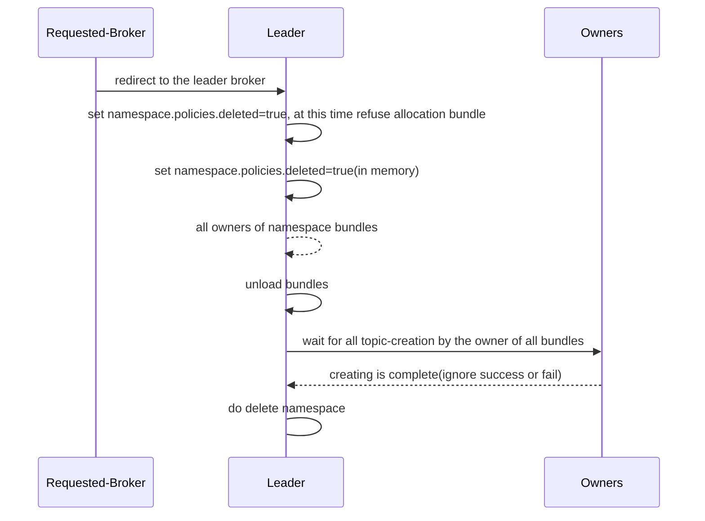

# Motivation
If `create new topic` and `delete namespace` execute at the same topic, the request `delete namespace` will get an error: `KeeperException$NotEmptyException`, this happened as the flow below:

| time | `delete namespace` | `create a topic` |
| --- | --- | --- |
| 1 | | start create a topic |
| 2 | | ensure the namespace is not deleting |
| 3 | mark this namespace is deleting(at this pointer, new topic creation will fail, but the in-flight creating still works) | |
| 4 | List all topics under this namespace, and delete them one by one |
| 5 | | The new topic was created |
| 6 | Delete the ZK node of this namespace, but there is a new topic was created, get an error: `KeeperException$NotEmptyException` |

# Goals
Make every request `delete namespace` can be successful.

# High Level Design



Just like the flowchart above, we need to add a internal HTTP APIs:
- Wait for all topics(including system topic) under a namespace to be created (regardless of success or failure)

# Detailed Design

**PersistentTopics.java**
```java
@GET
@Path("/{tenant}/{namespace}/waitForAllTopicsCreated")
public void waitForAllTopicsCreated(String tenant,String namespace) {}
```