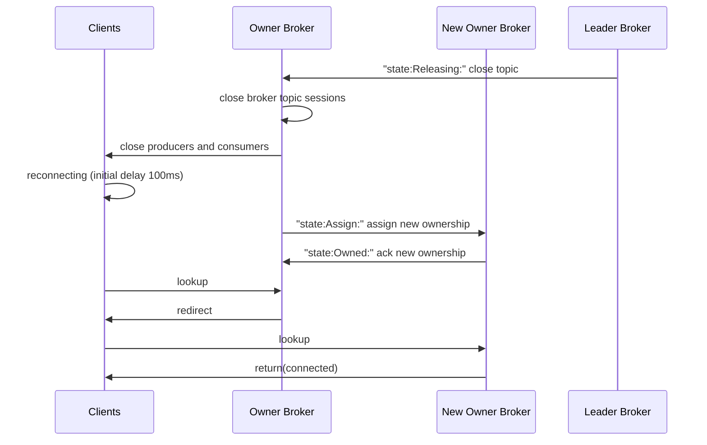
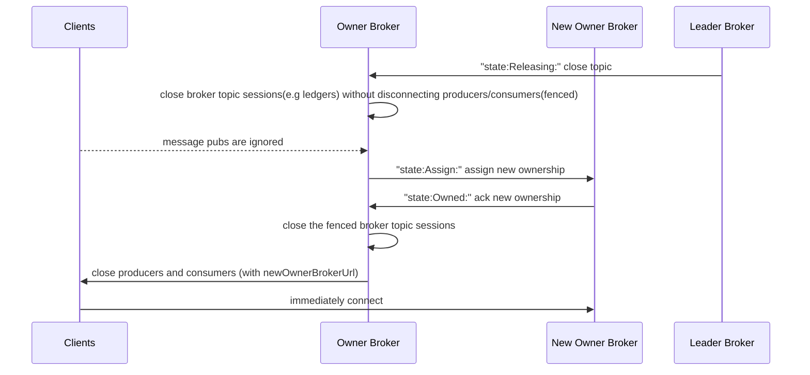

<!--
RULES
* Never place a link to an external site like Google Doc. The proposal should be in this issue entirely.
* Use a spelling and grammar checker tools if available for you (there are plenty of free ones).

PROPOSAL HEALTH CHECK
I can read the design document and understand the problem statement and what you plan to change *without* resorting to a couple of hours of code reading just to start having a high level understanding of the change.

THIS COMMENTS
Please remove them when done.
-->

# Background knowledge

- Pulsar broker load balancer periodically unloads bundles from overloaded brokers. During this unload process, previous owner brokers close topic sessions(e.g. producers, subscriptions(consumers), managed ledgers). When re-assigned, new owner brokers recreate the topic sessions.

- Pulsar clients request `CommandLookupTopic` to lookup or assign owner brokers for topics and connect to them.

- PIP-192, the extensible load balancer introduced the bundle state channel that event-sources this unloading process in a state machine manner, from `releasing,` `assigned`, to `owned` state order. At `releasing,` the owner broker "releases" the bundle ownership(close topic sessions).

- PIP-192, the extensible load balancer introduced TransferShedder, a new shedding strategy, which pre-assigns new owner brokers beforehand.


# Motivation

- When unloading closes many topic sessions, then many clients need to request CommandLookupTopic at the same time, which could cause many lookup requests on brokers. This unloading process can be further optimized if we can let the client directly connect to the new owner broker without following `CommandLookupTopic` requests.
- In the new load balancer(pip-192), since the owner broker is already known, we can modify the close command protocol to pass the new destination broker URL and skip the lookup requests.
- Also, when unloading, we can gracefully shutdown ledgers -- we always close old managed ledgers first and then recreate it on the new owner without conflicts.

# Goals
- Remove clients' lookup requests in the unload protocol to reduce the publish latency spike and e2e latency spike during
unloading and also to resolve bottlenecks (of thundering lookups) when there are a large number of topics in a cluster.
- Gracefully shutdown managed ledgers before new owners create them to reduce possible race-conditions between ledger close and ledger creations during unloading.

## In Scope

<!--
What this PIP intend to achieve once It's integrated into Pulsar.
Why does it benefit Pulsar.
-->

- This change will be added in the extensible load balancer.

## Out of Scope

<!--
Describe what you have decided to keep out of scope, perhaps left for a different PIP/s.
-->

- This won't change the existing load balancer behavior(modular load manager).


# High Level Design

<!--
Describe the design of your solution in *high level*.
Describe the solution end to end, from a birds-eye view.
Don't go into implementation details in this section.

I should be able to finish reading from beginning of the PIP to here (including) and understand the feature and 
how you intend to solve it, end to end.

DON'T
* Avoid code snippets, unless it's essential to explain your intent.
-->

To achieve the goals above, we could modify the bundle transfer protocol by the following.
The proposed protocol change is based on the bundle states from PIP-192. 

Basically, we could close the ledgers only in the releasing state and finally disconnect clients in the owned state with destination broker urls. The clients will directly connect to the pre-assigned destination broker url without lookups.  Meanwhile, during this transfer, any produced messages will be ignored by the source broker.

Current Unload and Lookup Sequence in Extensible Load Balancer


Proposed Unload Sequence in Extensible Load Balancer without Lookup



# Detailed Design

## Design & Implementation Details

<!--
This is the section where you dive into the details. It can be:
* Concrete class names and their roles and responsibility, including methods.
* Code snippets of existing code.
* Interface names and its methods.
* ...
-->

- Modify CommandCloseProducer, CommandCloseConsumer to pass optional brokerServiceUrls
```
message CommandCloseProducer {
required uint64 producer_id = 1;
required uint64 request_id = 2;
+ optional string assignedBrokerServiceUrl      = 3;
+ optional string assignedBrokerServiceUrlTls   = 4;
}

message CommandCloseConsumer {
required uint64 consumer_id = 1;
required uint64 request_id = 2;
+ optional string assignedBrokerServiceUrl      = 3;
+ optional string assignedBrokerServiceUrlTls   = 4;
}
```

- Add new disconnect apis on producer and consumer to pass dstBrokerLookupData
```
public CompletableFuture<Void> disconnect(Optional<BrokerLookupData> dstBrokerLookupData) {
```

- Modify the Topic.close() behavior to optionally skip producers.disconnect() and consumers.disconnect().
```
public CompletableFuture<Void> close(boolean closeWithoutWaitingClientDisconnect,
                                          boolean closeWithoutDisconnectingClients) {

```

- please refer to this poc code for more details: https://github.com/apache/pulsar/compare/master...heesung-sn:pulsar:close-command-dst-url


### Eventual Consistency of Ownership States

This protocol and ownership state checks follow the eventual consistency of the bundle state channel introduced in PIP-192.

After the client connects to the destination broker, the next command(e.g.  ProducerCommand) requires 
the destination broker to check the ownership again against its local table view of the bundle state channel.

Upon this local ownership check, there could be the following scenarios:

Happy case:
- If the ownership state is `owned ` and the current broker is indeed the owner, the command completes. 

Unhappy cases:
- If the ownership state is `owned ` and the current broker is not the owner, the command fails
(the broker returns an error to the client), and the client tries to find the true new owner by lookups. 
The global bundle state channel is eventually consistent, and the lookups should eventually converge.
- if the ownership change is still in progress(`releasing`, `assigning`), this check will be deferred 
until the state becomes `owned` with a timeout.

### Failure Recovery of Ownership States

The failure recovery logic relies on the bundle state channel cleanup logic introduced in PIP-192.

When the destination or source broker crashes in the middle of unloading, 
the leader will find the orphan state and clean the ownership by selecting a new owner, and the client will reconnect to it.
During this transfer process, if alive, the source broker will serve the topic according to the protocol described in the PIP. 


## Public-facing Changes

<!--
Describe the additions you plan to make for each public facing component. 
Remove the sections you are not changing.
Clearly mark any changes which are BREAKING backward compatability.
-->

### Public API
<!--
When adding a new endpoint to the REST API, please make sure to document the following:

* path
* query parameters
* HTTP body parameters, usually as JSON.
* Response codes, and for each what they mean.
  For each response code, please include a detailed description of the response body JSON, specifying each field and what it means.
  This is the place to document the errors.
-->

### Binary protocol

- Modify CommandCloseProducer, CommandCloseConsumer to pass optional assignedBrokerServiceUrls like the above.

### Configuration

### CLI

### Metrics

<!--
For each metric provide:
* Full name
* Description
* Attributes (labels)
* Unit
-->


# Monitoring

<!-- 
Describe how the changes you make in this proposal should be monitored. 
Don't describe the detailed metrics - they should be at "Public-facing Changes" / "Metrics" section.
Describe how the user will use the metrics to monitor the feature: Which alerts they should set up, which thresholds, ...
-->

# Security Considerations
<!--
A detailed description of the security details that ought to be considered for the PIP. This is most relevant for any new HTTP endpoints, new Pulsar Protocol Commands, and new security features. The goal is to describe details like which role will have permission to perform an action.

An important aspect to consider is also multi-tenancy: Does the feature I'm adding have the permissions / roles set in such a way that prevent one tenant accessing another tenant's data/configuration? For example, the Admin API to read a specific message for a topic only allows a client to read messages for the target topic. However, that was not always the case. CVE-2021-41571 (https://github.com/apache/pulsar/wiki/CVE-2021-41571) resulted because the API was incorrectly written and did not properly prevent a client from reading another topic's messages even though authorization was in place. The problem was missing input validation that verified the requested message was actually a message for that topic. The fix to CVE-2021-41571 was input validation. 

If there is uncertainty for this section, please submit the PIP and request for feedback on the mailing list.
-->

# Backward & Forward Compatability
- We are adding new parameters in the close producer and consumer command protocol, the old client versions should not see the optional destination urls in the close commands. Hence, they will request lookups.

## Revert

<!--
Describe a cookbook detailing the steps required to revert pulsar to previous version *without* this feature.
-->

## Upgrade

<!--
Specify the list of instructions, if there are such, needed to perform before/after upgrading to Pulsar version containing this feature.
-->

# Alternatives

<!--
If there are alternatives that were already considered by the authors or, after the discussion, by the community, and were rejected, please list them here along with the reason why they were rejected.
-->

# General Notes

# Links

<!--
Updated afterwards
-->
* Mailing List discussion thread:
* Mailing List voting thread:

