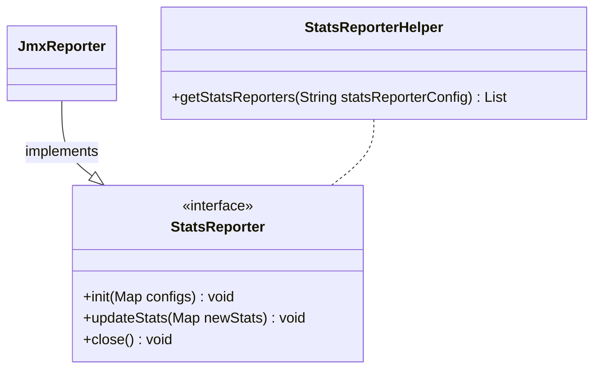

# PIP-309: Adding Pulsar Client Stats Reporter

# Background knowledge

Pulsar Client can provide recorded statistics for both [Producer](https://github.com/apache/pulsar/blob/v3.1.0/pulsar-client-api/src/main/java/org/apache/pulsar/client/api/ProducerStats.java) and [Consumer](https://github.com/apache/pulsar/blob/v3.1.0/pulsar-client-api/src/main/java/org/apache/pulsar/client/api/ConsumerStats.java):
* All the stats are relative to the last interval and would be reset for next interval.
* The interval of the stats refreshes is configured with [ClientBuilder.statsInterval(long, java.util.concurrent.TimeUnit)](https://github.com/apache/pulsar/blob/v3.1.0/pulsar-client-api/src/main/java/org/apache/pulsar/client/api/ClientBuilder.java#L462) with a default of 1 minute.

But not all stats come as fixed values, take the ProducerStats as an example:
* [getNumAcksReceived()](https://github.com/apache/pulsar/blob/v3.1.0/pulsar-client-api/src/main/java/org/apache/pulsar/client/api/ProducerStats.java#L54) returns the number of messages published in the last interval, to be noted, the last interval here is actually refers to the current in progress interval per the [implementation](https://github.com/apache/pulsar/blob/master/pulsar-client/src/main/java/org/apache/pulsar/client/impl/ProducerImpl.java#L366), so it's a dynamic value that may change within the same interval.
* [getTotalAcksReceived()](https://github.com/apache/pulsar/blob/v3.1.0/pulsar-client-api/src/main/java/org/apache/pulsar/client/api/ProducerStats.java#L114) returns the total number of messages published by this producer, and it's a fixed value calculated based on the last completed interval.

It turns out all `long` type interval related stats of Producer or Consumer are dynamic values, let's use the term `Dynamic Interval Stats` to refer to them.

# Motivation

Considering the existence of `Dynamic Interval Stats` provided by the Pulsar Client Library, these stats are unreliable to be used directly when we are fetching them proactively as the exact start or end time of each interval is unpredictable.

Although these values can be derived alternatively without any change, from the long run, it would be helpful to have a reporter plugin in the library itself, thus allowing all stats being reported precisely at the end of each interval.

# Goals

## In Scope

Provide a simple reporter plugin interface with a default implementation(eg. JMX reporter) that returns all existing client stats with the default statsInterval.

## Out of Scope

This proposal won't support configurable reporter stats fetch interval, which can be added in the future.

# High Level Design

Add a `StatsReporter` plugin interface to allow ProducerStats or ConsumerStats to be reported.

# Detailed Design

## Design & Implementation Details

Core class diagram of the proposed reporter:


* StatsReporter:
    * A plugin interface to listen to client stats for both Producer and Consumer
    * For Producer, it should be initiated with topic name and producerName
    * For Consumer, it should be initiated with topic, subscription and consumerName
    * All stats shall be refreshed at the end of each stats interval
    * Reporter can be closed promptly while shutting down Producer and Consumer
* JmxReporter:
    * Default implementation for StatsReporter interface, can be disabled through the below client config:
        * statsReporter
* StatsReporterHelper:
    * Helper class to cast customized StatsReporter implementations to StatsReporter instances

## Public-facing Changes

### Configuration

Add an optional `StatsReporter` [configuration](https://github.com/apache/pulsar/blob/v3.1.0/pulsar-client/src/main/java/org/apache/pulsar/client/impl/conf/ClientConfigurationData.java) field for PulsarClient for interface implementation injection
```java
    @ApiModelProperty(
        name = "statsReporter",
        value = "A list of classes of the customized implementation for StatsReporter plugin interface. "
                + "Use comma(,) as the delimiter for multiple implementations. "
                + "Use an empty string to disable the default JmxReporter."
    )
    private String statsReporter = "org.apache.pulsar.client.impl.JmxReporter";
```
eg. specify which statsReporter to use while building PulsarClient
```java
    @Bean(name = "defaultClient")
    public PulsarClient getDefaultClient() throws PulsarClientException {
        return PulsarClient
                .builder()         
                .serviceUrl("pulsar://localhost:6650")
                .statsReporter("com.example.mypackage.MyStatsReporterImpl")
                .build();
    }
```

# Rejected Alternatives

Derive `Dynamic Interval Stats` from other stats with fixed values, eg. keep track of the value of getTotalAcksReceived() for last 2 intervals and do the subtraction to calculate the accurate value of getNumAcksReceived() for the last completed interval.

# General Notes

# Links
* Mailing List discussion thread: https://lists.apache.org/thread/2rrhrqwc7jov4klxd262sncmto7lo0hg
* Mailing List voting thread:
