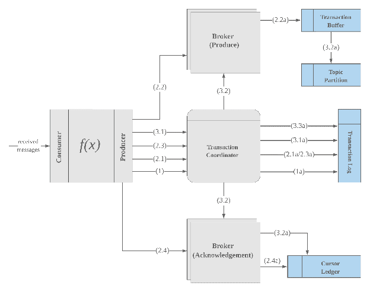
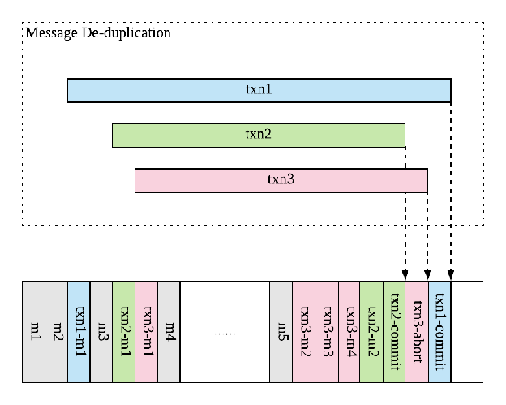
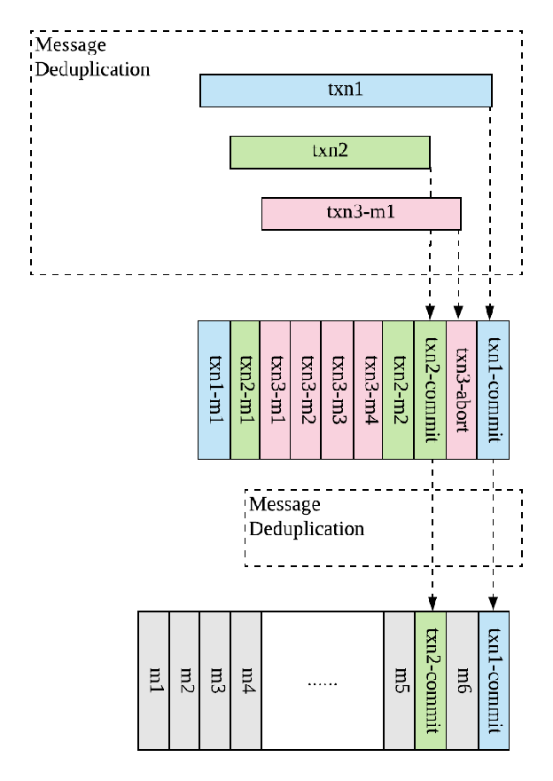
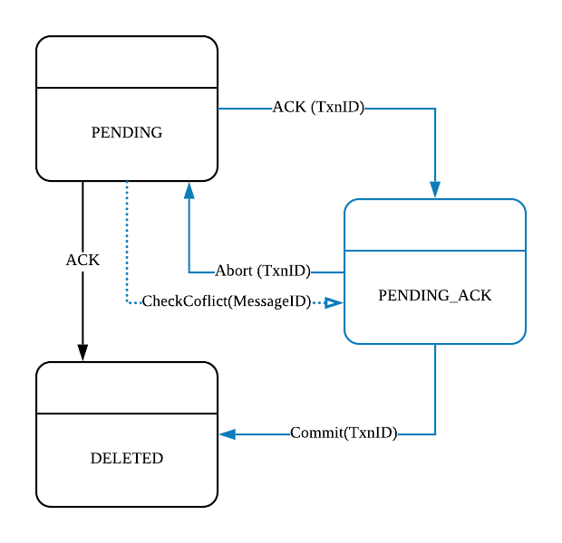

# PIP-31: Transaction Support

* **Status**: Implemented
* **Author**: Sijie Guo
* **Pull Request**: https://github.com/apache/pulsar/pull/2664
* **Mailing List discussion**:
* **Release**: 2.8.0

[**Motivation**](#motivation)	**[4](#motivation)**

[Use Cases](#use-cases)	[4](#use-cases)

[Event Processing](#event-processing)	[4](#event-processing)

[Atomic Produce](#atomic-produce)	[5](#atomic-produce)

[Transactional Guarantees](#transactional-guarantees)	[**6**](#transactional-guarantees)

[Isolation Levels](#isolation-levels)	[6](#isolation-levels)

[A 10,000 Foot View](#a-10,000-foot-view)	[**7**](#a-10,000-foot-view)

[Concepts](#concepts)	[7](#concepts)

[Transaction Coordinator](#transaction-coordinator)	[7](#transaction-coordinator)

[Transaction Buffer](#transaction-buffer)	[7](#transaction-buffer)

[Acknowledgements in Transactions](#acknowledgements-in-transactions)	[8](#acknowledgements-in-transactions)

[Materialization Mechanism](#materialization-mechanism)	[8](#materialization-mechanism)

[Transaction Flow](#transaction-flow)	[9](#transaction-flow)

[1\. Begin Transaction](#1.-begin-transaction)	[10](#1.-begin-transaction)

[2\. Transaction Loop](#2.-transaction-loop)	[10](#2.-transaction-loop)

[2.1 Add Partitions To Txn](#2.1-add-partitions-to-txn)	[10](#2.1-add-partitions-to-txn)

[2.2 Produce Messages to Partitions](#2.2-produce-messages-to-partitions)	[10](#2.2-produce-messages-to-partitions)

[2.3 Add Subscriptions To Txn](#2.3-add-subscriptions-to-txn)	[11](#2.3-add-subscriptions-to-txn)

[2.4 Ack Messages on Subscriptions](#2.4-ack-messages-on-subscriptions)	[11](#2.4-ack-messages-on-subscriptions)

[3\. End Transaction](#3.-end-transaction)	[11](#3.-end-transaction)

[3.1 End Transaction Request](#3.1-end-transaction-request)	[11](#3.1-end-transaction-request)

[3.2 Finalizing Process](#3.2-finalizing-process)	[12](#3.2-finalizing-process)

[3.3 Mark Transaction as COMMITTED or ABORTED](#3.3-mark-transaction-as-committed-or-aborted)	[12](#3.3-mark-transaction-as-committed-or-aborted)

[**Design Choices**](#design-choices)	**[13](#design-choices)**

[Transaction Buffer](#transaction-buffer-1)	[13](#transaction-buffer-1)

[Marker Approach](#marker-approach)	[13](#marker-approach)

[Overview](#overview)	[14](#overview)

[Challenges](#challenges)	[15](#challenges)

[Materialization](#materialization)	[15](#materialization)

[Sweep](#sweep)	[15](#sweep)

[Retention](#retention)	[16](#retention)

[Changes](#changes)	[16](#changes)

[Discussions](#discussions)	[16](#discussions)

[Sidecar Approach](#sidecar-approach)	[17](#sidecar-approach)

[Overview](#overview-1)	[17](#overview-1)

[Challenges](#challenges-1)	[19](#challenges-1)

[Materialization](#materialization-1)	[19](#materialization-1)

[Sweep](#sweep-1)	[20](#sweep-1)

[Retention](#retention-1)	[20](#retention-1)

[Changes](#changes-1)	[20](#changes-1)

[Discussions](#discussions-1)	[20](#discussions-1)

[Huge Size Transaction](#huge-size-transaction)	[20](#huge-size-transaction)

[**A Full Proposal**](#a-full-proposal)	**[21](#a-full-proposal)**

[Public APIs](#public-apis)	[21](#public-apis)

[Examples](#examples)	[24](#examples)

[Data Structures](#data-structures)	[25](#data-structures)

[TxnID](#txnid)	[25](#txnid)

[Wire Protocol Changes](#wire-protocol-changes)	[25](#wire-protocol-changes)

[New Commands](#new-commands)	[25](#new-commands)

[TxnAction](#txnaction)	[25](#txnaction)

[CommandNewTxn](#commandnewtxn)	[25](#commandnewtxn)

[CommandNewTxnResponse](#commandnewtxnresponse)	[26](#commandnewtxnresponse)

[CommandAddPartitionToTxn](#commandaddpartitiontotxn)	[26](#commandaddpartitiontotxn)

[CommandAddPartitionToTxnResponse](#commandaddpartitiontotxnresponse)	[26](#commandaddpartitiontotxnresponse)

[CommandAddSubscritpionToTxn](#commandaddsubscritpiontotxn)	[27](#commandaddsubscritpiontotxn)

[CommandAddSubscriptionToTxnResponse](#commandaddsubscriptiontotxnresponse)	[27](#commandaddsubscriptiontotxnresponse)

[CommandEndTxn](#commandendtxn)	[28](#commandendtxn)

[CommandEndTxnResponse](#commandendtxnresponse)	[28](#commandendtxnresponse)

[CommandEndTxnOnPartition](#commandendtxnonpartition)	[28](#commandendtxnonpartition)

[CommandEndTxnOnPartitionResponse](#commandendtxnonpartitionresponse)	[29](#commandendtxnonpartitionresponse)

[CommandEndTxnOnSubscription](#commandendtxnonsubscription)	[29](#commandendtxnonsubscription)

[CommandEndTxnOnSubscriptionResponse](#commandendtxnonsubscriptionresponse)	[29](#commandendtxnonsubscriptionresponse)

[Modified Commands](#modified-commands)	[30](#modified-commands)

[CommandSend](#commandsend)	[30](#commandsend)

[CommandAck](#commandack)	[30](#commandack)

[Transaction Coordinator](#transaction-coordinator-1)	[31](#transaction-coordinator-1)

[Concepts](#concepts-1)	[33](#concepts-1)

[TCID](#tcid)	[33](#tcid)

[TxnStatus](#txnstatus)	[33](#txnstatus)

[TransactionMetadataStoreProvider](#transactionmetadatastoreprovider)	[33](#transactionmetadatastoreprovider)

[TransactionMetadataStore](#transactionmetadatastore)	[34](#transactionmetadatastore)

[Implementation](#implementation)	[34](#implementation)

[Transaction Log](#transaction-log)	[34](#transaction-log)

[TC Startup](#tc-startup)	[35](#tc-startup)

[TC Request Processing](#tc-request-processing)	[36](#tc-request-processing)

[CommandNewTxn](#commandnewtxn-1)	[36](#commandnewtxn-1)

[CommandAddPartitionToTxn](#commandaddpartitiontotxn-1)	[36](#commandaddpartitiontotxn-1)

[CommandAddSubscriptionToTxn](#commandaddsubscriptiontotxn)	[37](#commandaddsubscriptiontotxn)

[CommandEndTxn](#commandendtxn-1)	[37](#commandendtxn-1)

[TC Transaction Expiration](#tc-transaction-expiration)	[38](#tc-transaction-expiration)

[Deployment](#deployment)	[38](#deployment)

[TC in Broker](#tc-in-broker)	[38](#tc-in-broker)

[Broker \- Transaction Buffer](#broker---transaction-buffer)	[39](#broker---transaction-buffer)

[Message](#message)	[39](#message)

[Message ID](#message-id)	[39](#message-id)

[Transaction Log](#transaction-log-1)	[40](#transaction-log-1)

[Implementation](#implementation-1)	[40](#implementation-1)

[Transaction Manager](#transaction-manager)	[40](#transaction-manager)

[Dedup Cursor](#dedup-cursor)	[40](#dedup-cursor)

[Transaction Cursor](#transaction-cursor)	[40](#transaction-cursor)

[Transaction Index](#transaction-index)	[40](#transaction-index)

[Retention Cursor](#retention-cursor)	[41](#retention-cursor)

[Compacting Transaction Log](#compacting-transaction-log)	[41](#compacting-transaction-log)

[Partition Loading](#partition-loading)	[42](#partition-loading)

[Broker Request Processing](#broker-request-processing)	[42](#broker-request-processing)

[CommandSend](#commandsend-1)	[42](#commandsend-1)

[CommandEndTxnOnPartition](#commandendtxnonpartition-1)	[42](#commandendtxnonpartition-1)

[Broker Dispatching](#broker-dispatching)	[43](#broker-dispatching)

[Broker \- Acknowledgements](#broker---acknowledgements)	[43](#broker---acknowledgements)

[New Acknowledgement State](#new-acknowledgement-state)	[44](#new-acknowledgement-state)

[PENDING\_ACK State](#pending_ack-state)	[45](#pending_ack-state)

[Negative Acknowledgement](#negative-acknowledgement)	[46](#negative-acknowledgement)

[Client-Broker Request Processing](#client-broker-request-processing)	[46](#client-broker-request-processing)

[**Future Worker**](#future-worker)	**[46](#future-worker)**

[Single Partition Transaction](#single-partition-transaction)	[46](#single-partition-transaction)

#

# PIP-31: Transactional Streaming

# Motivation {#motivation}

This document outlines a proposal for supporting transactional messaging at Apache Pulsar. Transactions are used for strengthening the message delivery semantics of Apache Pulsar and processing guarantees at Pulsar Functions.

The highest message delivery guarantee that Apache Pulsar currently provides is \`exactly-once\` producing at one single partition via Idempotent Producer. Users are guaranteed that every message produced to one single partition via an Idempotent Producer will be persisted exactly once, without data loss. There is no \`atomicity\` when a producer attempts to produce messages to multiple partitions. For instance, a publish failure can occur when the broker crashes and if the producer doesn’t retry or has exhausted its retry count, the message might not be written to Pulsar. On the consumer side, acknowledgement currently is a best-effort operation, which will result in message redelivery, hence consumers will receive duplicate messages. Pulsar only guarantees at-least-once consumption for consumers.

Similarly, Pulsar Functions only guarantees exactly-once processing on a single event on idempotent function. It can’t guarantee processing multiple events or producing multiple results can happen exactly once. For example, if a function accepts multiple events and produces one result (e.g. windowing functions), the function can fail between producing the result and acknowledging the incoming messages, or even between acknowledging individual events. This will cause all (or some) incoming messages being re-delivered and reprocessed, and a new result is generated.

Users of Pulsar and Pulsar Functions will greatly benefit from transactional semantic support. Every message written or processed will be happening exactly once, without duplicates and without data loss \- even in the event of broker or function instance failures. A transactional messaging semantic not only makes writing applications using Pulsar or Pulsar Functions easier, it expands the scope which Pulsar can provide.

## Use Cases {#use-cases}

### Event Processing {#event-processing}

Event Processing (aka Event Streaming, Stream Processing) applications will hugely benefit from transactional guarantees. Event processing application, which is typically a pipeline of ‘consume-transform-produce’ tasks, requires transactional guarantees when duplicate processing of the event stream is unacceptable.

Pulsar Functions is one of such event processing framework built for Apache Pulsar. A function invocation is a typical \`consume-transform-produce\` task \- It reads events from one (or multiple) topic(s), processes the events by invoking the function, and produces the results to one (or multiple) topic(s).  [^1][^2]

Many SPE (stream processing engines) or customized event processing logic (using Pulsar producer and consumer) falls into the category of \`consume-transform-produce\`. It requires the ability to produce a batch of messages to different topic-partitions and acknowledge a batch of messages in one atomic operation. By atomically, we mean either all messages are committed (all output messages are persisted exactly-once and all input messages are acknowledged), or none of them are.

The number of messages produced and number of messages acknowledged in a single transaction can vary \- from a few messages or a ton of messages. The number of topic-partitions (aka partitions)[^3] can vary \- from one single partition to many partitions. It depends on the processing efficiency, windowing/buffering logic and many other application related factors. A typical example for understanding the variants described above is windowing operators in an event processing application. As the reader works through this document, we encourage him/her to keep this category of use cases in mind as it will motivate many design choices in the remaining part of this proposal.

### Atomic Produce {#atomic-produce}

Atomically producing multiple messages is a variant of \`consume-transfer-produce\`, where it only requires \`produce\` messages in an atomic way.

Another variant of atomic-produce is for going beyond the 5MB message size limitation in Apache Pulsar. You can increase the limit of message to a very large message size, but it means you will have very large network and disk IO, which is not friendly to memory and disk utilization. People will end up breaking down a large message into multiple smaller chunks, and send each chunk as one pulsar message. If doing so, we need to make sure producing such chunks are done in an atomic way.

Database CDC or using Apache Pulsar as commit log are typical use cases for atomic producing.

# Transactional Guarantees {#transactional-guarantees}

As described in [Motivation](#bookmark=id.g2xdepks9p63) section, providing transactional semantics will enable event streaming applications to consume, process, and produce messages in one atomic operation.

That means, ***a batch of messages in a transaction can be received from, produced to and acknowledged to many partitions. All the operations involved in a transaction will succeed or fail as one single unit.***

However, we are not guaranteed the messages produced within a committed transaction will be consumed by its downstream consumers all together. This is for several reasons:

1. Consumers may not consume from all the partitions which participated in the committed transaction. Hence they will never be able to read all the messages that comprised in the transaction.
2. Consumers may have a different receiver queue size or buffering/window size, which they might only be interested in consuming a certain amount of messages. That amount can be any arbitrary number.

*However, we might be able to support consuming messages committed to one single partition all together. But it depends on the design we choose below. As there is no strong requirement for this feature, I will leave this point outside of guarantees for now.*

## Isolation Levels {#isolation-levels}

Similar as Database Transactions, Transactions in an event streaming system will also have isolation levels. The isolations levels are:

- READ\_UNCOMMITTED: It means no isolation and consumers are able to read uncommitted messages.
- READ\_COMMITTED: All consumers are only able to read committed messages.
- SERIALIZABILITY:  The execution of multiple transactions over multiple partitions is equivalent to some serial execution (total ordering) of the transactions. This guarantees the committed messages of transaction A appear before the committed messages of transaction B if transaction A is committed before B. Hence, the consumer will be able to see exactly the same order of the committed messages across the partitions involved in those transactions.

The isolation level that Pulsar transaction must support is **READ\_COMMITTED**. Whether to support READ\_UNCOMMITTED or SERIALIZABILITY requires inputs from Pulsar users.

# A 10,000 Foot View  {#a-10,000-foot-view}

There are many ways to design the transaction support in Pulsar. All these proposals can be shaped into one common framework, which we will discuss in this section. Further sections will describe the details based on this framework in detail.

## Concepts {#concepts}

### Transaction Coordinator {#transaction-coordinator}

In order to achieve transactional messaging, we will have to introduce a server-side module named ***Transaction Coordinator*** (aka TC). TC manages transactions of messages sent by producers and acknowledgements sent by consumers, and commit or abort the operations as a whole.

The Transaction Coordinator will be persisting transaction statuses in some persistent storage (e.g. a transaction log backed by a separated topic, or a table in table service) for recovery. We will talk about how a TC can be implemented and how it manages the transaction statuses in further section.

### Transaction Buffer {#transaction-buffer}

Messages produced within a transaction will be stored  in ***Transaction Buffer*** (aka TB). The messages in TB will not be materialized (visible) to consumers until their transactions are committed. The messages in TB will be discarded when their transactions are aborted. A cleanup process (e.g. compaction) might be required to clean up messages of aborted transactions depending on how TB is implemented.

A TB implementation requires :

- Messages produced to TB are NOT duplicated no matter how producer retries producing messages.
- Messages are not lost during broker crashes.

There are other factors to be considered such as cleaning up messages of aborted transactions, write amplifications, ordering, and etc. We will discuss the solutions of how a TB can be implemented and what are the tradeoffs.

### Acknowledgements in Transactions {#acknowledgements-in-transactions}

Many event streaming applications (e.g. Pulsar Functions) include both consumers and producers, where the applications consume messages from input Pulsar topics and produce new messages to output Pulsar topics. To achieve \`exactly once\` streaming, we need to make sure acknowledgements on the input messages happen as part of the transaction in order to achieve atomicity. Otherwise, if there is a failure between acknowledging inputs and producing the messages to output topics, data duplicates or data loss will occur depending on the ordering of the two operations: if committing produced messages happens first, then the input messages will be re-delivered upon recovery since they are not acknowledged, hence data duplicates; if acknowledging input messages happens first, the output messages failed to commit will not be re-generated because input messages has been acknowledged, hence data loss.

Hence, we need to include acknowledgments in transactions to guarantee atomicity. In order to achieve this, we have to change the behavior of acknowledgements in a transaction. Because currently all the acknowledgements in Pulsar are only best-effort operations, ack’s can be lost during network disconnections or broker crashes, which would result in data duplicates.

We also need to consider commit conflicts between individual acknowledgements and cumulative acknowledgements. We will talk about how to enhance consumer protocol and cursor management for supporting acknowledgements in transactions in further sections.

### Materialization Mechanism {#materialization-mechanism}

For messages appended to TB, the transaction implementation should also provide materialize mechanism to materialize uncommitted messages to make them visible to consumer when transactions are committed. This materialize mechanism varies based on the implementation of TB.

The materialization mechanism should also be considering isolation levels (if we want to support higher isolation level than READ\_COMMITTED).

We will talk about how transaction materializes uncommitted messages in further sections.

## Transaction Flow {#transaction-flow}

All transaction implementations can be shaped using these key components/concepts described in the above sections.

Figure 1\. Transaction Flow

In [Figure 1\. Transaction Flow](#bookmark=id.5x2yklb5p0ig):

- The gray square boxes represent distinct brokers.
- The gray rounded boxes represent logical components which can be running inside a broker or as a separated service (e.g. like how we run function worker as part of broker)
- All the blue boxes represent logs. The logs can be a pulsar topic, a bookkeeper ledger, or a managed ledger.
- Each arrow represents the request flow or message flow. These operations occur in sequence indicated by the numbers next to each arrow.
- The sections below are numbered to match the operations showed in the diagram.

### 1\. Begin Transaction {#1.-begin-transaction}

At the beginning of a transaction, the pulsar client will find a Transaction Coordinator. The TC will allocate a transaction id (aka TxnID) for the transaction. The transaction will be logged with its transaction id and a status of OPEN (indicating the transaction is OPEN) in the transaction log (as shown in step 1a). This ensures the transaction status is persisted regardless TC crashes. After a transaction status entry is logged, TC responds the transaction id back to the pulsar client.

### 2\. Transaction Loop {#2.-transaction-loop}

In this stage, the pulsar client will enter a transaction loop, repeating the actions of consume-transform-produce the messages that comprise the transaction. This is a long phase and is potentially comprised of multiple produce and acknowledgement requests.

#### 2.1 Add Partitions To Txn {#2.1-add-partitions-to-txn}

Before the pulsar client produces messages to a new topic partition, the client sends a request to TC to add the partition to the transaction. TC logs the partitions changes of the transaction into its transaction log for durability (as shown in 2.1a). This step ensures TC knows all the partitions that a transaction is touching, so TC can commit or abort changes on each partition at the end-partition phase.

#### 2.2 Produce Messages to Partitions {#2.2-produce-messages-to-partitions}

The pulsar client starts producing messages to partitions. This produce flow is same as the normal message produce flow. The only difference is the batch of messages produced by a transaction will be containing the transaction id. The broker receiving the batch of messages checks if the batch of messages belongs to a transaction. If it doesn’t belong to a transaction, the broker writes the batch directly into the partition’s managed ledger (it is the normal produce flow). If it belongs to a transaction, the broker will write the batch into the transaction’s transaction buffer.

The transaction buffer must meet the following requirements:

1) The messages appended to the transaction buffer should be durably persisted regardless broker crashes.
2) The messages should be appended exactly once regardless how producer retries producing the same message on network disconnections.
3) The messages should not be materialized to the consumers until the transaction is committed.

The transaction buffer can be implemented in many ways. It can be managed ledger itself, a separated sidecar managed ledger, or some other implementation. We will be discussing more details about the design choices of transaction buffer in further sections.

#### 2.3 Add Subscriptions To Txn {#2.3-add-subscriptions-to-txn}

The pulsar client sends a request to TC the first time a new subscription is acknowledged to as part of a transaction. The addition of the subscription to the transaction is logged by TC in step 2.3a. This step ensures TC knows all the subscription that a transaction is touching, so TC can commit or abort changes on each subscription at the EndTxn phase.

#### 2.4 Ack Messages on Subscriptions {#2.4-ack-messages-on-subscriptions}

The pulsar client start acknowledging messages on subscriptions. This transactional acknowledgement flow is same as the normal acknowledgement flow. However the ack request will be carrying a transaction id. The broker receiving the acknowledgement request checks if the acknowledge belongs to a transaction or not. If it belongs to a transaction, the broker will mark the message as in PENDING\_ACK state. PENDING\_ACK state means the message can not be acknowledged or negative-acknowledged by other consumers until the ack is committed or aborted. (See details at Section “[New Acknowledgement State](#bookmark=id.4bikq6sjiy8u)”) This allows if there are two transactions attempted to acknowledge on one message, only one will succeed and the other one will be aborted.

The pulsar client will abort the whole transaction when it tries to acknowledge but a conflict is detected. The conflict can be detected on both individual acks and cumulative acks.

### 3\. End Transaction {#3.-end-transaction}

At the end of a transaction, the application will decide to commit or abort the transaction. The transaction can also be aborted when a conflict is detected on acknowledging messages.

#### 3.1 End Transaction Request {#3.1-end-transaction-request}

When a pulsar client is finished with a transaction, it can issue an end transaction request to TC, with a field indicating whether the transaction is to be committed or aborted.

Upon receiving this request, the TC:

1. Writes a COMMITTING or ABORTING message to its transaction log (as shown in 3.1a).
2. Begins the process of committing or aborting messages or acknowledgments to all the partitions involved in this transaction. It is shown in 3.2 and described in section 3.2 below.
3. After all the partitions involved in this transaction have been successfully committed or aborted, TC writes COMMITTED or ABORTED messages to its transaction log. It is shown in 3.3 in the diagram and described in section 3.3 below.

#### 3.2 Finalizing Process {#3.2-finalizing-process}

At this stage, TC will finalize the transaction by committing or aborting messages or acknowledgments on all the partitions involved in this transaction.

Committing produced message is materializing the messages and making them visible to the consumers (shown as 3.2a in the diagram). The commiting action can happen multiple times due to failures (such as TC retries after recovery, network disconnections and such). The TB implementation has to ensure in the committing process no duplicate will be introduced.

Aborting produced message is discarding the messages in TB. TB has to ensure cleaning up those messages and reclaim spaces if the transaction is aborted.

Committing acknowledgments moves a message from PENDING\_ACK to ACK. Aborting acknowledgments will negative acks a message, so the message will be re-deliver to other consumers.

#### 3.3 Mark Transaction as COMMITTED or ABORTED {#3.3-mark-transaction-as-committed-or-aborted}

After all produced messages and acknowledgements to all partitions are committed or aborted, the TC writes the final COMMITTED or ABORTED transaction status message to its transaction log, indicating that the transaction is complete (shown as 3.3a in the diagram). At this point, all the messages pertaining to the transaction in its transaction log can safely be removed.

---

This diagram shows the whole transaction flows involving different components. However the implementation details of those components are not well discussed here. We will talk about them in more details in following sections and compare the design choices component by component.

Also there are many optimizations can be made on improving the transaction flow. Those are left out of this proposal to make sure we start with a reliable and robust implementation to get things right first.

# Design Choices {#design-choices}

\`[Transaction Coordinator](#bookmark=id.s49iko5e8j8a)\` and \`[Transactional Acknowledgement](#bookmark=id.asf2ci9pcdeb)\` are pretty straightforward to implement. See details at Section “[A Full Proposal](#bookmark=id.qw636l7pty05)”. The most challenge part will be the \`Transaction Buffer\` part, as there will be many proposals with different tradeoffs there. These proposals are discussed below.

## Transaction Buffer {#transaction-buffer-1}

Recapping what we have described of a transactional flow above, a transaction buffer implementation should consider followings:

1. During the transaction loop:
   1. The messages appended to transaction buffer should be durably persisted regardless broker crashes.
   2. The messages should be appended exactly once regardless how producer retries producing the same message on network disconnections.
   3. The messages should not be materialized to the consumers until the transaction is committed.
2. A materialization mechanism to materialize the messages in transaction buffer to make them visible for consumers
   1. How messages are materialized will impact how we dispatch messages to consumers
3. A sweep mechanism to discard the messages from transaction buffer for reclaiming disk spaces.

### Marker Approach {#marker-approach}

One of the approaches to implement the transaction buffer is:

- Reuse the partition as the “transaction buffer”
- Write the messages involved in transactions directly to the partition
- Mark them as invisible and the consumers are not able to consume them until the transaction is committed
- Mark the messages as visible when the transaction is committed
- Cleanup (in background) the messages when the transaction is aborted.

#### Overview {#overview}

Figure 2\. Marker Approach

Figure 2 [Marker Approach](#bookmark=id.kc3lb5od0iy6) demonstrates how a marker approach looks like. The gray boxes represents the messages produced by a normal client (through non-transactional flow); the color boxes represents the messages produced by transactions; different color indicates different transaction. Each message produced by a transaction will be labelled as \`\<txn\>-\<msg\>\` (e.g. \`txn2-m2\`). \`\<txn\>-commit\` or \`\<txn\>-abort\` are the markers appended when committing or aborting a given transaction.

In this approach, all the transactional messages are appended directly to the partition’s managed ledger. Additional metadata (e.g. a TxnID field) is required to add to the messages when they are produced to brokers. The broker dispatcher checks those metadata and also the transaction status to decide whether it should dispatch them. Each transaction will be using TxnID as the producer id, so broker can use the de-duplication logic to ensure messages are appended to the partition exactly-once. When transaction coordinator begins committing or aborting the transaction, it writes a \`\<txn\>-commit\` or \`\<txn\>-abort\` to the partition log to mark the transaction as \`COMMITTED\` or \`ABORTED\`. At this point, the messages of COMMITTED transactions are safe to dispatch to consumers, and the messages of ABORTED transactions can be cleaned up by a sweep process in the background.

Figure 2 demonstrates 3 transactions, \`txn1\`, \`txn2\`, and \`txn3\`. \`txn1\` and \`txn2\` are committed, while \`txn3\` is aborted.

#### Challenges {#challenges}

There are a few challenges in this approach.

##### Materialization {#materialization}

\`\<txn\>-commit\` is the commit marker used for marking the transaction as \`COMMITTED\` and materializing the messages to the consumers. It is also a “fencing” point for the transaction \- any messages produced to the same transaction after this marker will be rejected.

Since a transaction can be spreading over multiple messages, we need a mechanism for indexing the messages for the transaction. Hence when the materialization happens, the dispatcher knows how to fetch the messages and dispatch them correctly.

This can be done via MessageDeduplication cursor. Currently the MessageDeduplication cursor maintains the mapping between producer id and its sequence id. We can extend it to maintain a mapping between txn id and a list of message id of its messages. When TC commits a transaction:

1. Add the list of message id of the transaction as part of the commit marker.
2. Write the commit marker to the partition.
3. When the marker is successfully written, remove the transaction from MessageDeduplication cursor, since the transaction has already been materialized.
4. The transaction can be added to a transaction cache for fast lookup if needed (optional).

##### Sweep {#sweep}

\`\<txn\>-abort\` is the commit marker used for marking the transaction as \`ABORTED\`. Once a transaction is marked as \`ABORTED\`, the messages of the transaction is safe to be removed. However since managed ledger is append-only, there is no way for deleting individual messages from the partition. So the messages are not easy to remove. The messages have to wait until retention kick in, or an additional “compacting” process is required to compact the segments to delete messages of aborted transactions. This requires rewriting a new segment. We can either improve current Pulsar’s compaction logic to do it, or piggyback the process as part of moving data to tiered storage.

##### Retention {#retention}

In current approach, since transactional messages (both committed and aborted messages) are interleaving with normal messages, there are care should be taken by the broker on acknowledgements. As the cursor can not be moved forward if the transaction that a message belongs to is not finalized (committed or aborted) yet.

#### Changes {#changes}

In summary of this approach, it requires to change following components:

- Introduce new fields in Message Metadata for broker to tell if a message belongs to a transaction or not.
- Introduce new fields in Message Metadata to tell if a message is a transaction marker or not.
- Change MessageDeduplication to maintain a map between transaction id and its list of message ids.
- Change Broker Dispatcher to skip dispatching messages that are not materialized
- Change the compaction or offloader logic to discard messages that belong to aborted transactions

In this approach, we might end up touching almost every pieces at Broker.

#### Discussions {#discussions}

There are also a few more performance related discussion points:

Since the transactional messages appended and transaction commits can happen at different time, the messages of a same transaction is not stored continuously (both logically and physically at bookie side). Hence the entry caching behavior can be very randomized. For example, in Figure 2, when reading messages of txn2, it has to jump back to txn2-m1 and then read \`txn2-m1\` and \`txn2-m2\`; then broker moves to read messages of txn1, it has to jump back to read txn1-m1.

Not only that, in this proposal, we are mixing normal messages with transactional messages, it will significantly change the caching behavior for normal messages, which might results in more network I/O for brokers.

### Sidecar Approach {#sidecar-approach}

In contrast to the marker approach, the other approaches can be described as a sidecar approach. Basically,

- Use a separate \`managed ledger\` as the “transaction buffer”. Let’s use \`transaction log\` in the renaming discussion of this section.
- Write the messages involved in transactions to the transaction log.
- Since the messages are not written to the partition, so they are invisible to the consumers until they are committed.
- When committing a transaction, write a \`COMMIT\` message to the partition, including the list of message ids of its messages and then write the same \`COMMIT\` message to the transaction log. We will discuss why we need two \`COMMIT\` messages in further sections.
- When aborting a transaction, write a \`ABORT\` message to the transaction log to mark the transaction as aborted. A background process cleans up the messages of aborted transactions.

#### Overview {#overview-1}

Figure 3\. Sidecar Approach

Figure 3 [Sidecar Approach](#bookmark=id.w171cbz337cr) demonstrates how a sidecar approach looks like. The gray boxes represents the messages produced by a normal client (through non-transactional flow); the color boxes represents the messages produced by transactions; different color indicates different transaction. Each message produced by a transaction will be labelled as \`\<txn\>-\<msg\>\` (e.g. \`txn2-m2\`). \`\<txn\>-commit\` or \`\<txn\>-abort\` are the markers appended when committing or aborting a given transaction.

In this approach, all the transactional messages are appended directly to the partition’s transaction log. Each transaction will be using TxnID as the producer id to produce to the partition’s transaction log, so broker can use the de-duplication logic to ensure messages are appended to the transaction log exactly-once.

1. When transaction coordinator begins committing a transaction, it writes a \`\<txn\>-commit\` marker to the partition to indicate the transaction is marked ast \`COMMITTED\`. This operation seals the transaction. And the commit marker will be served as an index to the transaction messages when broker dispatcher sees it. The message deduplication cursor will have to be improved to involve both transaction log and partition to make sure the commit marker is written exactly once.
2. When transaction coordinator begins aborting a transaction, it writes a \`\<txn\>-abort\` marker to the transaction log to indicate the transaction is marked as \`ABORTED\`. This operation seals the transaction. After that, the messages of this transaction in transaction log can be cleaned up in the background.

Comparing to the [Marker Approach](#bookmark=id.llk60f1xr4ae), only the \`commit\` marker is written to the partition, so the dispatcher and retention will \*almost\* not be changed. the \`commit\` marker is just a pointer to a batch of messages. The separation of transactional data and normal data will make sure :

1) Transactional use cases will not impact normal use cases
2) It creates an isolation between transactions and normal use cases. Especially around caching perspective. The caching behavior for normal use case will remain unchanged. We can create an enhanced entry cache to optimize it for transaction messages access.

Figure 3 demonstrates 3 transactions, \`txn1\`, \`txn2\`, and \`txn3\`. \`txn1\` and \`txn2\` are committed, while \`txn3\` is aborted.

#### Challenges {#challenges-1}

There are a few challenges in this approach.

##### Materialization {#materialization-1}

Similar as Marker Approach, we use the commit marker \`\<txn\>-commit\` to mark a transaction as \`COMMITTED\` to materialize the messages to the consumers.

##### Sweep {#sweep-1}

\`\<txn\>-abort\` is the commit marker used for marking the transaction as \`ABORTED\`. Once a transaction is marked as \`ABORTED\`, the messages of the transaction is safe to be removed. However since the transaction log is append-only, there is no way for deleting individual messages from the partition. An additional \`compacting\` process is required to be running at background to compact the transaction log to remove the messages of aborted transactions.

##### Retention {#retention-1}

Retention becomes much easier comparing to the marker approach. When an acknowledgement happens on a commit marker, it will load the commit marker into the memory and find the message ids of the transaction to acknowledge. Then it will mark those messages as acknowledged in transaction log.

#### Changes {#changes-1}

In summary of this approach, it requires to change following components:

- Introduce a new meta message \- the meta message has a list of pointers to other messages. The dispatcher will resolve the meta message to read the actual messages by following the pointers.
- Change MessageDeduplication to maintain a map between transaction id and its list of message ids, and handle cursors for both transaction log and the partition.
- Introduce a new compacting logic to compact a segment to discard the messages of abort transactions

#### Discussions {#discussions-1}

##### Huge Size Transaction {#huge-size-transaction}

If we modeled supporting unlimited size message as a transaction of a sequence of message chunks, we can introduce a setting to tell broker to use a separate ledger for storing the messages for a given transaction on a partition. In this approach, we can just let the commit marker to point to the ledger directly. The deletion of the ledger will be similarly as deleting the messages when the commit marker is deleted.
---

The detailed implementation of the Sidecar Approach is described at Section “[Broker \- Transaction Buffer](#bookmark=id.atfdy9rs9x26)”.

# A Full Proposal {#a-full-proposal}

In the rest of this design doc we will provide a detailed description of the above transactional flow along with the proposed changes on different modules.

## Public APIs {#public-apis}

We will introduce a new public API named \`Transaction\`. Transaction is for representing a txn in Pulsar.

\`\`\`
*interface Transaction {*

    *CompletableFuture\<Void\> commit();*
    *CompletableFuture\<Void\> abort();*

*}*
\`\`\`
---

We will then add a new public API to the  PulsarClient interface, and describe how these APIs will be implemented.

\`\`\`
/\* initialize a new transaction in pulsar client \*/
*TransactionBuilder newTransaction();*
\`\`\`

The *newTransaction* API is used for building a transaction.

\`\`\`

*interface TransactionBuilder {*

    */\*\**
     *\* Configure the maximum amount of time that the transaction*
     *\* coordinator will for a transaction to be completed by the*
     *\* client before proactively aborting the ongoing transaction.*
     *\**
     *\* The config value will be sent to the transaction coordinator*
     *\* along with the* [CommandNewTxn](#bookmark=id.gtfkqevwo97j)*.*
     *\**
     *\* Default is 60 seconds.*
     *\*/*
    *TransactionBuilder withTransactionTimeout(long timeout, TimeUnit timeoutUnit)*

    */\*\**
     *\* Build the transaction with the configured settings.*
     *\*/*
    *CompletableFuture\<Transaction\> build();*

*}*
\`\`\`

The following steps will be taken when is *TransactionBuilder\#build()* called.

1. The pulsar client will discover an available transaction coordinator. It can be any TC alive in the cluster.
2. Send a [CommandNewTxn](#bookmark=id.gtfkqevwo97j) with configured transaction settings (such Txn TTL time and etc) to the TC. Satisfy the CompletableFuture after retrieving a [TxnID](#bookmark=id.kp4mw4ra0fyl).

The *Transaction* instance returned from *newTransaction* call will then be used in PulsarClient for producing messages and sending acknowledgements.
---

We will add an overridden method \`*newMessage*\` to \`*Producer*\` to construct a message to be published as part of a transaction.

\`\`\`
/\*\*
 \* Create a message builder to build a message to produce
 \* as part of a transaction
 \*/
TypedMessageBuilder\<T\>[^4] newMessage(Transaction transaction);
\`\`\`

With an ongoing transaction, the transaction instance will be responsible for maintaining a set of partitions that it has produced to. When TypedMessageBuilder\#send() is called, the following steps will be added:

1. Check whether the transaction is ongoing. If so, check if the destination partition is in the list of produced partitions. If the partition is not in the list, then send an [CommandAddPartitionToTxn](#bookmark=id.g8xm098glzk9) to TC.
2. The message will be written into a message batch maintained in the transaction instance. (similar as normal batching logic)
3. The message batch will be flushed to the wire only after the partition has been added to TC ([CommandAddPartitionToTxn](#bookmark=id.g8xm098glzk9) returns SUCCESS) and when message buffer is full or batching interval has timed out.
4. The message batch will be written to the wire with a transaction id. See [CommandSend](#bookmark=id.jl31pl47n0cf).

---

We will add an overridden method \`*acknowledge*\` to \`*Consumer*\` to acknowledge a given message as part of a transaction.

\`\`\`
/\*\*
 \* Acknowledge the consumption of a single message,
 \* identified by its {@link MessageId}, as part of a transaction
 \*/
void acknowledge(Transaction transaction, MessageId messageId);
\`\`\`

When Consumer\#acknowledge() is called, the following steps will be executed:

1. Check whether the transaction is ongoing. If so, check if the destination partition is in the list of acked partitions. If the partition is not in the list, then send an [CommandAddPartitionToTxn](#bookmark=id.g8xm098glzk9) to TC.
2. The acknowledgement will be send with the transaction id. See [CommandAck](#bookmark=kix.ur9qp3cns1s7).

---

When Transaction\#commit()is called, the following steps will be executed:

1. Flush all the pending messages and acknowledges to make sure all modifications made in this transactions are persisted.
2. Send an CommandEndTxn with COMMIT flag to TC, block until the corresponding response is received.

When Transaction\#abort() is called, the following steps will be executed:

1. Immediately fail and drop any buffered messages and acknowledges. Await any outstanding requests which haven’t been acknowledged.
2. Send an CommandEndTxn with ABORT flag to TC, block until the corresponding response is received.

### Examples {#examples}

Below is an example on showing how to use Pulsar’s transactional API.

\`\`\`
PulsarClient client \= ...;
Transaction txn \= client.newTransaction().build().get();
try {
    Consumer c \= ...;

    Producer p1 \= ...;
    Producer p2 \= ...;

    Message msg \= c.receive();

    // send message to p1 in txn
    p1.newMessage(txn)
      ...
      .send();

    // send message to p2 in txn
    p2.newMessage(txn)
      ...
      .send();

    // ack msg in the same txn
    c.acknowledge(txn, msg.getId());

    // commit the transaction
    txn.commit().get();
} catch (Exception e) {
    // abort the transaction
    txn.abort().get();
}

\`\`\`

## Data Structures {#data-structures}

#### TxnID {#txnid}

The TxnID (transaction id) is identifying a unique transaction in pulsar. The transaction id will be 128-bits. The highest 16 bits will be reserved for the id of transaction coordinator, and the remaining bits will be used for monotonically increasing numbers in each TC. so given a TxnID, we can quickly locate the TC.

## Wire Protocol Changes {#wire-protocol-changes}

### New Commands {#new-commands}

#### TxnAction {#txnaction}

This is a enum indicating the action for a [*CommandEndTxn*](#bookmark=kix.hoewy3ptkbwj) request.

\`\`\`
*enum TxnAction {*
        *COMMIT \= 0;*
        *ABORT  \= 1;*
*}*
\`\`\`

#### CommandNewTxn {#commandnewtxn}

This is a request sent from pulsar client to transaction coordinator when opening a new transaction.

\`\`\`
*message CommandNewTxn {*
        *required uint64 request\_id       \= 1;*
        *optional uint64 txn\_ttl\_seconds  \= 2 \[default \= 0\];*
*}*
\`\`\`

#### CommandNewTxnResponse {#commandnewtxnresponse}

This is a response for [*CommandNewTxn*](#bookmark=id.gtfkqevwo97j), sent from transaction coordinator to pulsar client.

\`\`\`
*message CommandNewTxnResponse {*
        *required uint64 request\_id       \= 1;*
        *optional uint64 txnid\_least\_bits \= 2 \[default \= 0\];*
        *optional uint64 txnid\_most\_bits  \= 3 \[default \= 0\];*
*}*
\`\`\`

#### CommandAddPartitionToTxn {#commandaddpartitiontotxn}

This is a request sent from pulsar client to transaction coordinator to add a partition to the transaction.

\`\`\`
*message CommandAddPartitionToTxn {*
        *required uint64 request\_id       \= 1;*
        *optional uint64 txnid\_least\_bits \= 2 \[default \= 0\];*
        *optional uint64 txnid\_most\_bits  \= 3 \[default \= 0\];*
        *repeated string partitions       \= 4;*
*}*
\`\`\`

#### CommandAddPartitionToTxnResponse {#commandaddpartitiontotxnresponse}

This is a response for [*CommandAddPartitionToTxn*](#bookmark=id.g8xm098glzk9), sent from transaction coordinator to pulsar client.

\`\`\`
*message CommandAddPartitionToTxnResponse {*
        *required uint64 request\_id       \= 1;*
        *optional uint64 txnid\_least\_bits \= 2 \[default \= 0\];*
        *optional uint64 txnid\_most\_bits  \= 3 \[default \= 0\];*
        *optional ServerError error       \= 4;*
*}*
\`\`\`

#### CommandAddSubscritpionToTxn {#commandaddsubscritpiontotxn}

This is a request sent from pulsar client to transaction coordinator to add a subscription to the transaction.

\`\`\`
*message Subscription {*
        *required string topic \= 1;*
        *required string subscription \= 2;*
*}*
\`\`\`

\`\`\`
*message CommandAddSubscriptionToTxn {*
        *required uint64 request\_id           \= 1;*
        *optional uint64 txnid\_least\_bits     \= 2 \[default \= 0\];*
        *optional uint64 txnid\_most\_bits      \= 3 \[default \= 0\];*
        *repeated Subscription subscription   \= 4;*
*}*
\`\`\`

#### CommandAddSubscriptionToTxnResponse {#commandaddsubscriptiontotxnresponse}

This is a response for [*CommandAddSubscriptionToTxn*](#bookmark=kix.pwvej5jcgbvs), sent from transaction coordinator to pulsar client.

\`\`\`
*message CommandAddSubscriptionToTxnResponse {*
        *required uint64 request\_id       \= 1;*
        *optional uint64 txnid\_least\_bits \= 2 \[default \= 0\];*
        *optional uint64 txnid\_most\_bits  \= 3 \[default \= 0\];*
        *optional ServerError error       \= 4;*
*}*
\`\`\`

#### CommandEndTxn {#commandendtxn}

This is a request sent from pulsar client to transaction coordinator when ending (committing or aborting) a new transaction.

\`\`\`
*message CommandEndTxn {*
        *required uint64 request\_id       \= 1;*
        *optional uint64 txnid\_least\_bits \= 2 \[default \= 0\];*
        *optional uint64 txnid\_most\_bits  \= 3 \[default \= 0\];*
        *optional TxnAction txn\_action    \= 4;*
*}*
\`\`\`

#### CommandEndTxnResponse {#commandendtxnresponse}

This is a response for [*CommandEndTxn*](#bookmark=kix.7mfmb7y7zheu), sent from transaction coordinator to pulsar client.

\`\`\`
*message CommandEndTxnResponse {*
        *required uint64 request\_id       \= 1;*
        *optional uint64 txnid\_least\_bits \= 2 \[default \= 0\];*
        *optional uint64 txnid\_most\_bits  \= 3 \[default \= 0\];*
        *optional ServerError error       \= 4;*
*}*
\`\`\`

#### CommandEndTxnOnPartition {#commandendtxnonpartition}

This is a request sent from transaction coordinator to brokers when ending (committing or aborting) a new transaction on a given partition.

\`\`\`
*message CommandEndTxnOnPartition {*
        *required uint64 request\_id       \= 1;*
        *optional uint64 txnid\_least\_bits \= 2 \[default \= 0\];*
        *optional uint64 txnid\_most\_bits  \= 3 \[default \= 0\];*
        *optional string topic   	        \= 4;*
        *optional TxnAction txn\_action    \= 5;*
*}*
\`\`\`

#### CommandEndTxnOnPartitionResponse {#commandendtxnonpartitionresponse}

This is a response for [*CommandEndTxnOnPartition*](#bookmark=id.ue4e7wrfso8b), sent from brokers back to transaction coordinator.

\`\`\`
*message CommandEndTxnOnPartitionResponse {*
        *required uint64 request\_id       \= 1;*
        *optional uint64 txnid\_least\_bits \= 2 \[default \= 0\];*
        *optional uint64 txnid\_most\_bits  \= 3 \[default \= 0\];*
        *optional ServerError error       \= 4;*
*}*
\`\`\`

#### CommandEndTxnOnSubscription {#commandendtxnonsubscription}

This is a request sent from transaction coordinator to brokers when ending (committing or aborting) a new transaction on a given subscription.

\`\`\`
*message CommandEndTxnOnSubscription {*
        *required uint64 request\_id       \= 1;*
        *optional uint64 txnid\_least\_bits \= 2 \[default \= 0\];*
        *optional uint64 txnid\_most\_bits  \= 3 \[default \= 0\];*
        *optional string topic   	        \= 4;*
        *optional string subscription     \= 5;*
        *optional TxnAction txn\_action    \= 6;*
*}*
\`\`\`

#### CommandEndTxnOnSubscriptionResponse {#commandendtxnonsubscriptionresponse}

This is a response for [*CommandEndTxnOnSubscription*](#bookmark=kix.we4rd1tv1zpn), sent from brokers back to transaction coordinator.

\`\`\`
*message CommandEndTxnOnSubscriptionResponse {*
        *required uint64 request\_id       \= 1;*
        *optional uint64 txnid\_least\_bits \= 2 \[default \= 0\];*
        *optional uint64 txnid\_most\_bits  \= 3 \[default \= 0\];*
        *optional ServerError error       \= 4;*
*}*
\`\`\`

### Modified Commands {#modified-commands}

#### CommandSend {#commandsend}

This is a request sent from pulsar clients to brokers to append messages.

\`\`\`
*message CommandSend {*
        *required uint64 producer\_id   \= 1;*
        *required uint64 sequence\_id   \= 2;*
        *optional int32 num\_messages      \= 3 \[default \= 1\];*
        ***optional uint64 txnid\_least\_bits \= 4 \[default \= 0\];***
        ***optional uint64 txnid\_most\_bits  \= 5 \[default \= 0\];***
*}*
\`\`\`

#### CommandAck {#commandack}

This is a request sent from pulsar clients to brokers to acknowledge messages.

\`\`\`
*message CommandAck {*
        *enum AckType {*
                *Individual \= 0;*
                *Cumulative \= 1;*
        *}*

        *required uint64 consumer\_id       \= 1;*
        *required AckType ack\_type         \= 2;*

        *// In case of individual acks, the client can pass a list of message ids*
        *repeated MessageIdData message\_id \= 3;*

        *// Acks can contain a flag to indicate the consumer*
        *// received an invalid message that got discarded*
        *// before being passed on to the application.*
        *enum ValidationError {*
                *UncompressedSizeCorruption \= 0;*
                *DecompressionError \= 1;*
                *ChecksumMismatch \= 2;*
                *BatchDeSerializeError \= 3;*
                *DecryptionError \= 4;*
        *}*

        *optional ValidationError validation\_error \= 4;*
        *repeated KeyLongValue properties \= 5;*
        ***optional uint64 txnid\_least\_bits \= 6 \[default \= 0\];***
        ***optional uint64 txnid\_most\_bits  \= 7 \[default \= 0\];***
*}*

\`\`\`

\`\`\`
*message CommandAckResponse {*
        *required uint64 consumer\_id   \= 1;*
        ***optional uint64 txnid\_least\_bits \= 2 \[default \= 0\];***
        ***optional uint64 txnid\_most\_bits  \= 3 \[default \= 0\];***
        *optional ServerError error       \= 4;*
*}*
\`\`\`

## Transaction Coordinator {#transaction-coordinator-1}

The transaction coordinator is a module used for handling requests from the transactional pulsar clients to keep track of their transaction status. Each transaction coordinator is identified by an id (TCID), and maintains its own transaction metadata store. TCID is used for generating transaction id, as well as for recovery from TC failures.

The operations of the transaction metadata store can be abstracted into a \`*TransactionMetadataStore*\` and \`*TransactionMetadataStoreProvider\`* interface.

\`\`\`
enum TxnStatus {
    OPEN,
    COMMITTING,
    COMMITTED,
    ABORTING,
    ABORTED
}

interface TransactionMetadataStoreProvider {

    /\*\*
     \* Open the transaction metadata store for transaction coordinator
     \* identified by \<tt\>transactionCoordinatorId\</tt\>.
     \*/
    CompletableFuture\<TransactionMetadataStore\> openStore(
        long transactionCoordinatorId);
}

interface TransactionMetadataStore {

    /\*\*
     \* Create a new transaction in the transaction metadata store.
     \*/
    CompletableFuture\<TxnID\> newTransaction();

    /\*\*
     \* Add the produced partitions to transaction identified by \<tt\>txnid\</tt\>.
     \*/
    CompletableFture\<Void\> addProducedPartitionToTxn(
        TxnID txnid, List\<String\> partitions);

    /\*\*
     \* Add the acked partitions to transaction identified by \<tt\>txnid\</tt\>.
     \*/
    CompletableFture\<Void\> addAckedPartitionToTxn(
        TxnID txnid, List\<String\> partitions);

    /\*\*
     \* Update the transaction from \<tt\>expectedStatus\</tt\> to \<tt\>newStatus\</tt\>.
     \*
     \* \<p\>If the current transaction status is not \<tt\>expectedStatus\</tt\>, the
     \* update will be failed.
     \*/
    CompletableFuture\<Void\> updateTxnStatus(
        TxnStatus newStatus, TxnStatus expectedStatus);

}
\`\`\`

### Concepts {#concepts-1}

#### TCID {#tcid}

Transaction Coordinator ID (TCID) is used for identifying an instance of transaction coordinator. This TCID is used for locating the transaction metadata store served by this transaction coordinator.

We will discuss on how to run transaction coordinators and how to assign TCID at Section [Deployment](#bookmark=id.kqdalafxhiah).

#### TxnStatus {#txnstatus}

\`TxnStatus\` is used for indicating the status of a transaction.

- OPEN: The transaction is open. The operations of the transaction is ongoing.
- COMMITTING: TC is committing the transaction.
- COMMITTED: The transaction has been committed. The metadata of the transaction can be removed from the transaction metadata store at this moment.
- ABORTING: TC is aborting the transaction.
- ABORTED: The transaction has been aborted. The metadata of the transaction can be removed from the transaction metadata store at this moment.

#### TransactionMetadataStoreProvider {#transactionmetadatastoreprovider}

The provider is used for locating and opening the TransactionMetadataStore for a given transaction coordinator (identified by TCID).

#### TransactionMetadataStore {#transactionmetadatastore}

The transaction metadata store is used by a transaction coordinator for storing and managing all the transactions’ metadata.

The metadata store should provide following implementations for the interfaces described above.

### Implementation {#implementation}

The transaction metadata store can be implemented by using a distributed key/value storage (like zookeeper), or using an in-memory hashmap backed by a managed ledger.

In this section, we describe an implementation of using an in-memory hashmap backed by a managed ledger.

In this implementation, the transaction coordinator maintains the following information in memory:

1. A transaction id allocator used for generating transaction id.
2. A map from TxnID to its transaction metadata. The transaction metadata includes transaction status, the list of partitions that this transaction is modifying, and the last time when this status was updated.

All the updates to the transaction metadata map will first be persisted to the transaction log (backed by a managed ledger). So they can be used for recovery.

#### Transaction Log {#transaction-log}

The format of the transaction entry appended to the transaction log is described as below.

\`\`\`
*enum TransactionMetadataOp {*
    *NEW                 \= 0;*
    *ADD\_PARTITION       \= 1;*
    *ADD\_SUBSCRIPTION    \= 2;*
    *UPDATE              \= 3;*
*}*

*message TransactionMetadataEntry {*
    *TransactionMetadataOp metadata\_op   \= 1;*
    *optional uint64 txnid\_least\_bits    \= 2 \[default \= 0\];*
    *optional uint64 txnid\_most\_bits     \= 3 \[default \= 0\];*
    *optional TxnStatus expected\_status  \= 4;*
    *optional TxnStatus new\_status       \= 5;*
    *repeated string partitions          \= 6;*
    *repeated Subscription subscriptions \= 7;*
    *optional uint64 txn\_timeout\_ms      \= 8;*
    *optional uint64 txn\_start\_time      \= 9;*
    *optional uint64 txn\_last\_modification\_time \= 10;*
*}*
\`\`\`

The *TransactionMetadataOp* field indicating the operations happened in the transaction metadata store; while the *expected\_status* indicating the expected txn status for this operation and *new\_status* indicating the txn status should be updated.

Writing COMMITTING or ABORTING transaction metadata entry can be served as the synchronization point \- Once the transaction metadata entry is appended to the transaction log, the transaction is GUARANTEED to be committed or aborted. Even when the TC fails, the transaction will be rolled forward or back upon recovery.

The timestamp in the transaction metadata entry will be used for determining when the transaction has timed out. Once the difference of the current time and the *txn\_start\_time* has exceeded the *txn\_timeout\_ms* value, the transaction will be aborted.

#### TC Startup {#tc-startup}

The TC will be assigned with a TCID during startup. The TCID assignment will be determined by the deployment method used for deploying transaction coordinators. The TC will basically call \`TransactionMetadataStoreProvider\#openStore(TCID)\` to open its transaction metadata store. The execution of \`openStore\` is described as followings:

1. Open its currently assigned managed ledger (identified by TCID).
2. Bootstrap the transaction metadata cache: TC will scan the managed ledger from the beginning[^5] to replay the entries and materialize the entries to the metadata cache.

During replaying, there are a few actions should be taken care of:

When **committing** a transaction, the following steps should be done by TC:

1. Send [CommandEndTxnOnPartition](#bookmark=id.ue4e7wrfso8b) with *COMMIT* action to all the brokers of the transaction’s added partitions.
2. Send [CommandEndTxnOnSubscription](#bookmark=kix.we4rd1tv1zpn) with *COMMIT* action to all the brokers of the transaction’s added subscriptions.
3. When all the responses have been received, append a [*TransactionMetadataEntry*](#bookmark=id.iasxbbpsygfk) to its transaction log to change the transaction status to *COMMITTED*.

When **aborting** a transaction, the following steps will be executed by TC:

1. Send [CommandEndTxnOnPartition](#bookmark=id.ue4e7wrfso8b) with *ABORT* action to all the brokers of the transaction’s added partitions.
2. Send [CommandEndTxnOnSubscription](#bookmark=kix.we4rd1tv1zpn) with *ABORT* action to all the brokers of the transaction’s added subscriptions.
3. When all the responses have been received, append a [*TransactionMetadataEntry*](#bookmark=id.iasxbbpsygfk) to its transaction log to change the transaction status to *ABORTED*.

---

One important thing to keep in mind is \- when ending (committing or aborting) a transaction, if one of the partitions involved in the transaction become unavailable, then the transaction will be unable to completed. This will ONLY delay the materialization of messages from transaction buffer to the actual data partition, but it doesn’t block consumers on consuming already materialized (READ\_COMMITTED) data.

#### TC Request Processing {#tc-request-processing}

##### CommandNewTxn {#commandnewtxn-1}

When TC receiving the CommandNewTxn request, the following steps will be executed:

- An in-memory transaction id counter will be incremented, named local transaction id.
- A 128-bits TxnID will be generated by combining TCID and local transaction id.
- An TransactionMetadataEntry with TxnID and OPEN TxnStatus is logged into the transaction log.
- Respond with the TxnID to the client

##### CommandAddPartitionToTxn {#commandaddpartitiontotxn-1}

When TC receiving the CommandAddPartitionToTxn request, the following steps will be executed:

- If the TxnID does not exist in transaction metadata store, it responds TxnNotFound error; otherwise proceed to next step.
- If there is already a transaction metadata entry exists in the store, check if the status is OPEN , if yes append a transaction metadata entry with the updated partition list and the updated last\_modification\_time timestamp, respond success when the entry is successfully appended to the log; otherwise reply with TxnMetaStoreError error code.

##### CommandAddSubscriptionToTxn {#commandaddsubscriptiontotxn}

When TC receiving the CommandAddSubscriptionToTxn request, the following steps will be executed:

- If the TxnID does not exist in transaction metadata store, it responds TxnNotFound error; otherwise proceed to next step.
- If there is already a transaction metadata entry exists in the store, check if the status is OPEN , if yes append a transaction metadata entry with the updated subscription list and the updated last\_modification\_time timestamp, respond success when the entry is successfully appended to the log; otherwise reply with TxnMetaStoreError error code.

##### CommandEndTxn {#commandendtxn-1}

When TC receiving the CommandEndTxn request, the following steps will be executed:

1. If the TxnID does not exist in transaction metadata store, it responds TxnNotFound error; otherwise proceed to next step.
2. If there is already an entry found in the transaction metadata store, check its status
   1. If the status is OPEN, go on to step 3\.
   2. If the status is COMMITTING or COMMITTED, and the action from the request is COMMIT, then return success.
   3. If the status is ABORTING or ABORTED, and the action from the request is ABORT, then return success.
   4. Otherwise, reply with TxnMetaStoreError error code.
3. Construct a transaction metadata entry with updating following fields:
   1. Update last\_modification\_time
   2. Change TxnStatus according to the action from the request
      1. If action is COMMIT action, change TxnStatus to COMMITTING.
      2. If action is ABORT action, change TxnStatus to ABORTING.
4. Append the transaction metadata entry to the transaction log, and update the in-memory map upon successfully append the entry, and respond success to the client.
5. TC commits or aborts the transaction based on the action from the request.

#### TC Transaction Expiration {#tc-transaction-expiration}

When a pulsar client crashes and never comes back, TC should have a mechanism to proactively expire the transactions initiated by this client. To achieve this, TC will periodically scan the transaction metadata store:

1. If a transaction is in OPEN state, and it has passed its provided transaction timeout duration, TC expires it by doing the following:
   1. Update the transaction metadata entry to ABORTING state.
   2. Executing the aborting steps to abort the transaction
2. If a transaction is in COMMITTING state, then complete the commiting process for this transaction. (This can happen when a TC crashes at the middle of completing the committing process)
3. If a transaction is in ABORTING state, then complete the aborting process for this transaction. (This can happen when a TC crashes at the middle of completing the aborting process)

### Deployment {#deployment}

Transaction Coordinator (TC) is designed to be a logic component, which can be deployed into multiple instances. The main question of TC is how to assign a unique TCID when deploying TCs.

If you deploy TC as a separated service using Kubernetes (or other similar schedulers), it is very easier to obtain a unique id as TCID. For example, in Kubernetes, you can retrieve an increasing pod number using StatefulSets.

If you deploy TC as a Pulsar Function, you can obtain the instance id as the TCID.

If you are running TC as part of a broker, this can be done in a different way, described in the below section.

#### TC in Broker {#tc-in-broker}

We can model all the transaction logs for TCs as a \`TC-Transaction-Log\` topic. The number of TCs determines the number of partitions of this transaction log topic. Each TC will be obtaining one partition to startup. Since partitions area already managed and distributed to brokers by load manager. So when a partition of the TC transaction log topic is assigned to a broker, the broker knows the partition id and can use the partition id as TCID to start up.

## Broker \- Transaction Buffer {#broker---transaction-buffer}

This proposal implements a [Sidecar Approach](#bookmark=id.x2y17hd6i2md) described above.

### Message {#message}

\`\`\`
*enum MessageType {*

    *DATA \= 0;*
    *TXN\_COMMIT \= 1;*
    *TXN\_ABORT \= 2;*

*}*
\`\`\`

\`\`\`
*message MessageMetadata {*
    *…*
    *optional MessageType msg\_type \= 19 \[default \= DATA\];*
    *optional long indirect\_ledger\_id \= 20;*
    *optional uint64 txnid\_least\_bits    \= 21 \[default \= 0\];*
    *optional uint64 txnid\_most\_bits     \= 22 \[default \= 0\];*
*}*
\`\`\`

We introduce a new field in message metadata indicating the message type.

- DATA: indicates this is a normal message, which payload is storing the actual payload of the message.
- TXN\_COMMIT: this is a commit marker message for indicating that a transaction is committed.
- TXN\_ABORT: this is an abort marker message for indicating that a transaction has been aborted.

#### Message ID {#message-id}

The message id of the message in a transaction is comprised by the message id of the commit marker in topic partition and the index of the message in the transaction. For example, if the transaction is committed as ledger id 5, entry id 7. The message id of 2nd message in the transaction is 5,7,2.

### Transaction Log {#transaction-log-1}

For each topic partition where a transaction is happening, broker will automatically created a sidecar partition and use it as the transaction log. The name of the transaction log partition is the name of the topic partition with a suffix \`/\_txnlog\`. For example, if the topic partition is \`my\_tenant/my\_ns/my\_topic\`, then the transaction log partition for it is \`my\_tenant/my\_ns/my\_topic/\_txnlog\`.

The transaction log partition will only be created when there are transactions. So it doesn’t introduced additional overhead if transactions are not used.

### Implementation {#implementation-1}

#### Transaction Manager[^6] {#transaction-manager}

The implementation of a transaction manager is based on \`Message Deduplication\` (let’s call it \`dedup\` cursor in the remaining part of this proposal). It comprised a \`dedup\` cursor, a \`retention\` cursor, a \`transaction\` cursor and a transaction log.

##### Dedup Cursor {#dedup-cursor}

The Dedup cursor is actually the \`Message Deduplication\` on the transaction log. It ensures for a given transaction, all the messages are appended exactly-once to the transaction log.

##### Transaction Cursor {#transaction-cursor}

The transaction cursor maintains a map between TxnID and TransactionIndex. The cursor is used for rebuilding the transaction map during recovery, like how \`dedup\` cursor rebuilds its sequence id maps.

###### *Transaction Index* {#transaction-index}

A transaction index includes following fields:

- TxnStatus: indicating the current state of the transaction
- List\<MessageId\>: A list of message ids pointing to the messages in the transaction log
- CommitMarker: The message id of the commit marker in the topic partition

The \`CommitMarker\` can be used for building a reverse index from \`CommitMarker\` to \`Transaction Index\`. If we sort the reverse index by \`CommitMarker\` we can use this reverse index quickly locate the transactions can be deleted when the segments are deleted from topic partition, and delete those transactions from the transaction log.

##### Retention Cursor {#retention-cursor}

The retention cursor is used for managing the retention of messages in the transaction log. It is created along with the creation of the transaction log.

When a \`transaction\` is aborted, it learns the list of messages of a transaction from the \`Transaction Cursor\` and mark the list of messages as deleted.

When a segment is deleted from topic partition due to retention, broker find the transactions whose commit markers has been deleted by searching the commit marker reverse index in \`Transaction Cursor\`, and mark the list of messages of those deleted transactions as deleted in transaction log.

#### Compacting Transaction Log {#compacting-transaction-log}

If users set retention to infinite, it is making more sense to compact transaction log to delete the messages of aborted messages and rewrite the messages in transaction commit order.

The compaction is done by using another transaction log and rewriting the transactions from the old transaction log to the new transaction log in transaction commit order.

The compacting flow is described as below:

- Create a \`Compacting Cursor\` on transaction log
- Loop over the commit marker reverse index in \`Transaction Cursor\`
  - For each commit transaction
    - Read its transactional messages one by one
    - Write the transactional messages in order to a new transaction log
    - At the completion of the rewrite, update the in-memory transaction index to point to the new locations
    - Update \`Compacting Cursor\` to mark the transactional messages as DELETED. So they can be deleted.
- The broker keeps doing the loop whenever there is a new transaction committed.

The same compacting logic can be applied when a segment is offloaded to tiered storage. We will append the transaction messages when offloading the segment.

#### Partition Loading {#partition-loading}

When a partition is loaded, it will check if there is a transaction log. If there is no transaction log, it means that the partition doesn’t have any transaction, it will recover as normal.

If there is a transaction log, it will recover transaction manager as part of the normal recovery process.

- Dedup Cursor will recover as it is
- Transaction Cursor
  - It will first load the transaction index snapshot from transaction cursor.
  - Then it will start replay the transaction log to rebuild the transaction index
  - After finishing the replay, it completes the recovery.

#### Broker Request Processing {#broker-request-processing}

##### CommandSend {#commandsend-1}

When TB receiving the CommandSend request with a transaction id, the following steps will be executed:

- It will use the txn id as the producer id to append the message into transaction log, dedup cursor will make sure the message is never duplicated.
- After successfully appended the message to the transaction log, it will update the transaction index in \`Transaction Cursor\`.

##### CommandEndTxnOnPartition {#commandendtxnonpartition-1}

When TB receiving the CommandEndTxnOnPartition request with COMMIT action, the following steps will be executed:

- It will first write a message with message type TXN\_COMMIT with transaction id to the partition.
- After it successfully appended to the topic, it will get the message id of this commit marker message.
- It will then write another message with message type TXN\_COMMIT with transaction id to the transaction log. The payload of this message will include the message id of the commit marker in topic partition. It will be used for recovering  \`Transaction Cursor\` upon failures.

\> We added commit marker to the partition first so we can retrieve the message id of the commit marker and store it in \`Transaction Cursor\`

When TB receiving the CommandEndTxnOnPartition request with ABORT action, the following steps will be executed:

- It will write a message with message type TXN\_ABORT with transaction id to the transaction log.
- Then it will mark the transaction as aborted and mark the messages of this transaction as DELETED in \`Retention Cursor\`.

##### Broker Dispatching {#broker-dispatching}

When Broker dispatcher dispatches a message \`TXN\_COMMIT\`, it will retrieve the list of messages ids of the transaction from \`Transaction Cursor\`. Then it will read individual messages from the transaction log and dispatch them.

## Broker \- Acknowledgements {#broker---acknowledgements}

As mentioned in Section [Motivation](#bookmark=id.g2xdepks9p63), Pulsar Functions need to both consume from input topics and produce results to output topics at the same time. When Pulsar Functions acknowledges input messages, the acknowledgements should be done as part of the transaction. In order to support this scenario, we have to improve \`Subscription\` component at Pulsar broker side to make it transaction-aware. More specifically, we need to:

1. Enhance acknowledgement protocol
   1. Improve \`CommandAck\` to carry transaction id
   2. Introduce a new wire protocol message for client to receive acknowledgement response \`CommandAckResponse\`.
2. Introduce a new acknowledgement state \`PENDING\_ACK\` in Subscription for achieving transactional acknowledgement.

### New Acknowledgement State {#new-acknowledgement-state}

Figure. Acknowledgement State Machine

The diagram above shows the state machine of acknowledgement flow at broker side. The black boxes are the states currently Pulsar has, while the blue boxes are the new states introduced by supporting transactional acknowledgement. The black arrow line indicates the state change, while the blue arrow lines indicates state changes introduced after introducing the new state.

Before introducing the new \`PENDING\_ACK\` state, Pulsar technically has two states for a message in the dispatcher path. One is \`PENDING\`, while the other one is \`DELETED\`. When a message is delivered to a consumer, the message will be put into \`PENDING\`; when broker receives an acknowledgement from a consumer, the message will be marked as \`DELETED\`. If a redelivery request received from consumers, broker will re-deliver the messages in \`PENDING\`.

#### PENDING\_ACK State {#pending_ack-state}

In order to support transactional acknowledgement, we introduce a new state for messages. This state is called \`PENDING\_ACK\`. When the message is put in this state, it means:

- The message CANNOT be re-delivered to any other consumers even it is requested to re-deliver by consumers.
- The message can ONLY come out of the PENDING\_ACK state when an explicit EndTxn request is sent to the subscription, via \`[CommandEndTxnOnSubscription](#bookmark=kix.we4rd1tv1zpn)\`.

After introduced this \`PENDING\_ACK\` state, the acknowledgement state machine will be changed to following:

1. PENDING \-\> DELETED: on receiving a normal ACK request. However a new logic will be introduced in this state transition. Before it can transition to \`DELETED\` state, it has to check if the message is in \`PENDING\_ACK\`. If the message is in \`PENDING\_ACK\`, it CANNOT be marked as \`DELETED\`, we can simply drop the acknowledgement on this message[^7]. If the message is not in \`PENDING\_ACK\`, transition the state to \`DELETED\` state as a normal ACK.
2. PENDING \-\>  PENDING\_ACK: when receiving [an ACK request with transaction id](#bookmark=kix.ur9qp3cns1s7), the broker will first check if this message can be transitioned to \`PENDING\_ACK\`. A message can only be transitioned when it is in \`PENDING\` state. If the message is in any other state, the ACK request will be failed with \`InvalidTxnState\` error code. This will result in client aborting the transaction since conflicts are detected[^8].
   When a message is transitioned to \`PENDING\_ACK\` state, broker will log a state change to cursor ledger. This ensures the \`PENDING\_ACK\` state is durably stored and can be recovered upon broker failures.
3. PENDING\_ACK \-\>  PENDING: on receiving \`[CommandEndTxnOnSubscription](#bookmark=kix.we4rd1tv1zpn)\` request with \`ABORT\` action, the broker logs a state change into cursor ledger of message state transitioning from \`PENDING\_ACK\` to  \`PENDING\`. This ensures the \`PENDING\_ACK\` state can be cleared and the message can be re-dispatched in next consume request.
4. PENDING\_ACK \-\>  DELETED: on receiving \`[CommandEndTxnOnSubscription](#bookmark=kix.we4rd1tv1zpn)\` request with \`COMMIT\` action, the broker logs a state change into cursor ledger of message state transitioning from \`PENDING\_ACK\` to  \`DELETED\`. This ensures the message can be deleted and will not be delivered again.

#### Negative Acknowledgement {#negative-acknowledgement}

On broker receiving a negative-ack request, since broker only negative ack messages in \`PENDING\`, broker doesn’t have to do anything.

### Client-Broker Request Processing {#client-broker-request-processing}

The request processing flow is described as part of state machine above.

# Future Worker {#future-worker}

## Single Partition Transaction {#single-partition-transaction}

Since all the transaction logic are managed via \`Transaction\` instance, there are many optimizations can be done at the client side. For example, we can delay the request of \`CommandNewTxn\` until the transaction is touching \>=2 partitions or \>=1 subscriptions. This allows us falling back to use idempotent producer to achieve transaction on one single partition.

[^1]:  If a global state is involved, the transaction should also consider transactional semantic on updating global state. This proposal will not involve this part as it can be extended and added in the future if we have setup a reliable transaction coordinator.

[^2]:  If a function attempts to access external resources (such as a database, or another queuing system), we are not considering any transactional semantics for such resources at this moment. It is recommended to make external calls idempotent.

[^3]:  We are using ‘partition’ extensively in the remaining of the proposal. A partition is either a non-partitioned topic or a partition in a partitioned topic.

[^4]:  We might consider having a separate TransactionalMessageBuilder to remove \`sendAsync\` and change \`send\` to return Void. because sending a message within a transaction will not complete until the whole transaction is committed or aborted.

[^5]:  We can enable compaction on the managed ledger or take snapshots, or use the bookkeeper state library.

[^6]:  Separating Transaction Manager from Message Deduplication is for providing a cleaner separation between normal message flow and transactional message flow.

[^7]:  It is totally fine to drop an \`ACK\`, as there is no guarantee on \`ACK\` before introducing transactional acknowledgement.

[^8]:  PENDING\_ACK approach is a pessimistic locking mechanism to lock-in a message until it is committed or aborted. This is totally fine in a streaming application, since a message is anyway delivered to a consumer and most likely consumed by the same consumer. It is very rare that a message is delivered to one consumer but acknowledged by another consumer. So during a life cycle of a message, the consumer is actually acting as a single owner for that message. We can always try the optimistic locking if this becomes a problem.
