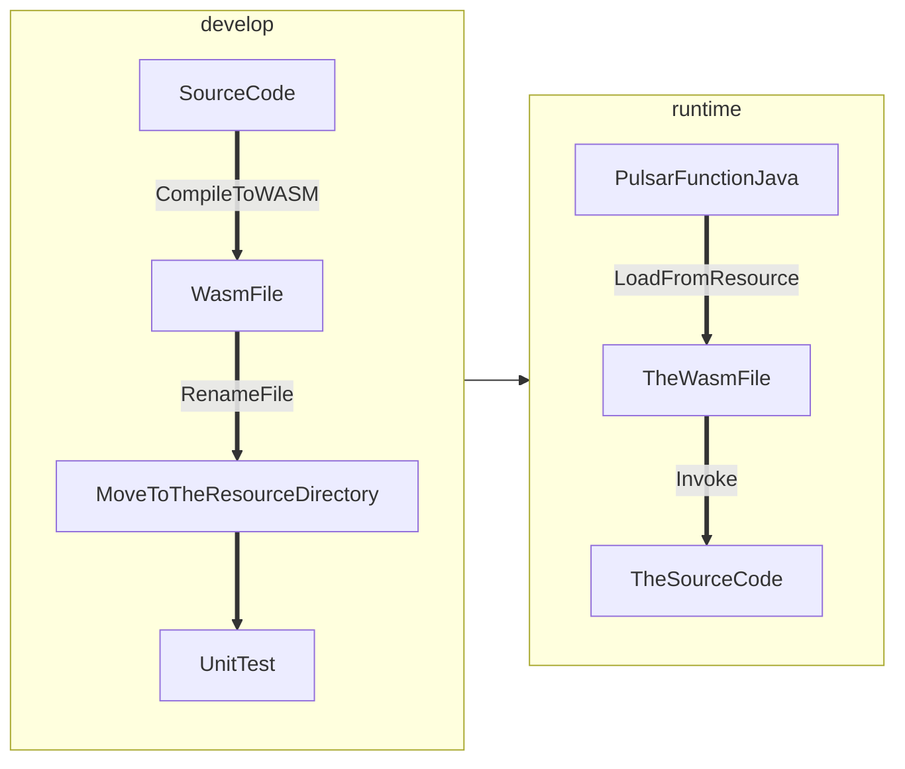

# PIP-336: WASM Support for pulsar-function-java

# Background knowledge

WASM(WebAssembly) bytecode is designed to be encoded in a size- and load-time-efficient binary format. WASM aims to leverage the common hardware features available on various platforms to execute in browsers at machine code speed.

WASI(WebAssembly System Interface) provide a portable interface for applications that run within a constrained sandbox environment, which allows WASM to run in non browser environments such as Linux. It's portable and secure.

# Motivation

The server and client sides of the Pulsar function use protobuf for decoupling. In principle, the language supported by protobuf can be supported by the pulsar function, now Pulsar provided the java, python and golang function client, but there are still many languages that are not supported.

Before all language adaptations are completed (and it's almost entirely certain to be impossible), users cannot write pulsar function in their familiar languages.

# Goals

## In Scope

Other languages, as long as their code can be compiled into WASM bytecode (such as Rust/golang/C++), users can use these languages to write pulsar function.

## Out of Scope

This PIP is not intended to create a completely new runtime, but rather to extend the abilities of existing pulsar-function-java which supplement its communication with other languages.

All existing abilities of the Java pulsar function client are not reimplemented, the WASM Pulsar functions is under the Java Pulsar functions.

Due to the strict requirements of WASM on parameter types and for simplicity reasons, types other than `java.lang.Integer`/`java.lang.Long`/`java.lang.Float`/`java.lang.Double` are not used as parameters or return value.

# High Level Design



SourceCode: Write the source code in a language that can be compiled into WASM bytecode.

CompileToWASM: Compile the source code into a WASM bytecode file.

MoveToTheResourceDirectory: Because we need to load and call WASM files, the purpose of this step is to reduce file duplication conflicts.

PulsarFunctionJava: The data is sourced from the pulsar-function-java.

LoadFromResource: Load the WASM file from the resource directory.

Invoke: Call the WASM function in the WASM file (this is equivalent to calling the source code we previously developed)

# Detailed Design

## Design & Implementation Details

### 1. The WASM function definition in java.

```java
public enum WasmType {

    None(Void.class),

    I32(Integer.class),

    I64(Long.class),

    F32(Float.class),

    F64(Double.class);

    private final Class<?> javaType;

    WasmType(Class<?> javaType) {
        this.javaType = javaType;
    }

    public Class<?> getJavaType() {
        return javaType;
    }
}
```

```java
public class WasmValue {

    private final WasmType wasmType;

    private final Object wasmValue;

    WasmValue(WasmType wasmType, Object wasmValue) {
        this.wasmType = wasmType;
        this.wasmValue = wasmValue;
    }

    public static WasmValue of() {
        return new WasmValue(WasmType.Null, null);
    }

    public static WasmValue ofI32(Integer wasmValue) {
        return new WasmValue(WasmType.I32, wasmValue);
    }

    public static WasmValue ofI64(Long wasmValue) {
        return new WasmValue(WasmType.I64, wasmValue);
    }

    public static WasmValue ofF32(Float wasmValue) {
        return new WasmValue(WasmType.F32, wasmValue);
    }

    public static WasmValue ofF64(Double wasmValue) {
        return new WasmValue(WasmType.F64, wasmValue);
    }

    public WasmType getWasmType() {
        return wasmType;
    }

    public <T> T getWasmValue() {
        return (T) wasmType.getJavaType().cast(wasmValue);
    }
}
```

```java
public interface WasmFunction {

    String getFunctionName();

    WasmType[] getParameterTypes();

    WasmType getReturnType();

    WasmValue invoke(WasmValue... args);
}
```

### 2. Load WASM functions and provide the WASM function to java, also provide the java function to WASM if we need.

We use [wasmtime-java](https://github.com/kawamuray/wasmtime-java) or [chicory](https://github.com/dylibso/chicory) as the actual low-level runtime.

```java
import java.util.Map;

public interface WasmLoader extends AutoCloseable {

    /**
     * If you want to call this method, this method must be called before {@link #load(byte[])} is called.
     * 
     * @return true if the function is defined successfully, false if the function name is duplicate or the {@code wasmFunction} is null.
     */
    boolean defineWasmFunction(WasmFunction wasmFunction);

    /**
     * Load the WASM file bytes.
     *
     * @param wasmBytes the WASM file bytes
     */
    Map<String, WasmFunction> load(byte[] wasmBytes);

    WasmFunction getWasmFunction(String functionName);
}
```

### 3. Pulsar developer usage.

The pulsar developers should use `ServiceLoader.load(WasmLoader.class).iterator().next()` to get a WASM runtime implementation, then use the runtime as follows:

   1) Export `WasmLoader#defineWasmFunction` to users in some way, allowing them to expose Java functions to WASM functions.

   2) call `WasmLoader#load` to load a WASM file.

   3) get a WASM function instance by `WasmLoader#getWasmFunction`.

   4) call the WASM function by `WasmFunction#invoke`.

### 4. Pulsar user usage.

   1) (Optional) Export java function to the other language.

   ```java
   public class UserWasmFunction {
       //......
       public WasmFunction defineWasmFunction() {
           return new WasmFunction() {
               @Override
               public String getFunctionName() {
                   return "add";
               }

               @Override
               public WasmType[] getParameterTypes() {
                   return new WasmType[]{WasmType.I32, WasmType.I32};
               }

               @Override
               public WasmType getReturnType() {
                   return WasmType.I32;
               }

               @Override
               public WasmValue invoke(WasmValue... args) {
                   return WasmValue.ofI32(args[0].getWasmValue() + args[1].getWasmValue());
               }
           };
       }
   }
   ```

   2) Write the source code in the other language that can be compiled into WASM bytecode.

   Below is a example of using rust:
   ```rust
   #[link(wasm_import_module = "pulsar")]
   extern "C" {
       /// This is the java function
       fn add(x: i32, y: i32) -> i32;
   }
   
   /// This method name depends on the implementation of the pulsar and may not be named `invoke`.
   #[no_mangle]
   pub unsafe extern "C" fn invoke() {
       eprintln!("rust side-> invoke {}", add(1, 2));
   }
   ```

   3) Compile the source code into a WASM bytecode file.

   4) Move the WASM file to the specified directory.

# Security Considerations

Maybe need to add folders with tenancy name in the resource directory to prevent conflicts between WASM file names of different tenancies.

# General Notes

# Links

* Mailing List discussion thread: https://lists.apache.org/thread/c3kndzsj6w1z4mg674o48dk6xwfhxv9f
* Mailing List voting thread:
