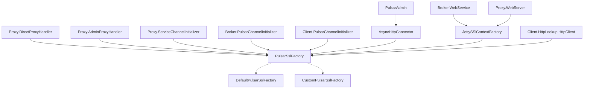

# PIP-337: SSL Factory Plugin to customize SSLContext/SSLEngine generation

# Background knowledge
Apache Pulsar supports TLS encrypted communication between the clients and servers. The TLS encryption setup requires
loading the TLS certificates and its respective passwords to generate the SSL Context. Pulsar supports loading these 
certificates and passwords via the filesystem. It supports both Java based Keystores/Truststores and TLS information in 
".crt", ".pem" & ".key" formats. This information is refreshed based on a configurable interval.
 
Apache Pulsar internally uses 3 different frameworks for connection management:

- Netty: Connection management for Pulsar server and client that understands Pulsar binary protocol.
- Jetty: HTTP Server creation for Pulsar Admin and websocket. Jetty Client is used by proxy for admin client calls.
- AsyncHttpClient: HTTP Client creation for Admin client and HTTP Lookup

Each of the above frameworks supports customizing the generation of the SSL Context and SSL Engine. Currently, Pulsar 
uses these features to feed the SSL Context via its internal security tools after loading the file based certificates.
One of the issues of using these features is that pulsar tries to bootstrap the SSL Context in multiple ways to suit
each framework and file type.

```mermaid
flowchart TB
    Proxy.DirectProxyHandler --> NettyClientSslContextRefresher
    Proxy.DirectProxyHandler --> NettySSLContextAutoRefreshBuilder
    Proxy.AdminProxyHandler --> KeyStoreSSLContext
    Proxy.AdminProxyHandler --> SecurityUtility
    Proxy.ServiceChannelInitializer --> NettySSLContextAutoRefreshBuilder
    Proxy.ServiceChannelInitializer --> NettyServerSslContextBuilder
    Broker.PulsarChannelInitializer --> NettyServerSslContextBuilder
    Broker.PulsarChannelInitializer --> NettySSLContextAutoRefreshBuilder
    Client.PulsarChannelInitializer --> NettySSLContextAutoRefreshBuilder
    Client.PulsarChannelInitializer --> SecurityUtility
    Broker.WebService --> JettySSlContextFactory
    Proxy.WebServer --> JettySSlContextFactory
    PulsarAdmin --> AsyncHttpConnector
    AsyncHttpConnector --> KeyStoreSSLContext
    AsyncHttpConnector --> SecurityUtility
    JettySSlContextFactory --> NetSslContextBuilder
    JettySSlContextFactory --> DefaultSslContextBuilder
    NettyClientSslContextRefresher -.-> SslContextAutoRefreshBuilder
    NettySSLContextAutoRefreshBuilder -.-> SslContextAutoRefreshBuilder
    NettyServerSslContextBuilder -.-> SslContextAutoRefreshBuilder
    NetSslContextBuilder -.-> SslContextAutoRefreshBuilder
    DefaultSslContextBuilder -.-> SslContextAutoRefreshBuilder
    Client.HttpLookup.HttpClient --> KeyStoreSSLContext
    Client.HttpLookup.HttpClient --> SecurityUtility
    SecurityUtility -.-> KeyManagerProxy
    SecurityUtility -.-> TrustManagerProxy
```


The above diagram is an example of the complexity of the TLS encryption setup within Pulsar. The above diagram only
contains the basic components of Pulsar excluding Websockets, Functions, etc.

Pulsar uses 2 base classes to load the TLS information.

- `SecurityUtility`: It loads files of type ".crt", ".pem" and ".key" and converts it into SSL Context. This SSL Context
can be of type `io.netty.handler.ssl.SslContext` or `javax.net.ssl.SSLContext` based on the caller. Security Utility 
can be used to create SSL Context that internally has KeyManager and Trustmanager proxies that load cert changes 
dynamically.
- `KeyStoreSSLContext`: It loads files of type Java Keystore/Truststore and converts it into SSL Context. This SSL
Context will be of type `javax.net.ssl.SSLContext`. This is always used to create the SSL Engine.

Each of the above classes are either directly used by Pulsar Clients or used via implementations of the abstract class 
`SslContextAutoRefreshBuilder`.

- `SslContextAutoRefreshBuilder` - This abstract class is used to refresh certificates at a configurable interval. It 
internally provides a public API to return the SSL Context.

There are several implementations of the above abstract class to suit the needs of each of the framework and the
respective TLS certificate files:

- `NettyClientSslContextRefresher` - It internally creates the `io.netty.handler.ssl.SslContext` using the ".crt", 
".pem" and ".key" files for the proxy client.
- `NettySSLContextAutoRefreshBuilder` - It internally creates the `KeyStoreSSLContext` using the Java Keystores.
- `NettyServerSslContextBuilder` - It internally creates the `io.netty.handler.ssl.SslContext` using the ".crt",
  ".pem" and ".key" files for the server.
- `NetSslContextBuilder` - It internally creates the `javax.net.ssl.SSLContext` using the Java Keystores for the web 
server.
- `DefaultSslContextBuilder` - It internally creates the `javax.net.ssl.SSLContext` using the ".crt", ".pem" and ".key"
files for the web server.

# Motivation
Apache Pulsar's TLS encryption configuration is not pluggable. It only supports file-based certificates. This makes 
Pulsar difficult to adopt for organizations that require loading TLS certificates by other mechanisms.

# Goals
The purpose of this PIP is to introduce the following:

- Provide a mechanism to plugin a custom SSL Factory that can generate SSL Context and SSL Engine. 
- Simplify the Pulsar code base to universally use `javax.net.ssl.SSLContext` and reduce the amount of code required to
build and configure the SSL context taking into consideration backwards compatibility.

## In Scope

- Creation of a new interface `PulsarSslFactory` that can generate a SSL Context, Client SSL Engine and Server SSL 
Engine.
- Creation of a default implementation of `PulsarSslFactory` that supports loading the SSL Context and SSL Engine via
file-based certificates. Internally it will use the SecurityUtility and KeyStoreSSLContext.
- Creation of a new class called "PulsarSslConfiguration" to store the ssl configuration parameters which will be passed
to the SSL Factory.
- Modify the Pulsar Components to support the `PulsarSslFactory` instead of the SslContextAutoRefreshBuilder, SecurityUtility
and KeyStoreSSLContext.
- Remove the SslContextAutoRefreshBuilder and all its implementations.
- SSL Context refresh will be moved out of the factory. The responsibility of refreshing the ssl context will lie with
the components using the factory.
- The factory will not be thread safe. We are isolating responsibilities by having a single thread perform all writes,
while all channel initializer threads will perform only reads. SSL Context reads can be eventually consistent.
- Each component calling the factory will internally initialize it as part of the constructor as well as create the
ssl context at startup as a blocking call. If this creation/initialization fails then it will cause the Pulsar 
Component to shutdown. This is true for all components except the Pulsar client due to past contracts where 
authentication provider may not have started before the client.
- Each component will re-use its scheduled executor provider to schedule the refresh of the ssl context based on its
component's certificate refresh configurations.

# High Level Design


# Detailed Design

## Design and Implementation Details

### Pulsar Common Changes

A new interface called `PulsarSslFactory` that provides public methods to create a SSL Context, Client SSL Engine and
Server SSL Engine. The SSL Context class returned will be of type `javax.net.ssl.SSLContext`.

```java
public interface PulsarSslFactory extends AutoCloseable {
  /*
   * Utilizes the configuration to perform initialization operations and may store information in instance variables.
   * @param config PulsarSslConfiguration required by the factory for SSL parameters
   */
  void initialize(PulsarSslConfiguration config);

  /*
   * Creates a client ssl engine based on the ssl context stored in the instance variable and the respective parameters.
   * @param peerHost Name of the peer host
   * @param peerPort Port number of the peer
   * @return A SSlEngine created using the instance variable stored Ssl Context
   */
  SSLEngine createClientSslEngine(String peerHost, int peerPort);

  /*
   * Creates a server ssl engine based on the ssl context stored in the instance variable and the respective parameters.
   * @return A SSLEngine created using the instance variable stored ssl context
   */
  SSLEngine createServerSslEngine();

  /*
   * Returns A boolean stating if the ssl context needs to be updated
   * @return Boolean value representing if ssl context needs to be updated
   */
  boolean needsUpdate();

  /*
   * Checks if the SSL Context needs to be updated. If true, then a new SSL Context should be internally create and 
   * should atomically replace the old ssl context stored in the instance variable.
   * @throws Exception It can throw an exception if the createInternalSslContext method fails
   */
  default void update() throws Exception {
    if (this.needsUpdate()) {
      this.createInternalSslContext();
    }
  }

  /*
   * Creates a new SSL Context and internally stores it atomically into an instance variable
   * @throws It can throw an exception if the internal ssl context creation fails.
   */
  void createInternalSslContext() throws Exception;

  /*
   * Returns the internally stored ssl context
   * @throws IllegalStateException If the SSL Context has not be created before this call, then it will throw this 
   * exception.
   */
  SSLContext getInternalSslContext();
  
  /*
   * Shutdown the factory and close any internal dependencies
   * @throws Exception It can throw an exception if there are any issues shutting down the factory.
   */
  void close() throws Exception;
  
}
```

A default implementation of the above SSLFactory class called `DefaultPulsarSslFactory` that will generate the SSL 
Context and SSL Engines using File-based Certificates. It will be able to support both Java keystores and "pem/crt/key" 
files.

```java
public class DefaultPulsarSslFactory implements PulsarSslFactory {
  public void initialize(PulsarSslConfiguration config);
  public SSLEngine createClientSslEngine(String peerHost, int peerPort);
  public SSLEngine createServerSslEngine();
  public boolean needsUpdate();
  public void createInternalSslContext() throws Exception;
  public SSLContext getInternalSslContext();
  public void close() throws Exception;
}
```

### Pulsar Common Changes

4 new configurations will need to be added into the Configurations like `ServiceConfiguration`, 
`ClientConfigurationData`, `ProxyConfiguration`, etc. All of the below will be optional. It will use the default values
to match the current behavior of Pulsar.

- `sslFactoryPlugin`: SSL Factory Plugin class to provide SSLEngine and SSLContext objects.
The default class used is `DefaultPulsarSslFactory`.
- `sslFactoryPluginParams`: SSL Factory plugin configuration parameters. It will be of type string. It can be parsed by
the plugin at its discretion.

The below configs will be applicable only to the Pulsar Server components like Broker and Proxy:
- `brokerClientSslFactoryPlugin`: SSL Factory Plugin class used by internal client to provide SSLEngine and SSLContext 
objects. The default class used is `DefaultPulsarSslFactory`.
- `brokerClientSslFactoryPluginParams`: SSL Factory plugin configuration parameters used by internal client. It can be 
parsed by the plugin at its discretion.

`JettySslContextFactory` class will need to be changed to internally use the `PulsarSslFactory` class to generate the 
SslContext.

### SslFactory Usage across Pulsar Netty based server components

Example Changes in broker's `PulsarChannelInitializer` to initialize the PulsarSslFactory:
```java
PulsarSslConfiguration pulsarSslConfig = buildSslConfiguration(serviceConfig);
this.sslFactory = (PulsarSslFactory) Class.forName(serviceConfig.getSslFactoryPlugin())
        .getConstructor().newInstance();
this.sslFactory.initialize(pulsarSslConfig);
this.sslFactory.createInternalSslContext();
this.pulsar.getExecutor().scheduleWithFixedDelay(this::refreshSslContext,
                                                 serviceConfig.getTlsCertRefreshCheckDurationSec(),
                                                 serviceConfig.getTlsCertRefreshCheckDurationSec(),
                                                 TimeUnit.SECONDS);
```

Example changes in `PulsarChannelInitializer` to `initChannel(SocketChannel ch)`:
```java
ch.pipeline().addLast(TLS_HANDLER, new SslHandler(this.sslFactory.createServerSslEngine()));
```

The above changes is similar in all the Pulsar Server components that internally utilize Netty.

### SslFactory Usage across Pulsar Netty based Client components

Example Changes in Client's `PulsarChannelInitializer` to initialize the SslFactory:
```java
this.pulsarSslFactory = (PulsarSslFactory) Class.forName(conf.getSslFactoryPlugin())
        .getConstructor().newInstance();
PulsarSslConfiguration sslConfiguration = buildSslConfiguration(conf);
this.pulsarSslFactory.initialize(sslConfiguration);
this.pulsarSslFactory.createInternalSslContext();
scheduledExecutorProvider.getExecutor())
        .scheduleWithFixedDelay(() -> {
        this.refreshSslContext(conf);
        }, conf.getAutoCertRefreshSeconds(),
        conf.getAutoCertRefreshSeconds(), TimeUnit.SECONDS);
```

Example changes in `PulsarChannelInitializer` to `initChannel(SocketChannel ch)`:
```java
SslHandler handler = new SslHandler(sslFactory
                        .createClientSslEngine(sniHost.getHostName(), sniHost.getPort()));
ch.pipeline().addFirst(TLS_HANDLER, handler);
```

The above changes is similar in all the Pulsar client components that internally utilize Netty.

### SslFactory Usage across Pulsar Jetty Based Server Components

The initialization of the PulsarSslFactory is similar to the [Netty Server initialization.](#sslfactory-usage-across-pulsar-jetty-based-server-components)

The usage of the PulsarSslFactory requires changes in the `JettySslContextFactory`. It will internally accept 
`PulsarSslFactory` as an input and utilize it to create the SSL Context.
```java
public class JettySslContextFactory {
  private static class Server extends SslContextFactory.Server {
    private final PulsarSslFactory sslFactory;

    // New 
    public Server(String sslProviderString, PulsarSslFactory sslFactory,
                  boolean requireTrustedClientCertOnConnect, Set<String> ciphers, Set<String> protocols) {
        this.sslFactory = sslFactory;
      // Current implementation
    }

    @Override
    public SSLContext getSslContext() {
      return this.sslFactory.getInternalSslContext();
    }
  }
}
```

The above `JettySslContextFactory` will be used to create the SSL Context within the Jetty Server. This pattern will be 
common across all Web Server created using Jetty within Pulsar.

### SslFactory Usage across Pulsar AsyncHttpClient based Client Components

The initialization of the PulsarSslFactory is similar to the [Netty Server initialization.](#sslfactory-usage-across-pulsar-jetty-based-server-components)

The usage of the PulsarSslFactory requires changes in the `AsyncHttpConnector`. It will internally initialize the 
`PulsarSslFactory` and pass it to a new custom `PulsarHttpAsyncSslEngineFactory` that implements `org.asynchttpclient.SSLEngineFactory`.
This new custom class will incorporate the features of the existing `WithSNISslEngineFactory` and `JsseSslEngineFactory`
and replace it.

```java
public class PulsarHttpAsyncSslEngineFactory extends DefaultSslEngineFactory {

    private final PulsarSslFactory sslFactory;
    private final String host;

    public PulsarHttpAsyncSslEngineFactory(PulsarSslFactory sslFactory, String host) {
        this.sslFactory = sslFactory;
        this.host = host;
    }

    @Override
    protected void configureSslEngine(SSLEngine sslEngine, AsyncHttpClientConfig config) {
        super.configureSslEngine(sslEngine, config);
        if (StringUtils.isNotBlank(host)) {
            SSLParameters parameters = sslEngine.getSSLParameters();
            parameters.setServerNames(Collections.singletonList(new SNIHostName(host)));
            sslEngine.setSSLParameters(parameters);
        }
    }

    @Override
    public SSLEngine newSslEngine(AsyncHttpClientConfig config, String peerHost, int peerPort) {
        SSLContext sslContext = this.sslFactory.getInternalSslContext();
        SSLEngine sslEngine = config.isDisableHttpsEndpointIdentificationAlgorithm()
                ? sslContext.createSSLEngine() :
                sslContext.createSSLEngine(domain(peerHost), peerPort);
        configureSslEngine(sslEngine, config);
        return  sslEngine;
    }

}
```

The above `PulsarHttpAsyncSslEngineFactory` will be passed to the DefaultAsyncHttpClientConfig.Builder while creating 
the DefaultAsyncHttpClient. This pattern will be common across all HTTP Clients using AsyncHttpClient within Pulsar.

## Public-facing Changes

### Configuration

Same as [Broker Common Changes](#pulsar-common-changes)

### CLI
CLI tools like `PulsarClientTool` and `PulsarAdminTool` will need to be modified to support the new configurations.

# Backward & Forward Compatibility

## Revert
Rolling back to the previous version of Pulsar will revert to the previous behavior.

## Upgrade
Upgrading to the version containing the `PulsarSslFactory` will not cause any behavior change. The `PulsarSslFactory` 
for the server, client and brokerclient will default to using the `DefaultPulsarSslFactory` which will 
read the TLS certificates via the file system.

The Pulsar system will use the custom plugin behavior only if the `sslFactoryPlugin` configuration is set.

# Links

POC Changes:  https://github.com/Apurva007/pulsar/pull/4