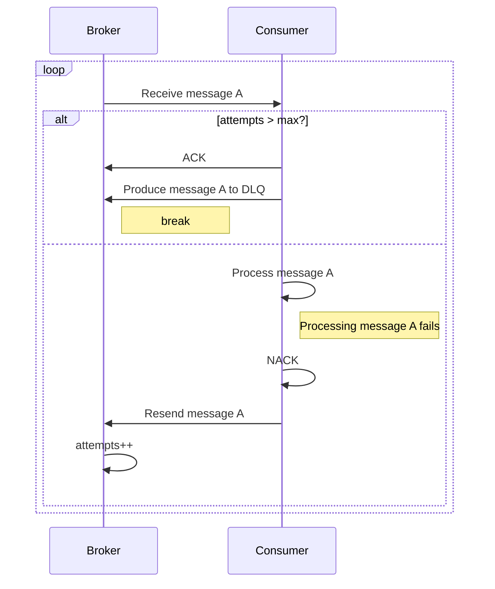
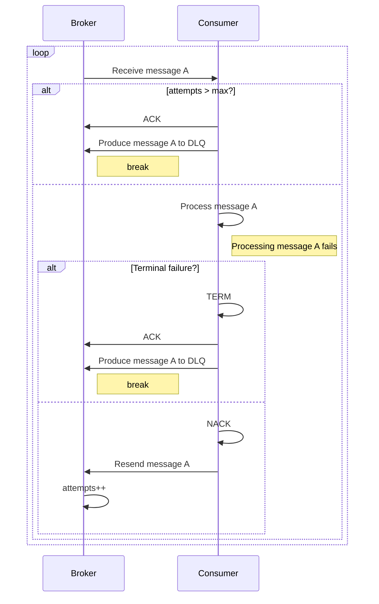

# PIP-372: Allow consumers to terminally NACK a message, bypassing retries and routing directly to the DLQ

# Background knowledge

A consumer has two options when it has finished processing a message:
1. [Acknowledge](https://pulsar.apache.org/docs/3.3.x/concepts-messaging/#acknowledgment) (ACK) the message, signalling
   to the broker that this message has been successfully processed and should not be sent again.
2. [Negative Acknowledge](https://pulsar.apache.org/docs/3.3.x/concepts-messaging/#negative-acknowledgment) (NACK) the
   message which, after a configured delay, signals to the broker to redeliver the message.

A consumer can NACK the same message up to a configured maximum number of times. After this maximum number of retries
has been reached, the consumer will attempt to ACK the message and then produce that same message to a [dead letter
topic](https://pulsar.apache.org/docs/3.3.x/concepts-messaging/#dead-letter-topic) (DLQ). Messages in the DLQ can be
consumed and processed 'out of band', e.g. for later manual inspection.

# Motivation

If a consumer consumes a message and fails during the processing of that message in a terminal way, we as the client in
certain scenarios may not want to retry that message later, we may want to send it directly to the DLQ for later
inspection.

Example: A message is received that contains an invalid field value. The business logic dictates that we should fail
processing this message and not retry, however this invalid value might be unexpected and indicate a bug in the system.
It would be useful to have the message routed to the DLQ so that an engineer can reconsume it 'offline' at a later date
to investigate.

Currently, if the client wanted a persistent record of the message, they would have to do one of:

1. NACK the message and retry it up to the configured max retries, when it would then land in the DLQ.
2. ACK the message and explicity produce it to the DLQ.
3. ACK the message and persist it in some other system, e.g. a database table, a log file.

# Goals

## In Scope

* Add an interface that allows a consumer to terminally NACK a message, sending it directly to the DLQ instead of
  retrying.

## Out of Scope

N/A


# High Level Design

Omitted as the detailed design is not overly complex.

# Detailed Design

## Design & Implementation Details

This change could be achieved by changes to the client libraries only, reusing existing functionality. I propose adding
a public method to the Consumer interface `Term`. `Term` would bypass the check between the number of message
redeliveries and the configured maximum and route the message directly to the DLQ.

Here is an example of the proposed interface change in Go and Java client.
```go
type Consumer interface {
	// Term acknowledges the terminal, non-retryable failure to process a single message.
	//
	// When a message is "terminally negatively acked" it will not be marked for redelivery. Instead, it will be routed
	// directly to the DLQ in accordance with the configured [DLQPolicy]. If there is no DLQPolicy configured on the
	// consumer, this method will error.
	Term(Message) error
}
```

```java
public interface Consumer<T> {

    /**
     * Non-retryable failure to process a single message.
     * <p>When a message is "terminally negatively acked" it will not be marked for redelivery. Instead,
     * it will be routed directly to the DLQ in accordance with the configured {@link DeadLetterPolicy}
     *
     * @param messageId {@link MessageId} to be individual acknowledged
     * @throws PulsarClientException.InvalidConfigurationException
     *             if the consumer did not set the {@link DeadLetterPolicy}
     */
    void terminate(MessageId messageId) throws PulsarClientException;

    void terminate(Message<?> message) throws PulsarClientException;
}

```

Here is the existing flow that a Consumer undergoes in order to route a message to the DLQ.


Here is the same flow augmented to allow a Consumer to terminally fail a message and route it to the DLQ without having
to retry up to several times.


## Public-facing Changes

### Public API

N/A

### Binary protocol

N/A

### Configuration

N/A

### CLI

N/A

### Metrics

If the client would like to track the number of calls to the `Term` method, we could add a new metric
`pulsar_client_consumer_terms`. This metric should in theory track exactly with the
`pulsar_client_consumer_dlq_messages`, but it may be desirable to have separate metrics.

* Name: `pulsar_client_consumer_terms`
* Description: Counter of messages termed by the client
* Attributes: `client`, `pulsar_tenant`, `pulsar_namespace`, `topic`
* Unit: N/A

> Keep the Java client consistent.

# Monitoring

N/A

# Security Considerations

N/A

# Backward & Forward Compatibility

This proposal includes adding a new method to the Consumer interface in the client libraries, not changing any existing
interface methods therefore this change is backwards and forwards compatible.

# Alternatives

N/A

# General Notes

N/A

# Links

* Mailing List discussion thread:
* Mailing List voting thread:
