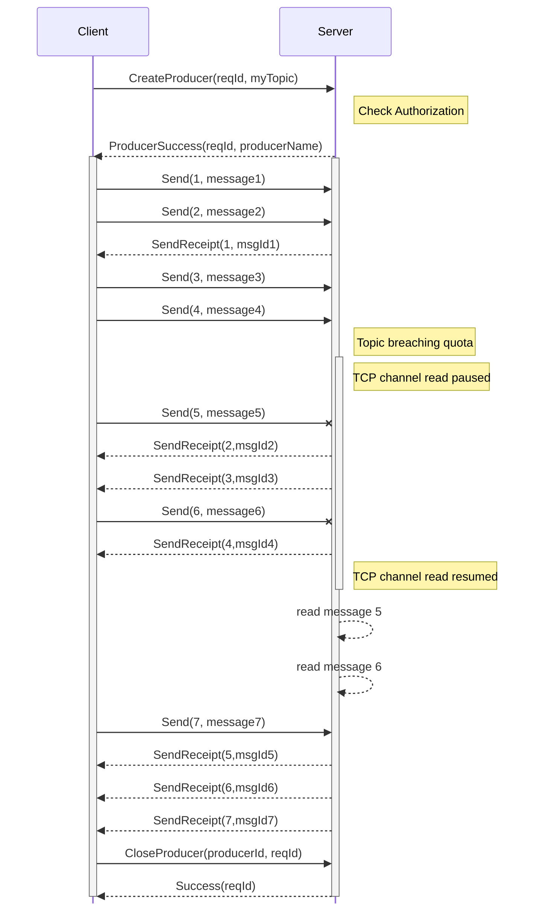
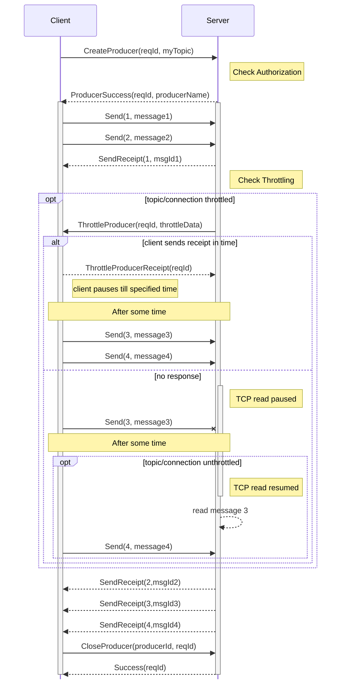

# PIP-385: Add rate limit semantics to pulsar protocol and Java client

<details>
  <summary><h2>Table of Contents</h2></summary>

- [Background knowledge](#background-knowledge)
  * [Challenges with the current approach](#challenges-with-the-current-approach)
- [Motivation](#motivation)
- [Goals](#goals)
  * [In Scope](#in-scope)
  * [Out of Scope](#out-of-scope)
- [High Level Design](#high-level-design)
  * [New binary protocol commands](#new-binary-protocol-commands)
  * [Java client changes](#java-client-changes)
- [Detailed Design](#detailed-design)
  * [High-level Implementation Details](#high-level-implementation-details)
    + [Broker Changes](#broker-changes)
    + [Determining the throttling duration for clients](#determining-the-throttling-duration-for-clients)
    + [Java Client Changes](#java-client-changes-1)
    + [Blocking messages to be sent during throttling](#blocking-messages-to-be-sent-during-throttling)
    + [Client side rate limit exception](#client-side-rate-limit-exception)
  * [Public-facing Changes](#public-facing-changes)
    + [Binary Protocol](#binary-protocol)
    + [Java Client](#java-client)
    + [Configuration](#configuration)
    + [Metrics](#metrics)
- [Backward & Forward Compatibility](#backward-forward-compatibility)
  * [Upgrade / Downgrade / Rollback](#upgrade-downgrade-rollback)
  * [Lower Protocol Client](#lower-protocol-client)
  * [Lower Protocol Server](#lower-protocol-server)
- [Alternatives](#alternatives)
- [Links](#links)

</details>

# Background knowledge

Being a multi tenant system, pulsar supports quality of service constructs like topic quotas in bytes per second and
qps. On top of this, the fact that one broker has only certain limited resources, it has to additionally implement some
other controls to limit the resources usage, like how much message buffer it has, etc.

As such, pulsar induces throttling at multiple levels. Just looking at publish level throttling, here are the various
levers that we can configure in pulsar which enables us to rate limit a producer, topic or an entire connection from a
client:

* At the core of it, we can set topic level publish rate in bytes and/or messages per second.
* We can create a resource group (combination of one or more namespaces or tenants) and set a publish-rate for that
  resource group.
* We can set a broker config to throttle based on pending messages at a connection level.
  See [maxPendingPublishRequestsPerConnection](https://github.com/apache/pulsar/blob/4b3b273c1c57741f9f9da2118eb4ec5dfeee2220/pulsar-broker-common/src/main/java/org/apache/pulsar/broker/ServiceConfiguration.java#L750)
* We can set a broker config to throttle based on message buffer size at a thread level.
  See [maxMessagePublishBufferSizeInMB](https://github.com/apache/pulsar/blob/4b3b273c1c57741f9f9da2118eb4ec5dfeee2220/pulsar-broker-common/src/main/java/org/apache/pulsar/broker/ServiceConfiguration.java#L1431C17-L1431C49)
* We can set a broker level maximum publish rate per broker in bytes and/or messages.

Currently, the way pulsar uses these levers and enforces these limits is by pausing reading further messages from an
established connection for a topic. This is transparent to the clients, and they continue to publish further messages
with an increased observed latency. Once the publish-rates are within the limits, broker resumes reading from the
connection.

Here is a small illustration to demonstrate the situation:



## Challenges with the current approach

The current approach may look perfectly fine when looking at the above example, but when looked from a wider scope,
things start looking bad.
Typically, the clients reuse a single TCP connection from the client to a broker to send messages to multiple topics.
This is controlled by the client side property
of [connectionsPerBroker](https://github.com/apache/pulsar/blob/4b3b273c1c57741f9f9da2118eb4ec5dfeee2220/pulsar-client/src/main/java/org/apache/pulsar/client/impl/conf/ClientConfigurationData.java#L135)
which defaults to 1. The situation is worsened by the fact that typically, a client is used to create producers for
partitioned topics and generally an application may produce to more than one partitioned topic with the producers
created from the same client object, thus all sharing the same tcp connection.

In this situation, even when a single topic starts breaching the quota, the entire TCP connection is paused leading to
a noisy neighbour effect where effectively all the topics that the client is producing to start getting throttled and
observe high latencies.

# Motivation

The current method of inducing throttling when a topic or connection breaches quota has various challenges:

* **Noisy neighbors** - Even if one topic is exceeding the quota, since the entire channel read is paused, all topics
  sharing the same connect (for example - using the same java client object) get rate limited.
* **Unaware clients** - clients are completely unaware that they are being rate limited. This leads to all send calls
  taking super long time or simply timing out (assuming shorter send timeouts). If clients were aware, they can either
  fail fast or induce back-pressure to their upstream.
* **Impossible debugging** - Since all topics emit the rate limit metric, it is practically impossible to figure out
  which
  actual topic is breaching the quota in order to update the topic policies.
* **Missing protocol** - Since rate limiting is a first class citizen of messaging sub-system, it really should be
  present as a response in the protocol as well.

# Goals

## In Scope

* Introduce a new binary protocol command pair to notify clients about throttling and get an acknowledgement back from
  the clients that they respect the throttling and will stop producing further until mentioned.
    * If acknowledgement is received within a configured time, we do not pause the connection for further reads.
* [Java client] Add client public API interface to indicate if a producer is being throttled.
* [Java client] Add relevant new PulsarClientException and logic to throw throttling related exception instead of
  timeout if needed.
* [Java client] Add OTel metrics about rate limiting.

## Out of Scope

* Changing the core rate limiting logic.
* Implementation for other language clients
* Changes in other protocols

# High Level Design

## New binary protocol commands

We introduce a new comment which server will send to clients - `ThrottleProducer(reqId, throttleData)` and server will
expect an acknowledgement command back within a configured time window `ThrottleProducerReceipt(reqId)`.

The broker already records different levels of throttling in one way or another via metrics or counters, both at a topic
level and at a connection level as well. The main design idea is that wherever today we take action to pause the
channel, we first instead send the `ThrottleProducer` command and if we receive the `ThrottleProducerReceipt` response,
instead of pausing the channel, we rely on clients not sending further messages for the breaching topic. If the response
doesn't come within the configured window, we continue to pause the channel as usual.

For the **case where connection level breaches** happen - i.e. breach due to maxPendingPublishRequestsPerConnection,
maxMessagePublishBufferSizeInMB or broker level rate limit - **we continue to pause the connection**, but we still send
the `ThrottleProducer` command in order to inform the client about the reason for any potential timeout. The reason we
continue to pause reads is that we are already breaching memory limits, thus, even if the client sends
a `ThrottleProducerReceipt` response, we won't be able to read it until further pending messages before that are read.

Here is a sequence diagram highlighting the case when a topic level breach happens:



## Java client changes

* Client will now have logic to understand the `ThrottleProducer` command and take relevant action of blocking further
  messages for the relevant topic. It will then respond back with `ThrottleProducerReceipt` command.
    * Client will resume message sending after the specified time in the `ThrottleProducer` command's data.
    * This interval of no messages will be noted as "being throttled"
    * Within this duration, another `ThrottleProducer` command from server may come.
* Producer will record new OTel metric indicating which topic was throttled and the reason.
* In case a message fails due to timeout and there was a throttled command from server for the owning topic, client will
  instead throw a rate limit exception instead of timeout exception.

# Detailed Design

## High-level Implementation Details

### Broker Changes

* For calls arising from `PublishRateLimiterImpl` class, add logic in `ServerCnxThrottleTracker.java` to send the
  command to client and wait for response for the max configured duration before calling `changeAutoRead`. It checks for
  feature availability first.
* For calls arising from `ServerCnxThrottleTracker::changeThrottlingFlag`, we send the command async (if feature
  supported) without worrying about response and then call `changeAutoRead`.
* capture `AbstractTopic::getTotalPublishRateLimitCounter` per publish rate limit counter and add relevant attribute in
  the rate limit metric

### Determining the throttling duration for clients

Broadly, there are 2 different categories for rate limiting - (a) quota exceeding at a topic/resource group level OR (b)
connection level breaches leading to broker's resource crunch.

In case (a), as per the current token bucket based quota tracking introduced in PIP-322, we (lazily) resume channel
reads on the next second mark. i.e. the throttling is only applied at max for 1 second.
In case (b), there is no clear picture on when the channel read is resumed as we wait till we have processed half of the
pending messages, or cleared half of the memory threshold.

Thus, for case (a), we will be asking the client to pause further message sending for the remainder of the second and in
case (b), we will send `0` as the channel read is anyway paused.

### Java Client Changes

* We maintain a boolean and an enum field at a producer level to capture if the producer is being throttled or not and
  the reason for current throttling.
* We also capture the timestamp at which we began throttling, and the duration for which we need to continue throttling
  from that timestamp.
* `ClientCnx` to handle incoming `ThrottleProducer` command and set the boolean and timestamp for the relevant producer
  and send back a the `ThrottleProducerReceipt`.
    * We mark a counter metric with the reason and the value being the throttle duration.
* Most of the blocking logic lies in `ProducerImpl::processOpSendMsg`. More details in next section. 
* Producer disables the throttling lazily, whenever next time there is a check for "being throttled" and required time
  has passed.
* In the timeout processor `run` method, we add logic to send a rate limit exception if the producer is being throttled
  instead of TimeoutException. Explained in further sections.
* For partitioned producer - `isThrottled` returns true if any of the partitions is being throttled.
* For partitioned producer - In case of default round robing partition selection approach, we skip the partition which
  is being throttled.

### Blocking messages to be sent during throttling

Most of the logic to actually block a message until throttling is lifted resides inside `ProducerImpl::processOpSendMsg`

If the configured `sendTimeout` is less than the remaining throttled duration while we are being throttled, we simply fail
with rate limit exception before adding the message to `pendingMessages`.

Otherwise, right before we retain the connection - `op.cmd.retain()`, we check if we are being throttled. If yes, we
add the message to a new class level field `OpSendMsgQueue blockedMsgsDueToThrottling` instead of sending the message
through. There will be a scheduled task created by the `CommandThrottleProducer` command handler to drain the messages 
from this queue. This scheduled task will also handle any extension in throttling window, and updating the topic stats.

The timeout handler method will also ensure it clears the message from `blockedMsgsDueToThrottling` along with
`pendingMessages`.

### Client side rate limit exception

This will be a new exception to be thrown instead of timeout exception in case a message times out and the producer was
being throttled for the majority of the duration while the message was waiting for send receipt.

For this decision, we try to figure out the ratio `B/T` , where `T` is time from message `send` call to timeout, thus
basically the configured `sendTimeout` and `B` is the amount of time during the period of `T` when the producer was being
throttled. If this ratio of `B/T` is greater than 80%, then we throw a rate limit exception. The calculation need not be
precise in favor of an efficient way of calculation.

## Public-facing Changes

### Binary Protocol

2 new binary protocol commands:

```protobuf
message CommandThrottleProducer {
    required uint64 request_id = 1;    // unique identifier for the request within the connection
    required uint64 producer_id = 2;   // target producer id
    
    enum ThrottlingReason {
        TopicProduceQuotaExceeded = 0;
        ResourceGroupProduceQuotaExceeded = 1;
        ConnectionPendingMessagesBreach = 2;
        MessageBufferSizeBreach = 3;
        BrokerProduceQuotaExceeded = 4;
    }
    required ThrottlingReason throttling_reason = 4;
    required uint64 pause_for_millis = 5;
}

message CommandThrottleProducerReceipt {
    required uint64 request_id = 1;
}
```

A new feature flag

```protobuf
 message FeatureFlags {
     optional bool supports_auth_refresh = 1 [default = false];
     optional bool supports_broker_entry_metadata = 2 [default = false];
     optional bool supports_partial_producer = 3 [default = false];
     optional bool supports_topic_watchers = 4 [default = false];
     optional bool supports_get_partitioned_metadata_without_auto_creation = 5 [default = false];
+    optional bool supports_throttle_producer_commands = 6 [default = false];
 }
```

### Java Client

api/Producer.java - `boolean isThrottled()` - A new public getter to indicate if the producer is being throttled at that
moment.

A new `PulsarClientException` for the java client - `ProducerThrottledException` which relays the `throttling_reason`
from the `ThrottleProducer` command in the exception message.

### Configuration

New broker level configuration - `ServiceConfiguration::throttleProducerReceiptWaitTimeMillis` [default `100`] - time to
wait for a `ProducerThrottoledReceipt` for the corresponding request id before falling back to pausing the TCP channel
read.

### Metrics

* New java client counter metric `pulsar.client.producer.throttled_times{reason, topic}` indicating the duration for
  which the topic has been throttled for each of the reason.
* Add publish rate limiter name in the broker metric `pulsar.broker.topic.publish.rate.limit.count` . i.e. publish, rate
  limit or broker.

# Backward & Forward Compatibility

## Upgrade / Downgrade / Rollback

No compatibility issues between pulsar server version upgrade/downgrades.

## Lower Protocol Client

If a client which doesn't support the throttled commands connects to the broker which does, broker will continue to
behave like before - i.e. pausing channel read in all throttling situations. This will be based on the feature flag from
the client and broker will not even attempt to send in the `ThrottleProducer` command.

## Lower Protocol Server

If a client which supports the throttled commands connects to an older broker version which doesn't, it will have no
effect as it would never receive the `ThrottleProducer` command which is the entry point for any client side logical
change related to this PIP.

# Alternatives

There are a few alternate approaches/hacks to somewhat tackle this problem of noisy neighbor that are being documented
below along with the reason why they are not chosen

* Users can simply create N different pulsar client objects to have every topic in a different TCP connection:
  * On the client side, this may not scale well when there are 100s of partitions to produce to both from memory and
    network perspective. Especially because having 1 cached client per topic/partition leads to properties like
    numListenerThreads, numIoThreads, memoryLimitBytes loosing their effectiveness in managing memory footprint.
  * On the broker side, assuming a broker is owner of 2000 topics, the broker now has to handle many TCP connections,
    probably in the range of 20k-100k. There is a network and OS level limit to how many connections can be present and
    moreover - a broker's performance varies a lot based on how many actual connections are open to it.
* Brokers can send back a send error response indicating throttling rather than a new command in the protocol:
  * CommandSendError command doesn't have the provision to notify the time for which the producer is throttled. Adding
    that optional field just for one of the ServerError enums doesn't seem right.
  * Due to the distributed nature of a producer, relying on communication as a response to a `CommandSend` request might
    not work out. Suppose 10 producers connected to a topic, one of them might not even have produced yet but the quota
    might have breached. So we need to send communication to all 10 producers to throttle themselves.
  * Throttling doesn't actually lead to failures - If the client has reasonable timeouts (default being 30s is very
    reasonable) then even with throttling, the message production will succeed. Moreover, every producer could be
    created with a different client sendTimeout value. Thus, it is not possible in the current protocol approach to 
    determine whether a throttling on the broker side would actually lead to client side error at all. Thus, this is
    decoupled from send response.


# Links

* Mailing List discussion thread: https://lists.apache.org/thread/9wddmj4o5mrdst427r40rr7phqb05y6s
* Mailing List voting thread: https://lists.apache.org/thread/p4zvok4l6dxrm0hqbno5s21tq4s33f7s
