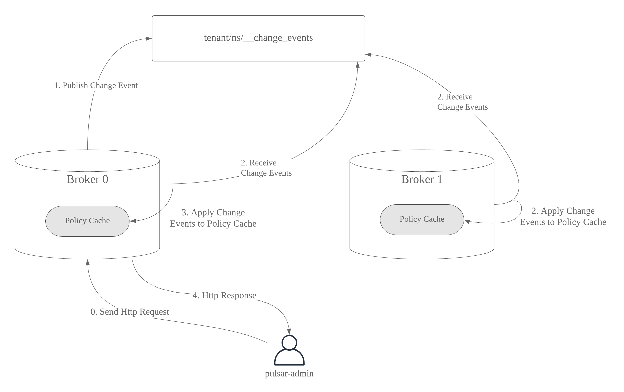

# PIP-39: Namespace Change Events & Topic Policy

* **Status**: Drafting
* **Author**: Sijie Guo
* **Pull Request**: https://github.com/apache/pulsar/issues/4899
* **Mailing List discussion**:
* **Release**:

### Motivation

Pulsar is a multi-tenant event streaming system. Administrators can manage the tenants and namespaces by setting policies at different levels. However the policies such as retention policy, storage quota policy are only able to be set at a namespace level. In many use cases, users would like to have the ability to override a policy at the topic level. But Pulsar doesn’t support topic level policy. So they ended up mapping topic to namespaces, which result in using one namespace per topic and it is only not efficient in managing many namespaces and topics.

The namespace change events approach is proposed to be used for supporting topic level policy in an efficient way. In this proposal we use Pulsar as an event log for storing namespace change events (such as topic policy changes). This has a few benefits:

1) Avoid using zookeeper and introduce more loads to zookeeper.
2) Use Pulsar as an event log for propagating the policy cache. It can scale efficiently.
3) Be able to use Pulsar sql to query the namespace changes and audit the system.

### Implementation

#### Overview

Each namespace will have a system topic \`\_\_change\_events\`. This system topic will be used for storing change events for a given namespace. The details of change events are described in section “Change Events”.

Figure 1 illustrates the overview of how to use namespace change events to implement the topic level policy.

1. Pulsar admin clients still talk to the admin restful service to update topic level policies (as shown in step 0 “Send Http Request”).
2. Any broker that receives the admin http request will publish a topic policy change event to the corresponding \`\_\_change\_events\` topic of the namespace. (as shown in step 1 “Publish Change Event”)
3. Each broker that owns a namespace bundle(s) will subscribe to the \`\_\_change\_events\` topic to receive change events of the namespace. It then appliesapply the change events to the policy cache. (as shown in step 2 “Receive Change Events” and step 3 “Apply Change Events to Policy Cache”)
4. Once the policy cache is updated, the broker sends the response back to the pulsar admin clients. (as shown in step 4 “Http Response”)

Figure 1\. Namespace Change Events & Topic Policy

#### Change Events

The change event format is defined as below:

Enum ActionType {
	INSERT,
	DELETE,
	UPDATE,
	NONE
}

Enum EventType {
	TOPIC
}

Class PulsarEvent {

	EventType eventType;
	ActionType action;

	// pulsar events
	TopicEvent topicEvent;

}

Class TopicEvent {
	String tenant;
	String namespace;
	String topic;
	Boolean persistent;

	Policies policies;
}

The events are serialized using AVRO schema. Using AVRO schema in \`\_\_change\_events\` allows us to managemanaging schema evolution using Pulsar’s existing mechanism.

#### Policy Cache Management

Policy cache is updated by receiving change events from \`\_\_change\_events\` topic when a namespace bundle(s) is loaded. The policy items are evicted lazily when all the namespace bundles of a namespace are unloaded from a broker. When to evict the topic policies of unowned namespaces are configured by a broker setting.

#### Policy of \`\_\_change\_events\` topic

By default infinite retention and compaction are enabled for \`\_\_change\_events\` topics. In future we can add a setting to namespace policy to configure the policy for its \`\_\_change\_events\` topic.

### Rejected Alternatives

#### ZooKeeper Approach

We can still use zookeeper for storing the topic-level policy. See the existing implementation at [https://github.com/apache/pulsar/pull/2659](https://github.com/apache/pulsar/pull/2659)

As explained at the \*Motivation\* section, there are a lot of shortcomings in this approach. For example, more zookeeper accesses when a topic level policy is not set, more zookeeper watches registered if there are many topic level policies are set.
