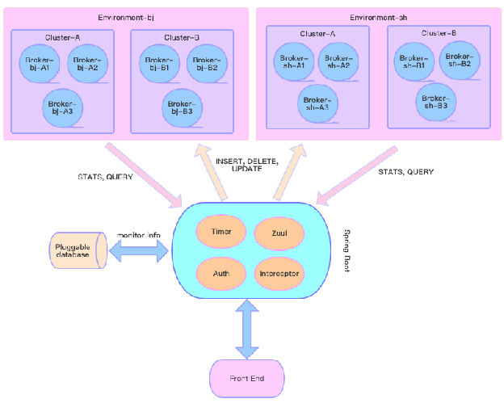
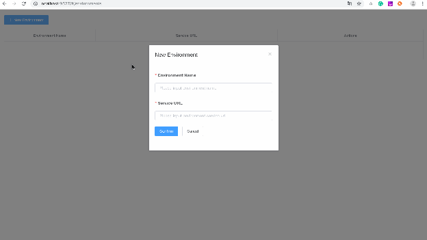
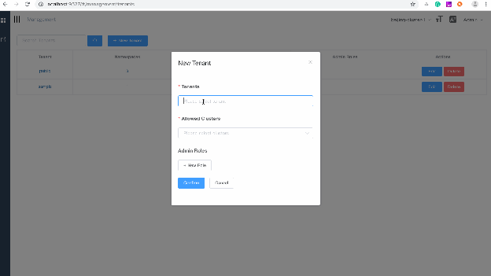
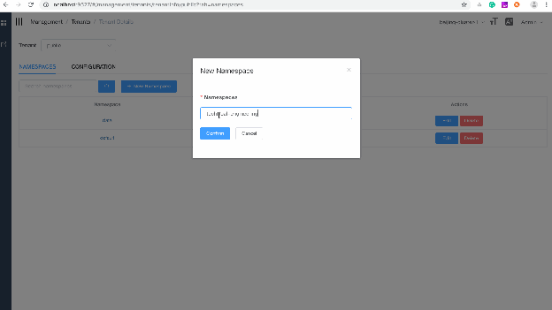
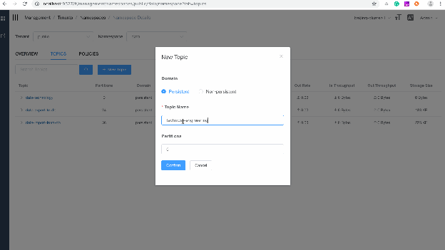
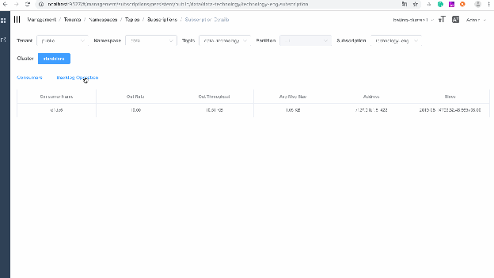
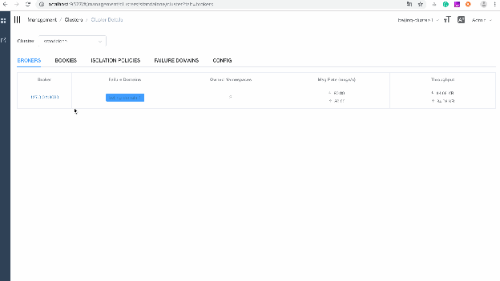
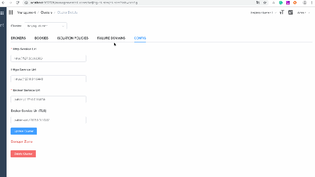

# PIP-40: Pulsar Manager

* **Status**: Adopted
* **Author**: Guangning E
* **Pull Request**: https://lists.apache.org/thread.html/ec4437456d399aaefbca0b980bbfb2c63fd83ad1d15a2d05d8046962@%3Cdev.pulsar.apache.org%3E
* **Mailing List discussion**:
* **Release**:

Pulsar Manager is already accepted as part of Pulsar project. The repo is available at - https://github.com/apache/pulsar-manager.

# **Status**

Current State: *\[“Drafted”\]*

*Author: Guanning E*

*Reviewers: Siije Guo, Jia Zhai, Penghui Li*

Pull Request:

Mailing List Discussion:

Github Repo*: \[[https://github.com/streamnative/pulsar-manager](https://github.com/streamnative/pulsar-manager)\]*

# **Motivation**

*Currently Pulsar has a monitoring tool \- \[Pulsar Dashboard\]([http://pulsar.apache.org/docs/en/administration-dashboard/](http://pulsar.apache.org/docs/en/administration-dashboard/)). However, it only focuses on simple monitoring of Pulsar \- collecting and displaying information such as statistics of tenants, namespaces, topics, subscriptions, and so on. It doesn’t provide any management operations such as add, delete and update tenants, namespaces,topics, and so on. When the scale of Pulsar cluster increases or the number of clusters grows, using \`pulsar-admin\` to  manage Pulsar can not satisfy demands. Therefore, Pulsar needs  a simple and easy-to-use management console for administrators.*

*Pulsar Manager is a web-based GUI management and monitoring tool that helps administrators and users manage and monitor tenants, namespaces, topics, subscriptions, brokers, clusters, and so on, and supports dynamic configuration of multiple environments.*

# **Design**

*\#\# Design*

*As Pulsar's management tool, Pulsar Manager aims at supporting managing Pulsar clusters running in different environments (on-premise data centers, cloud,  and so on). Apache Pulsar, as an excellent distributed messaging system, has already provided a concise and elegant RESTful API, which can continue to be used in Pulsar manager. The goal of Pulsar manager is to use a set of tools and a portal to provide administrators with an easy-to-use management tool for Pulsar.*

*\#\#\# Concepts*

*We introduced a concept \`Environment\` (aka Instance) in Pulsar Manager for managing multiple distinguished or isolated Pulsar environments. For example, within an organization, you might have a \`Staging\` environment for development and testing and a \`Production\` environment for serving production traffic.*

*Within an environment, there are multiple geo-replicated clusters sharing the same global configuration store. Each cluster has its own dedicated local zookeeper and a list of brokers and bookies.*

*Tenants, namespaces, topics and subscriptions are globally available within one environment. Pulsar Manager provides per-cluster aggregated metrics for each entity and per-cluster management as well.*

*Pulsar Manager features are listed as follows:*

- *Management*
  - *Environment : (operations on environment)*
    - *Create / Delete / Update / List / Get*
  - *Cluster : (operations on clusters)*
    - *Create / Delete / Update / List / Get*
  - *Brokers : (operations on brokers)*
    - *Heartbeat / Unload*
  - *Tenants:*
    - *Create / Delete / Update / List*
  - *Namespaces:*
    - *Create / Delete / List*
    - *Manage Namespace Policy*
    - *Unload*
    - *Operations on Namespace Bundles*
  - *Topics*
    - *Create / Delete / List*
    - *Unload / Terminate / Offload / Compact*
    - *Topic Details*
  - *Subscriptions*
    - *Create / Delete / List*
    - *Reset Cursor / Skip / Clear backlog / Unsubscribe*
  - *Namespace Isolation Policies*
    - *Create / Delete / Update / Get / List*
  - *Failure Domains*
    - *Create / Delete / Update / Get / List*
- *Monitoring: (display \*aggregated\* stats at different levels)*
  - *Tenants*
    - *List the total number of namespaces per tenant (both aggregated and per-cluster basis)*
  - *Namespaces*
    - *List the total number of topics per namespace*
    - *List the aggregated stats per namespace (such as rate-in, rate-out, throughput-in, and throughput-out)*
    - *List the distributions of namespace bundles*
  - *Topics*
    - *List the total number of partitions per topic*
    - *List the aggregated stats per topic (such as rate-in, rate-out, throughput-in, and throughput-out)*
    - *Detailed stats per topic partition*
    - *Detailed stats of storage per topic partition*
    - *Detailed stats of subscription per topic and per partition*
    - *Detailed stats of producers*
    - *Detailed stats of consumers*

*The figure above illustrates how does Pulsar Manager work and how it manages  multiple Pulsar environments. The Pulsar Manager comprises two parts: frontend and backend.*

*\#\#\# Backend*

*The backend is written using Spring-Boot. It includes four components: timer, interceptor, authentication and Zuul router. In most cases,  the backend just forwards the RESTful requests to the destined Pulsar clusters. But the backend does additional work for managing environments, users, roles, stats aggregation, and so on.*

*\#\#\#\# Unified RESTful API*

*In order to be consistent with Pulsar's RESTful API to the greatest extent possible and to be easily distinguished from it, Pulsar Manager's RESTful API is uniformly prefixed with pulsar-manager, for example:*

*Gets all namespaces under a tenant.*

*\`\`\`*

*GET /pulsar-manager/admin/v2/namespaces/{tenant}*

*\`\`\`*

*The request is handled by the backend, and the backend will query the Pulsar clusters to return the namespaces information of each cluster for the given tenant. The backend returns the aggregated metrics back to the frontend.*

*Create a namespace under a tenant.*

*\`\`\`*

*PUT /admin/v2/namespaces/{tenant}/{namespace}*

*\`\`\`*

*This request is posted to endpoints under \`/admin\`. It is forwarded  directly to the given broker.*

*\#\#\#\# Timer*
*The timer is responsible for collecting the statistical information of each environment and each broker under each cluster and storing it into database. With the collected stats, it is very convenient to aggregate the stats at different dimensions (subscription, topic, namespace, tenant, broker, cluster, and so on).*

*\#\#\#\# Zuul router*

*Pulsar provides a rich RESTful API to manage Pulsar clusters. Pulsar manager reuses these features to the greatest extent possible. Therefore, a Zuul component is added to Pulsar Manager for routing RESTful requests. For all non-idempotent operations, it is directly forwarded to broker.*

*Zuul is also responsible for handling request redirection. Since Pulsar manager aims at managing multiple Pulsar environment and Pulsar clusters. The Pulsar manager has to make sure it forwards the request to the right Pulsar clusters (brokers). Hence the RESTful requests sent from frontend to backend carries additional environment or cluster related headers to tell Zuul which pulsar cluster (broker) that this request should be sent to.*

*These headers are:*

- *X-pulsar-cluster: the name of the pulsar cluster*
- *X-pulsar-broker: the name of the pulsar broker*
- *Environment: the name of the pulsar environment. The environment is also stored as part of the cookie.*

*\#\#\#\# Pluggable database*

*Different databases have different advantages. For example, SQLite is very convenient in the testing environment. MySQL has advantages for a large amount of data online. Pulsar Manager supports a variety of databases to allow users to use the database that is suitable for them.*

*\#\#\#\# Interceptor*

*Pulsar manager provides an interceptor to intercept all unauthenticated and non-environment related requests.*

*\#\#\#\#\# Authentication*

*The components of the infrastructure attach great importance to security, so {kkkkkkkkkkkkkkkkkkkkPulsar Manager should have a reasonable authentication and authorization system. Therefore, Pulsar Manager has added a basic authentication feature, which will be further expanded later.*

*\#\#\# Frontend*

*The first version of the front end consists of several parts:*

* *Tenants management*
* *Namespaces management*
* *Topics management*
* *Subscriptions management*
* *Brokers management*
* *Clusters management*
* *Dynamic environments with multiple changes*

*\#\#\#\# Dynamic environments with multiple changes*

**

*\#\#\#\# Tenants management*

**

*\#\#\#\# Namespaces management*

**

*\#\#\#\# Topics management*

**

*\#\#\#\# Subscriptions management*

**

*\#\#\#\# Brokers management*

**

*\#\#\#\# Clusters management*

*\#\#\# Test Plan*

*We have the following test plans:*

* *Add unit tests for backend*
* *Add integration tests for frontend*

# **Rejected Alternatives**

*If there are alternative ways of accomplishing the same thing, what are they? The purpose of this section is to motivate why a new project is the way it is and not some other way.*

[image1]: <data:image/png;base64,iVBORw0KGgoAAAANSUhEUgAAAm0AAAALCAYAAAAtObrQAAAAw0lEQVR4Xu3WMY0CABQFQWSdA1QggBIvOEAJCq4+BZgggfz20d4j+ckUo2H38Hu/vui5Pf7gw/PyA6udT0fgyw45GfyvjDWMDCBskzEB+kxbWcYaRgYQtsmYAH2mrSxjDSMDCNtkTIA+01aWsYaRAYRtMiZAn2kry1jDyADCNhkToM+0lWWsYWQAYZuMCdBn2soy1jAygLBNxgToM21lGWsYGUDYJmMC9Jm2sow1jAwgbJMxAfpMW1nGGkYGELbJmAB9bxL59nuswkk6AAAAAElFTkSuQmCC>
