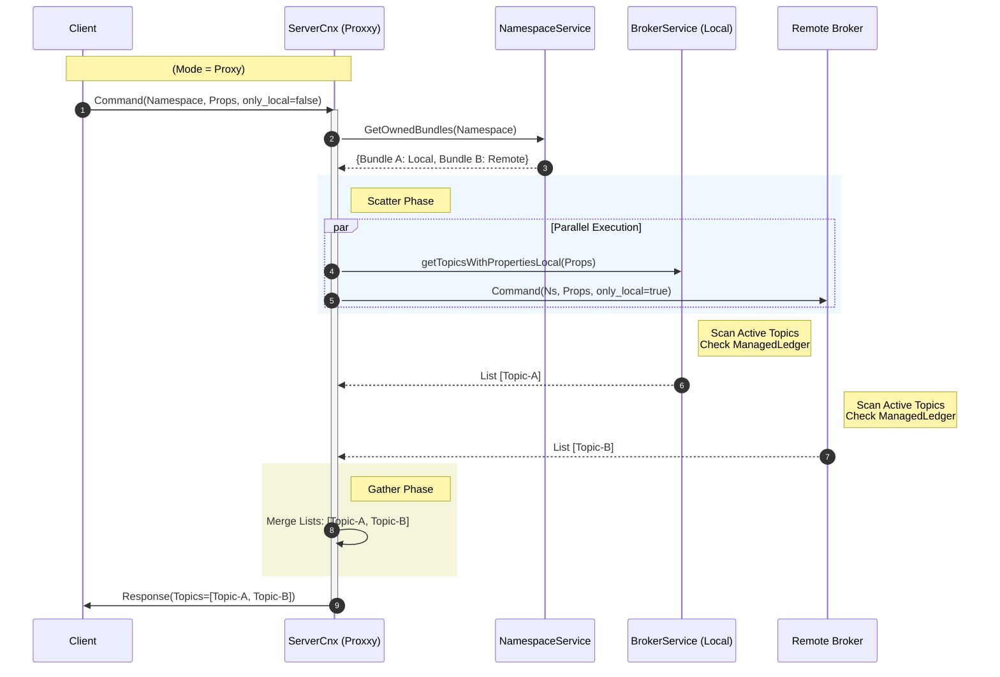

# PIP-451: Support Label-based Topic Subscription

# Motivation

Currently, Apache Pulsar supports Pattern Subscription, which allows consumers to subscribe to multiple topics using Regular Expressions (Regex). While powerful, Regex-based subscription has several structural limitations in complex microservice architectures:

* Coupling: It couples the consumption logic with the topic naming convention. Changing business requirements often forces topic renaming, which is operationally expensive and risky.S

* Flexibility: It is difficult to group semantically related but differently named topics (e.g., persistent://public/default/payment-core and persistent://public/legacy/billing-v1) into a single subscription without complex regex wizardry.

* Complexity: complex Regex can be hard to maintain and error-prone.

Label-based Subscription solves these issues by decoupling "Identity" (Topic Name) from "Attributes" (Labels). Users can attach Key-Value metadata (e.g., env=prod, dept=finance) to topics and subscribe by specifying a label selector.

# Goals

## In Scope
* Management: Allow attaching, updating, and removing Key-Value labels to/from Topics via the Admin API.
* Subscription: Allow Consumers to subscribe to topics matching specific Tags within specified Namespaces. Support cross-namespace subscription via an explicit namespace list in the Client API, avoiding the complexity of background metadata polling.

# High-Level Design

The feature consists of three main components:

* Storage:

We reuse existing Topic Properties.

To support Partitioned Topics, we adopt a Propagate-on-Write strategy. When properties are set on a Parent Topic, the Broker orchestrating the update will iterate and write these properties to the ManagedLedger metadata of all its sub-partitions.

* Discovery (Broker Scatter-Gather):

A new Binary Protocol command allows clients to query "Active Topics matching properties".

The Gateway Broker (Coordinator) distributes the query to all Bundle Owners (Workers).

Workers perform a fast in-memory scan of loaded topics.

* Client (Polling Model):

The Consumer client periodically polls the Broker using the new command.

It compares the returned list with its current subscription and dynamically subscribes/unsubscribes.

# Detailed Design

## Design & Implementation Details

### Public API & CLI Changes

#### Set topic properties: (Existing API can be reused)

* CLI: pulsar-admin topics update-properties <topic-name> -p a=b -p c=d

#### Get topic properties: (Existing API can be reused)

* CLI: pulsar-admin topics get-properties <topic-name>

#### Remove topic properties: (Existing API can be reused)

* CLI: pulsar-admin topics remove-properties <topic-name> -k a

#### Query topic associated with specific properties:

* CLI: pulsar-admin topics list <namespace> --properties "k1:v1,k2:v2"
* REST API: GET /admin/v2/topics/{tenant}/{namespace} with a query params properties=k1:v1,k2:v2

### Consumer API (Client)
Introduce `topicsByLabels` in the ConsumerBuilder.
```java
public interface ConsumerBuilder<T> {
    
    // ... existing methods ...

    /**
     * Subscribe to topics matching the given labels within specific namespaces.
     * * @param labels     The Key-Value pairs that a topic must match (AND semantics).
     * @param namespaces The set of namespaces to look for topics. 
     * If empty, defaults to the current consumer's namespace.
     */
    ConsumerBuilder<T> topicsByLabels(Map<String, String> labels, Set<String> namespaces);
}
```

### Binary protocol

Add new Command to query topics by properties:

```protobuf
// New Command Types
enum Type {
    // ... existing types
    GET_TOPICS_OF_NAMESPACE_WITH_PROPERTIES = 101; 
    GET_TOPICS_OF_NAMESPACE_WITH_PROPERTIES_RESPONSE = 102; 
}

message KeyValue {
    required string key = 1;
    required string value = 2;
}

message CommandGetTopicsOfNamespaceWithProperties {
    required uint64 request_id = 1;
    required string namespace = 2;
    
    // Filter criteria: A topic matches if it contains ALL specified Key-Values.
    repeated KeyValue properties = 3;

    // Filter Scope Flag
    // false (default): Cluster-wide search. Broker acts as Coordinator (Scatter-Gather).
    // true: Local-only search. Broker scans only its own memory.
    optional bool only_local = 4 [default = false];
}

message CommandGetTopicsOfNamespaceWithPropertiesResponse {
    required uint64 request_id = 1;
    repeated string topics = 2;
    
    // Indicates if the result might be incomplete (e.g., a peer broker timed out)
    optional bool is_partial_result = 3 [default = false];
}
```

### Update topic properties: 

If a topic is partitioned, the properties updated are propagated to all partitions.

### Query topics by properties: Broker Scatter-Gather

Add new method `getTopicsUnderNamespaceByProperties` in LookupService to get topics by properties:

```java
public class GetTopicsResult {
    private final List<String> topics;
    private final boolean isPartialResult;

    public GetTopicsResult(List<String> topics, boolean isPartialResult) {
        this.topics = topics;
        this.isPartialResult = isPartialResult;
    }

    public List<String> getTopics() {
        return topics;
    }

    public boolean isPartialResult() {
        return isPartialResult;
    }
}


public interface LookupService {
    /**
     * Get topics under a namespace that match the specified properties.
     *
     * @param namespace The namespace
     * @param properties The filter labels
     * @param onlyLocal If true, only scan the connected broker's memory (Internal use).
     * If false, trigger cluster-wide scatter-gather (Client use).
     * @return A result containing the list of topics and a partial status flag.
     */
    CompletableFuture<GetTopicsResult> getTopicsUnderNamespaceByProperties(
        NamespaceName namespace, 
        Map<String, String> properties, 
        boolean onlyLocal
    );
}
```

When a Broker receives a `CommandGetTopicsOfNamespaceWithProperties` with only_local=false, it acts as the Coordinator and performs the following steps:


When admin server receives topics list by properties request, it forwards to one of the brokers in the cluster which performs the scatter-gather operation as described above.

### Client Implementation Details

Since the architecture relies on Active Topics and does not use event-based notifications (like System Topics), the client must use a Polling (Pull) model to detect changes.

Implement `PropertyMultiTopicsConsumerImpl`, which inherits or refers to the design pattern of MultiTopicsConsumerImpl and extends the capability of cross-namespace dynamic discovery based on Metadata Properties.

Internally starts a single-threaded ScheduledExecutorService to periodically execute the recheckTopics() method, with the process as follows:

1. Discovery (Server-side Filtering) Invokes LookupService.getTopicsUnderNamespaceByProperties to directly retrieve the pre-filtered list of topics that match the specified metadata properties, effectively offloading the filtering logic to the server side.

2. Rebalance (State Synchronization) Performs a differential comparison between this retrieved target list and the active subscription map, executing incremental subscribe or close operations to maintain state consistency.


### Configuration Changes


# Security Considerations


# Backward Compatibility
Protocol: Old brokers will not understand the CommandGetTopicsOfNamespaceWithProperties.

Mitigation: The Client library must check the Broker's protocol version or capabilities. If the Broker does not support Label Subscription, the Client should throw a NotSupportedException rather than falling back to consuming all topics (which would be dangerous).


# Alternatives

* Store labels in an external metadata service (e.g., ZooKeeper, etcd) instead of Topic Properties.
  - Pros: Decouples label storage from topics, allowing more complex querying and indexing.
  - Cons: Increases system complexity, introduces additional latency, and requires maintaining consistency between the external store and topic states.

# Links


* Mailing List discussion thread:
* Mailing List voting thread: