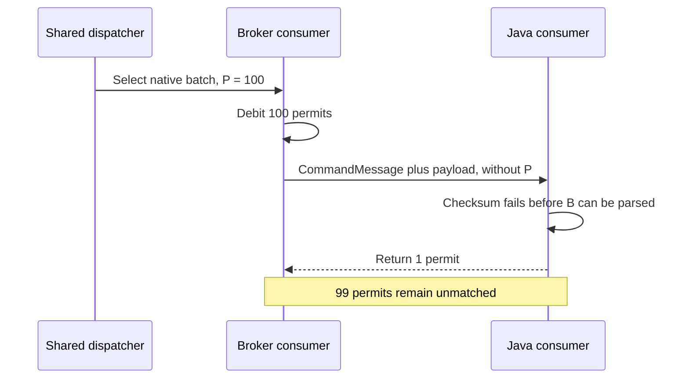
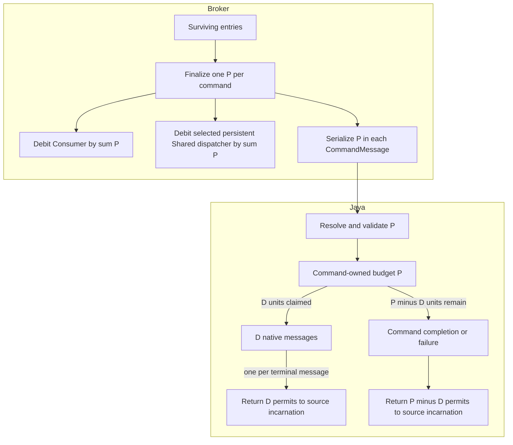

# PIP-491: Prevent Delivery Stalls by Making the Client Return Exactly the Permits Used by the Broker

# Background knowledge

Pulsar consumers use permits for receiver-side flow control. A client sends `CommandFlow` to grant receiver
capacity, the broker consumes that capacity while dispatching, and the client returns permits as messages leave its
prefetch path. In the consumer flow accounting covered by this PIP, one permit represents one logical message, not
one BookKeeper entry.

The broker represents this capacity at two levels for persistent Shared subscriptions. Each `Consumer` tracks its
own available permits, while the Shared dispatcher tracks aggregate `totalAvailablePermits` across its consumers to
decide whether dispatch can continue. A send must therefore debit both levels by the same number of logical messages.
If they use different counts, the dispatcher and the selected consumer disagree about remaining capacity even when
the network write itself succeeds.

A native Pulsar batch stores multiple logical messages in one entry. The payload metadata field
`num_messages_in_batch` describes the original batch cardinality so the broker can account for the entry and the
client can deserialize it. This PIP calls that value `B`; a non-batched entry has `B = 1`.

With batch-index acknowledgments introduced by [PIP-54](pip-54.md), a redelivered entry can include an `ack_set` in
`CommandMessage`. In this representation, a set bit identifies an unacknowledged index that remains deliverable; a
cleared bit identifies an index that the client must not deliver. A complete batch therefore consumes `B` permits,
while a partial batch consumes only the number of deliverable indexes.

This PIP calls the actual permit debit for one `CommandMessage` `P`. For a valid native batch:

```text
complete batch: P = B
partial batch:  P = cardinality(deliverable ack_set indexes within B)
valid command:  1 <= P <= B
```

For example:

| Entry | `B` | Deliverable `ack_set` indexes | `P` |
| --- | ---: | --- | ---: |
| Non-batched message | 1 | absent | 1 |
| Complete native batch | 8 | absent | 8 |
| Partial native batch | 8 | `{0, 2, 5}` | 3 |

The partial example shows why `B` cannot be reused as the debit: the payload still contains eight original indexes,
but only three logical messages are eligible for this delivery.

The broker's available-permit balance is distinct from `P` and may temporarily be negative. Dispatch operates on
indivisible entries, so a positive balance of one can admit a batch with `P = 10`; after the send, both the consumer
balance and, when it has no other consumers, the persistent Shared dispatcher balance are `-9`. This is outstanding
batch debt, not an invalid permit value. The consumer is not eligible for another send until returned credit makes its
balance positive again. Implementations must debit and later credit the full `P`; clamping or resetting the balance to
zero would discard the debt and grant excess capacity when the client returns those ten permits.

The acknowledgment path is separate from permit accounting. Acknowledgment controls cursor progress and redelivery;
permits control subsequent dispatch. Acknowledging an entry does not repair a missing permit, and returning a permit
does not acknowledge a message.

Permit accounting is scoped to a broker-consumer incarnation, not merely to a physical connection. A broker can close
and recreate one consumer while the pooled `ClientCnx` remains active for other producers or consumers. Debt belonging
to the removed broker consumer must not be compensated to its replacement, even when both use the same `ClientCnx`.

# Motivation

For each sent `CommandMessage`, the broker uses `P` consumer permits and the Java client must eventually return
exactly `P`. The command does not carry `P`, so the client has to infer it from `ack_set` and the payload. If the
payload cannot be parsed or only part of a batch enters the message lifecycle, the client can return a different
count from the one used by the broker.

The current protocol therefore relies on duplicated computation across broker layers and the client. The dispatcher,
consumer, and sender derive related counts at different points in the send lifecycle, while the client independently
reconstructs the expected return from what it can still observe after receipt. Equality of those calculations is an
implementation coincidence, not an explicit wire contract. It breaks when those paths observe different information,
such as post-selection admission changing the actual send set or a payload failure before the client can read batch
metadata.

This PIP does not add periodic synchronization, a permit reset, or a per-command acknowledgment. It establishes a
per-command accounting contract instead: the broker is the authority that creates and declares a debt of `P`, and
the in-scope Java native-message path must conserve and eventually return exactly `P` while the source
broker-consumer incarnation remains active. When that incarnation is removed, its debt disappears with it, so the
client discards old credit rather than moving it to a replacement.
`CommandFlow` can continue to aggregate returned credit; it no longer needs the client to independently rediscover
how the debt was created.

Steady-state native delivery does not normally lose permits: the duplicated calculations agree for successful
complete, partial, and non-batched delivery. They diverge when the actual send set changes after an earlier aggregate was
calculated, payload processing fails before or during batch expansion, a handed-off message has no terminal outcome,
or the broker-consumer incarnation changes while credit is being returned.

Returning too little permanently reduces the consumer's effective capacity and can eventually stall dispatch.
Returning too much weakens receiver-side backpressure by granting capacity the client did not originally provide.
Returning old credit to a replacement consumer crosses the incarnation boundary and can produce the same
over-grant even when the numeric total on the old consumer would otherwise have been correct.

For example, assume a Shared consumer grants 100 permits and the broker sends one native batch with `P = 100`. If
checksum verification fails before the client can parse `num_messages_in_batch`, the current Java error path returns
one permit. The broker consumer is left with one available permit instead of 100. Repeating the failure can exhaust
its capacity and stall Shared dispatch.



There are four root causes.

## 1. The wire protocol relies on duplicated inference instead of an explicit debit

`num_messages_in_batch` cannot be the permit contract because it is inside the payload metadata. It is unavailable
when checksum or metadata parsing fails, and it remains `B` when a partial redelivery has `P < B`.

`ack_set` is sufficient for a partial batch but is normally absent for a complete batch. Neither existing field is a
reliable statement of the debit for every command.

## 2. The broker does not finalize one value and pass it end to end

The dispatcher builds aggregate counts before final send eligibility is known. `Consumer.sendMessages` then records
pending-ack ownership; this final admission step can still reject an entry, for example when the consumer has closed.
Consumer accounting, Shared dispatcher accounting, and serialization currently have no shared post-admission result.

For example, if two entries each contain ten logical messages and final admission rejects the second entry, only one
command is sent. Any calculation that still uses the earlier aggregate of 20 disagrees with the actual send of ten.
A wire field is useful only if it is populated from the post-admission value.

## 3. The Java client has no explicit command-to-message ownership boundary

The native batch path separately counts delivered, skipped, and failed work rather than retaining the part of `P`
still owned by command processing. Once a message is handed to an asynchronous callback, terminal handling and source
association are also spread across separate paths.

For `P = 10`, if four messages enter the normal lifecycle before a later index fails, those messages own four units
and command processing retains six. The current delivered, skipped, and generic error counts do not
represent that split directly.

Adding `P` only to corrupted-message helpers would fix early failures, but not partial deserialization,
asynchronous stale-epoch discard, or reconnect. The client therefore needs a command-local ownership budget as well
as the wire value.

## 4. A failed broker write has no terminal accounting outcome

The broker debits the finalized value before the asynchronous network write completes. On success that debit belongs
to the live consumer and is later replenished by Flow. On failure, the current write listener only logs; it does not
remove the consumer from its connection or subscription. Leaving that consumer live strands both the undelivered
permit debt and any pending-ack ownership recorded before the write.

Re-crediting the failed value is unsafe because the transport may have accepted an unknown prefix of the write. The
unambiguous terminal outcome is to remove that broker-consumer incarnation and let normal removal/redelivery semantics
dispose of all of its connection-local accounting together.

## Current failure modes and evidence

| Failure mode | Current behavior | Permit consequence |
| --- | --- | --- |
| Checksum, metadata, or decompression failure | `ConsumerImpl.messageReceived` reaches corrupted-message handling before `B` is available and returns one. | A command with `P > 1` loses `P - 1` permits. |
| Failure partway through native batch parsing | Transferred messages return individually, client-side skips are counted separately, and the catch path returns one. | If `D` messages were transferred and `K` were skipped, the old paths return `D + K + 1`, which is not necessarily `P`. |
| Stale epoch after asynchronous handoff | The message is released and one permit is returned through the consumer's current connection without completing the prefetch gauges. | Prefetch accounting leaks, and credit can cross into a replacement consumer. |
| Broker consumer recreation | Later paths identify the source with `ClientCnx` or read the current `cnx()`; a pooled `ClientCnx` can survive consumer replacement. | An old return can pass a connection check or race with accumulator reset. |
| Rejection after Shared dispatch selection | `Consumer.sendMessages` can remove an entry when pending-ack admission rejects it, while earlier aggregates still feed later debits. | The server can debit permits for a command that is not sent. |
| Asynchronous broker write failure | The current write listener logs the failure but leaves the consumer registered. | Undelivered debt and pending-ack ownership remain on a live consumer. |

The checksum, parsing, stale-epoch, and write-failure rows follow directly from current terminal branches. Consumer
recreation and post-selection rejection are race-dependent and require deterministic tests. Appendix A maps these
behaviors to their current code owners.

# Goals

## In Scope

- Add the actual logical-message debit `P` to `CommandMessage`.
- Finalize `P` once on the broker after send eligibility is known.
- Reuse that result for consumer accounting, both persistent Shared dispatcher implementations, and command
  serialization.
- Conserve `P` in the Java native-batch path across successful delivery, client-side skips, and checksum, metadata,
  decompression, and batch-deserialization failures.
- Bind immediate and deferred permit returns to local source consumer-incarnation state, including when the same
  `ClientCnx` is reused.
- Require an asynchronous message write failure to remove the affected broker consumer from its connection and
  subscription.
- Preserve old/new broker, Java client, and Pulsar proxy interoperability.
- Validate the result end to end with persistent Shared subscriptions.

## Out of Scope

- Complete permit-ownership semantics for custom `MessagePayloadProcessor` output, encrypted payloads, and chunk
  assembly.
- Non-Java client implementations.
- Broker-side attestation or reconciliation of arbitrary client `CommandFlow` values.
- Permit reset, absolute synchronization, or connection-generation commands.
- Asynchronous broker `CommandFlow` processing racing with consumer removal, and Key_Shared-specific draining
  behavior.
- Changes to acknowledgment, redelivery, public receiver-queue, dispatch-rate, or message-rate semantics.
- New Java public APIs, configuration, CLI commands, metrics, or broad consumer/dispatcher refactoring.

These paths are deferred rather than incompatible with the explicit debt and incarnation model; their additional
ownership rules are not defined here. Known adjacent work is listed in Appendix B.

# High Level Design

For a send containing one or more entries, the broker produces one finalized `P` for every entry that will actually
be sent. It also calculates the sum of those per-command values. The per-command values and their sum become the only
inputs to the permit-related server counters and command serialization covered by this PIP.

The Java client treats `P` as a command-local budget. Each native message accepted into the existing per-message
lifecycle takes one unit. That lifecycle later returns the unit. The command path returns every unit not transferred
to a message. The same finalized broker value and the ownership split are shown below.



On every successfully written broker send that leaves the consumer live, the consumer debit is the sum of the
serialized command debits. Persistent Shared additionally uses that same sum for its dispatcher-level accounting:

```text
broker consumer debit == sum of all P values in the send
persistent Shared dispatcher debit == sum of all P values in the send
```

An entry rejected before handoff produces no command and no debit. A failure after handoff follows the terminal
consumer-removal rule described below instead of trying to restore this successful-send invariant by re-crediting.

For each command processed through the in-scope Java native-message path while its source consumer remains active:

```text
for each command:
    CommandMessage.message_permits == Java client's eventual return == P
```

Ordinary non-batched delivery naturally uses `P = 1` and needs no separate accounting model.

## Broker and Java client responsibilities

The accounting contract has one authority and one owner at each stage. The broker creates the debt, the protocol
transfers its value, and the Java client conserves the debt until it is returned or its source incarnation disappears.

| Component | Responsibility |
| --- | --- |
| Broker finalization | Decide which entries produce commands, calculate one `P` per admitted command, and calculate their sum. A rejected entry produces neither a command nor a debit. All covered broker counters and serialization consume this result. |
| Wire protocol | Carry the broker's actual per-command debit in `CommandMessage.message_permits`; this is a declaration of existing debt, not a client request. |
| Java command path | Resolve and validate `P`, create `remaining = P`, transfer one unit to each accepted native message, and return every unit that was not transferred. |
| Java message lifecycle | Return exactly one unit for every in-scope transferred message, including normal consumption and stale-epoch discard. |
| Consumer-incarnation boundary | Create new local permit state for every broker-consumer incarnation, even when `ClientCnx` is reused. The state object is the incarnation token and owns only that incarnation's accumulator. Old state cannot return or accumulate credit for a replacement. |
| Broker write outcome | A successful write keeps the debit on the live consumer. A failed write must disconnect and remove that consumer; the debit and pending-ack ownership then terminate with the removed incarnation. |

This is a correctness guarantee for the new protocol-compliant Java implementation, not broker attestation of client
behavior. `CommandFlow` currently carries only a `consumer_id` and an incremental `messagePermits` value. It has no
delivery identifier, incarnation, or cumulative sequence that lets the broker prove that a Flow increment corresponds
to previously dispatched debt. A client that returns too little eventually stalls itself; a buggy or malicious client
can return too much and weaken its own receiver-side backpressure. This trust boundary already exists and is not
expanded by declaring `P`.

Broker-side detection would require a separate protocol design, such as incarnation-scoped cumulative returns or
broker-issued delivery-credit identifiers, while also distinguishing initial/window-growth grants from returned
credit. Such a mechanism could reject stale, duplicate, or excessive Flow increments, but still could not prove that
the application actually processed a message. It is outside this PIP's Java correctness scope.

The complete invariant is provided only by the broker and Java responsibilities together. The protocol field alone
does not fix post-admission broker recounting or client lifecycle leaks. The broker and client changes are independently
compatible with old peers, but both are required to establish the new end-to-end guarantee.

## Accounting convergence boundaries

This design converges the arithmetic and ownership boundaries without moving payload parsing, pending acknowledgments,
queueing, or callbacks into one class. Existing code owners keep their non-accounting responsibilities.

## How the design closes the current failures

The protocol field is necessary but is not sufficient by itself. The guarantee comes from applying the complete
broker and Java ownership rules together:

| In-scope scenario | Preventing mechanism | Result with a new broker and new Java client |
| --- | --- | --- |
| Checksum, metadata parsing, or decompression fails before batch expansion | `P` is present in `CommandMessage` and resolved before payload processing. | The command path returns `P` without expanding the batch. |
| Native parsing fails after `D` handoffs, or the client skips an index | The budget transfers only accepted units and retains the rest. | Messages return `D`; command completion or failure returns `P - D`; total return is `P`. |
| Stale epoch or consumer recreation, including on the same `ClientCnx` | Each message retains the source permit state; each state owns its accumulator; the event loop revalidates state before writing Flow. | Credit returns only while the source incarnation is active and can never enter the replacement accumulator. |
| Pending-ack admission rejects an entry selected earlier | Broker records a candidate `P` in the finalized result only after admission and derives every covered debit from that result's sum. | The rejected entry produces no command and no permit debit. |
| The asynchronous network write fails | The write listener disconnects the affected `Consumer`, removing it from `ServerCnx` and its subscription/dispatcher. Failure to notify the client closes the physical connection. | No live broker consumer remains with undelivered debit or stranded pending-ack ownership. |

The full in-scope guarantee requires a new broker and new Java client; mixed-version behavior is defined below.

# Detailed Design

## Design & Implementation Details

### Broker permit finalization

Finalization occurs in `Consumer.sendMessages`. The broker first derives a candidate `P` because pending-ack admission
needs the logical-message count. That candidate is not an accounting fact yet. Only after admission accepts the entry
does the broker record `P` in the per-send result, before handing entries to the asynchronous command sender:

```text
entry is not sent    => no command and no debit
ack_set is absent    => P = B
ack_set is present   => P = deliverable set-bit count within B
```

An entry with `P = 0` is not sent. A serialized `CommandMessage` always represents at least one logical message.

Finalization produces the per-entry `P` values and their sum. The same result is used for:

- the consumer's available-permit debit;
- the consumer's unacked-message accounting where applicable;
- the selected persistent Shared dispatcher's aggregate available-permit debit, for both
  `PersistentDispatcherMultipleConsumers` and `PersistentDispatcherMultipleConsumersClassic`; and
- each command's `message_permits` field.

Unacked state still controls acknowledgment backpressure, while permits control dispatch capacity; they only share
the finalized logical-message count. Downstream layers do not recompute it from `B`, `ack_set`, or earlier aggregates.
The per-send result owns a primitive per-entry array, its checked sum, and the asynchronous write future, so it remains
valid after the sender recycles its existing batch-size and `ack_set` inputs.

Once the send is handed to the network, the debit belongs to that broker-consumer incarnation. A successful write
keeps the consumer live with that debit. An asynchronous write failure is a required terminal outcome: the write
listener calls the existing consumer-disconnect path, which removes that `Consumer` from `ServerCnx` and from its
subscription/dispatcher. The broker sends `CommandCloseConsumer` when supported; if that close notification cannot be
written, it closes the physical connection. The broker does not re-credit `P` to a replacement consumer or compensate
it with a later `CommandFlow`.

The classic dispatcher selected by `subscriptionSharedUseClassicPersistentImplementation=true` follows the same
invariant. Dispatch-rate, byte-rate, and public message-rate statistics do not change.

### Java permit resolution

For the native path, the Java client resolves `P` in this order:

1. Use a present `message_permits` value.
2. Otherwise, use the cardinality of a non-empty `ack_set`.
3. Otherwise, after parsing metadata, use `num_messages_in_batch`.
4. If an old-broker command fails before either source is available, use the legacy value of one.

A present `message_permits` value is authoritative for flow accounting once validated. It must be in the range
`1..Integer.MAX_VALUE`; Java must interpret and validate the protobuf `uint32` value using unsigned conversion.

After native metadata is available, an explicit value must equal `B` for a complete batch or the deliverable
`ack_set` cardinality for a partial batch. This validation happens before any native message is transferred to the
per-message lifecycle. An invalid explicit value is a protocol error: the client sends no Flow credit and closes the
source connection so the associated broker-side debt is discarded.

The final fallback cannot recover a complete-batch debit from an old broker when failure occurs before metadata
parsing. Exact conservation for that case requires an upgraded broker. The client retains the legacy one-permit
behavior rather than closing a multiplexed connection for this old-protocol ambiguity.

### Java native-batch budget

Native command processing starts with `remaining = P`.

Indexes excluded by the broker's `ack_set` are not part of `P` and never interact with the budget. For each
deliverable index, immediately before its logical message is accepted into the existing per-message lifecycle, the
client claims one unit by decrementing `remaining`. If the transfer itself fails, the claim is restored.

A deliverable index that the client later skips as duplicate, compacted-out, or otherwise ineligible does not claim a
unit, so its unit remains in the command budget. Any message object already created for that skipped index is
released.

At normal completion or failure, the command path immediately returns all remaining units. If deserialization fails
after `D` messages were transferred, those messages eventually return `D`, while the command path returns `P - D`.

Processing more than `P` native messages is a malformed command and follows the protocol-error behavior above.

Once a message claims one unit, the existing per-message lifecycle owns it. Every terminal branch must return the unit
or discard it after the source broker consumer disappears. In particular, stale-epoch discard after asynchronous
handoff closes the prefetch accounting, returns through the retained source state when it is still active, and releases
the message exactly once.

The numeric budget does not own networking state. `ConsumerImpl` creates one opaque permit-state object per
broker-consumer incarnation; the object is both the local incarnation token and that incarnation's atomic permit
accumulator. Every transferred `MessageImpl` retains that state in addition to its existing source `ClientCnx`.
Reconnect or `CommandCloseConsumer` replaces the state even when the pooled `ClientCnx` is unchanged, and never copies
the old accumulator into the replacement.

A return can update only its retained state and succeeds only while that state is current. After a threshold drain,
the source connection's event loop revalidates exact state identity immediately before writing `CommandFlow`. A new
state is not Flow-enabled until its Subscribe succeeds.

The connection event loop is the final ordering point for Flow and Subscribe writes:

```text
old Flow task wins the event loop => old Flow is written before replacement Subscribe
replacement becomes visible first => old accumulator or queued Flow is discarded
```

Thus a queued old Flow either precedes the replacement Subscribe or becomes a no-op. It cannot enter the replacement
accumulator or be written after its Subscribe, and isolation does not require closing the multiplexed connection.

## Public-facing Changes

### Binary protocol

Add one optional field to `CommandMessage`:

```proto
message CommandMessage {
    required uint64 consumer_id       = 1;
    required MessageIdData message_id = 2;
    optional uint32 redelivery_count  = 3 [default = 0];
    repeated int64 ack_set = 4;
    optional uint64 consumer_epoch = 5;

    // Number of consumer permits debited by the broker for this command.
    optional uint32 message_permits = 6;
}
```

The wire rules are:

- valid values are `1..Integer.MAX_VALUE`;
- an upgraded broker sends the field for every command, including when `P = 1`;
- zero is invalid; no command is sent when nothing is deliverable; and
- the value is the actual debit, not necessarily the original batch size.

No protocol-version bump or feature flag is required. Old protobuf readers ignore the optional field, so an upgraded
broker can send it without detecting client support. New Java clients use field presence to distinguish an explicit
debit from an old-broker command that requires the compatibility fallback rules.

# Monitoring

No metric is added. Existing `pulsar_consumer_available_permits` or
`pulsar.broker.consumer.permit.count`, receive-failure statistics, and dispatch progress can help diagnose a stall,
but none independently proves that both sides agreed on `P`. Tests therefore verify the accounting invariant directly
and verify that repeated corrupted batches do not stall a Shared consumer.

# Security Considerations

The broker-to-client field grants no client authority and does not change authentication, authorization, or tenant
isolation. The broker continues to trust a connected client to send protocol-compliant Flow increments; this PIP makes
the new Java client's accounting deterministic and testable but does not make `CommandFlow` self-authenticating.
The Java client must reject zero and unsigned values above `Integer.MAX_VALUE`. The in-scope native path must not
return more than `P` for one command. Permit accumulation uses checked arithmetic; overflow is handled as a protocol
error on the source connection rather than wrapping into negative or unrelated Flow credit.

# Backward & Forward Compatibility

| Broker | Java client | Behavior |
| --- | --- | --- |
| New | New | Exact native-batch accounting from explicit `P`. |
| New | Old | The field is ignored; normal delivery is unchanged, while old exceptional-path limitations remain. |
| Old | New | The client falls back to `ack_set`, parsed batch metadata, then legacy one. |
| Old | Old | No change. |

An upgraded broker does not special-case `P = 1`: it explicitly declares the debit for both a complete one-message
command and a partial batch with one deliverable index. Field absence is reserved for compatibility with old brokers
or intermediaries that remove unknown fields. An old client ignores the new field and already returns one permit per
successfully delivered native message, so an upgraded broker does not change its normal path.

Pulsar proxy paths forward the original message frame without re-serializing `CommandMessage`. A third-party proxy
that drops unknown fields remains wire-compatible through the fallback, but cannot preserve the new early-failure
guarantee for complete batches.

## Upgrade

No configuration or metadata migration is required. Upgrade brokers before Java clients when practical. Old clients
can remain connected to upgraded brokers.

## Downgrade / Rollback

The value is connection-local and not persisted. Brokers can be rolled back without data migration; new Java clients
then use the fallback rules.

## Pulsar Geo-Replication Upgrade & Downgrade/Rollback Considerations

`CommandMessage` is not stored or replicated between clusters, so geo-replication requires no coordinated upgrade or
rollback.

# Alternatives

- **Continue inferring from batch metadata:** cannot handle checksum or metadata failure before `B` is parsed and
  cannot describe a partial-batch debit by itself.
- **Use only `ack_set`:** exact for partial batches, but complete batches generally omit it.
- **Always disconnect on ambiguous payload failure:** discards the debt but disrupts every producer and consumer on a
  multiplexed connection. Disconnect remains appropriate for an invalid explicit value, not normal data corruption
  or old-protocol ambiguity.
- **Add a reset or absolute-permit command:** requires ordering, idempotency, in-flight command, and connection-
  generation rules. Attaching the debit to the command that creates it is smaller.
- **Assign arbitrary permit costs to `Message`:** unnecessary for native batches, where each accepted logical message
  owns exactly one unit. Deferred processing paths require their own ownership rules.
- **Separate broker and client PIPs:** risks defining different debit and return semantics. The selected design keeps
  two implementation layers under one end-to-end protocol contract and one pull request.

# General Notes

The implementation is organized as one end-to-end pull request with two commit layers:

1. **Protocol and broker:** add the field, finalize one per-entry value, align consumer and persistent Shared
   aggregate debits in both modern and classic implementations, serialize that value, make failed writes remove the
   affected consumer, and test old-reader compatibility.
2. **Java native batch:** implement resolution and fallbacks, command-local ownership, consumer-incarnation binding,
   the narrow terminal fixes, and the persistent Shared end-to-end test.

Keeping both layers in one PR makes the complete invariant reviewable together; commits retain the same boundary for
review and later backporting.

The required test matrix covers:

- full and partial native batches, including explicit `P = 1` and old-broker field absence;
- filtering or pending-ack rejection before broker finalization;
- consumer and persistent Shared debits equal the sum of the per-command values in both modern and classic
  dispatchers, while each command carries its `P`;
- batch overshoot from one available permit to a negative broker balance, followed by exact recovery when the client
  returns the full `P`, in both modern and classic persistent Shared dispatchers;
- asynchronous lifetime of finalized per-entry values while existing sender inputs are recycled;
- asynchronous write failure removes the affected consumer from its connection and subscription/dispatcher;
- explicit-field validation and old-broker `ack_set`/metadata fallbacks;
- checksum, metadata, decompression, and mid-batch deserialization failures;
- native skips, stale-epoch discard, different-connection replacement, same-`ClientCnx` recreation, a concurrent
  old-return/recreation race, and a queued old Flow that executes after same-connection state replacement; and
- deterministic randomized native batches whose decoded `CommandFlow.messagePermits` sum equals the explicit `P`
  sum after all delivered messages and immediate skips reach terminal handling; and
- repeated corrupted batches on a persistent Shared subscription without dispatch stall.

# Appendix A: Implementation map and convergence points

This appendix records where the current behavior is distributed and identifies the two narrow accounting components
introduced by this design. It is supporting detail, not additional implementation scope.

| Component | Responsibility | Relevance to this PIP |
| --- | --- | --- |
| `MessageMetadata.num_messages_in_batch` | Stores original payload cardinality `B`. | Payload structure is not always the actual debit and is unavailable before metadata parsing. |
| `AbstractBaseDispatcher.filterEntriesForConsumer` | Extracts `B`, `ack_set`, and aggregate counts. | Runs before final pending-ack admission. |
| `Consumer.sendMessages` | Performs pending-ack admission and debits consumer/unacked counts. | Must finalize the values for entries that survive admission. |
| PIP-491 `SendMessagesResult` | Carries one primitive per-entry `P` array, its checked sum, and the asynchronous write result for one send. | Establishes the broker finalization boundary consumed by accounting and serialization. |
| `PersistentDispatcherMultipleConsumers` | Default persistent Shared implementation; debits aggregate `totalAvailablePermits`. | Must consume the same finalized aggregate rather than recalculate it. |
| `PersistentDispatcherMultipleConsumersClassic` | Configurable classic persistent Shared implementation; independently debits aggregate `totalAvailablePermits`. | Must consume the same finalized aggregate and preserve the invariant when the rollback setting selects it. |
| `PulsarCommandSenderImpl.sendMessagesToConsumer` | Serializes surviving entries and `ack_set`. | Must serialize the finalized per-entry value without recomputation. |
| `EntryBatchIndexesAcks` | Carries mutable pooled per-entry `ack_set` state. | The sender owns and recycles it asynchronously, so finalized values need an explicit lifetime and must not be recomputed after handoff. |
| `ConsumerImpl.messageReceived` | Verifies checksum, parses metadata, decompresses, and chooses the payload path. | Must resolve `P` before payload-dependent failures. |
| `ConsumerImpl.receiveIndividualMessagesFromBatch` | Splits native batches and counts skipped messages. | Must transfer units from the command budget instead of reconstructing returns. |
| `ConsumerImpl.executeNotifyCallback` | Performs asynchronous callback handling. | A transferred unit needs an exact terminal outcome on its source permit state. |
| PIP-491 `MessagePermitAccounting` | Resolves and validates `P` and owns the numeric command budget. | Centralizes permit inference and conservation without coupling the budget to connection or queue state. |
| PIP-491 local `ConsumerPermitState` | Acts as the identity token and permit accumulator for one broker-consumer incarnation. | Keeps incarnation identity separate from the existing message-source `ClientCnx` and prevents old asynchronous returns from crossing a same-connection consumer recreation. |

The broker result introduced by this PIP uses one primitive array per send and avoids allocating one object per
dispatched entry. It does not need to be pooled; existing pooled sender inputs retain their current recycling rules.
This low-allocation shape does not change the protocol contract.

# Appendix B: Related work outside this PIP

The following known areas have different ordering or ownership requirements and are deliberately deferred:

- asynchronous `CommandFlow` dispatcher updates racing with consumer removal;
- Key_Shared hash draining and admission policy;
- custom `MessagePayloadProcessor` output cardinality;
- encrypted payload and chunk-assembly lifecycles;
- non-Java client prefetch implementations;
- multi-topic parent and zero-queue specializations beyond behavior reached through the native child consumer;
- broader entry, batch, and logical-message unit consistency in statistics and rate limiting.

These areas remain compatible with the explicit debt and incarnation model but are outside the native Java Shared
invariant defined by this PIP.

# Links

* Related broader permit-unit accounting issue (not the specific failure addressed here):
  https://github.com/apache/pulsar/issues/23263
* Batch-index acknowledgment: [PIP-54](pip-54.md)
* Current protocol: [PulsarApi.proto](../pulsar-common/src/main/proto/PulsarApi.proto)
* Current broker paths:
  [AbstractBaseDispatcher](../pulsar-broker/src/main/java/org/apache/pulsar/broker/service/AbstractBaseDispatcher.java),
  [Consumer](../pulsar-broker/src/main/java/org/apache/pulsar/broker/service/Consumer.java),
  [persistent Shared dispatcher](../pulsar-broker/src/main/java/org/apache/pulsar/broker/service/persistent/PersistentDispatcherMultipleConsumers.java),
  [classic persistent Shared dispatcher](../pulsar-broker/src/main/java/org/apache/pulsar/broker/service/persistent/PersistentDispatcherMultipleConsumersClassic.java),
  and [command sender](../pulsar-broker/src/main/java/org/apache/pulsar/broker/service/PulsarCommandSenderImpl.java)
* Current Java paths:
  [ConsumerImpl](../pulsar-client/src/main/java/org/apache/pulsar/client/impl/ConsumerImpl.java)
  and [ConsumerBase](../pulsar-client/src/main/java/org/apache/pulsar/client/impl/ConsumerBase.java)
* Accounting convergence types: broker `SendMessagesResult` and Java `MessagePermitAccounting`.
* Mailing List discussion thread:
* Mailing List voting thread:
