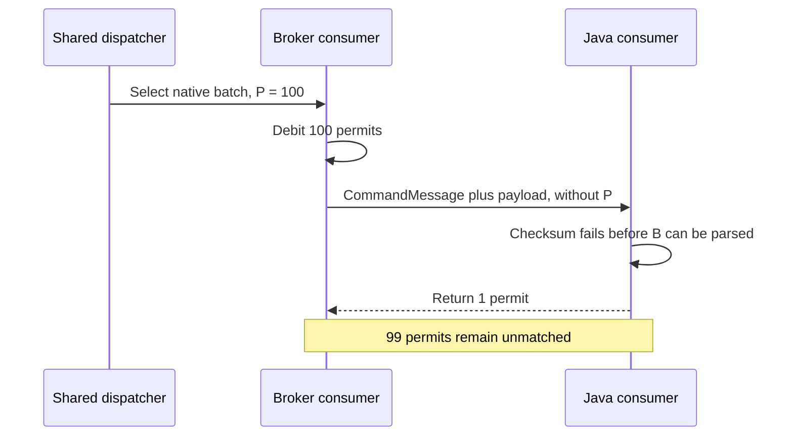
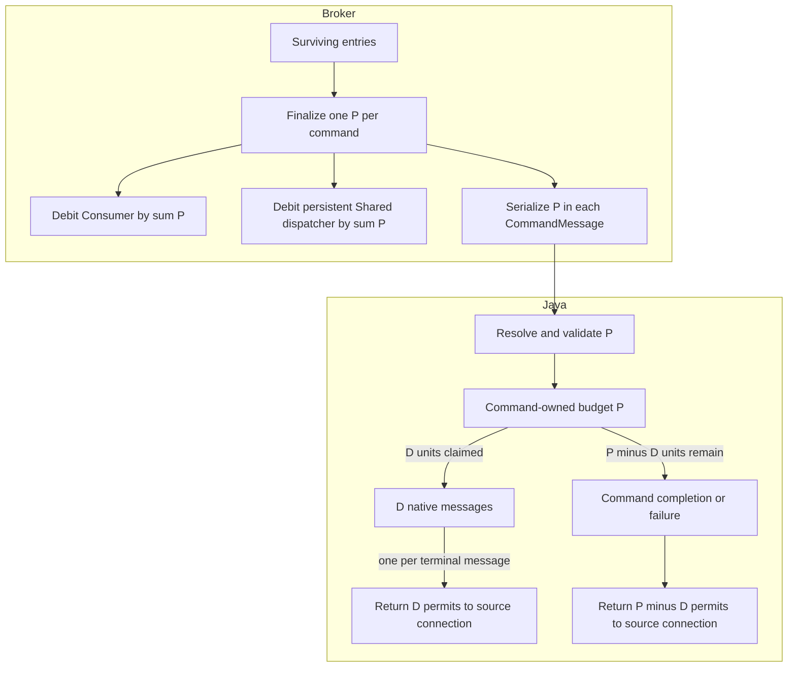

# PIP-491: Explicit permit accounting for batched message delivery

# Background knowledge

Pulsar consumers use permits for receiver-side flow control. A client sends `CommandFlow` to grant receiver
capacity, the broker consumes that capacity while dispatching, and the client returns permits as messages leave its
prefetch path. In the consumer flow accounting covered by this PIP, one permit represents one logical message, not
one BookKeeper entry.

A native Pulsar batch stores multiple logical messages in one entry. The payload metadata field
`num_messages_in_batch` describes the original batch cardinality so the broker can account for the entry and the
client can deserialize it. This PIP calls that value `B`; a non-batched entry has `B = 1`.

With batch-index acknowledgments introduced by [PIP-54](pip-54.md), a redelivered entry can include an `ack_set` in
`CommandMessage`. In this representation, a set bit identifies an unacknowledged index that remains deliverable; a
cleared bit identifies an index that the client must not deliver. A complete batch therefore consumes `B` permits,
while a partial batch consumes only the number of deliverable indexes.

This PIP calls the actual permit debit for one `CommandMessage` `P`. For a valid native batch:

```text
complete batch: P = B
partial batch:  P = cardinality(deliverable ack_set indexes within B)
valid command:  1 <= P <= B
```

For example:

| Entry | `B` | Deliverable `ack_set` indexes | `P` |
| --- | ---: | --- | ---: |
| Non-batched message | 1 | absent | 1 |
| Complete native batch | 8 | absent | 8 |
| Partial native batch | 8 | `{0, 2, 5}` | 3 |

The partial example shows why `B` cannot be reused as the debit: the payload still contains eight original indexes,
but only three logical messages are eligible for this delivery.

The acknowledgment path is separate from permit accounting. Acknowledgment controls cursor progress and redelivery;
permits control subsequent dispatch. Acknowledging an entry does not repair a missing permit, and returning a permit
does not acknowledge a message.

Permit accounting is also connection-scoped. When a client consumer reconnects, the broker replaces its server-side
consumer. Debt belonging to the removed consumer must not be compensated on the new connection.

# Motivation

For each sent `CommandMessage`, the broker must debit `P`, but the command does not carry `P`. The Java client must
infer it from `ack_set` and the payload. If the payload cannot be parsed, the client may not know `P`; if only part of
a batch enters the message lifecycle, the current code does not preserve how ownership of `P` was split.

The current protocol therefore relies on duplicated computation across broker layers and the client. The dispatcher,
consumer, and sender derive related counts at different points in the send lifecycle, while the client independently
reconstructs the expected return from what it can still observe after receipt. Equality of those calculations is an
implementation coincidence, not an explicit wire contract. It breaks when those paths observe different information,
such as post-selection admission changing the actual send set or a payload failure before the client can read batch
metadata.

This PIP does not add periodic synchronization, a permit reset, or a per-command acknowledgment. It establishes a
per-command accounting contract instead: the broker is the authority that creates and declares a debt of `P`, and
the Java client must conserve and eventually return exactly `P` while the source connection remains active. If that
connection is replaced, its broker consumer and debt disappear together, so the client discards the old credit.
`CommandFlow` can continue to aggregate returned credit; it no longer needs the client to independently rediscover
how the debt was created.

Steady-state delivery does not normally lose permits: the duplicated calculations agree for successful complete,
partial, and non-batched delivery. They diverge when the actual send set changes after an earlier aggregate was
calculated, payload processing fails before or during batch expansion, a handed-off message has no terminal outcome,
or the connection changes while credit is being returned.

For example, assume a Shared consumer grants 100 permits and the broker sends one native batch with `P = 100`. If
checksum verification fails before the client can parse `num_messages_in_batch`, the current Java error path returns
one permit. The broker consumer is left with one available permit instead of 100. Repeating the failure can exhaust
its capacity and stall Shared dispatch.



There are three root causes.

## 1. The wire protocol relies on duplicated inference instead of an explicit debit

`num_messages_in_batch` cannot be the permit contract because it is inside the payload metadata. It is unavailable
when checksum or metadata parsing fails, and it remains `B` when a partial redelivery has `P < B`.

`ack_set` is sufficient for a partial batch but is normally absent for a complete batch. Neither existing field is a
reliable statement of the debit for every command.

## 2. The broker does not finalize one value and pass it end to end

The dispatcher builds batch and aggregate counts before final send eligibility is known. `Consumer.sendMessages`
then records pending-ack ownership for individual-ack subscriptions; this final admission step can reject an entry,
for example when the consumer has closed. The Shared dispatcher and command sender consume related state through
separate paths. Even when their formulas agree on the normal path, there is no finalized per-command value shared by
consumer accounting, dispatcher accounting, and serialization.

For example, if two entries each contain ten logical messages and final admission rejects the second entry, only one
command is sent. Any calculation that still uses the earlier aggregate of 20 disagrees with the actual send of ten.
A wire field is useful only if it is populated from the post-admission value.

## 3. The Java client has no explicit command-to-message ownership boundary

The native batch path separately counts delivered, skipped, and failed work. It does not retain one value representing
the part of `P` still owned by command processing. Once delivery is handed to an asynchronous callback, terminal
handling and source-connection association are also spread across separate paths.

For `P = 10`, if four messages enter the normal lifecycle before a later index fails, those messages should own four
units and command processing should retain six. The current delivered, skipped, and generic error counts do not
represent that split directly.

Adding `P` only to corrupted-message helpers would fix some early failures, but would not define who returns each unit
during partial deserialization, queue rejection, or reconnect. The client therefore needs a command-local budget as
well as the wire value.

## Current failure modes and evidence

| Failure mode | Evidence in the current path | Permit consequence |
| --- | --- | --- |
| Checksum, metadata, or decompression failure | Direct: `ConsumerImpl.messageReceived` reaches corrupted-message handling that returns one. | A command with `P > 1` loses `P - 1` permits. |
| Failure partway through native batch parsing | Direct: `ConsumerImpl.receiveIndividualMessagesFromBatch` lets already-transferred messages return individually, counts client-side skips separately, and returns one from the catch path. | The total is not tied to `P` and can be too small or too large. |
| Local queue offer rejects an asynchronously handed-off message | Direct: `ConsumerBase.enqueueMessageAndCheckBatchReceive` rolls back queue-size accounting, but has no matching terminal handling for the message and its permit. | One debited unit can be stranded. |
| Connection replacement during asynchronous handling | Race-dependent: the source `ClientCnx` is available at command receipt, but later native-batch and callback paths can read the consumer's current `cnx()`. | Credit belonging to the old broker consumer can be dropped or applied to its replacement. |
| Shared pending-ack admission rejects a batched entry after dispatch selection | Race-dependent: `Consumer.sendMessages` can null and release an entry when its `PendingAcksMap` has closed, while later consumer and dispatcher debits still originate from the earlier aggregates and the sender skips the null entry. | The server can debit permits for a command that is not sent. |

For the partial-parsing case, suppose `D` messages were transferred and `K` deliverable messages were skipped by the
client before the failure. The current paths eventually return `D + K + 1`, regardless of how many deliverable
indexes remain. This under-returns when more than one remains and can over-return when none remains but parsing later
fails on an index that was not part of `P`.

The first three rows follow directly from current terminal branches; the connection and closed pending-ack cases need
deterministic race-oriented tests. The table describes native-batch delivery, including common queue and connection
helpers only where that path reaches them. The asynchronous carrier lifetime in Appendix A is an implementation risk,
not a separately claimed production failure.

# Goals

## In Scope

- Add the actual logical-message debit `P` to `CommandMessage`.
- Finalize `P` once on the broker after send eligibility is known.
- Reuse that result for consumer accounting, persistent Shared dispatcher accounting, and command serialization.
- Conserve `P` in the Java native-batch path across successful delivery, client-side skips, and checksum, metadata,
  decompression, and batch-deserialization failures.
- Bind immediate and deferred permit returns to the source client connection.
- Preserve old/new broker, Java client, and Pulsar proxy interoperability.
- Validate the result end to end with persistent Shared subscriptions.

## Out of Scope

- Custom `MessagePayloadProcessor` output accounting.
- Encrypted or chunked message processing.
- Non-Java client implementations.
- Permit reset, absolute synchronization, or connection-generation commands.
- General Flow/consumer-removal races and Key_Shared-specific draining behavior.
- Changes to acknowledgment, redelivery, public receiver-queue, dispatch-rate, or message-rate semantics.
- New Java public APIs, configuration, CLI commands, metrics, or broad consumer/dispatcher refactoring.

Known adjacent problems are listed in Appendix B to make the boundary explicit.

# High Level Design

For a send containing one or more entries, the broker produces one finalized `P` for every entry that will actually
be sent. It also calculates the sum of those per-command values. The per-command values and their sum become the only
inputs to the permit-related server counters and command serialization covered by this PIP.

The Java client treats `P` as a command-local budget. Each native message accepted into the existing per-message
lifecycle takes one unit. That lifecycle later returns the unit. The command path returns every unit not transferred
to a message. The same finalized broker value and the ownership split are shown below.



For every successfully delivered send on a live consumer connection, the invariant is:

```text
broker consumer debit == persistent Shared dispatcher debit == sum of all P values in the send

for each command:
    CommandMessage.message_permits == Java client's eventual return == P
```

Non-batched delivery naturally uses `P = 1` and needs no separate accounting model.

## Broker and Java client responsibilities

The accounting contract has one authority and one owner at each stage. The broker creates the debt, the protocol
transfers its value, and the Java client conserves the debt until it is returned or its source connection disappears.

| Component | Responsibility |
| --- | --- |
| Broker admission | Decide which entries will produce commands. A rejected entry produces neither a command nor a permit debit. |
| Broker finalization | Calculate one `P` for every admitted command and its sum exactly once. All covered broker counters and serialization consume that result without recomputing it. |
| Wire protocol | Carry the broker's actual per-command debit in `CommandMessage.message_permits`; this is a declaration of existing debt, not a client request. |
| Java command path | Resolve and validate `P`, create `remaining = P`, transfer one unit to each accepted native message, and return every unit that was not transferred. |
| Java message lifecycle | Return exactly one transferred unit on every terminal path, including normal consumption and local rejection. |
| Connection boundary | Associate the debit and all returns with the connection that delivered the command. Connection teardown discards that connection's debt and credit; neither is moved to a replacement consumer. |
| Mixed versions | Use the explicit value when present and valid; otherwise retain the defined `ack_set`, metadata, and legacy-one fallbacks. |

The complete invariant is provided only by the broker and Java responsibilities together. The protocol field alone
does not fix post-admission broker recounting or client lifecycle leaks, and either implementation PR alone preserves
mixed-version behavior without claiming the new end-to-end guarantee.

## How the design closes the current failures

The protocol field is necessary but is not sufficient by itself. The guarantee comes from applying the complete
broker and Java ownership rules together:

| In-scope scenario | Preventing mechanism | Result with a new broker and new Java client |
| --- | --- | --- |
| Checksum, metadata parsing, or decompression fails before batch expansion | `P` is present in `CommandMessage` and resolved before payload processing. | The command path returns `P` without expanding the batch. |
| Native batch parsing fails after `D` messages are handed off | The command-local budget transfers only `D` units and retains `P - D`. | Messages return `D`; command failure returns `P - D`; total return is `P`. |
| A client-side skip occurs before message handoff | The skipped index never claims a unit from the command budget. | Its unit remains in `P - D` and is returned by command completion. |
| Local queue offer rejects a handed-off message | Queue rejection becomes a terminal message path that releases the message and returns its claimed unit. | The unit is neither leaked nor returned twice. |
| The source connection is replaced during asynchronous handling | The command budget and transferred messages retain the source connection. | Old credit is discarded and is never applied to the replacement consumer. |
| Pending-ack admission rejects an entry selected earlier | Broker finalizes per-entry values after admission and derives every covered debit from their sum. | The rejected entry produces no command and no permit debit. |

The full in-scope guarantee requires a new broker and new Java client; mixed-version behavior is defined below.

# Detailed Design

## Design & Implementation Details

### Broker permit finalization

Logically, finalization occurs in `Consumer.sendMessages`, after pending-ack admission and before handing entries to
the asynchronous command sender. At that point the broker knows which entries will actually produce commands:

```text
entry is not sent    => no command and no debit
ack_set is absent    => P = B
ack_set is present   => P = deliverable set-bit count within B
```

An entry with `P = 0` is not sent. A serialized `CommandMessage` always represents at least one logical message.

Finalization produces the per-entry `P` values and their sum. The same result is used for:

- the consumer's available-permit debit;
- the consumer's unacked-message accounting where applicable;
- the persistent Shared dispatcher's aggregate available-permit debit; and
- each command's `message_permits` field.

Unacked-message accounting and permit accounting remain separate mechanisms: unacked state controls acknowledgment
backpressure, while permits control dispatch capacity. They reuse the same finalized logical-message count only so
that neither path describes messages that final admission rejected.

Downstream layers must consume this result rather than recompute it from `B`, `ack_set`, or aggregate message counts.
Finalization is synchronous even though the network write is asynchronous: the Shared dispatcher must capture the
finalized sum as part of the send handoff, before the sender can recycle its input. The per-entry values remain valid
until the sender has serialized them. The carrier type, allocation strategy, and method signatures are implementation
details discussed in Appendix A.

Once the send is handed to the network, the debit belongs to that source connection. An asynchronous write failure is
resolved by connection teardown, which removes the associated broker consumer and its debt; the broker does not
re-credit `P` to a replacement consumer or attempt to compensate it with a later `CommandFlow`.

This PIP does not change dispatch-rate, byte-rate, or public message-rate statistics.

### Java permit resolution

For the native path, the Java client resolves `P` in this order:

1. Use a present `message_permits` value.
2. Otherwise, use the cardinality of a non-empty `ack_set`.
3. Otherwise, after parsing metadata, use `num_messages_in_batch`.
4. If an old-broker command fails before either source is available, use the legacy value of one.

A present `message_permits` value is authoritative for flow accounting once validated. It must be in the range
`1..Integer.MAX_VALUE`; Java must interpret and validate the protobuf `uint32` value using unsigned conversion.

After native metadata is available, an explicit value must equal `B` for a complete batch or the deliverable
`ack_set` cardinality for a partial batch. This validation happens before any native message is transferred to the
per-message lifecycle. An invalid explicit value is a protocol error: the client sends no Flow credit and closes the
source connection so the associated broker-side debt is discarded.

The final fallback cannot recover a complete-batch debit from an old broker when failure occurs before metadata
parsing. Exact conservation for that case requires an upgraded broker. The client retains the legacy one-permit
behavior rather than closing a multiplexed connection for this old-protocol ambiguity.

### Java native-batch budget

Native command processing starts with `remaining = P`.

Indexes excluded by the broker's `ack_set` are not part of `P` and never interact with the budget. For each
deliverable index, immediately before its logical message is accepted into the existing per-message lifecycle, the
client claims one unit by decrementing `remaining`. If the transfer itself fails, the claim is restored.

A deliverable index that the client later skips as duplicate, compacted-out, or otherwise ineligible does not claim a
unit, so its unit remains in the command budget. Any message object already created for that skipped index is
released.

At normal completion or failure, the command path immediately returns all remaining units. If deserialization fails
after `D` messages were transferred, those messages eventually return `D`, while the command path returns `P - D`.

Processing more than `P` native messages is a malformed command and follows the protocol-error behavior above.

Once a message claims one unit, ownership passes to the existing per-message lifecycle. Every terminal branch in that
lifecycle must eventually return the unit, either after normal prefetch processing or while releasing a rejected
message. The required Shared-path terminal fix includes local queue-offer rejection; it does not redesign
receiver-queue behavior or add an arbitrary permit cost to `Message`.

The budget and every message created from it retain the `ClientCnx` that delivered the command. Credit is accumulated
or sent only while that source connection is still active for the consumer. If it has been replaced, the credit is
discarded because the corresponding broker-side consumer and its debt have already been removed. Old-connection
credit is never applied to the replacement consumer.

## Public-facing Changes

### Binary protocol

Add one optional field to `CommandMessage`:

```proto
message CommandMessage {
    required uint64 consumer_id       = 1;
    required MessageIdData message_id = 2;
    optional uint32 redelivery_count  = 3 [default = 0];
    repeated int64 ack_set = 4;
    optional uint64 consumer_epoch = 5;

    // Number of consumer permits debited by the broker for this command.
    optional uint32 message_permits = 6 [default = 1];
}
```

The wire rules are:

- valid values are `1..Integer.MAX_VALUE`;
- the broker may omit the field when `P = 1`, and sends it when `P > 1`;
- zero is invalid; no command is sent when nothing is deliverable; and
- the value is the actual debit, not necessarily the original batch size.

No protocol-version bump or feature flag is required. Old protobuf readers ignore the optional field, so an upgraded
broker can send it without detecting client support. New Java clients use field presence and the fallback rules.

# Monitoring

No metric is added. Existing consumer `availablePermits`, receive-failure statistics, and dispatch progress can help
diagnose the behavior. Tests verify the accounting invariant directly and verify that repeated corrupted batches do
not stall a Shared consumer.

# Security Considerations

The broker-to-client field grants no client authority and does not change authentication, authorization, or tenant
isolation.
The Java client must reject zero and unsigned values above `Integer.MAX_VALUE` and must not return more than `P` for
one command. Permit accumulation uses checked arithmetic; overflow is handled as a protocol error on the source
connection rather than wrapping into negative or unrelated Flow credit.

# Backward & Forward Compatibility

| Broker | Java client | Behavior |
| --- | --- | --- |
| New | New | Exact native-batch accounting from explicit `P`. |
| New | Old | The field is ignored; normal delivery is unchanged, while old exceptional-path limitations remain. |
| Old | New | The client falls back to `ack_set`, parsed batch metadata, then legacy one. |
| Old | Old | No change. |

Omitting `P = 1` is unambiguous. A complete one-message command falls back to one, while a partial batch with one
deliverable index carries an `ack_set` with cardinality one. An old client already returns one permit per successfully
delivered native message, so an upgraded broker does not change its normal path.

Pulsar proxy paths forward the original message frame without re-serializing `CommandMessage`. A third-party proxy
that drops unknown fields remains wire-compatible through the fallback, but cannot preserve the new early-failure
guarantee for complete batches.

## Upgrade

No configuration or metadata migration is required. Upgrade brokers before Java clients when practical. Old clients
can remain connected to upgraded brokers.

## Downgrade / Rollback

The value is connection-local and not persisted. Brokers can be rolled back without data migration; new Java clients
then use the fallback rules.

## Pulsar Geo-Replication Upgrade & Downgrade/Rollback Considerations

`CommandMessage` is not stored or replicated between clusters, so geo-replication requires no coordinated upgrade or
rollback.

# Alternatives

- **Continue inferring from batch metadata:** cannot handle checksum or metadata failure before `B` is parsed and
  cannot describe a partial-batch debit by itself.
- **Use only `ack_set`:** exact for partial batches, but complete batches generally omit it.
- **Always disconnect on ambiguous payload failure:** discards the debt but disrupts every producer and consumer on a
  multiplexed connection. Disconnect remains appropriate for an invalid explicit value, not normal data corruption
  or old-protocol ambiguity.
- **Add a reset or absolute-permit command:** requires ordering, idempotency, in-flight command, and connection-
  generation rules. Attaching the debit to the command that creates it is smaller.
- **Assign arbitrary permit costs to `Message`:** unnecessary for native batches, where each accepted logical message
  owns exactly one unit. Custom processors need a separate entry-level completion design.
- **Separate broker and client PIPs:** risks defining different debit and return semantics. Implementation can still
  be staged under one end-to-end protocol contract.

# General Notes

After the PIP is accepted, implementation is split into two focused pull requests:

1. **Protocol and broker:** add the field, finalize one per-entry value, align consumer and persistent Shared
   aggregate debits, serialize that value, and test old-reader compatibility.
2. **Java native batch:** implement resolution and fallbacks, command-local ownership, source-connection binding, the
   narrow terminal fixes, and the persistent Shared end-to-end test.

The first PR does not introduce client lifecycle abstractions. The second PR does not redesign dispatcher selection
or Flow/removal ordering. Neither PR alone establishes the end-to-end guarantee.

The required test matrix covers:

- full and partial native batches, including `P = 1` omission;
- filtering or pending-ack rejection before broker finalization;
- consumer and persistent Shared debits equal the sum of the per-command values, while each command carries its `P`;
- asynchronous ownership and recycling of the broker's per-entry carrier;
- explicit-field validation and old-broker `ack_set`/metadata fallbacks;
- checksum, metadata, decompression, and mid-batch deserialization failures;
- native skips, queue rejection, and source-connection replacement; and
- repeated corrupted batches on a persistent Shared subscription without dispatch stall.

# Appendix A: Current implementation map

This appendix records where the current behavior is distributed. It is supporting evidence, not an additional
implementation scope.

| Component | Current responsibility | Relevance to this PIP |
| --- | --- | --- |
| `MessageMetadata.num_messages_in_batch` | Stores original payload cardinality `B`. | Payload structure is not always the actual debit and is unavailable before metadata parsing. |
| `AbstractBaseDispatcher.filterEntriesForConsumer` | Extracts `B`, `ack_set`, and aggregate counts. | Runs before final pending-ack admission. |
| `Consumer.sendMessages` | Performs pending-ack admission and debits consumer/unacked counts. | Must finalize the values for entries that survive admission. |
| `PersistentDispatcherMultipleConsumers` | Debits aggregate `totalAvailablePermits`. | Must consume the same finalized aggregate rather than recalculate it. |
| `PulsarCommandSenderImpl.sendMessagesToConsumer` | Serializes surviving entries and `ack_set`. | Must serialize the finalized per-entry value without recomputation. |
| `EntryBatchIndexesAcks` | Carries mutable pooled per-entry `ack_set` state. | The sender owns and recycles it asynchronously, so finalized values need an explicit lifetime and must not be recomputed after handoff. |
| `ConsumerImpl.messageReceived` | Verifies checksum, parses metadata, decompresses, and chooses the payload path. | Must resolve `P` before payload-dependent failures. |
| `ConsumerImpl.receiveIndividualMessagesFromBatch` | Splits native batches and counts skipped messages. | Must transfer units from the command budget instead of reconstructing returns. |
| `ConsumerImpl.executeNotifyCallback` | Performs asynchronous callback handling. | A transferred unit needs an exact terminal outcome on its source connection. |
| `ConsumerBase.enqueueMessageAndCheckBatchReceive` | Admits messages to the local queue. | Queue-offer rejection must release the native message and its unit. |

The broker carrier introduced by this PIP should continue the existing low-allocation approach: use primitive pooled
storage where practical and avoid allocating one object per dispatched entry. This performance constraint does not
change the protocol contract.

# Appendix B: Related work outside this PIP

The following known areas have different ordering or ownership requirements and are deliberately deferred:

- asynchronous `CommandFlow` dispatcher updates racing with consumer removal;
- Key_Shared hash draining and admission policy;
- custom `MessagePayloadProcessor` output cardinality;
- encrypted payload and chunk-assembly lifecycles;
- non-Java client prefetch implementations;
- multi-topic parent and zero-queue specializations beyond behavior reached through the native child consumer;
- channel write failure and teardown for commands that were not successfully delivered; and
- broader entry, batch, and logical-message unit consistency in statistics and rate limiting.

These areas may reuse the explicit field later, but they do not block the native Java Shared invariant.

# Links

* Related broader permit-unit accounting issue (not the specific failure addressed here):
  https://github.com/apache/pulsar/issues/23263
* Batch-index acknowledgment: [PIP-54](pip-54.md)
* Current protocol: [PulsarApi.proto](../pulsar-common/src/main/proto/PulsarApi.proto)
* Current broker paths:
  [AbstractBaseDispatcher](../pulsar-broker/src/main/java/org/apache/pulsar/broker/service/AbstractBaseDispatcher.java),
  [Consumer](../pulsar-broker/src/main/java/org/apache/pulsar/broker/service/Consumer.java),
  [persistent Shared dispatcher](../pulsar-broker/src/main/java/org/apache/pulsar/broker/service/persistent/PersistentDispatcherMultipleConsumers.java),
  and [command sender](../pulsar-broker/src/main/java/org/apache/pulsar/broker/service/PulsarCommandSenderImpl.java)
* Current Java paths:
  [ConsumerImpl](../pulsar-client/src/main/java/org/apache/pulsar/client/impl/ConsumerImpl.java)
  and [ConsumerBase](../pulsar-client/src/main/java/org/apache/pulsar/client/impl/ConsumerBase.java)
* Mailing List discussion thread:
* Mailing List voting thread:
