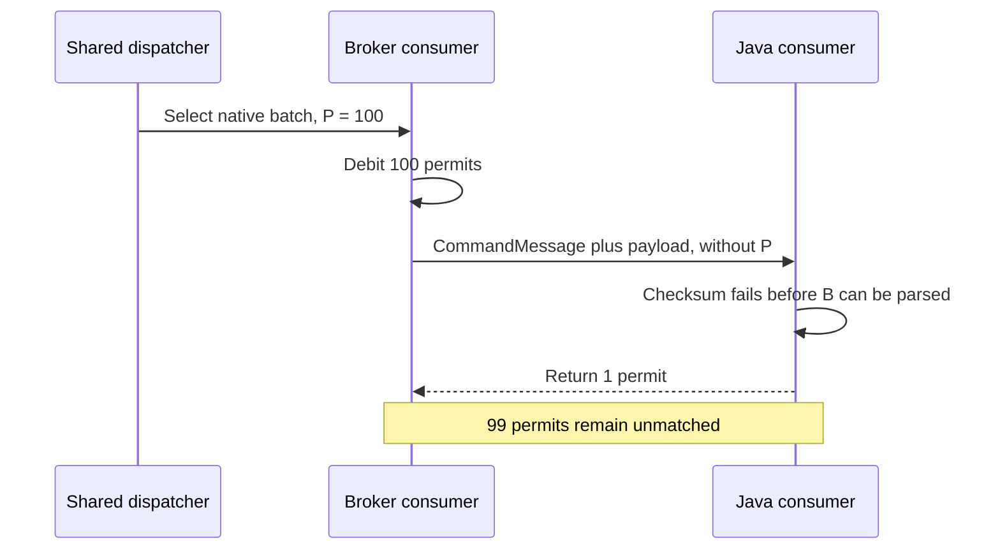

# PIP-491: Prevent Delivery Stalls by Making the Client Return Exactly the Permits Used by the Broker

# Background knowledge

Pulsar consumers use permits for receiver-side flow control. A client sends `CommandFlow` to grant receiver
capacity, the broker consumes that capacity while dispatching, and the client returns permits as messages leave its
prefetch path. In the consumer flow accounting covered by this PIP, one permit represents one logical message, not
one BookKeeper entry.

Each broker `Consumer` tracks its own available permits. Dispatchers that schedule across multiple consumers can also
track aggregate available permits to decide whether dispatch can continue. A send must debit the selected consumer
and every applicable dispatcher aggregate by the same number of logical messages. If they use different counts, the
dispatcher and selected consumer disagree about remaining capacity even when the network write itself succeeds.

A native Pulsar batch stores multiple logical messages in one entry. The payload metadata field
`num_messages_in_batch` describes the original batch cardinality so the broker can account for the entry and the
client can deserialize it. This PIP calls that value `B`; a non-batched entry has `B = 1`.

With batch-index acknowledgments introduced by [PIP-54](pip-54.md), a redelivered entry can include an `ack_set` in
`CommandMessage`. In this representation, a set bit identifies an unacknowledged index that remains deliverable; a
cleared bit identifies an index that the client must not deliver. A complete batch therefore consumes `B` permits,
while a partial batch consumes only the number of deliverable indexes.

This PIP calls the actual permit debit for one `CommandMessage` `P`. For a valid native batch:

```text
complete batch: P = B
partial batch:  P = cardinality(deliverable ack_set indexes within B)
valid command:  1 <= P <= B
```

For example:

| Entry | `B` | Deliverable `ack_set` indexes | `P` |
| --- | ---: | --- | ---: |
| Non-batched message | 1 | empty | 1 |
| Complete native batch | 8 | empty | 8 |
| Partial native batch | 8 | `{0, 2, 5}` | 3 |

The partial example shows why `B` cannot be reused as the debit: the payload still contains eight original indexes,
but only three logical messages are eligible for this delivery.

The broker's available-permit balance is distinct from `P` and may temporarily be negative. Dispatch operates on
indivisible entries, so a positive balance of one can admit a batch with `P = 10`; after the send, both the consumer
balance and, when it has no other consumers, the persistent Shared dispatcher balance are `-9`. This is outstanding
batch debt, not an invalid permit value. The consumer is not eligible for another send until returned credit makes its
balance positive again. Implementations must debit and later credit the full `P`; clamping or resetting the balance to
zero would discard the debt and grant excess capacity when the client returns those ten permits.

The acknowledgment path is separate from permit accounting. Acknowledgment controls cursor progress and redelivery;
permits control subsequent dispatch. Acknowledging an entry does not repair a missing permit, and returning a permit
does not acknowledge a message.

Permit accounting is scoped to a broker-consumer incarnation, not merely to a physical connection. A broker can close
and recreate one consumer while the pooled `ClientCnx` remains active for other producers or consumers. Debt belonging
to the removed broker consumer must not be compensated to its replacement, even when both use the same `ClientCnx`.

# Motivation

For each sent `CommandMessage`, the broker uses `P` consumer permits. While the source consumer incarnation remains
active, the in-scope Java path must eventually return exactly `P`. The command does not carry `P`, so the client has
to infer it from `ack_set` and the payload. If the payload cannot be parsed or only part of a batch enters the message
lifecycle, the client can return a different count from the one used by the broker.

The current protocol therefore relies on duplicated computation across broker layers and the client. The dispatcher,
consumer, and sender derive related counts at different points in the send lifecycle, while the client independently
reconstructs the expected return from what it can still observe after receipt. Equality of those calculations is an
implementation coincidence, not an explicit wire contract. It breaks when those paths observe different information,
such as post-selection admission changing the actual send set or a payload failure before the client can read batch
metadata.

This PIP does not add periodic synchronization, a permit reset, or a per-command acknowledgment. It establishes a
per-command accounting contract instead: the broker is the authority that creates and declares a debt of `P`, and
the in-scope Java native-message path must conserve and eventually return exactly `P` while the source
broker-consumer incarnation remains active. When that incarnation is removed, its debt disappears with it, so the
client discards old credit rather than moving it to a replacement.
`CommandFlow` can continue to aggregate returned credit; it no longer needs the client to independently rediscover
how the debt was created.

Steady-state native delivery does not normally lose permits: the duplicated calculations agree for successful
complete, partial, and non-batched delivery. They diverge when the actual send set changes after an earlier aggregate was
calculated, payload processing fails before or during batch expansion, a handed-off message has no terminal outcome,
or the broker-consumer incarnation changes while credit is being returned.

Returning too little permanently reduces the consumer's effective capacity and can eventually stall dispatch.
Returning too much weakens receiver-side backpressure by granting capacity the client did not originally provide.
Returning old credit to a replacement consumer crosses the incarnation boundary and can produce the same
over-grant even when the numeric total on the old consumer would otherwise have been correct.

For example, assume a Shared consumer grants 100 permits and the broker sends one native batch with `P = 100`. If
checksum verification fails before the client can parse `num_messages_in_batch`, the current Java error path returns
one permit. The broker consumer is left with one available permit instead of 100. Repeating the failure can exhaust
its capacity and stall Shared dispatch.



There are three root causes.

## 1. The wire protocol relies on duplicated inference instead of an explicit debit

`num_messages_in_batch` cannot be the permit contract because it is inside the payload metadata. It is unavailable
when checksum or metadata parsing fails, and it remains `B` when a partial redelivery has `P < B`.

`ack_set` is sufficient for a partial batch but is normally empty for a complete batch. Neither existing field is a
reliable statement of the debit for every command.

## 2. The broker does not finalize one value and pass it end to end

The dispatcher builds aggregate counts before final send eligibility is known. `Consumer.sendMessages` then records
pending-ack ownership; this final admission step can still reject an entry, for example when the consumer has closed.
Consumer accounting, Shared dispatcher accounting, and serialization currently have no shared post-admission result.

For example, if two entries each contain ten logical messages and final admission rejects the second entry, only one
command is sent. Any calculation that still uses the earlier aggregate of 20 disagrees with the actual send of ten.
A wire field is useful only if it is populated from the post-admission value.

## 3. The Java client has no explicit command-to-message ownership boundary

The native batch path separately counts delivered, skipped, and failed work rather than retaining the part of `P`
still owned by command processing. Once a message is handed to an asynchronous callback, terminal handling and source
association are also spread across separate paths.

For `P = 10`, if four messages enter the normal lifecycle before a later index fails, those messages own four units
and command processing retains six. The current delivered, skipped, and generic error counts do not
represent that split directly.

Adding `P` only to corrupted-message helpers would fix early failures, but not partial deserialization,
asynchronous stale-epoch discard, or reconnect. The client therefore needs a command-local ownership budget as well
as the wire value.

## Current failure modes and evidence

| Failure mode | Current behavior | Permit consequence |
| --- | --- | --- |
| Checksum or metadata failure | `ConsumerImpl.messageReceived` reaches corrupted-message handling before `B` is available and returns one. | A command with `P > 1` loses `P - 1` permits. |
| Decompression failure | `B` is available, but the generic corrupted-message path still returns one. | A command with `P > 1` loses `P - 1` permits even though the client has enough information. |
| Failure partway through native batch parsing | Transferred messages return individually, client-side skips are counted separately, and the catch path returns one. | If `D` messages were transferred and `K` were skipped, the old paths return `D + K + 1`, which is not necessarily `P`. |
| Client-side skip or parent handoff | Duplicate, start-position, compaction, dead-letter, child-consumer, and parent-consumer branches can each return directly. | A permit can be lost or returned twice unless one owner handles each terminal outcome. |
| Stale epoch after asynchronous handoff | The message is released and one permit is returned through the consumer's current connection without completing the prefetch gauges. | Prefetch accounting leaks, and credit can cross into a replacement consumer. |
| Broker consumer recreation | Later paths identify the source with `ClientCnx` or read the current `cnx()`; a pooled `ClientCnx` can survive consumer replacement. | An old return can pass a connection check or race with accumulator reset. |
| Rejection after Shared dispatch selection | `Consumer.sendMessages` can remove an entry when pending-ack admission rejects it, while earlier aggregates still feed later debits. | The server can debit permits for a command that is not sent. |

The checksum, decompression, parsing, skip, and stale-epoch rows follow directly from current terminal branches.
Consumer recreation and post-selection rejection are race-dependent and require deterministic tests. Appendix A
maps these behaviors to their current code owners.

# Goals

## In Scope

- Add the actual logical-message debit `P` to `CommandMessage`.
- Finalize `P` once on the broker after send eligibility is known.
- Reuse that result for consumer accounting, command serialization, and every dispatcher aggregate debited for the
  send.
- Conserve `P` in the Java native-batch path across successful delivery, client-side skips, and checksum, metadata,
  decompression, and batch-deserialization failures.
- Define one permit-return owner for direct returns, queue removal, listener and parent handoff, and zero-queue
  terminal paths reached by the built-in Java client.
- Bind immediate and deferred permit returns to local source consumer-incarnation state, including when the same
  `ClientCnx` is reused.
- Preserve old/new broker, Java client, and Pulsar proxy interoperability.
- Validate the result end to end with persistent Shared subscriptions.

## Out of Scope

- Exact output-cardinality semantics after control transfers to a custom `MessagePayloadProcessor`, chunk assembly,
  or a crypto failure action. Successful decryption that returns to the built-in native path remains in scope.
- Non-Java client implementations, which require client-specific follow-up work.
- Broker-side attestation or reconciliation of arbitrary client `CommandFlow` values.
- Permit reset, absolute synchronization, or connection-generation commands.
- Asynchronous broker `CommandFlow` processing racing with consumer removal.
- New broker network-write failure handling; existing transport cleanup remains unchanged.
- Changes to Key_Shared routing or draining policy. Accounting for the resulting send remains in scope.
- Changes to acknowledgment, redelivery, public receiver-queue, dispatch-rate, or message-rate policy. Permit outcomes
  of existing client removal and redelivery paths remain in scope.
- New Java public APIs, configuration, CLI commands, metrics, or broad consumer/dispatcher refactoring.

These exclusions do not change wire compatibility. Specialized payload paths retain their current cardinality and
ownership rules as detailed below. Known adjacent work is listed in Appendix B.

# High Level Design

For a send containing one or more entries, the broker produces one finalized `P` for every entry that will actually
be sent. It also calculates the sum of those per-command values. The per-command values and their sum become the only
inputs to the permit-related server counters and command serialization covered by this PIP.

The Java client treats `P` as a command-local budget. Each native message accepted into the existing per-message
lifecycle takes one unit. That lifecycle later returns the unit. The command path returns every unit not transferred
to a message. The same finalized broker value and the ownership split are shown below.


On every successfully written broker send that leaves the consumer live, the consumer debit is the sum of the
serialized command debits. Any dispatcher aggregate debited for that send uses the same sum:

```text
broker consumer debit == sum of all P values in the send
applicable dispatcher aggregate debit == sum of all P values in the send
```

An entry rejected before handoff produces no command and no debit.

For each command processed through the in-scope Java native-message path while its source consumer remains active:

```text
for each command:
    CommandMessage.message_permits == Java client's eventual return == P
```

Ordinary non-batched delivery naturally uses `P = 1` and needs no separate accounting model.

## Broker and Java client responsibilities

The accounting contract has one authority and one owner at each stage. The broker creates the debt, the protocol
transfers its value, and the Java client conserves the debt until it is returned or its source incarnation disappears.

| Component | Responsibility |
| --- | --- |
| Broker finalization | Decide which entries produce commands, calculate one `P` per admitted command, and calculate their sum. A rejected entry produces neither a command nor a debit. All covered broker counters and serialization consume this result. |
| Wire protocol | Carry the broker's actual per-command debit in `CommandMessage.message_permits`; this is a declaration of existing debt, not a client request. |
| Java command path | Resolve and validate `P`, create `remaining = P`, transfer one unit to each accepted native message, and return every unit that was not transferred. |
| Java message lifecycle | Return exactly one unit for every in-scope transferred message, including normal consumption and stale-epoch discard. |
| Consumer-incarnation boundary | Create new local permit state for every broker-consumer incarnation, even when `ClientCnx` is reused. The state object is the incarnation token and owns only that incarnation's accumulator. Old state cannot return or accumulate credit for a replacement. |

This is a correctness guarantee for the new protocol-compliant Java implementation, not broker attestation of client
behavior. `CommandFlow` currently carries only a `consumer_id` and an incremental `messagePermits` value. It has no
delivery identifier, incarnation, or cumulative sequence that lets the broker prove that a Flow increment corresponds
to previously dispatched debt. A client that returns too little eventually stalls itself; a buggy or malicious client
can return too much and weaken its own receiver-side backpressure. This trust boundary already exists and is not
expanded by declaring `P`.

Broker-side detection would require a separate protocol design, such as incarnation-scoped cumulative returns or
broker-issued delivery-credit identifiers, while also distinguishing initial/window-growth grants from returned
credit. Such a mechanism could reject stale, duplicate, or excessive Flow increments, but still could not prove that
the application actually processed a message. It is outside this PIP's Java correctness scope.

The complete invariant is provided only by the broker and Java responsibilities together. The protocol field alone
does not fix post-admission broker recounting or client lifecycle leaks. The broker and client changes are independently
compatible with old peers, but both are required to establish the new end-to-end guarantee.

## Accounting convergence boundaries

This design converges the arithmetic and ownership boundaries without moving payload parsing, pending acknowledgments,
queueing, or callbacks into one class. Existing code owners keep their non-accounting responsibilities, but must
consume finalized `P`, the resolved command budget, and retained source-incarnation state instead of independently
reconstructing permit debt.

## How the design closes the current failures

The protocol field is necessary but is not sufficient by itself. The guarantee comes from applying the complete
broker and Java ownership rules together:

| In-scope scenario | Preventing mechanism | Result with a new broker and new Java client |
| --- | --- | --- |
| Checksum or metadata parsing fails before `B` is available | `P` is present in `CommandMessage` and resolved before payload processing. | The command path returns `P` without depending on payload metadata. |
| Decompression fails after `B` is available | The resolved command budget remains authoritative after metadata parsing. | The command path returns `P`, rather than the generic one-permit fallback. |
| Native parsing fails after `D` handoffs, or the client skips an index | The budget transfers only accepted units and retains the rest. | Messages return `D`; command completion or failure returns `P - D`; total return is `P`. |
| A direct skip or parent handoff reaches more than one return site | Each unit has one command or message owner, and a terminal action consumes that ownership. | An outer cleanup or wrapper cannot return the same unit again. |
| Stale epoch or consumer recreation, including on the same `ClientCnx` | Each message retains the source permit state; each state owns its accumulator; the event loop revalidates state before writing Flow. | Credit returns only while the source incarnation is active and can never enter the replacement accumulator. |
| Pending-ack admission rejects an entry selected earlier | Broker records a candidate `P` in the finalized result only after admission and derives every covered debit from that result's sum. | The rejected entry produces no command and no permit debit. |

The full in-scope guarantee requires a new broker and new Java client; mixed-version behavior is defined below.

# Detailed Design

## Design & Implementation Details

### Broker permit finalization

Finalization occurs in `Consumer.sendMessages`. The broker first derives a candidate `P` because pending-ack admission
needs the logical-message count. That candidate is not an accounting fact yet. Only after admission accepts the entry
does the broker record `P` in the per-send result, before handing entries to the asynchronous command sender:

```text
entry is not sent    => no command and no debit
ack_set is empty     => P = B
ack_set is non-empty => P = deliverable set-bit count within B
```

An entry with `P = 0` is not sent, debited, or recorded as pending-ack ownership. A serialized `CommandMessage`
always represents at least one logical message.

Finalization produces the per-entry `P` values and their sum. The same result is used for:

- the consumer's available-permit debit;
- the consumer's unacked-message accounting where applicable;
- every applicable dispatcher aggregate available-permit debit; and
- each command's `message_permits` field.

Unacked state still controls acknowledgment backpressure, while permits control dispatch capacity; they only share
the finalized logical-message count. Downstream layers do not recompute it from `B`, `ack_set`, or earlier aggregates.
The per-send result owns a primitive per-entry array, its checked sum, and the asynchronous write future, so it remains
valid after the sender recycles its existing batch-size and `ack_set` inputs.

All `Consumer` send entry points, including overloads carrying consumer epochs or sticky-key hashes, expose the same
finalized values and sum to callers that own aggregate accounting.

Once a command is successfully written, the debit belongs to that broker-consumer incarnation. This PIP does not add
new handling for asynchronous network-write failure or speculative re-crediting after an ambiguous write; existing
transport cleanup remains unchanged.

#### Dispatcher aggregate coverage

Every dispatcher that subtracts a logical-message count from aggregate available permits uses the finalized sum for
the commands actually emitted:

| Dispatcher | Required aggregate debit |
| --- | --- |
| `PersistentDispatcherMultipleConsumers` | Finalized sum. |
| `PersistentDispatcherMultipleConsumersClassic` | Finalized sum. |
| `PersistentStickyKeyDispatcherMultipleConsumers` | Finalized sum, including its overridden sticky-key send loop. |
| `PersistentStickyKeyDispatcherMultipleConsumersClassic` | Finalized sum. |
| `NonPersistentDispatcherMultipleConsumers` | Finalized sum. |
| `NonPersistentStickyKeyDispatcherMultipleConsumers` | Finalized sum. |

The rule applies to normal, replay, and chunk-specific loops that debit an aggregate. Persistent and non-persistent
single-active dispatchers have no such multi-consumer aggregate; they still debit the selected consumer and serialize
the finalized per-command value. This changes no Key_Shared routing or draining decision.

#### `avgMessagesPerEntry` and precise dispatcher flow control

The permit unit remains one logical message whether `preciseDispatcherFlowControl` is enabled or disabled. After
finalization, `avgMessagesPerEntry` is updated as:

```text
sum(finalized P values) / number of emitted entries
```

When no entry is emitted, the average is not updated. This statistic therefore describes final deliverable logical
messages per emitted entry, and the existing `ConsumerStats.avgMessagesPerEntry` field exposes that corrected value.
Existing dispatch-rate, byte-rate, and message-rate semantics otherwise remain unchanged.

### Java permit resolution

For the native path, the Java client resolves `P` in this order:

1. Use a present `message_permits` value.
2. Otherwise, use the cardinality of a non-empty `ack_set`.
3. Otherwise, after parsing metadata, use `num_messages_in_batch`.
4. If an old-broker command fails before either source is available, use the legacy value of one.

A present `message_permits` value is authoritative for flow accounting once validated. Every resolved value must be
positive. Java interprets the protobuf `uint32` using unsigned conversion and accepts an explicit value only in
`1..Integer.MAX_VALUE`.

After native metadata is available, `B` must be positive. A complete batch requires `P = B`; a partial batch requires
`P` to equal the deliverable `ack_set` cardinality, with every set bit in `[0, B)`. A non-empty all-zero `ack_set`, an
out-of-range set bit, or native expansion beyond `P` is malformed. Validation occurs before accepting a native
message whenever the required metadata is available. A malformed command returns no Flow credit and closes the
source connection so the associated broker-side debt is discarded.

Before metadata is available, the client can validate only the explicit field's unsigned range or count an
old-broker `ack_set`; full consistency validation occurs after metadata parsing. An explicit range-valid `P` remains
available to checksum and metadata-failure paths. An absent-field early fallback is necessarily best effort.

The final fallback cannot recover a complete-batch debit from an old broker when failure occurs before metadata
parsing. Exact conservation for that case requires an upgraded broker. The client retains the legacy one-permit
behavior rather than closing a multiplexed connection for this old-protocol ambiguity.

### Java native-batch budget

Native command processing starts with `remaining = P`.

Indexes excluded by the broker's `ack_set` are not part of `P` and never interact with the budget. For each
deliverable index, one unit transfers from the command budget when handoff to the existing per-message lifecycle
succeeds. Constructing a message object alone is not acceptance. If an implementation reserves a unit before calling
the handoff, failure restores that reservation.

A deliverable index rejected before handoff as duplicate, compacted-out, before `startMessageId`, selected for
dead-letter handling, or otherwise ineligible does not claim a unit, so that unit remains command-owned.

At normal completion or failure, the command path immediately returns all remaining units. If deserialization fails
after `D` messages were transferred, those messages eventually return `D`, while the command path returns `P - D`.

The budget has one terminal transition. The first terminal action returns all command-owned units and closes the
budget; later cleanup returns zero. A direct return for a simple non-batched branch is valid only when it atomically
consumes that budget, so it cannot coexist with an outer terminal drain for the same unit. Returning the unit for a
non-batched item before `startMessageId` intentionally corrects the current leak.

Processing more than `P` native messages is a malformed command and follows the protocol-error behavior above.

#### Client terminal outcomes

"Return" below means credit only the retained source incarnation; if that incarnation is obsolete, the return is a
no-op.

| Branch | Permit outcome |
| --- | --- |
| Invalid explicit `P`, `B`, `ack_set`, or expansion beyond `P` | Return no credit and close the source connection. |
| Checksum or metadata failure | Return range-valid explicit `P`; otherwise use the early compatibility fallback. |
| Decompression failure | Return resolved `P`. |
| Non-batched duplicate or item before `startMessageId` | Consume and return the `P = 1` budget once. |
| Index cleared by the broker's `ack_set` | No return; the index is outside `P`. |
| Batch duplicate, compaction, or start-position skip | Leave the unit command-owned for the single terminal drain. |
| Batched or non-batched item skipped above the dead-letter threshold | Leave the unit command-owned; dead-letter processing retains the message object. |
| Dead-letter candidate at the threshold and still delivered | Transfer one unit to the normal message lifecycle. |
| Expansion fails after `D` successful handoffs | Messages own `D`; command processing returns `P - D`. |
| Handoff throws before acceptance | Restore any reservation and return the unit through the command terminal action. |
| Normal receive, listener delivery, or stale-epoch discard while the source remains active | The accepted message lifecycle returns its one unit once. |

Permit ownership is independent from pooled-message ownership. A dead-letter candidate can retain a message object
after its permit is returned. A duplicate normally releases its object, but a combined duplicate/dead-letter branch
must first remove it from dead-letter retention or leave release to the retaining owner. Reconnect, replacement, and
close release retained dead-letter objects exactly once.

Once a successful handoff transfers one unit, the existing per-message lifecycle owns it. Every terminal branch must
return the unit or discard it after the source broker consumer disappears. In particular, stale-epoch discard after
asynchronous handoff closes the prefetch accounting, returns through the retained source state when it is still
active, and releases the message exactly once.

The numeric budget does not own networking state. `ConsumerImpl` creates one opaque permit-state object per
broker-consumer incarnation; the object is both the local incarnation token and that incarnation's atomic permit
accumulator. Every transferred `MessageImpl` retains that state in addition to its existing source `ClientCnx`.
Reconnect or `CommandCloseConsumer` replaces the state even when the pooled `ClientCnx` is unchanged, and never copies
the old accumulator into the replacement.

Command processing captures this source state once and carries it through payload, crypto, chunk, queue, listener, and
callback paths. A terminal branch must not reacquire permit state from the current `ClientCnx`, because that same
physical connection can already represent a replacement consumer.

A return can update only its retained state and succeeds only while that state is current. After a threshold drain,
the source connection's event loop revalidates exact state identity immediately before writing `CommandFlow`. A new
state is not Flow-enabled until its Subscribe succeeds.

Pause can delay writing accumulated credit; resume flushes that existing credit without manufacturing another return.

The connection event loop is the final ordering point for Flow and Subscribe writes:

```text
old Flow task wins the event loop => old Flow is written before replacement Subscribe
replacement becomes visible first => old accumulator or queued Flow is discarded
```

Thus a queued old Flow either precedes the replacement Subscribe or becomes a no-op. It cannot enter the replacement
accumulator or be written after its Subscribe, and isolation does not require closing the multiplexed connection.

#### Queue, parent-consumer, and zero-queue integration

Removing accepted messages for redelivery while the same broker consumer remains active returns one unit per removed
message to its retained source state. Clearing a queue during close, reconnect, or replacement releases message
objects but does not transfer old credit to the replacement. A bulk return is valid only when all removed messages
are proven to share the same current source state.

Multi-topic and partitioned parent consumers do not create new command debt. If a child dequeue already returns a
unit, a parent skip or listener path cannot return it again. If listener mode deliberately defers the child return,
the parent returns it once through the child's retained source state.

A zero-queue non-batched receive has `P = 1` and returns that unit at its receive or listener terminal point. Native
batch delivery remains unsupported by that specialization; rejection closes the consumer and sends no Flow credit
for the rejected command. A stale zero-queue message is released without crediting a replacement incarnation.

#### Specialized payload ownership

Successful decryption that returns to built-in native processing remains covered by the command budget. Once chunk
assembly, a crypto failure action, or a custom `MessagePayloadProcessor` takes ownership, its existing permit
cardinality remains authoritative and the generic budget must not also drain. Existing chunk, crypto `DISCARD`,
`CONSUME`, decrypt-failure-listener, and custom-processor returns remain source-incarnation-bound. Crypto `FAIL`
continues to return no permit while retaining the message for redelivery. A failure before ownership transfers to one
of these paths remains command-owned and follows the normal terminal action.

## Public-facing Changes

### Binary protocol

Add one optional field to `CommandMessage`:

```proto
message CommandMessage {
    required uint64 consumer_id       = 1;
    required MessageIdData message_id = 2;
    optional uint32 redelivery_count  = 3 [default = 0];
    repeated int64 ack_set = 4;
    optional uint64 consumer_epoch = 5;

    // Number of consumer permits debited by the broker for this command.
    optional uint32 message_permits = 6;
}
```

The wire rules are:

- valid values are `1..Integer.MAX_VALUE`;
- an upgraded broker sends the field for every command, including when `P = 1`;
- zero is invalid; no command is sent when nothing is deliverable; and
- the value is the actual debit, not necessarily the original batch size.

No protocol-version bump or `FeatureFlags` capability is added. Old protobuf readers ignore the optional field, so an
upgraded broker can send it without detecting client support. Field absence always invokes the compatibility fallback;
a new client therefore cannot distinguish an old broker, an upgraded broker that omitted the field on one
serialization path, or an intermediary that stripped it. This preserves wire compatibility but intentionally loses
the exact early-failure guarantee for that command.

# Monitoring

No metric is added. Existing `pulsar_consumer_available_permits` or
`pulsar.broker.consumer.permit.count`, receive-failure statistics, and dispatch progress can help diagnose a stall,
but none independently proves that both sides agreed on `P`. Tests therefore verify the accounting invariant directly
and verify that repeated corrupted batches do not stall a Shared consumer.

Without a capability flag, monitoring also cannot distinguish an old peer, an upgraded serialization path that
omitted the field, or an intermediary that removed it.

# Security Considerations

The broker-to-client field grants no client authority and does not change authentication, authorization, or tenant
isolation. The broker continues to trust a connected client to send protocol-compliant Flow increments; this PIP makes
the new Java client's accounting deterministic and testable but does not make `CommandFlow` self-authenticating.
The Java client must reject zero and unsigned values above `Integer.MAX_VALUE`. The in-scope native path must not
return more than `P` for one command. Permit accumulation uses checked arithmetic; overflow is handled as a protocol
error on the source connection rather than wrapping into negative or unrelated Flow credit.

# Backward & Forward Compatibility

| Broker | Java client | Behavior |
| --- | --- | --- |
| New | New | Exact native-batch accounting from explicit `P`. |
| New | Old | The field is ignored; normal delivery is unchanged, while old exceptional-path limitations remain. |
| Old | New | The client falls back to `ack_set`, parsed batch metadata, then legacy one. |
| Old | Old | No change. |

An upgraded broker does not special-case `P = 1`: it explicitly declares the debit for both a complete one-message
command and a partial batch with one deliverable index. Field absence is reserved for compatibility with old brokers
or intermediaries that remove unknown fields. An old client ignores the new field and already returns one permit per
successfully delivered native message, so an upgraded broker does not change its normal path.

Pulsar proxy paths forward the original message frame without re-serializing `CommandMessage`. A third-party proxy
that drops unknown fields remains wire-compatible through the fallback, but cannot preserve the new early-failure
guarantee for complete batches.

## Upgrade

No configuration or metadata migration is required. Upgrade brokers before Java clients when practical. Old clients
can remain connected to upgraded brokers.

## Downgrade / Rollback

The value is connection-local and not persisted. Brokers can be rolled back without data migration; new Java clients
then use the fallback rules.

## Pulsar Geo-Replication Upgrade & Downgrade/Rollback Considerations

`CommandMessage` is not stored or replicated between clusters, so geo-replication requires no coordinated upgrade or
rollback.

# Alternatives

- **Continue inferring from batch metadata:** cannot handle checksum or metadata failure before `B` is parsed and
  cannot describe a partial-batch debit by itself.
- **Use only `ack_set`:** exact for partial batches, but complete batches generally omit it.
- **Add only the wire field:** fixes early ambiguity but does not align post-admission broker aggregates or prevent
  client ownership leaks and duplicate returns.
- **Always disconnect on ambiguous payload failure:** discards the debt but disrupts every producer and consumer on a
  multiplexed connection. Disconnect remains appropriate for an invalid explicit value, not normal data corruption
  or old-protocol ambiguity.
- **Add a reset or absolute-permit command:** requires ordering, idempotency, in-flight command, and connection-
  generation rules. Attaching the debit to the command that creates it is smaller.
- **Add a protocol capability flag:** distinguishes an old peer from field stripping, but requires handshake and proxy
  capability plumbing. This PIP accepts optional-field fallback instead.
- **Assign arbitrary permit costs to `Message`:** unnecessary for native batches, where each accepted logical message
  owns exactly one unit. Deferred processing paths require their own ownership rules.
- **Separate broker and client PIPs:** risks defining different debit and return semantics. The selected design keeps
  both layers under one end-to-end protocol contract.

# General Notes

This PIP defines behavioral boundaries, not required helper classes or commit structure. Existing components can keep
their non-accounting responsibilities, but they must consume the authoritative finalized value, command budget, and
source-incarnation state defined above.

The required test matrix covers:

- full and partial native batches, including explicit `P = 1`, every old-broker fallback source, and early failure
  before metadata is available;
- invalid explicit zero or unsigned range, `B = 0`, all-zero or out-of-range `ack_set`, inconsistent metadata, and
  native expansion beyond `P`;
- old readers, Pulsar proxy forwarding, and a simulated field-stripping intermediary;
- filtering or pending-ack rejection, including `P = 0`, produces no command, debit, or pending-ack ownership;
- consumer debit, every serialized field, and all six listed dispatcher aggregates use the finalized values in
  normal, replay, and chunk-specific loops;
- persistent and non-persistent single-active dispatchers debit only the selected consumer and serialize `P`;
- batch overshoot from one available permit to a negative broker balance, followed by exact recovery when the client
  returns the full `P`, in both modern and classic persistent Shared dispatchers;
- asynchronous lifetime of finalized per-entry values while existing sender inputs are recycled;
- finalized `avgMessagesPerEntry` with zero emitted entries and both `preciseDispatcherFlowControl` settings;
- checksum, metadata, decompression, and mid-batch deserialization failures;
- non-batched and batched duplicate, compaction, `startMessageId`, and dead-letter outcomes, including pooled-message
  cleanup for combined duplicate/dead-letter state;
- failed handoff, stale-epoch discard, same-incarnation redelivery, reconnect queue clearing, and close;
- synchronous, asynchronous, batch, and listener receive terminal returns;
- multi-topic and partitioned parent forwarding with and without listener-mode deferral;
- zero-queue non-batched delivery, unsupported native batch rejection, and stale old-incarnation cleanup;
- different-connection replacement, same-`ClientCnx` recreation, a concurrent old-return/recreation race, and a
  queued old Flow that executes after same-connection state replacement; Subscribe success and pause/resume must not
  duplicate or transfer accumulated credit;
- chunk, crypto-failure, and custom processor paths retain existing cardinality without also draining the generic
  budget, while successful decryption returning to the built-in path uses exact `P`; any return remains
  source-incarnation-bound;
- deterministically generated native batches whose decoded `CommandFlow.messagePermits` sum equals the explicit `P`
  sum after all delivered messages and immediate skips reach terminal handling; and
- repeated corrupted batches on a persistent Shared subscription without dispatch stall.

# Appendix A: Implementation map and convergence points

This appendix records where the current behavior is distributed. It is supporting detail, not a required helper-class
layout or additional implementation scope.

| Component | Responsibility | Relevance to this PIP |
| --- | --- | --- |
| `MessageMetadata.num_messages_in_batch` | Stores original payload cardinality `B`. | Payload structure is not always the actual debit and is unavailable before metadata parsing. |
| `AbstractBaseDispatcher.filterEntriesForConsumer` | Extracts `B`, `ack_set`, and aggregate counts. | Runs before final pending-ack admission. |
| `Consumer.sendMessages` | Performs pending-ack admission and debits consumer/unacked counts. | Must finalize the values for entries that survive admission. |
| Aggregate dispatchers listed above | Debit aggregate available permits after a send. | Must consume the finalized aggregate rather than recalculate it. |
| `PulsarCommandSenderImpl.sendMessagesToConsumer` | Serializes surviving entries and `ack_set`. | Must serialize the finalized per-entry value without recomputation. |
| `EntryBatchIndexesAcks` | Carries mutable pooled per-entry `ack_set` state. | The sender owns and recycles it asynchronously, so finalized values need an explicit lifetime and must not be recomputed after handoff. |
| `ConsumerImpl.messageReceived` | Verifies checksum, parses metadata, decompresses, and chooses the payload path. | Must resolve `P` before payload-dependent failures. |
| `ConsumerImpl.receiveIndividualMessagesFromBatch` | Splits native batches and counts skipped messages. | Must transfer units from the command budget instead of reconstructing returns. |
| `ConsumerImpl.executeNotifyCallback` | Performs asynchronous callback handling. | A transferred unit needs an exact terminal outcome on its source permit state. |

# Appendix B: Related work outside this PIP

The following known areas have different ordering or ownership requirements and are deliberately deferred:

- asynchronous `CommandFlow` dispatcher updates racing with consumer removal;
- Key_Shared hash draining and admission policy;
- custom `MessagePayloadProcessor` output cardinality;
- encrypted payload and chunk-assembly lifecycles;
- non-Java client prefetch implementations;
- broader entry, batch, and logical-message unit consistency in statistics and rate limiting.

These areas remain compatible with the explicit debt and incarnation model, but their own ordering, routing, or
output-cardinality semantics are not redefined by this PIP. The Flow-removal race is tracked by
[issue #26288](https://github.com/apache/pulsar/issues/26288) and
[PR #26289](https://github.com/apache/pulsar/pull/26289). That work touches some of the same counters but enforces a
Flow-side consumer-removal invariant; implementations must account for merge order without combining its scope with
this PIP's send-side command debt.

# Links

* Related broader permit-unit accounting issue (not the specific failure addressed here):
  https://github.com/apache/pulsar/issues/23263
* Batch-index acknowledgment: [PIP-54](pip-54.md)
* Current protocol: [PulsarApi.proto](../pulsar-common/src/main/proto/PulsarApi.proto)
* Current broker paths:
  [AbstractBaseDispatcher](../pulsar-broker/src/main/java/org/apache/pulsar/broker/service/AbstractBaseDispatcher.java),
  [Consumer](../pulsar-broker/src/main/java/org/apache/pulsar/broker/service/Consumer.java),
  [persistent Shared dispatcher](../pulsar-broker/src/main/java/org/apache/pulsar/broker/service/persistent/PersistentDispatcherMultipleConsumers.java),
  [classic persistent Shared dispatcher](../pulsar-broker/src/main/java/org/apache/pulsar/broker/service/persistent/PersistentDispatcherMultipleConsumersClassic.java),
  and [command sender](../pulsar-broker/src/main/java/org/apache/pulsar/broker/service/PulsarCommandSenderImpl.java)
* Current Java paths:
  [ConsumerImpl](../pulsar-client/src/main/java/org/apache/pulsar/client/impl/ConsumerImpl.java)
  and [ConsumerBase](../pulsar-client/src/main/java/org/apache/pulsar/client/impl/ConsumerBase.java)
* Adjacent Flow-removal race issue:
  https://github.com/apache/pulsar/issues/26288
* Adjacent Flow-removal race pull request:
  https://github.com/apache/pulsar/pull/26289
* Mailing List discussion thread:
* Mailing List voting thread:
