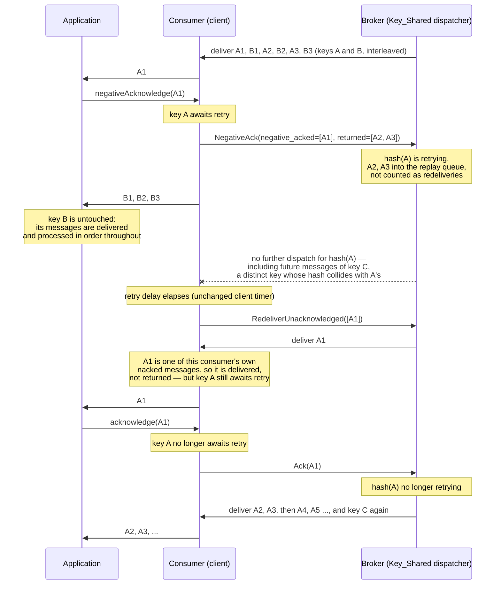

# PIP-493: Key-ordered negative acknowledgement for Key_Shared subscriptions

# Background knowledge

## Key_Shared subscriptions and the ordering contract

A Key_Shared subscription allows multiple consumers to consume from one subscription in parallel while
messages that share the same key are processed in order. The broker maps each message's *sticky key*
(the ordering key, or the partition key when no ordering key is set — `Commands#resolveStickyKey`) to a
16-bit *sticky key hash*, and maps hash ranges to consumers.

[PIP-379](pip-379.md) (Pulsar 4.0) defined the ordering contract as an invariant:

> In Key_Shared subscriptions, messages with the same key are delivered and allowed to be in an
> unacknowledged state to only one consumer at a time.

PIP-379 also documented an explicit carve-out, which is the subject of this proposal:

> The Key_Shared subscription doesn't prevent using any methods in the consumer API. For example, the
> application might call `negativeAcknowledge` or the `redeliverUnacknowledgedMessages` method. When
> messages are scheduled for delivery due to these methods, they will get redelivered as soon as
> possible. There's no ordering guarantee in these cases, however the guarantee of delivering a message
> key to a single consumer at a time will continue to be preserved.

## One key per entry

The broker resolves the sticky key once per **entry**, from the entry-level `MessageMetadata` only:
`Commands#resolveStickyKey` never descends into `SingleMessageMetadata`, and a batched entry is
dispatched whole to a single consumer. The producer stamps that entry-level key from the *first* message
added to the batch (`Commands#initBatchMessageMetadata`), so a producer that puts several distinct keys
into one entry has all of them dispatched under the first message's key, and the Key_Shared contract does
not hold for the keys that ride along.

**Producers on a Key_Shared topic must therefore disable batching or use `BatcherBuilder.KEY_BASED`.**
That is a condition of the existing contract rather than something this proposal introduces:
[PIP-460](pip-460.md) states it outright, and [PIP-486](pip-486.md) describes it as the producer-consumer
coupling it exists to remove. Nothing enforces it, and no javadoc on `BatcherBuilder`, `ProducerBuilder`
or `KeySharedPolicy` states it, which is why it is named here rather than assumed: this proposal reasons
throughout on the basis that **one entry carries one sticky key**, and a mixed-key entry is outside this
guarantee exactly as it is outside today's.

What that buys is used repeatedly below. The replay queue, `PendingAcksMap` and the redelivery count are
all keyed by position, so the *entry* is the only granularity the broker has; under this precondition it
is also key-precise, and no rule here has to reason about the individual messages inside an entry.

## The Key_Shared dispatcher mechanics that this proposal builds on

Four existing mechanisms matter, all in `PersistentStickyKeyDispatcherMultipleConsumers` and its base
class:

1. **The replay queue** (`MessageRedeliveryController`, field `redeliveryMessages`). Positions that must
   be redelivered are held here. For ordered Key_Shared subscriptions the controller also indexes each
   position's sticky key hash, and `containsStickyKeyHash(hash)` answers "is some message with this hash
   waiting for redelivery?".
2. **Three dispatch gates, not one.** A message can be withheld from a consumer at three independent
   points, and any new blocking rule has to be applied at all three:
   - `canDispatchEntry` — the per-entry check on a normal read;
   - `ReplayPositionFilter` — the filter that selects positions from the replay queue before entries are
     read from storage;
   - `handleAddingPendingAck` — the send-time recheck reached through
     `PendingAcksMap#addPendingAckIfAllowed`, which PIP-379 added specifically to close the race between
     a consumer-set change and a send that is already in progress. Note that the shipped method tests
     only the draining hash; the replay-index test that appears in the PIP-379 document was removed
     during its implementation. PIP-493's retrying-hash test will therefore be the only ordering guard at
     this gate, which is a further reason not to omit it.
3. **Pending acknowledgements** (`PendingAcksMap`). For each dispatched-but-unacknowledged message the
   broker keeps `(ledgerId, entryId) -> (remainingUnacked, stickyKeyHash)`. Full removals invoke a
   `PendingAcksRemoveHandler` callback, which is how PIP-379 keeps `DrainingHashesTracker` in sync
   without embedding that logic into `PendingAcksMap`. Partial acknowledgement of batch indexes goes
   through `updateRemainingUnacked`, which mutates the packed value in place and does **not** invoke the
   callback.
4. **Draining hashes** (PIP-379). When hash ranges change, hashes with messages still pending at the
   previous consumer are marked *draining* and withheld from the new consumer until the previous
   consumer has acknowledged them. They are what the current dispatcher has in place of the *recently
   joined consumers* read-position tracking that [PIP-282](pip-282.md) redefined and that only the
   classic dispatcher still carries — which is one reason the classic dispatcher is a different ordering
   regime and is out of scope here.

## How negative acknowledgement works today

`Consumer#negativeAcknowledge` is entirely a client-side facility. `NegativeAcksTracker` stores the
message id together with a redelivery timestamp computed from `negativeAckRedeliveryDelay` or from the
configured `RedeliveryBackoff`, and groups nacks by trimmed timestamp so that many of them travel in one
command. A timer fires when the delay elapses, and only *then* does the client send
`CommandRedeliverUnacknowledgedMessages`. Until that moment the broker knows nothing: the message
remains in the consumer's `PendingAcksMap` and counts towards the unacknowledged-message limits, exactly
as any other in-flight message.

Two consequences follow, and both are visible in the code today:

- For the whole retry delay the broker keeps dispatching later messages with the same key to the
  consumer, because nothing has told it not to.
- The sticky key hash is dropped on the redelivery path. `Consumer#redeliverUnacknowledgedMessages(List<
  MessageIdData>)` builds a `List<Position>`, and `PersistentDispatcherMultipleConsumers#
  redeliverUnacknowledgedMessages(Consumer, List<Position>)` calls the two-argument
  `addMessageToReplay(ledgerId, entryId)`, which calls `redeliveryMessages.add(ledgerId, entryId)`
  without a hash. The position is therefore not indexed by hash, `containsStickyKeyHash` will not report
  it, and later messages with the same key are not withheld. The code carries a `TODO` acknowledging
  this:

  ```java
  // TODO: We want to pass a sticky key hash as a third argument to guarantee the order of the messages
  // on Key_Shared subscription, but it's difficult to get the sticky key here
  ```

  The hash is available where it is discarded: `PendingAcksMap#removeAndGetRemainingUnacked` already
  reads it out of the packed value.

# Motivation

Key-ordered processing exists because processing events for one entity out of order corrupts state or
triggers wrong actions. The most common reason a consumer cannot process a message *right now* is a
transient failure of a downstream dependency: an HTTP 503, a database failover, a rate limit. The
natural tool for "try this again in a moment" is `negativeAcknowledge`.

On a Key_Shared subscription that tool is currently unusable when ordering matters:

1. **Negative acknowledgement reorders the key.** Two keys are in flight, `A` and `B`, delivered
   interleaved: `A1, B1, A2, B2, A3, B3`. The application nacks `A1`; `A2` and `A3` are already in the
   consumer's receiver queue and are processed; `A1` is redelivered afterwards and processed last.
   Ordering for key `A` is violated, silently. `B1, B2, B3` are unaffected and should be — the failure
   had nothing to do with them, and a mechanism that stopped them would trade one problem for
   another.
2. **The alternatives are worse.** Routing the failed message to a dead letter topic leaves a permanent
   gap in the key's sequence, and re-injecting it in the right place later is generally not possible.
   Blocking the consumer thread until the downstream recovers stalls every other key handled by that
   consumer.
3. **Application-level workarounds do not have the tools to be safe.** An application can keep the
   failed message and buffer later messages for the same key itself, but it cannot stop the broker from
   dispatching more messages for that key. Under a sustained outage the buffer grows without bound and
   the consumer's permits are consumed by messages it cannot process.

Point 3 is why this cannot be solved in the client library alone: only the broker can stop dispatching
messages for a key, and the current protocol has no way to tell it to.

# Goals

## In Scope

- Preserve key ordering across negative acknowledgement on Key_Shared subscriptions with ordering
  enabled, in both AUTO_SPLIT and STICKY mode: after a message is negatively acknowledged, no later
  message with the same key reaches any application before that message has been acknowledged. (The
  broker withholds by sticky key hash, so *newly dispatched* messages for keys colliding with the nacked
  one are withheld as well. Colliding-key messages already inside the consumer are unaffected — see
  [Two halves](#two-halves-because-the-messages-are-in-two-places).)
- Keep the resource cost bounded for the whole duration of a downstream outage, on both sides, without
  introducing any new unbounded or client-controlled broker state.
- Leave the existing negative acknowledgement retry delay, `RedeliveryBackoff` and grouping behaviour
  exactly as they are.
- Pause delivery entirely, client-side, when the application is failing regardless of key, so that a
  broad downstream failure is answered by stopping flow permits rather than by as many concurrent retry
  cycles as there are active keys (see
  [Client: broad-failure delivery pause](#client-broad-failure-delivery-pause)).
- Keep the mechanism inert when it is not in use: no new state is held while no message is in a retry
  cycle, and the work left on the idle path is constant-time and enumerated here — the per-add
  `PendingAcksMap` callback that ordered Key_Shared installs in both modes, a single test against an
  empty map at each of the three broker dispatch gates, and one `isEmpty()` check per delivered message
  on the client. An AUTO_SPLIT subscription already pays that callback cost for draining hashes; for a
  STICKY subscription it is new, and all of it is paid whether or not anything is ever negatively
  acknowledged.
- Make a stuck subscription diagnosable: how many hashes are withholding messages, and how many positions
  the broker is tracking. Not which message is blocking each hash — the application that negatively
  acknowledged a message still holds it, so the broker owes the operator magnitude and duration rather
  than identity.
- Degrade safely. Where the guarantee cannot apply, the behaviour falls back to today's, never to a
  stall. The exception is the explicit opt-in `OrderedNegativeAckMode.REQUIRED`, which fails loudly
  rather than degrading, because an application that asked for the property should learn from the client
  that it is absent, not from its data. Ordered processing admission, the other explicit opt-in, fails
  loudly only for client-side misconfiguration; it produces no failure of its own where the broker
  capability is missing, and follows the mode instead — beside the default `BEST_EFFORT` that is the
  typed per-message `ADMITTED_WITHOUT_GUARANTEE`, which is degradation the application is told about
  rather than a stall or a silent reorder. See [Public API](#public-api).

## Out of Scope

- Ordering guarantees for `redeliverUnacknowledgedMessages()`, acknowledgement timeout redelivery, dead
  letter topics and retry letter topics. These remain as documented by PIP-379.
- Shared, Exclusive and Failover subscriptions. Their negative acknowledgement behaviour is unchanged,
  and the Java client does not use the new command for them.
- Key_Shared subscriptions created with `KeySharedPolicy#setAllowOutOfOrderDelivery(true)`; the classic
  Key_Shared dispatcher (`subscriptionKeySharedUseClassicPersistentImplementation=true`); and
  [PIP-486](pip-486.md) entry-bucket dispatch (`KeySharedMeta.entryBucketDispatch`), where the
  dispatch unit is a producer-stamped entry bucket spanning many keys rather than a key hash.
- Messages with neither an ordering key nor a partition key, and chunked messages. See
  [General Notes](#general-notes) for why each is excluded and how each could be added later.
- Non-persistent topics, which have no redelivery.
- Clients other than the Java client. The protocol change is additive; other clients may adopt it later
  by implementing the [client conformance requirements](#client-conformance-requirements).
- Detecting, rejecting or reporting batch entries that mix several distinct keys. Such entries fall
  outside the [one key per entry](#one-key-per-entry) precondition and outside this guarantee, exactly as
  they fall outside today's.

# High Level Design

## The invariant

PIP-493 replaces the negative acknowledgement carve-out in the PIP-379 contract with a guarantee:

> **On a Key_Shared subscription with ordering enabled, when a message is negatively acknowledged, no
> *later* message with the same key is delivered to any application until that message has been
> acknowledged.**

The word "later" is load-bearing: the negatively acknowledged message is itself a message with that key,
and redelivering it is the whole point. "Later" means later in position order within the subscription.

The wording for `redeliverUnacknowledgedMessages` is unchanged: that method still carries no ordering
guarantee.

## Two halves, because the messages are in two places

At the moment of the nack, the messages that must not reach the application live in two places:

- Messages the broker has **not yet dispatched**. Only the broker can withhold these, and it must,
  because otherwise they accumulate somewhere for the whole outage.
- Messages **already inside the consumer**. The broker cannot recall them — they are on the wire, in the
  receiver queue, or already queued on a listener executor. Only the client can deal with these.

So the design has two mechanisms:

| | Broker: *retrying hashes* | Client: *keys awaiting retry* |
|---|---|---|
| Unit | sticky key hash | sticky key bytes |
| Withheld | positions strictly later than that hash's earliest outstanding nacked position | positions strictly later than that key's earliest outstanding nacked position |
| Effect | withholds dispatch to any consumer | **returns** the message to the broker instead of delivering it |
| Set by | the nack command | `negativeAcknowledge(Message)` |
| Cleared by | acknowledgement of the nacked message | acknowledgement of the nacked message, with self-healing fallbacks |

**One rule, applied at three places.** The *Withheld* row is deliberately the same rule on both sides,
and the admission rule of `acquireForOrderedProcessing` (see [Public API](#public-api)) is the third
instance of it: a message is withheld exactly when an *earlier* position of the same key is still
unresolved, and it
is delivered when it is at or before that position. The three differ only in what each place can see —
the broker evaluates it over the negatively acknowledged positions of a *hash*, because the key bytes are
not in its hands at the gates; the client's guard evaluates it over the negatively acknowledged positions
of a *key*; and admission evaluates it over every undisposed copy of a key, because the application may
hold several. Stating it once here is worth doing, because the alternative shape — a predicate over the
*set* of guarded keys — is wrong in the same way at all three: it refuses positions *earlier* than the
negatively acknowledged one, which the invariant never asked for. On the broker that wedges permanently
(see [Broker: retrying hashes](#broker-retrying-hashes)); in the client it disarms a live guard (see
[Client: keys awaiting retry](#client-keys-awaiting-retry)); in the application it teaches exactly the
reordering the feature exists to prevent (see [Alternatives](#alternatives)).

**The two units differ deliberately, and the client's is the finer one.** When key `A` is nacked, a
message already inside the consumer that belongs to key `C` — a distinct key whose hash collides with
`A`'s — is *not* returned: it is delivered and processed normally. Only newly dispatched `C` messages are
withheld, by the broker, once it has the command. So a nack costs a colliding key its future throughput
for the duration of the outage, but never the work already in the consumer's hands.

That is sound rather than merely convenient, and the reason is worth stating because it is not obvious.
Consumer selection is a pure function of the hash, so `A` and `C` always resolve to the *same* consumer,
whose receiver queue is FIFO. The set of `C` messages inside the client at the moment of the nack is
therefore exactly what the broker had already dispatched — a position-ordered **prefix** of the
outstanding `C` stream — and everything the broker *withholds* is strictly later in position order than
the nacked position. Delivering the prefix while withholding the remainder preserves `C`'s order. Every
broker-side gate is hash-coarse, i.e. a superset of the key-precise set, so the error direction is always
over-withholding, never under-withholding.

What is *not* true, and is the reason all three of those rules are position-ordered rather than phrased
over a set of keys, is that everything arriving after the nack is later than it. An earlier position of
the same hash — the same key, or a colliding one — can still be dispatched afterwards: when a consumer
disconnects, its pending acknowledgements are re-added to the replay queue with their hashes and replayed
*ahead* of the nacked position, in order, to whichever consumer now owns the hash; and the legacy
hash-less replay path leaves earlier positions in the queue that no hash index withholds at all. The
withholding rule dispatches such a position deliberately, and the client delivers it for the same reason.
That is correct rather than an exception: the message is earlier than everything the guard is protecting,
nothing the broker withholds stands in front of it, and returning it would only send it straight back —
the broker does not withhold it, so it would arrive again, and a client that treated its own return as
evidence would disarm a guard whose hash is still retrying. The messages the client returns are the
later ones, and only those.

This rests on the `returned` list being key-precise. Returning by hash instead would pull a colliding
key's messages back out of the client's ordered stream and break the prefix property, which is why
conformance rule 8 is written in terms of "that key". Returning at *entry* granularity — the only unit the
replay queue has — stays key-precise, because [one entry carries one key](#one-key-per-entry).

That precondition is load-bearing one step earlier as well: "consumer selection is a pure function of the
hash" is, for a batched message, a function of its *entry's* key rather than its own.

The client **returns** messages rather than holding them. This is the central decision, and it is what
makes the design safe: a message held inside the client is still recorded in that consumer's
`PendingAcksMap`, so the broker believes it is being processed. If the hash is then reassigned, PIP-379
marks it draining until the previous consumer acknowledges those messages — while the client refuses to
hand them to the application until the nacked message is acknowledged, which cannot happen until the
draining hash releases. That is a circular wait that nothing but an acknowledgement timeout breaks.
Returning the messages removes them from `PendingAcksMap` and dissolves the cycle. It also removes the
need for any client-side buffer, its memory accounting, and its interaction with permits and the
acknowledgement timeout tracker.

Returning reuses existing, proven machinery on the parts that matter most:
`ConsumerImpl#redeliverUnacknowledgedMessages(Set<MessageId>)` already takes messages out of
`incomingMessages`, releases them, corrects the incoming-message size accounting and restores the
permits, and it is the model the return path follows. What it does not already do is find them. It
drains through `GrowableArrayBlockingQueue#pollIf`, which tests only the element at the head and returns
null at the first non-match, so it reclaims a matching *prefix* of the receiver queue and nothing behind
it. For the nacked key's own messages sitting at the head that is exactly right; collecting a key's
messages scattered through the queue is new work, and a predicate sweep over the whole queue rather than
its head is the part this design adds. The other new part is on the broker: it must not count a returned
message as a redelivery, because the application never saw it — otherwise `RedeliveryBackoff` escalates
and the dead letter topic eventually swallows messages nobody ever tried to process.

## The nack becomes an immediate signal, and nothing else moves

The one structural change is *when* the broker is told. A new `CommandNegativeAck` is sent at nack time
and carries two lists: the negatively acknowledged messages, and the messages the consumer is returning
unprocessed. It carries **no delay**. The retry delay, `RedeliveryBackoff`, the grouping window and the
existing `CommandRedeliverUnacknowledgedMessages` that the timer eventually sends all stay exactly where
they are today.

That is deliberate. Moving the retry deadline to the broker so that one command could do everything was
considered and rejected, for three reasons that only became visible once the consequences were followed
through:

- A broker-side deadline requires the broker to drop the message from `PendingAcksMap` at nack time, so
  the message escapes `maxUnackedMessagesPerConsumer` / `maxUnackedMessagesPerSubscription` accounting
  while occupying broker state for a client-chosen duration. That is a new denial-of-service lever.
- `RedeliveryBackoff` produces a *different* delay per message, so a single per-command delay is not
  expressive enough, and a per-message delay on the wire also has to specify how the grouping window and
  network transit are subtracted from it.
- It needs a scheduler, a clamp, saturating deadline arithmetic, and a defined lifecycle across consumer
  disconnect, cursor reset and topic unload.

Leaving the timer on the client removes all of that. The nacked message stays in `PendingAcksMap`
exactly as it does today, so it stays inside the existing unacknowledged-message accounting, and the
broker gains no timer at all.

The `negative_acked` entries carry one further thing, and it costs no schema change. Batch index
acknowledgement is enabled by default, so a batched entry can already be partly acknowledged when one of
its messages is negatively acknowledged, and the broker needs the batch dimension to know when that entry
is resolved. A `negative_acked` entry therefore populates the existing `MessageIdData.batch_index` — the
index that was negatively acknowledged — and the existing `MessageIdData.ack_set` — the client's current
bitmap of the indexes of that entry that are **still unacknowledged**. That is the polarity `ack_set`
already has on the wire: every index of a batch starts with its bit set, acknowledging an index *clears*
that bit, and an entry is fully acknowledged when the bitmap is empty. This document uses that wire
encoding everywhere it names `ack_set`; where the prose is clearer talking about the acknowledged
indexes it says so explicitly rather than switching silently. Both fields are already on `MessageIdData`,
so this is new semantics on an existing message rather than a protobuf schema change. The `ack_set` is a
diagnostic cross-check, which the broker may log on mismatch and otherwise ignores; it is never treated
as an acknowledgement, and nothing on the nack path writes acknowledgement state. See
[Broker: retrying hashes](#broker-retrying-hashes) for how the broker resolves an entry's indexes from
its own state, and [Client conformance requirements](#client-conformance-requirements) for the
acknowledgement flush that makes that state at least as new as the client's.

## Lifecycle



If the application nacks `A1` again instead of acknowledging it, the hash simply stays retrying and the
cycle repeats. Nothing accumulates while it does: the broker dispatches nothing for that key, so the
only messages the client ever has to return are the ones that were already in flight when the first nack
happened. Key `B` is unaffected throughout — that is the difference from a client-only solution — and key
`C` pays only for the collision, in future dispatch and never in the work already in the consumer's
hands.

# Detailed Design

## Design & Implementation Details

### Broker: retrying hashes

A hash is **retrying** while at least one negatively acknowledged message with that hash has not been
acknowledged. A new per-dispatcher component in `PersistentStickyKeyDispatcherMultipleConsumers` tracks
this, alongside `DrainingHashesTracker`:

- **State**: `stickyKeyHash -> ordered set of negatively acknowledged positions`. The set normally holds
  one position; it holds more only when an application has several messages for one key in flight and
  nacks more than one.
- **Blocking**: an entry whose hash is retrying is withheld if and only if its position is **strictly
  later** than the earliest position in that hash's set. The earliest nacked position is dispatched —
  that is the retry — and so is anything before it.

  The rule is stated in terms of position order rather than set membership, and the difference matters.
  Withholding everything except the earliest nacked position looks equivalent and is not: it also
  withholds positions *earlier* than the nacked one, which the invariant never asked for, and that
  wedges permanently. A consumer can hold an earlier unacknowledged position with the same hash — the
  same key, or merely a colliding one — and when that consumer disconnects, its whole pending-ack map is
  re-added to the replay queue *with* hashes. The replay filter then meets the earlier position first,
  withholds it, and records the hash in its per-pass blocked set; the exempt position is short-circuited
  by that set before the exemption is ever consulted, so it is never dispatched, never acknowledged, and
  never releases the hash that is blocking the position in front of it. Ordering by position dissolves
  this: the earlier position replays ahead of the nacked one, in order, and the hash still withholds
  everything after it. It also preserves what the earliest-only formulation was introduced for — a
  second negatively acknowledged position of the same key is later than the first, so it stays withheld
  until the first resolves.

  (This does not rescue chunked messages: every chunk after the first is later than the earliest, so the
  chunk wedge described in [General Notes](#general-notes) stands and the exclusion remains.)

  The rule is applied at **all three** dispatch gates listed in Background — `canDispatchEntry`,
  `ReplayPositionFilter`, and the send-time `handleAddingPendingAck`. Omitting the third would leave exactly
  the race PIP-379 introduced that recheck to close: a send already in progress when the nack arrives.

  Two details of *how* it is applied are easy to get wrong and are part of the design. The test in
  `canDispatchEntry` must run for **both** read types: the pre-existing `containsStickyKeyHash` test
  beside it is gated on `ReadType.Normal`, and a retrying test gated the same way would be bypassed by
  exactly the replay that carries the redelivered message and its successors. And `ReplayPositionFilter`
  cannot obtain a position's hash from the replay queue's index, which returns nothing for the hash-less
  inserts that the legacy path produces — which is precisely how a nacked message re-enters the replay
  queue once its retry has been requested. The tracker must therefore hold a `position -> hash` lookup of
  its own alongside `stickyKeyHash -> ordered set of positions`, so the filter can recognise the exempt
  position rather than waving it through.

  The third gate needs care, because its contract differs from the other two. `canDispatchEntry` and
  `ReplayPositionFilter` are predicates whose callers re-queue the rejected entry;
  `handleAddingPendingAck` must re-queue the entry itself, because its caller in `Consumer#sendMessages`
  drops and releases it outright. Applying the retrying rule there as a plain predicate would silently
  lose the message. The nacked position must be exempt at this gate too — otherwise the one message the
  mechanism exists to deliver is the one that can never be sent.

  Both `PendingAcksMap` handlers are installed together today, and only when `drainingHashesRequired` is
  true, which excludes STICKY Key_Shared. The add handler is the one that reaches this gate; the remove
  handler drives *draining-hash* release and nothing else — its `handleRemoving` calls
  `DrainingHashesTracker#reduceRefCount` (`PersistentStickyKeyDispatcherMultipleConsumers.java:176-192`). What
  this proposal needs installed for ordered Key_Shared subscriptions in **both** modes is therefore the
  **add handler**, and only it. STICKY does not need draining hashes, because its ranges do not move, but
  it does need retrying hashes, and its users — who pin keys to instances precisely because ordering
  matters to them — are among those most likely to want them. The cost is the per-add callback that
  AUTO_SPLIT subscriptions already pay.

  The remove handler stays what it is today: a draining-hash mechanism, installed in AUTO_SPLIT alone.
  The retrying tracker takes **no** removal callback at all. Its release signal is on the subscription's
  acknowledgement path, for the reason the *Release* bullet below gives, and a non-closing removal
  carries nothing that path does not — it fires on the retry request as readily as on an acknowledgement,
  which is exactly why it cannot be the signal.
- **Precedence with draining hashes**: the two rules are independent and both must pass. A retrying-hash
  exemption exempts a position only from the *retrying* rule; if the hash is also draining, PIP-379 wins
  and the message waits. The nacked message stays in `PendingAcksMap` until its redelivery is requested,
  so it keeps its own hash draining-consistent, and the previous consumer's returned messages have
  already left `PendingAcksMap` — which is what prevents a circular wait.
- **Registration**: the nack command must register the retrying hashes and remove the returned positions
  from `PendingAcksMap` as one synchronized step with respect to dispatch, so that no send can observe
  neither the old pending acknowledgement nor the new retrying hash. Registration accepts a position only
  while the sending consumer still holds it in its `PendingAcksMap`; that precondition is what ties the
  tracker's intake to the unacknowledged-message accounting, and without it the tracker would be the one
  structure in the design with no server-side gate on its position count. A position that fails it is
  **skipped as an idempotent per-position no-op**, in the same terms the `returned` list already uses:
  the command's remaining positions are still processed, the command never fails, and the connection is
  never closed. That is a clarification of the precondition rather than a weakening of it — a nack racing
  a disconnect is a designed-for case, and a client that batches several keys into one command must not
  lose the well-behaved positions along with the stale one. That precondition is forced rather than
  chosen: the broker cannot recompute a sticky key hash from a message id, and `PendingAcksMap` is the
  only structure holding `(position -> hash)` for a dispatched message — so a read accessor must be added
  there. What it offers today is a whole-map traversal: `PendingAcksMap#forEach` is public and hands the
  sticky key hash of every entry to a processor without removing anything, which is what the draining-hash
  scan (`PersistentStickyKeyDispatcherMultipleConsumers.java:202`) and
  `PersistentDispatcherMultipleConsumers#redeliverUnacknowledgedMessages(Consumer, long)`
  (`PersistentDispatcherMultipleConsumers.java:1142`) already use. What is missing is a **per-position**
  hash lookup, which is what registration needs. What stops a stale nack from registering once its
  consumer is gone is that precondition, and it is worth saying which mechanism satisfies it in which
  case, because the two disconnect paths differ. When
  **other consumers remain**, `removeConsumer` drains the departing consumer's pending acknowledgements
  through `PendingAcksMap#forEachAndClose`, which closes the map to further entries: the precondition can
  never be met again, and the closed map is a genuine fence. When the **last** consumer disconnects the
  map is neither closed nor cleared — that path takes `clearComponentsAfterRemovedAllConsumers` instead —
  and it needs no fence, for the reason the *Lifecycle* bullet below gives: the same path clears the
  replay queue and the tracker, and the next consumer to arrive rewinds the cursor, so every position
  reverts to an ordinary unread one and there is nothing left for a late registration to be about.
  Registration is idempotent: a second nack of a position already in the set is a no-op rather than an
  error, which is what makes repeated nacks of the same message well defined. Registration skips the
  `NONE_KEY` marker's hash, which a message reaches only when its metadata cannot be parsed. Note that
  this does *not* implement the exclusion of keyless messages described in
  [General Notes](#general-notes): `resolveStickyKey` falls back to a producer-name/sequence-id key
  before `NONE_KEY`, so by the time the broker sees a hash it cannot tell a keyless message from a keyed one.
  That exclusion is necessarily client-side.

  Registration also snapshots, in the same synchronized step, the entry's unresolved **batch-index**
  state. `PendingAcksMap` packs `remainingUnacked`, which says how many of the entry's messages are still
  outstanding but not which ones, so the tracker materialises the unresolved indexes as a bitmap from the
  broker's own batch-index acknowledgement state for that position; the client-sent `ack_set` is
  cross-checked against it and is never a source of truth. That bitmap carries the same polarity as
  `ack_set` — a set bit is an index that is still unacknowledged — and it composes with an arriving
  `ack_set` the way the cursor already composes them, by intersection: `ManagedCursorImpl` merges an
  incoming `ack_set` into the stored one with `and` and deletes the entry once the result is empty. So
  "clear the bits an acknowledgement resolves" and "intersect the bitmap with the acknowledgement's
  `ack_set`" are the same operation, and the tracker's release condition — the unresolved set is empty —
  is the same condition under which the cursor deletes the entry. The tracker **retains** that per-entry
  bitmap after the retry request later removes the entry from `PendingAcksMap`. Retention is what makes
  release possible at all: once the retry has been requested there is no pending acknowledgement left to carry
  the state, and an acknowledgement arriving after that moment must still find something to resolve.
- **Release**: a position leaves the set when every index it holds has been acknowledged. **This needs a
  new, acknowledgement-specific signal; the existing `PendingAcksRemoveHandler` cannot carry it.** That
  callback fires for every removal from `PendingAcksMap`, and the client's own redelivery request removes
  the nacked position through the same method as an acknowledgement — `removeAndGetRemainingUnacked`,
  reached from the ack path and from `redeliverUnacknowledgedMessages` alike — with the same arguments
  and the same `closing=false`. A tracker that released on that callback would release on the retry
  request, which is the one moment it must not.

  The signal is therefore taken on the **subscription's acknowledgement path**, keyed by position and
  independent of `PendingAcksMap` membership, and it clears bits from the entry's unresolved-index bitmap
  rather than decrementing a counter. It must fire for all four ways an index is genuinely resolved:
  acknowledgement of individual batch indexes, which already travels this very path with its `ack_set`
  attached to the position — `Consumer#individualAck` calls `subscription.acknowledgeMessageAsync`
  (`Consumer.java:699`) on the `nonTxnPositions` it assembles with `buildPosition` (called at `:663`,
  body at `:771-786`), and those positions carry the ack set, built by
  `AckSetStateUtil.createPositionWithAckSet`; acknowledgement of the whole entry; the cursor's
  mark-delete position advancing past it, which covers cumulative acknowledgement, message expiry and
  administrative skips; and the **commit** of a transactional acknowledgement. It must **not** fire for a
  removal caused by redelivery, at either granularity. When the entry's bitmap is empty its position leaves
  the set, and when the set becomes empty the hash stops retrying and the existing batched unblock
  notification (`keySharedUnblockingIntervalMs`, `RescheduleReadHandler`) schedules a read.

  `PendingAcksMap#updateRemainingUnacked` is not that signal and must not be mistaken for it. It is the
  per-consumer unacknowledged-count bookkeeping applied *after* the acknowledgement has been handed to
  the subscription (`Consumer.java:733-745`), it mutates the packed value in place, and it invokes no
  callback at all — which is exactly why a release signal anchored on `PendingAcksMap` cannot see a
  batch-index acknowledgement, and why the signal is taken on the acknowledgement path instead.

  Two properties of that shape are load-bearing. *Resolution is idempotent*, because it is a bitmap and
  never a scalar decrement: a duplicate or reordered acknowledgement command clears an already-clear bit
  and changes nothing, where a decrement would double-release and let the key run ahead of its own nacked
  message. And *nothing on the nack path ever writes acknowledgement state* — no cursor mutation, no
  synthesized acknowledgement. "The indexes before the nacked one are acknowledged" is something the
  broker **observes** in its own state, made current by the client's flush before the command (see
  [Client conformance requirements](#client-conformance-requirements)), and never something the broker
  assumes or applies. If the application violated the in-order processing discipline and an earlier index
  is genuinely unacknowledged at the broker, the bitmap stays non-empty and the hash simply stays
  retrying until real resolution arrives: over-withholding, never loss.

  **A transactional acknowledgement releases the position only on commit.** The broker removes the
  pending acknowledgement when the transactional ack is processed, before the transaction's outcome is
  known, and `PendingAckHandleImpl` replays the transaction's positions if it aborts. Treating that
  removal as final would release the hash, let the next message for the key be dispatched, and then
  replay the nacked message behind it. The tracker must therefore **keep** the position across that
  removal and **release** it at commit — not re-register it. There is nothing to re-register: the
  position never left the tracker. Re-registration is not even available, because registration accepts a
  position only while the sending consumer still holds it in its `PendingAcksMap`, which a committed
  transactional acknowledgement no longer does. The same holds index by index: a transactional
  acknowledgement of individual batch indexes clears their bits only at commit, and an abort leaves them
  set, so a transaction that never commits cannot release a partly acknowledged entry.

  This needs no commit-side hook of its own, and the reason strengthens the rule rather than merely
  saving work. `PendingAckHandleImpl`'s commit paths acknowledge through
  `persistentSubscription.acknowledgeMessageAsync` (`PendingAckHandleImpl.java:470`, `:780` and `:800`)
  — the subscription acknowledgement path this design already places the release signal on, and a path
  that reaches the dispatcher today. Commit is thus the only moment a transactionally acknowledged
  position reaches that path at all, so the release can fire nowhere else: "release only on commit" is a
  property of where the signal is taken rather than a rule an implementation has to remember to enforce.
  The abort side needs nothing either: the position never left the tracker, and the existing abort
  replay is enough.

  While the outcome is pending the position is in the tracker but in neither `PendingAcksMap` nor the
  replay queue, so it is the earliest and nothing for that hash can be dispatched. That is correct, and
  it is worth naming as the longest wait in the design: a consumer that acknowledges in a transaction
  and then dies withholds the key until the transaction times out. Every other wait here is bounded by
  a retry delay.
- **Lifecycle**: the tracker holds *positions*. It holds no consumer identity and has no range dimension,
  and must acquire neither. A position stays in it for exactly as long as it is a negatively
  acknowledged message of this subscription that has not been acknowledged. Consumer scoping belongs to
  **registration** and only there; retention is position-scoped and release is acknowledgement-driven.

  *A position is removed only by resolution*: acknowledgement, the mark-delete position advancing past
  it, or one of the bulk resets that invalidates every position the dispatcher holds — cursor reset or
  seek, topic unload, and the disconnect of the **last** consumer
  (`clearComponentsAfterRemovedAllConsumers`). That last case is not merely "runtime state is cleared":
  the same path clears the replay queue, and the next consumer to arrive rewinds the cursor, so every
  position reverts to an ordinary unread one and there is nothing left for a retrying entry to be about.

  *Retrying hashes survive the disconnect of one consumer among several — including the consumer that
  sent the nack.* `removeConsumer` re-adds that consumer's pending acknowledgements to the replay queue
  **with their sticky key hash** and triggers a read, so a nacked message whose redelivery had not yet
  been requested becomes immediately deliverable again: it is the earliest position of its hash, and it
  is replayed to whichever consumer now owns that hash, with no dependence on the client timer that died
  with the connection. The replay queue is not a substitute for the tracker here. Its hash index
  withholds only until the position is *dispatched* — replay positions leave `redeliveryMessages` just
  before `Consumer#sendMessages` — not until it is acknowledged, which is exactly the interval this
  proposal exists to cover; and `ReplayPositionFilter` accepts later same-hash positions once an earlier
  one has been accepted, so the nacked message and its returned successors would be selected in one pass
  and handed together to a consumer whose guard is not armed, which is the original bug. If the retry had
  already been requested, the position sits in the replay queue *without* a hash, by the legacy path this
  proposal deliberately leaves alone, and the tracker is then the only ordering guard there is.

  *Retrying hashes survive hash range reassignment, in both modes.* Every gate resolves the target
  consumer from the selector at decision time, so the exempt position is dispatched to the new owner and
  the withholding transfers with the range. The *request* side is ownership-independent as well, which
  the argument below depends on and which is worth stating because it is the opposite of what one
  expects: `Consumer#redeliverUnacknowledgedMessages(List<MessageIdData>)` accepts a position exactly
  when the *sending* consumer still holds it in its own `PendingAcksMap`, and consults the selector
  nowhere; a range change neither moves nor clears pending acknowledgements — that is precisely what
  makes the hash draining. So a consumer that has lost the range still has its retry honoured, and the
  position enters the subscription-wide replay queue from which the current owner takes it.

  Draining hashes are not a substitute: a draining entry lasts only from the range change until the
  nacked message leaves the previous consumer's `PendingAcksMap`, and that boundary *is* the retry
  request — so the draining guard expires at the instant the retry begins. Draining is also computed from
  a scan of `PendingAcksMap` taken at the moment of the change, so it cannot see a position whose
  redelivery has already been requested. And STICKY has no draining machinery at all.

  Implementation note: **discarding on disconnect is what an implementation gets by accident** if it
  anchors the tracker on `PendingAcksMap` removals. `PendingAcksMap#forEachAndClose` invokes the remove
  handler with `closing=true` for every drained entry, so a tracker wired there would discard precisely
  the entries this bullet says survive — the rejected alternative, arrived at by omission. Taking no
  removal callback at all, which the *Release* bullet requires for its own reason, forecloses it.

Nothing here is persisted. After an unload or a broker restart the nacked messages are simply
unacknowledged messages, replayed in position order on reconnection, which preserves ordering even
though the retry delay is lost — the same as today.

### Broker: preserving the sticky key hash on the redelivery path

Positions that `CommandNegativeAck` puts into the replay queue — the `returned` list — carry their
sticky key hash, taken from `PendingAcksMap` where `removeAndGetRemainingUnacked` already reads it. This
is the `TODO` quoted in Background, applied on the new path.

It is applied **only** on the new path. The tempting move is to fix the `TODO` everywhere, so that every
targeted redelivery becomes hash-aware, and that was considered and rejected. It is out of scope: it
changes behaviour for older clients' negative acknowledgements and for every
`redeliverUnacknowledgedMessages(Set<MessageId>)` call, which would make this PIP carry an ordering
change nobody voting on it asked for. PIP-493 needs no such change — a retrying hash is withheld by the
tracker, not by the replay queue's hash index — so the legacy path keeps today's behaviour and the
compatibility story stays clean.

The hash-less overload of `Subscription#redeliverUnacknowledgedMessages(Consumer, List<Position>)`
therefore stays as it is, which is required anyway:
`MessageRedeliveryController#add(ledgerId, entryId, stickyKeyHash)` throws `IllegalArgumentException`
when the hash is `STICKY_KEY_HASH_NOT_SET` on the current dispatcher, and at least one caller has no
hash to give — `PendingAckHandleImpl` replays positions taken from the transaction pending-ack map on
transaction abort, not from `PendingAcksMap`.

### Broker: bounds

The retrying-hash map has at most one bucket per hash. Every `StickyKeyConsumerSelector` that ordered
Key_Shared dispatch can use produces hashes in a 65 535-value space — `ConsistentHashing` over
`[1, 65535]`, the two `HashRange` selectors over `[0, 65535]` with a zero result remapped to 1 — so a
subscription has at most 65 535 buckets, each keyed by an `int`, and the map is empty in the normal case.
The tree holds a fourth implementation, [PIP-486](pip-486.md)'s `EntryBucketConsumerSelector`, but it
serves entry-bucket dispatch, which is already out of scope for this proposal (see
[Out of Scope](#out-of-scope)); no subscription this proposal applies to selects through it.

The number of *positions* it holds is not bounded by that, and — contrary to what one might assume — it is
not bounded by the unacknowledged-message limits either. What those limits bound is how many positions can
be negatively acknowledged *at one instant*: a position enters the tracker only while the sending consumer
holds it in `PendingAcksMap`, and for ordered Key_Shared the per-consumer limit is enforced before
dispatch. The bound stops there, because the accounting is refunded *before* the tracker entry is
released. The unconditional retry request removes the position from `PendingAcksMap` and decrements both
the per-consumer and the per-subscription counter; the returned positions leave `PendingAcksMap` at nack
time by design; and a consumer disconnect refunds the subscription counter and moves that consumer's whole
map into the replay queue. The tracker holds all of them until acknowledgement, which is strictly later.
A retrying position therefore spends most of its life with no unacknowledged-message accounting behind it,
and that window is the ordinary retry cycle rather than an edge case. `maxUnackedMessagesPerSubscription`
never capped a structure in any case: it gates normal reads, and it is checked in an `else if` after the
replay branch, so a dispatcher blocked on it keeps replaying.

What limits the total is intake. A refund moves a position from `PendingAcksMap` to the replay queue; it
does not create one. A new tracked position requires a new dispatch, a dispatch of an unread message
requires a normal read, and normal reads stop once the replay queue reaches the effective look-ahead
limit. The look-ahead limits still do not cap the replay queue — redelivery requests and consumer
disconnects add to it unchecked — but gating reads is what throttles growth. They throttle the tracker
rather than bound it. With defaults that puts the resident state at the order of
`min(consumers × 50 000, 200 000)` messages in `PendingAcksMap` plus `min(consumers × 4000, 40 000)`
positions parked in the replay queue. Those two limits are not directly comparable — the replay queue
counts positions while the unacknowledged counters count messages, batch members individually — but since
positions ≤ messages, the replay threshold binds first.

The ceiling that survives every configuration is the withholding rule itself. Once a hash is retrying,
only its earliest position may be dispatched, so that hash accepts no positions beyond those already in
flight when it became retrying; further growth needs hashes that are not yet retrying, and there are at
most 65 535 of them. Everything else can be switched off: both unacknowledged limits accept zero, the
per-consumer limit is zero for non-durable subscriptions whatever the configuration, and the effective
look-ahead limit falls back to the unacknowledged settings when both thresholds are zero and to
`Integer.MAX_VALUE` when those are zero too.

The tracker therefore carries a per-subscription ceiling on tracked positions of its own, configured by a
new broker key `keySharedNegativeAckMaxRetryingPositionsPerSubscription`, default `50000` and dynamic.
The default sits above the 40 000 default per-subscription replay look-ahead threshold, so it never binds
in a default configuration; it takes effect only once the throttles above it have been turned off, which
is exactly the case the previous paragraph describes.

The ceiling is enforced at the **three dispatch gates**, not at registration. While the tracked-position
count is at or above it, `canDispatchEntry`, `ReplayPositionFilter` and `handleAddingPendingAck` admit
only the exempt earliest positions of hashes that are already retrying, so nothing that could create a
*new* tracked position is delivered and the tracker cannot grow. Registration of a negative
acknowledgement for a message that has already been dispatched is **always** accepted, overflow or not:
refusing it would let that message's successors through while its own retry is outstanding, which is the
guarantee itself, and intake at that instant is bounded by the unacknowledged-message limits exactly as
this section argues above. Recovery needs no intervention — capacity frees as acknowledgements resolve
positions and their hashes release, and dispatch resumes. Overflow is observable rather than silent:
`retryingPositionsCount` (see [Metrics](#metrics)) sits **at or above** the configured ceiling for as
long as it lasts, and the broker emits a rate-limited warning on entry into overflow. The *or above* is
not slack in the wording: the gates stop admitting anything that could create a *new* tracked position
once the ceiling is reached, but the negative acknowledgements the previous sentence always accepts
still arrive, so the count settles somewhat past the ceiling and falls back only as those positions are
acknowledged. The ceiling is the line at which overflow begins, not a value the count is pinned to. This is
the same over-withhold-never-under-withhold direction as every other rule here. The alternative — accepting
the nack but not tracking it, so ordering silently lapses under load — was rejected: a guarantee that stops
holding precisely when the system is under pressure is not one an application can build on.

Per position the tracker costs a long pair plus map overhead, duplicating identity `PendingAcksMap`
already holds. This is where hash-level tracking earns its place: the bucket count has a hard structural
ceiling and the bucket key is four bytes. A key-level tracker would be keyed by client-chosen bytes
bounded only by `maxMessageSize`, with no ceiling on the number of buckets, so it would have to carry its
own cap or store a digest — a bound it would owe rather than one it inherits.

Every lookup on the dispatch path is a single test against an empty map when nothing is retrying.

One cost is new and worth stating: returned positions stay unreplayable until their hash releases, and
`MessageRedeliveryController#getMessagesToReplayNow` walks the position set on every read cycle, so
during a long outage each cycle re-evaluates the replay filter for every withheld position. This is
work the rejected hold-buffer design did not do. It does not starve anything — iteration continues past
rejected positions — but on a subscription with a large replay queue it is a per-read cost proportional
to the number of withheld messages.

### Client: keys awaiting retry

`ConsumerImpl` keeps a map of the keys that are awaiting retry, indexed from the negatively acknowledged
messages the application has not yet acknowledged. Each entry holds the *positions* of that key's
outstanding negatively acknowledged messages — the guard compares against the earliest of them, so the
positions rather than the bare key are what the state is for — together with the ids this client has
returned for the key. The value it indexes by is the **guard key** — the client's counterpart to the
broker's sticky key, and what the rest of this section means by a message's sticky key. It is derived
from the delivered message alone, through the public `Message` API:

- the message's **ordering key** bytes when the message has an ordering key;
- otherwise the message's **partition key** bytes, base64-decoded when the metadata flags the partition
  key as base64 encoded;
- and a message with neither key is **keyless**: it has no guard key, and is excluded from the feature —
  see [General Notes](#general-notes).

The guard compares bytes, so presence and emptiness are distinguished explicitly. Presence of the field
decides, never its length: a message whose ordering key is set to an empty byte sequence *has* an
ordering key and guards as the empty key, and an absent partition key and a present-but-empty one are
different keys, which a client must not conflate. The existing helper `ConsumerBase#peekMessageKey` does
not conflate them either — it branches on `hasOrderingKey()` and `hasKey()`, presence rather than length,
so an absent key never yields empty bytes — and its one null-array path is unreachable through the public
producer API: it requires `hasKey()` to be true while `MessageImpl#getKeyBytes()` takes its
`isNullPartitionKey()` branch, and `TypedMessageBuilderImpl#key(null)` / `#keyBytes(null)` set
`null_partition_key` *without* setting `partition_key`, so such a message has no key at all and is
keyless to broker and client alike.

The divergence that does matter is `peekMessageKey`'s treatment of the producer name. Keylessness follows
from the two key fields alone and is never inferred from the producer name: `peekMessageKey` tests
`msg.getProducerName() != null` where the metadata question `Commands#resolveStickyKey` asks is
`metadata.hasProducerName()`, presence rather than nullness. A guard key derived the first way is not the
broker's sticky key.

The client deliberately does **not** reproduce `Commands#resolveStickyKey`. Its third branch,
`producerName + "-" + sequenceId`, stays an internal broker dispatch detail and is left unmirrored on
purpose: the broker owns the sticky key calculation and must be able to change it without a client
change, and keyless messages are recognised by both key fields being absent rather than by computing the
fallback. PIP-493 therefore neither exposes `resolveStickyKey` to clients nor promises that a client can
predict which hash ranges a consumer owns; the deferred-work record closing
[General Notes](#general-notes) states what a client would need before it could.

On the two branches the client does mirror, its per-*message* guard key equals the broker's per-*entry*
sticky key, because [one entry carries one key](#one-key-per-entry). That equality is what lets a return
at entry granularity be key-precise, and it is what the prefix argument in
[Two halves](#two-halves-because-the-messages-are-in-two-places) rests on. Any divergence between the two
silently breaks the guarantee for the affected keys, so the agreement of the client's two-branch
resolution with the broker's is worth a test over a corpus of keyed message shapes.

- **The guard is position-ordered, not a set of keys.** A message whose guard key is awaiting retry is
  returned **if and only if its position `(ledgerId, entryId)` is strictly later than the earliest
  outstanding negatively acknowledged position of that key**; a message at or before that position is
  **delivered**. This is the broker's blocking rule, evaluated on the key rather than on the hash — the
  same rule at another of the three places [Two halves](#two-halves-because-the-messages-are-in-two-places)
  names. The comparison is at *entry* granularity because the unit of return is the entry: the messages
  of the negatively acknowledged entry itself compare equal and are therefore delivered with it, which is
  what [General Notes](#general-notes) requires of them, and the negatively acknowledged message is
  delivered by the same clause rather than by an exception to the rule.

  A predicate over the *set* of guarded keys would return an earlier same-key message too, and that is
  reachable: a disconnected consumer's pending acknowledgements are replayed with their hashes ahead of
  the nacked position, to whichever consumer now owns the hash. Being earlier, such a message is exempt
  from the broker's withholding rule, so it is redispatched at once, and its second arrival would satisfy
  the self-healing disarm clause below and disarm the guard while the hash is still retrying — after
  which a later same-key message already queued inside the client, on the listener executor say, could
  reach the hand-off boundary before the nacked message is acknowledged. That is the inversion the
  invariant forbids, produced by the guard that exists to prevent it.
- **The guard is applied at one boundary: the hand-off to the application.** Immediately before a
  message is returned from `receive`/`batchReceive`, completes a pending `receiveAsync`, or is passed to
  a `MessageListener`, the client applies the test above; if the message is to be returned, it goes back
  to the broker instead of being delivered, and the delivery path moves on to the next message. Choosing
  this boundary rather than "when a message is taken from `incomingMessages`" is what
  makes the rule complete: a pending `receiveAsync` is completed directly without entering the queue,
  the zero-receiver-queue path bypasses the queue entirely, and `triggerListener` drains many messages
  onto the listener executor before any of them reaches the application. In `MultiTopicsConsumerImpl`
  the same rule is applied at the parent's hand-off boundary, and the return is routed to the
  sub-consumer that owns the message.
- **Sweeping the receiver queue is an optimisation, not the mechanism.** When the nack is issued the
  client also sweeps the messages already sitting in `incomingMessages` that the test above would
  return — that key's later-positioned ones — into the same return, which frees their memory and restores
  their permits immediately instead of one at a time. It is an optimisation that has to be built: the
  existing drain reclaims only a matching prefix of the queue, because
  `GrowableArrayBlockingQueue#pollIf` stops at the first head element that does not match, so sweeping a
  key's messages out of the middle of the queue needs a traversal the client does not have today. The
  guard above is what makes the guarantee hold whether or not the sweep catches a given message, which is
  why the sweep is the part that may be added incrementally.
- **A returned message must not remain in the client's unacknowledged-message tracker**, and must not be
  entered into it, because the application never received it. Acknowledgement-timeout tracking begins,
  as it does today, when the message is actually handed to the application. For the same reason a
  returned message must not run `ConsumerInterceptor#beforeConsume`, which otherwise reports a delivery
  that never happened, and its permit must be restored — a returned message has already consumed one.
- **Guard lifetime.** The guard for a key is armed when a message with that key is negatively
  acknowledged, and is disarmed when either:

  - the application has acknowledged every one of this client's negatively acknowledged messages for
    that key — the same condition that releases the hash on the broker; or
  - a message with that key that this client has already returned once during this guard arrives again.
    The broker withholds returned messages while the hash is retrying, so a second arrival proves the
    hash has been released — by an acknowledgement at another consumer, or because this subscription is
    one where the broker does not withhold at all. The client therefore keeps the ids it has returned
    for as long as the guard is armed.

  The position-ordered predicate is what makes that second clause exact, and this is its most useful
  consequence: because only later-positioned messages are ever returned, and later-positioned messages
  are precisely the ones a retrying hash withholds, a returned message that arrives again really does
  prove the hash was released. The clause needs no qualifier of its own — its premise is true rather than
  nearly true. Under a key-set predicate it would not be: an earlier same-key message is returned but not
  withheld, so its immediate redispatch would disarm a live guard.

  The **earliest** of this client's negatively acknowledged messages for a key is therefore **delivered**
  rather than returned when it comes back — it compares equal to the earliest outstanding negatively
  acknowledged position of that key, so the rule delivers it, which is the retry the guard exists to
  enable; returning it would put it straight back into the replay queue where the exemption dispatches it
  again. A second negatively acknowledged message of the same key is later than that position, so the
  rule returns it until the first resolves — which is what the broker's exemption enforces in any case.
  But receiving the retry does **not** disarm the guard: the hash is still retrying at that point, so a
  same-key message that was already queued for hand-off inside the client could otherwise slip past
  behind it, before the retry has been acknowledged.

  Every later-positioned message of the key is returned. The guard is also dropped on reconnection, and it
  expires on a deadline computed from that key's own outstanding negatively acknowledged messages: each
  of them contributes its own computed redelivery delay — from `negativeAckRedeliveryDelay`, or from
  `RedeliveryBackoff` where one is configured — plus a fixed slack of 60 seconds, counted from that
  message's negative acknowledgement, and the guard expires at the latest of those deadlines. Every new
  nack for the key re-arms it, so a key that is being re-nacked through a long outage keeps its guard, and
  only a guard that nothing has touched expires. The expiry exists only so that guard state cannot leak:
  if a hash is reassigned while the guard is armed and never comes back to this consumer, neither
  disarming condition can ever occur, and without a deadline the guard and its returned-id set would live
  until the next reconnection.

  The two terms answer different requirements. The delay term keeps the guard alive until the redelivered
  message can arrive at all — it cannot arrive before its own retry delay has elapsed, so any deadline
  shorter than that would disarm the guard on precisely the messages it exists for. The slack is an
  absolute 60 seconds rather than a multiple of the delay because the window the two disarming conditions
  cover is listener-executor delay plus broker replay latency, which is seconds and does not grow with the
  retry delay; a multiplicative bound would instead scale the leak window with a `RedeliveryBackoff`
  `maxDelayMs` that may be minutes. The leak window is therefore additive and absolute.

  Two simpler rules were tried and are wrong, which is worth recording because both look sufficient.
  Ending the guard when the client *requests* the redelivery fails because messages for the key can
  already be inside the client and past the receiver-queue sweep — `triggerListener` drains many
  messages onto the listener executor before any of them reaches the application — so such a message can
  reach the hand-off boundary after the request but before the redelivered message arrives. Ending it
  when the client *receives* the redelivered message fails for the same reason, one step later: the hash
  is still retrying, so the queued message would slip past between the retry's delivery and its
  acknowledgement.

  The second clause is what keeps the rule self-healing, and it is load-bearing. If the hash is
  reassigned while the guard is armed and the nacked message is acknowledged by a *different* consumer,
  this client will never see that acknowledgement; without the clause the guard would stay armed and the
  client would return messages the broker keeps re-dispatching. With it, the first such message costs
  one extra round trip and then disarms the guard.

  Note also what carries the absence of a deadlock with a draining hash: the nacked message stays in
  `PendingAcksMap`, so a reassignment does leave the hash draining on the old consumer, and the thing
  that always breaks that wait is the client's **unconditional** retry timer — when it fires, the
  redelivery request removes the position from `PendingAcksMap` and the draining refcount drops. Where a
  key has several negatively acknowledged messages it is the *last* of their timers that clears the
  draining hash, since each one still in `PendingAcksMap` holds the refcount above zero; the wait is
  bounded by the longest of their retry delays, not the shortest. More generally the refcount is per
  *hash* at that consumer, so any other message of that hash still pending there — one the application
  is simply slow to acknowledge, or one belonging to a colliding key — holds it above zero, and the
  retry then waits on ordinary processing rather than on a timer. That is unchanged PIP-379 behaviour:
  today's negative acknowledgement is held by the same draining entry. The guard's lifetime and the
  timers are independent, and the timers must stay unconditional.
- **Several nacks for one key** need no special client rule beyond the predicate itself. The guard
  compares against the *earliest* of that key's outstanding negatively acknowledged positions, so a
  second nacked message of the key is later than the first and is returned until the first is
  acknowledged — the client's half of what the broker's earliest-only exemption does. `RedeliveryBackoff`
  derives a different delay per message, so the client may request their redeliveries at different times,
  but the broker exempts only the earliest position of a retrying hash, so a later one cannot overtake it
  however the requests are timed. Which retry is due when stays the broker's business, and the client
  does not duplicate it.
- **On reconnection** the client drops the guard set along with the receiver queue. The broker replays
  unacknowledged messages in position order and the retrying hashes are still in place, so ordering is
  preserved; only the remaining retry delay is lost, exactly as it is today.
- **Cost**: one `isEmpty()` check per delivered message for a consumer that never nacks.

### Client: which API overloads carry the guarantee

`negativeAcknowledge(Message)` and `negativeAcknowledge(Messages)` carry the guarantee.

`negativeAcknowledge(MessageId)` cannot, and it does not take part in this proposal at all: it keeps
today's behaviour end to end — the client's retry timer followed by
`CommandRedeliverUnacknowledgedMessages` — and sends no `CommandNegativeAck`. What a bare id is missing
is the **guard key**, and both consequences follow from that one absence — the first decides the question:

- **The client cannot tell whether the message is keyless.** A `MessageId` holds no key field, and the
  client does not retain the key of a message once it has been handed to the application, so it cannot
  separate a message this proposal excludes from one it covers. Conformance rule 5 forbids ever putting a
  keyless message into `negative_acked`, and a rule that cannot be evaluated cannot be honoured, so
  **rule 5 wins and the overload sends nothing.** Sending anyway and letting the broker sort it out is
  not available: [General Notes](#general-notes) records that the broker cannot recognise a keyless
  message either, because `resolveStickyKey` has already given it a fallback key by the time the broker
  sees a hash. That is why the exclusion is client-side, and it is the client that has to abstain here.
- **The client cannot decide which messages to return**, for the same reason. With no key it cannot tell
  which of the messages inside the consumer belong to the nacked one's key, so the `returned` list this
  design depends on cannot be built.

The batch attributes conformance rule 7 requires are **not** the obstacle, which is worth saying because
they are the natural next suspicion: both are reachable from a bare id. `MessageIdAdv#getAckSet()` is
specified to return the batch's **still unacknowledged** indexes — exactly the polarity rule 7 uses — and
`BatchMessageIdImpl` returns that `BitSet` from a field every message id of the batch shares, so a bare
`MessageId` handed to this overload carries both its `batch_index` and the entry's bitmap. The overload
abstains because it cannot resolve the guard key, not because it cannot describe the entry.

So the broker does **not** stop dispatching the key: no `CommandNegativeAck` is sent, so no hash is
registered as retrying, and messages already inside the consumer are delivered in their original order
relative to the redelivered one. The overload therefore gains nothing from this proposal, and that sits
beside an already-documented limitation of exactly the same shape — it cannot support
`RedeliveryBackoff` either, because the redelivery count is only available on the message. That one is
documented on `ConsumerBuilder#negativeAckRedeliveryBackoff` rather than on the overload itself, whose
javadoc says nothing about it today. This proposal states both limitations on the overload, in the same
terms, and directs an application that needs the guarantee to nack the `Message`; the Key_Shared
documentation gains the same note.

Retaining the sticky key of every delivered-and-unacknowledged message purely to close this gap was
rejected: every consumer would pay for one API overload.

### Client: broad-failure delivery pause

Per-key withholding is the wrong shape for the failure that is most common in practice. When the
application's downstream dependency is unavailable, *every* message fails regardless of its key, and the
mechanism described so far answers that by registering a retrying hash for each key and returning each
key's successors — correct, but it turns one outage into as many retry cycles as there are active keys,
while the consumer keeps pulling messages it cannot process. A failure that is not key-specific deserves
a response that is not key-specific: stop asking for messages at all.

That brake is what makes negative acknowledgement practical on the consumers this proposal is written
for. An ordered Key_Shared consumer relying on the guarantee should have its dead letter topic disabled,
because routing one message of a key there leaves the permanent gap [Motivation](#motivation) describes.
Without the dead letter topic nothing eventually drains a broad failure, and every key grinds through its
retry cycle for as long as the dependency is down. The same brake is useful on a plain Shared
subscription, where it reduces how many messages reach the dead letter topic during an outage that has
nothing to do with any individual message.

The facility is **client-side only** and severable from everything else in this proposal: no wire change,
no broker change, no new command, and no interaction with the retrying-hash tracker. Flow permits are
already client-controlled, so "stop requesting messages" needs nothing the client does not have today.

**Configuration.** One `ConsumerBuilder` option enables it, and it is off unless a policy is set:

```java
// org.apache.pulsar.client.api.ConsumerBuilder<T>
ConsumerBuilder<T> negativeAckDeliveryPause(NegativeAckDeliveryPausePolicy policy);   // default: none
```

`NegativeAckDeliveryPausePolicy` is a builder-constructed class in `org.apache.pulsar.client.api`:

| Field | Type | Default | Meaning |
|---|---|---|---|
| `windowSize` | `int` | `100` | Number of most recent application dispositions the failure ratio is measured over, and the minimum number of samples before the breaker can open. |
| `failureRatioThreshold` | `double` | `1.0` | Fraction of the window, in `[0.0, 1.0]`, that must be negative acknowledgements for the breaker to open. |
| `initialPauseDelay` | `Duration` | 1 s | Pause length the first time the breaker opens. |
| `maxPauseDelay` | `Duration` | 60 s | Ceiling on the pause length after backoff. |
| `backoffMultiplier` | `double` | `2.0` | Factor applied to the pause length each time a probe fails. |

The threshold is a ratio because a ratio is the general form. "`windowSize` consecutive negative
acknowledgements" — the simplest rule an operator can reason about — is exactly its `1.0` special case,
and that is the default, so one knob expresses both shapes without a second one that can disagree with
it.

**What counts as a sample.** The breaker counts *application dispositions* over a sliding window of the
last `windowSize` of them: a negative acknowledgement is a failure, an acknowledgement is a success.
Nothing else is a sample. A message the library reclaimed through `returned` — because its key was
guarded, or because `acquireForOrderedProcessing` refused it — is never counted, because the application
never attempted it; counting reclaims would let a single nacked key trip the breaker on its own, which is
precisely the key-specific failure the retrying hash already handles. Redelivery commands, permits and
connection events are not counted either. The breaker measures whether the application can process, not
whether the broker can deliver.

**Scope is the logical consumer.** The failure it responds to is key-independent, so the breaker is per
`Consumer`, not per key and not per partition. On a `MultiTopicsConsumerImpl` it stops permit
replenishment across **all** sub-consumers when it opens: pausing only the partition whose messages
happened to fill the window would leave every other partition feeding the same broken dependency.

**Open means "stop requesting more", and nothing else.** While the breaker is open the client sends no
flow permits. Messages already fetched are not held: they continue to the application and are disposed of
by the ordinary rules — delivered, returned by the key guard, or refused by
`acquireForOrderedProcessing`. That is what keeps the breaker compatible with the central decision of
this design. Because the client
accumulates nothing, nothing it is sitting on stays in the broker's `PendingAcksMap` awaiting an
application decision, and the circular wait with draining hashes for which the hold buffer was rejected
in [Alternatives](#alternatives) cannot form here: the pause withholds nothing that has already been
dispatched, it only declines to ask for more. The returns-not-holds constraint is honoured rather than
worked around.

**Half-open probing.** When the pause delay elapses the breaker moves to half-open and grants a probe
budget of `windowSize` permits. If the failure ratio measured over that probe is below the threshold the
breaker closes and the pause delay resets to `initialPauseDelay`; otherwise it reopens and the delay
becomes `min(delay × backoffMultiplier, maxPauseDelay)`. The delay resets **only** after a full window
under the threshold, so a dependency that succeeds twice and fails again does not restart the backoff
from one second.

**Interactions.**

- The breaker never resumes a consumer the application paused with `pause()`. The two are independent
  conditions, ORed: delivery flows only while neither holds, and `resume()` clears only the
  application's half.
- Breaker state survives reconnection. It measures application failures, not connection health, and a
  dependency that was down before a reconnection is still down after it.
- Per-message retry scheduling is untouched. The negative acknowledgement delay, `RedeliveryBackoff` and
  the grouping window behave exactly as they do today. Permit pausing and retry scheduling are different
  axes — one decides how many messages the consumer asks for, the other decides when a particular message
  comes back — so the goal of leaving the retry behaviour exactly as it is ([Goals](#in-scope)) still
  holds.
- A long pause cannot lose a key's ordering. If a guard's expiry ceiling (see
  [Client: keys awaiting retry](#client-keys-awaiting-retry)) elapses while the breaker is open, the next
  negative acknowledgement for that key re-arms it, and the broker's retrying hash withholds the key
  throughout regardless of what the client's guard is doing. Guard expiry during a pause therefore costs
  at most one extra round trip, never an ordering violation.
- Tripping early bounds what a broad outage costs the broker. A breaker that opens after `windowSize`
  failures leaves at most that many hashes retrying, instead of one per key in the backlog, which is what
  keeps the tracker's per-subscription ceiling (see [Broker: bounds](#broker-bounds)) away from a
  subscription whose application is simply failing everywhere.

**Observability is client-side by necessity.** No broker can see a client's breaker, so the breaker
state, the number of times it has opened and the current pause delay are added to `ConsumerStats`.
`ConsumerStats` is a plain interface in `pulsar-client-api`, so these are client API additions and they
are `default` like everything else this proposal adds:

```java
// org.apache.pulsar.client.api.NegativeAckDeliveryPauseState
public enum NegativeAckDeliveryPauseState { CLOSED, HALF_OPEN, OPEN }

// org.apache.pulsar.client.api.ConsumerStats
default NegativeAckDeliveryPauseState negativeAckDeliveryPauseState() {
    return NegativeAckDeliveryPauseState.CLOSED;
}

/** How many times the breaker has opened over this consumer's lifetime. */
default long negativeAckDeliveryPauseOpenCount() {
    return 0;
}

/** The pause length currently in force; {@code Duration.ZERO} whenever the breaker is closed. */
default Duration negativeAckDeliveryPauseDelay() {
    return Duration.ZERO;
}
```

Their bodies **return** where the `default` bodies on `Consumer` and `ConsumerBuilder` throw (see
[Public API](#public-api)), and the difference is a consequence of the same rule rather than an
exception to it: a `default` body is allowed only when it tells the truth. There it cannot — a returned
`Outcome` would claim a message was admitted or reclaimed by machinery that does not exist. Here the
inert answer is exactly true: a `ConsumerStats` implementation that predates this proposal belongs to a
consumer that has no breaker, and "closed, never opened, no pause" describes it precisely. A stats
accessor that threw would also break every caller that does nothing but print a consumer's statistics.

The client also logs one line when the breaker opens — with the observed ratio and the chosen delay —
and one when it closes.

### Client conformance requirements

This subsection is the normative contract for client implementations; where it and the prose above ever
disagree, this list is the one to follow. A client that implements this proposal must implement all of
the following, and an obligation attached to an option binds every client that offers that option — rule
16's modes as much as rule 14's admission, and including `OrderedNegativeAckMode.DISABLED`, whose whole
effect is that no command is sent. A client that implements only the wire message gets broker-side
blocking and still reorders locally, which passes a two-message test and fails in production.

1. Only send the command for Key_Shared consumers without `allowOutOfOrderDelivery`, only when the
   broker advertises `supports_key_ordered_negative_ack`, and never when the consumer selected
   `OrderedNegativeAckMode.DISABLED`. Otherwise use the existing behaviour.
2. Send it **immediately** when the application negatively acknowledges, not when the retry delay
   elapses. The whole point is that the broker stops dispatching the key at once; a client that defers
   the command satisfies every other rule here and still lets the broker flood the key for the whole
   delay.
3. Flush the consumer's pending grouped acknowledgements on the connection **before** sending
   `CommandNegativeAck`. Same-connection ordering then guarantees that the broker has already processed
   every acknowledgement the client relied on when it nacked, so "the indexes before the nacked one are
   acknowledged" is something the broker observes in its own state rather than something the command
   asserts. Without the flush, a grouped acknowledgement still sitting in the client's tracker arrives
   after the command and the broker's view of the entry is older than the client's.
4. Derive the guard key from the delivered message alone, through the public message API: the ordering
   key bytes when the message has an ordering key, otherwise the partition key bytes, base64-decoded
   when the metadata flags base64 encoding. Presence of the field decides, not its length; an absent key
   and a present-but-empty key are different. Do not reproduce `Commands#resolveStickyKey` — the sticky
   key hash is not on the wire, and the broker owns and may change its own calculation. The deferred-work
   record closing [General Notes](#general-notes) states why the hash is not sent and what sending it
   would require.
5. A message with neither an ordering key nor a partition key is **keyless**. Never put a keyless
   message, or any position of a chunked message, into `negative_acked`. A keyless negative
   acknowledgement takes the legacy path — the client's retry timer followed by
   `CommandRedeliverUnacknowledgedMessages` — exactly as on a Shared subscription: no `CommandNegativeAck`,
   no blocking, no guard entry. For a keyless message the guarantee is vacuous, and inside a batch the
   messages of the nacked entry cannot be returned separately from it; a chunked message cannot be
   acknowledged until every chunk has been delivered.
6. Keep the two lists disjoint. A position that appears in both is meaningless, and depending on
   processing order would turn a negative acknowledgement into an immediate replay that skips its retry
   delay.
7. For a batched entry, set `batch_index` to the index that was negatively acknowledged and `ack_set` to
   the client's current bitmap of that entry's **still unacknowledged** indexes — the wire polarity,
   where a set bit is an index that has not been acknowledged — and keep a per-nacked-entry bitmap in
   that same encoding, keyed `(ledgerId, entryId)`. When the entry is redelivered, **intersect** the
   retained bitmap with the `ack_set` the broker sent with it, bit by bit (`and`), which is the merge
   `ManagedCursorImpl` already performs on the broker side. Intersecting two unacknowledged-index bitmaps
   is the same thing as unioning the two sets of acknowledged indexes, so the merge is monotonic in the
   one safe direction: an index moves from unacknowledged to acknowledged and never back. The client may
   therefore suppress a duplicate for an index it knows it acknowledged and the broker has not recorded
   yet, and can never re-open an index either side has already resolved, nor replace the broker's state
   with its own. Clear the bitmap when the entry resolves, and drop it on reconnection — the duplicates
   that can follow a reconnection are exactly today's at-least-once delivery.
8. From the moment of the nack, return — rather than deliver — every message of that key whose position
   `(ledgerId, entryId)` is strictly later than the earliest outstanding negatively acknowledged position
   of that key, and **deliver** every message at or before it. The predicate is position-ordered, never
   phrased over the set of guarded keys: an earlier same-key message can still arrive after the nack, the
   broker does not withhold it, and returning it would both reorder the key and feed the disarm condition
   in rule 10. Check immediately before each hand-off to the application, on every delivery path the
   client offers.
9. Deliver, rather than return, the **earliest** of this client's negatively acknowledged messages for a
   key, and every other message of that entry — rule 8 already yields this, since neither is later than
   the earliest outstanding negatively acknowledged position — but do not disarm the guard because of it.
   A second negatively acknowledged message of the same key is later than that position, so rule 8
   returns it until the first resolves.
10. Disarm the guard for a key only when the application has acknowledged all of this client's negatively
    acknowledged messages for that key, or when a message this client already returned once during the
    guard arrives again — which proves the hash was released only because rule 8 returns nothing but
    later-positioned messages — or on reconnection, or when the guard's bounded lifetime expires. Never
    merely because the redelivery request was sent.
11. Return messages in the `returned` list, never as an ordinary redelivery request, so their redelivery
    count is not incremented. Returning a chunked message returns every one of its chunk positions —
    a chunked message may still have to be returned because some *other* message guards its key, and any
    chunk left behind is stranded in the broker's pending acknowledgements after the client has discarded
    it.
12. Restore the flow permit for every returned message, and neither enter it into
    acknowledgement-timeout tracking nor run consumer interceptors for it — the application never
    received it. Remove it from acknowledgement-timeout tracking if it is already there.
13. Keep the retry delay and any backoff on the client, and keep the retry timer unconditional; the
    command carries no delay, and the broker relies on that request always arriving.
14. A client offering ordered processing admission must, for an enabled consumer, record every hand-off
    from before the first delivery; admit a message only when it is the minimum unresolved
    `(ledgerId, entryId, batchIndex)` of its key, resolved only by acknowledgement; answer `RETURNED`
    for every message it does not admit, having already reclaimed the copy through `returned` without a
    second permit restore, without re-running interceptors and without firing the negative-acknowledgement
    interceptor; answer `RETURNED` with reason `SUPERSEDED_CONNECTION` for a copy stamped with a
    connection that has since been replaced; and drop the tracking for a key only when no live copy of it
    remains, never on a timer. Reclaiming is idempotent per entry: a copy whose `(ledgerId, entryId)` has
    already been returned is answered `RETURNED` again with no second wire return and no second permit
    restore. It must fail the subscribe when the option is enabled on a subscription that can never
    qualify — not Key_Shared, `allowOutOfOrderDelivery`, or `OrderedNegativeAckMode.DISABLED`. The
    `REQUIRED` obligations themselves — the subscribe check and the two suspension triggers — belong to
    rule 16 and hold whether or not admission is offered; what admission owes on top of them is the answer
    for the copies a suspended partition already delivered over the superseded connection, which is
    `RETURNED` with `SUPERSEDED_CONNECTION` and never an admission. `IllegalStateException` is reserved
    for a call on a consumer that never enabled admission, and is not an answer to any runtime state.
    Under `BEST_EFFORT` it must answer `ADMITTED_WITHOUT_GUARANTEE`, never a bare `ADMITTED`, for a copy
    delivered over a connection that did not carry the capability. A broker receiving a `returned` position
    that is no longer in that consumer's pending acknowledgements treats it as an idempotent per-position
    no-op.
15. Tolerate silently skipped positions. A `negative_acked` position the broker no longer holds in that
    consumer's pending acknowledgements — a nack that raced a disconnect, a redelivery or an
    acknowledgement — is skipped as an idempotent per-position no-op, exactly as a stale `returned`
    position is: the command's other positions are still processed, and no error and no response follow.
    A client must not treat the command as failed and must not retry it; the affected message is covered
    by the client's ordinary unconditional retry timer.
16. Implement the three negative acknowledgement capability modes, whether or not the client offers
    ordered processing admission. `orderedNegativeAck` selects `DISABLED`, `BEST_EFFORT` or `REQUIRED`,
    and `BEST_EFFORT` is the default, so a client that does not expose the option at all must behave as
    `BEST_EFFORT` does. Under `DISABLED` never send `CommandNegativeAck`, even where the broker
    advertises the capability: every negative acknowledgement takes the pre-PIP-493 path, which is what
    rule 1 states at the send gate. Under `BEST_EFFORT` use the feature on every connection whose broker
    advertises `supports_key_ordered_negative_ack`, fall back to that same path on every connection that
    does not, and never fail `subscribe` on capability. Under `REQUIRED`:

    - Fail `subscribe` unless **every** partition's broker advertises the capability, with a
      `PulsarClientException.FeatureNotSupportedException` carrying
      `FailedFeatureCheck.SupportsKeyOrderedNegativeAck` and naming the partition whose broker did not.
      The failure is all-or-nothing: no partition is left running.
    - Suspend a partition on either of the two post-subscribe triggers — a partition that loses the
      capability on a reconnection, and a partition added by auto-discovery on a broker that does not
      advertise it. Those two are the whole list, because the capability arrives with the connection, so
      a loss the client can act on is a loss it can see; a dispatcher change made underneath a live
      connection is neither, and is the residual hole named under [Public API](#public-api).
    - A suspended partition hands nothing to the parent consumer, stops sending flow permits, logs a
      rate-limited error naming the partition and the missing capability, and makes the condition visible
      in consumer state. The subscription's other partitions keep running: a sticky key never spans
      partitions, so one lagging broker must not stop the application's other keys.
    - Suspension ends by itself when the capability returns — the next reconnection to a broker that
      advertises it — and delivery resumes with no application involvement.

    A client that also offers ordered processing admission owes, on top of all of this, rule 14's answer
    for the copies a suspended partition already delivered.

An implementation is verified against a matrix rather than a single happy path: all three dispatch gates;
replay reads and normal reads; AUTO_SPLIT and STICKY; consumer disconnect and hash range reassignment
while a hash is retrying; batched entries with only part of the batch acknowledged; transaction commit and
transaction abort; a mixed fleet of old and new brokers and a proxy that strips the capability flag; a
partition that loses the capability on a reconnection; and a partition added by auto-discovery on a broker
that does not advertise it.

## Public-facing Changes

### Binary protocol

One new command, assigned the next free `BaseCommand` type (82 at the time of writing):

```protobuf
message CommandNegativeAck {
    required uint64 consumer_id = 1;
    // Messages the application negatively acknowledged. Where key ordering applies (see below) the
    // broker withholds further dispatch of their sticky key hashes until these messages are
    // acknowledged. The messages stay in the consumer's pending acknowledgements; the consumer requests
    // their redelivery separately, with CommandRedeliverUnacknowledgedMessages, when its retry delay
    // elapses. For a batched entry, batch_index carries the index that was negatively acknowledged and
    // ack_set the client's bitmap of that entry's still unacknowledged indexes at that moment -- the
    // wire polarity, where a set bit means the index has not been acknowledged and acknowledging an
    // index clears its bit. The broker resolves the entry's remaining indexes from its own
    // acknowledgement state and treats ack_set as a diagnostic cross-check only, never as an
    // acknowledgement.
    repeated MessageIdData negative_acked = 2;
    // Messages the consumer received but never handed to the application, returned so that they are
    // redelivered in key order after the negatively acknowledged messages. They are put into the
    // subscription's replay queue and their redelivery count -- which the broker keeps per entry, not
    // per message -- is NOT incremented, because no application ever attempted to process them. They
    // do count towards the subscription's redelivery rate metrics, because the broker really does
    // redeliver them.
    repeated MessageIdData returned = 3;
}
```

The batch attributes add no field and no message: `MessageIdData` already carries both `batch_index` and
`ack_set`, so the vote surface stays one new command plus one new feature flag.

The two lists must be disjoint at **entry** granularity: the `(ledgerId, entryId)` position sets of
`negative_acked` and `returned` must not intersect, because two `MessageIdData` values differing only in
`batch_index` name the same position. A position in both is meaningless, and depending on processing
order would turn a negative acknowledgement into an immediate replay that skips its retry delay. Two
lists rather than one list of structured entries with a flag: the per-entry attributes this design needs
ride inside `MessageIdData` itself, and with the delay staying on the client nothing is left for a
structure around the ids to carry, so the flag would be the only thing in it, and two plain id lists say
the same thing with less encoding.

The command carries no `consumer_epoch`. The sibling `CommandRedeliverUnacknowledgedMessages` has one,
but the broker reads it only on the redeliver-everything branch; the message-id-targeted branch ignores
it, and `CommandNegativeAck` is always targeted. Adding a field with no defined meaning would leave
other-language implementers guessing at a value that does not matter. It can be added additively if a
fencing use is ever defined.

**The two lists degrade independently**, which is what makes the design fail open rather than stall:

- `negative_acked` registers retrying hashes only on an ordered Key_Shared subscription running the
  current dispatcher. Everywhere else — Shared, Exclusive and Failover subscriptions, out-of-order
  Key_Shared, the classic dispatcher, PIP-486 entry-bucket dispatch, or a broker with
  `keySharedNegativeAckOrderingEnabled=false` — it is a no-op. The message simply stays in the
  consumer's pending acknowledgements and the consumer's own timer redelivers it, exactly as today.
- `returned` is always honoured, on any subscription that supports targeted redelivery: the positions go
  into the replay queue without incrementing their redelivery count.

The second half matters. A returned message has already been discarded by the client, so a broker that
silently dropped the list would strand it — still pending on the broker, gone from the client, and
recoverable only by an acknowledgement timeout, which is disabled by default. Honouring `returned`
unconditionally means the worst case anywhere is today's ordering, never a stall.

One optional flag is added to `FeatureFlags`, set by the broker in `CommandConnected`, so that a client
can tell whether the broker understands the command:

```protobuf
message FeatureFlags {
  // ... existing flags ...
  optional bool supports_key_ordered_negative_ack = 10 [default = false];
}
```

`PulsarApi.proto` carries a convention comment above `FeatureFlags` asking that a matching value be
added to `PulsarClientException.FailedFeatureCheck`. One is added, following the existing naming:

```java
// org.apache.pulsar.client.api.PulsarClientException.FailedFeatureCheck
public enum FailedFeatureCheck {
    SupportsGetPartitionedMetadataWithoutAutoCreation,
    SupportsScalableTopics,
    SupportsKeyOrderedNegativeAck;
}
```

It has a producer. `OrderedNegativeAckMode.REQUIRED` fails `subscribe` exactly when the flag is absent,
so a missing-capability subscribe failure — which is what these values exist to carry — is reachable
here. `enableOrderedProcessingAdmission` is a separate axis and produces no such failure of its own: with
`BEST_EFFORT` it subscribes successfully and answers `ADMITTED_WITHOUT_GUARANTEE` where the capability is
missing, and with `DISABLED` it fails for a client-side reason that was never checked against a broker.
Naming the value also settles what that failure *is*, which the rest of this document otherwise leaves
unstated: **the `REQUIRED` subscribe failure is a `PulsarClientException.FeatureNotSupportedException`
carrying `FailedFeatureCheck.SupportsKeyOrderedNegativeAck`**, and `subscribeAsync` completes exceptionally
with it. On a partitioned topic it is thrown once for the whole `subscribe`, naming the partition whose broker
did not advertise the flag; the failure is all-or-nothing, so no partition is left running (see
[Public API](#public-api)). An application therefore catches one exception type and asks which check failed,
instead of parsing a message.

The purely client-side misconfigurations keep `IllegalArgumentException` and get no enum value —
admission enabled on a subscription that can never qualify: not Key_Shared, `allowOutOfOrderDelivery`,
or `OrderedNegativeAckMode.DISABLED` — because nothing about them was checked against a broker.
And the default, `BEST_EFFORT`, still never throws: a client that does not see the flag falls back
silently to today's behaviour. The value is therefore reachable from exactly one of the two explicit
opt-ins — `REQUIRED`, the one that is a statement about the broker — while admission's own loud failure
is client-side misconfiguration and carries no enum value.

### Proxy

`ProxyConnection#handleBrokerConnected` rebuilds `CommandConnected` from a hard-coded list of three
broker feature flags, so a new flag is silently dropped by a proxy that has not been upgraded. **The
proxy change is a required part of this proposal**, and the durable fix is to forward the whole
`FeatureFlags` message rather than extend the hard-coded list a fourth time. Until a proxy is upgraded,
clients behind it fall back to today's behaviour — safe, but the guarantee never activates, so the
upgrade order matters and is stated in the compatibility section.

### Configuration

Two new broker configuration keys:

| Key | Default | Dynamic | Description |
|---|---|---|---|
| `keySharedNegativeAckOrderingEnabled` | `true` | no | Whether the broker preserves key ordering across negative acknowledgements on Key_Shared subscriptions. When `false` the broker does not advertise `supports_key_ordered_negative_ack` and ignores the `negative_acked` list, falling back to PIP-379 behaviour. It still honours `returned`, as it must — see [Binary protocol](#binary-protocol). |
| `keySharedNegativeAckMaxRetryingPositionsPerSubscription` | `50000` | yes | Maximum number of negatively acknowledged positions the retrying-hash tracker holds for one subscription. At or above it the dispatcher delivers only the exempt earliest positions of hashes that are already retrying, so no message that could create a new tracked position is dispatched; registration of a negative acknowledgement for an already-dispatched message is still accepted. See [Broker: bounds](#broker-bounds). |

The first is static because it is advertised at connection time: a connection is told once whether the
capability is available, so a key that could change underneath live connections would announce a contract
the broker no longer honours. Making it static means the announcement and the behaviour are decided
together, and the toggle takes effect the way every client observes it — on reconnection. It exists as an
operational escape valve and as the rollback mechanism, which is why it is reachable at all. The second is
dynamic because it is a capacity backstop rather than a contract: raising it on a subscription that
legitimately holds many retrying positions must not require reconnecting anything.

The capability is advertised from the configuration in force when the connection is established, and no
attempt is made to keep it accurate for the lifetime of the connection. It does not need to be: because
`subscriptionKeySharedUseClassicPersistentImplementation` is dynamic, a subscription can move to the
classic dispatcher underneath a connection that was already told the capability is available, and the
per-list degradation described under [Binary protocol](#binary-protocol) is what makes that harmless —
`negative_acked` becomes a no-op and `returned` is still honoured, so the outcome is today's ordering
rather than a stall.

That resolution is `BEST_EFFORT`'s, and it is complete for `BEST_EFFORT`: today's ordering is an outcome
that mode accepts. It is not complete for `OrderedNegativeAckMode.REQUIRED`, which is defined as the
consumer that does not accept it. A dispatcher change leaves the connection intact, so the client sees no
event to act on and the suspension `REQUIRED` promises cannot fire. That limit is stated as a named
residual hole under [Public API](#public-api) rather than resolved here.

No new client *configuration key* is added; what the client gains is three `ConsumerBuilder` options.
`orderedNegativeAck` and `enableOrderedProcessingAdmission` are specified in
[Public API](#public-api); `negativeAckDeliveryPause` is specified in
[Client: broad-failure delivery pause](#client-broad-failure-delivery-pause). They are builder options
rather than configuration because each changes the contract of an individual consumer — what it requires
of its broker, and what it promises about its own message handling — which is a property of the
application, not of the deployment. All three default to the behaviour a consumer has today. The
delivery pause in particular has **no broker configuration key and no broker involvement at all**: it is
client-side only, so an operator changes it by changing the application's consumer configuration, not the
broker's. The switch for a consumer that does not need key ordering at all is unchanged and is none of
them: `KeySharedPolicy#setAllowOutOfOrderDelivery(true)`.

### Metrics

Topic stats gain two fields on `SubscriptionStatsImpl`:

| Field | Type | Description |
|---|---|---|
| `retryingHashesCount` | `int` | Number of sticky key hashes that have a negatively acknowledged message not yet acknowledged, and are therefore withholding later messages. Keys other than the nacked one that collide on the same hash are withheld too. |
| `retryingPositionsCount` | `long` | Number of negatively acknowledged positions the subscription is currently tracking. It sits at or above the configured per-subscription ceiling (see [Broker: bounds](#broker-bounds)) for as long as the tracker is in overflow — above it, because a negative acknowledgement of an already-dispatched message is accepted whatever the count is. |

Both counters sit at subscription level, unlike PIP-379's per-hash detail on `ConsumerStatsImpl`,
because a retrying hash belongs to the subscription: the message that holds it may be redelivered to a
different consumer than the one that nacked it, and attributing it to a consumer would be misleading.
Both are plain sums across the partitions of a partitioned topic.

Two Prometheus metrics are added to the existing per-subscription family, alongside
`pulsar_subscription_in_replay` and friends:

| Metric | Type | Labels | Unit | Description |
|---|---|---|---|---|
| `pulsar_subscription_retrying_hashes_count` | Gauge | the standard topic/subscription labels | hashes | Value of `retryingHashesCount`. |
| `pulsar_subscription_retrying_positions_count` | Gauge | the standard topic/subscription labels | positions | Value of `retryingPositionsCount`. |

The matching OpenTelemetry instruments are added at the same time, in `OpenTelemetryTopicStats`, which
is where subscription-scoped instruments already live — `DELAYED_SUBSCRIPTION_COUNTER`
(`pulsar.broker.topic.subscription.delayed.entry.count`, replacing `pulsar_subscription_delayed`) is the
precedent, and the subscription attributes it needs, `pulsar.subscription.name` and
`pulsar.subscription.type`, already exist in `OpenTelemetryAttributes`:

| Instrument | Kind | Unit | Replaces |
|---|---|---|---|
| `pulsar.broker.topic.subscription.retrying.hash.count` | Asynchronous UpDownCounter | `{hash}` | `pulsar_subscription_retrying_hashes_count` |
| `pulsar.broker.topic.subscription.retrying.position.count` | Asynchronous UpDownCounter | `{position}` | `pulsar_subscription_retrying_positions_count` |

Both are built with `upDownCounterBuilder(...).buildObserver()` and observed from the existing
`BatchCallback`, like every other instrument in that class, and both carry the `// Replaces
pulsar_...` comment the class uses to record the Prometheus correspondence.

Adding the OpenTelemetry pair with the Prometheus pair, rather than after it, is deliberate. A metric
that ships in only one system becomes a migration exception someone has to rediscover later, and this
proposal introduces the first signal in Pulsar for a *withheld* — as opposed to merely unacknowledged —
key, so there is no existing instrument an operator could fall back to. Note that
`pulsar_subscription_in_replay`, the metric these two are meant to be read beside, has no OpenTelemetry
counterpart today and is not yet recorded as an omission; migrating it is out of scope here but worth
doing in the same area.

PIP-379 deliberately kept draining hashes out of the metric families, and that was right: a draining
hash is transient by construction and clears in milliseconds. A retrying hash persists for exactly as
long as the downstream failure does, which is the thing operators need to alert on, so it needs a time
series rather than a stats poll.

Per-hash detail — a list naming each withheld hash and the message holding it — was considered and
dropped. The application that negatively acknowledged a message already knows which message it is, so
what the broker owes the operator is magnitude and duration, not identity. Two counters carry that
without adding a new public type to `pulsar-client-admin-api`.

### Public API

No REST API changes. The Javadoc of `Consumer#negativeAcknowledge(Message)` and
`Consumer#negativeAcknowledge(MessageId)` is updated to state the guarantee and its limitation.

Every client method this proposal adds is `default`, so that third-party implementations of these stable
interfaces keep compiling — the two `ConsumerBuilder` options and the `Consumer` method below,
`negativeAckDeliveryPause`, and the three `ConsumerStats` accessors that report the delivery-pause
breaker. The last four are specified under
[Client: broad-failure delivery pause](#client-broad-failure-delivery-pause), which is also where the
one difference between them is argued: the `default` bodies on `Consumer` and `ConsumerBuilder` throw,
while the `ConsumerStats` accessors return an inert value, because for a consumer with no breaker that
value is true. The three specified here are:

```java
// org.apache.pulsar.client.api.ConsumerBuilder<T>
ConsumerBuilder<T> enableOrderedProcessingAdmission(boolean enabled);       // default: false
ConsumerBuilder<T> orderedNegativeAck(OrderedNegativeAckMode mode);         // default: BEST_EFFORT

// org.apache.pulsar.client.api.Consumer<T>
OrderedProcessingAdmission acquireForOrderedProcessing(Message<?> message);
```

`acquireForOrderedProcessing` returns a new interface in `org.apache.pulsar.client.api`, implemented by
a record in the client implementation module:

```java
// org.apache.pulsar.client.api.OrderedProcessingAdmission
public interface OrderedProcessingAdmission {
    enum Outcome { ADMITTED, ADMITTED_WITHOUT_GUARANTEE, RETURNED }

    enum ReturnReason { KEY_AWAITING_RETRY, EARLIER_MESSAGE_UNRESOLVED, SUPERSEDED_CONNECTION }

    Outcome outcome();

    /** The reason the copy was taken back; non-null exactly when {@code outcome() == RETURNED}. */
    ReturnReason returnReason();

    /** True for {@code ADMITTED} and {@code ADMITTED_WITHOUT_GUARANTEE}. */
    boolean isAdmitted();
}
```

The name states the side effect. `acquireForOrderedProcessing` is **not a pure query**: the call disposes
of the message it is asked about whenever it does not admit it, so it names the transfer of ownership
rather
than a question about it. It is called once per delivered copy, immediately before processing, on the
serialized path for that message's key:

- `ADMITTED` — this is the earliest unresolved message of its key. Process it, then acknowledge or
  negatively acknowledge it before the next call for the same key.
- `ADMITTED_WITHOUT_GUARANTEE` — the same obligation, on a copy that arrived over a connection which does
  not carry the ordering guarantee. Which consumers can ever see this outcome is decided by the
  negative acknowledgement capability mode, defined later in this section.
- `RETURNED` — the consumer has **taken the copy back** and arranged in-order redelivery *without*
  incrementing its redelivery count. Discard the reference: do not process, acknowledge, negatively
  acknowledge, or release it again.

**The obligation after `RETURNED` is identical for every reason.** `KEY_AWAITING_RETRY` (the key is
guarded by a negative acknowledgement), `EARLIER_MESSAGE_UNRESOLVED` (an earlier message of the key is
still undisposed) and `SUPERSEDED_CONNECTION` (the copy was stamped with a connection that has since been
replaced) name *why* the library reclaimed the copy; in all three the copy is already reclaimed and the
application discards the reference. The reasons are diagnostic — for logging, metrics and support — and
an application must not branch its disposition on them. Anything else re-opens the decision the call
exists to take away from the application.

Folding the disposition into the call is what makes it safe. A pure "should I skip this?" query
tells an application to skip without saying what to do with the message, and the tempting answer —
hold it — reproduces the deadlock described in [Alternatives](#alternatives) one level up, inside the
application, where no timer exists to break it.

**Admission rule.** A message is admitted if and only if it is the minimum unresolved *logical* position
of its key: `(ledgerId, entryId, batchIndex)`, resolved only by acknowledgement. Note this admits
messages *earlier* than a negatively acknowledged one, which a key-set predicate would wrongly refuse —
the same position-versus-membership distinction the broker's blocking rule and the client's own key guard
are built on. This is the third of the three places
[Two halves](#two-halves-because-the-messages-are-in-two-places) names, and it is the same rule: withhold
a message exactly while an earlier position of its key is unresolved. Wire disposition
stays at entry granularity, so a reclaimed message travels in `returned` and its siblings return with it —
under [one key per entry](#one-key-per-entry) those siblings are messages of the same key, so returning
them withholds exactly what should be withheld.

**Reclaiming is idempotent per entry.** When the application later presents a sibling copy of an entry
that has already been returned, the call answers `RETURNED` again, but performs no second wire return and
no second permit restore: the entry left the consumer once, and the batch's copies collapse onto that one
reclaim. The answer is not a special case bolted onto the rule — under
[one key per entry](#one-key-per-entry) the siblings are later messages of the same key, and the admission
rule refuses them anyway until the entry resolves. The application's obligation is unchanged: discard each
refused reference.

**Why the tracking is opt-in and eager.** The client records every hand-off for an enabled consumer,
from before the first delivery. Arming lazily at the first nack is tempting and looks sufficient — under
the serialized precondition it yields identical admission answers — but it forces armed state to be
collected on a *timer*, because a key can be reassigned away and its armed entry never resolved locally.
If that timer expires while the application still holds an undisposed copy, the copy is admitted out of
order. The window it must cover is not listener-executor delay, which is what this proposal's own guard
expiry is sized against, but application queue dwell, which is unbounded when a stripe backs up —
precisely during the outage the feature exists for. Eager records let collection be gated on "no live
copies remain", which removes time from the correctness path. Eager records are an always-on cost this
proposal declines to impose on every consumer, so they require the opt-in.

**Precondition.** For one sticky key, the admission call, the processing and the acknowledgement or
negative acknowledgement must be serialized in queue order. The default Key_Shared listener path
provides this: `ExecutorProvider.createExecutor` returns `Executors.newSingleThreadExecutor` per stripe
and `getExecutor(byte[])` maps a key deterministically by `Murmur3_32Hash % numThreads`. A custom
`messageListenerExecutor` ([PIP-359](pip-359.md)) can break it, and the library cannot verify a promise
that it does not; this is stated as a documented behavioural requirement, with a warning logged when a
custom executor is combined with this option, rather than as a capability marker nobody can check.

**Every `default` body on `Consumer` and `ConsumerBuilder` throws `UnsupportedOperationException`**,
`negativeAckDeliveryPause` included. They are `default` only so that third-party implementations of those
two interfaces keep compiling, and no returning body is consistent with the contract: any `Outcome` an
unimplementing consumer could return either silently admits a message nothing tracked, or falsely claims
a reclaim that nothing performed, and a builder returning `this` silently accepts a mode, or an opt-in,
that it never honours. The `ConsumerStats` accessors added under
[Client: broad-failure delivery pause](#client-broad-failure-delivery-pause) return instead of throwing,
and the reason they can is given there.

**The negative acknowledgement capability mode.** `orderedNegativeAck` declares what a consumer requires
of the broker capability this proposal introduces:

```java
// org.apache.pulsar.client.api.OrderedNegativeAckMode
public enum OrderedNegativeAckMode {
    DISABLED,
    BEST_EFFORT,   // default
    REQUIRED
}
```

- **`BEST_EFFORT`** is the default, and it is exactly the behaviour the rest of this document describes:
  the client uses the feature on every connection whose broker advertises
  `supports_key_ordered_negative_ack`, and falls back to the existing client-side path on every connection
  that does not. Making it the default therefore changes nothing for an application that never sets this
  option.
- **`DISABLED`** never sends `CommandNegativeAck`, even where the capability is advertised; every negative
  acknowledgement takes the pre-PIP-493 path. It is narrower than
  `KeySharedPolicy#setAllowOutOfOrderDelivery(true)`, which gives up key-ordered *delivery* for the whole
  subscription: `DISABLED` keeps key-ordered delivery and gives up only key-ordered *negative
  acknowledgement*, for the one consumer that sets it.
- **`REQUIRED`** fails `subscribe` unless every partition's broker advertises the capability. It is for an
  application that depends on ordered negative acknowledgement for correctness: against an older broker,
  or behind a proxy that has not been upgraded, such an application must fail at startup rather than
  reorder its keys.

**The mode is a separate axis from `enableOrderedProcessingAdmission`.** The mode is a statement about the
*broker*: whether the wire feature must be available. Admission is a statement about the *client*:
whether it must track every hand-off so that it can adjudicate an application holding several messages
per key in flight. That tracking is a per-message cost, and `REQUIRED` must not imply it — an application
that keeps one message in flight per key needs the guarantee and not the bookkeeping. The two axes
compose as follows.

| `enableOrderedProcessingAdmission` | `orderedNegativeAck` | Behaviour |
|---|---|---|
| `true` | `REQUIRED` | Fail-loud on both axes. `subscribe` fails unless every partition's broker advertises the capability; if the capability is lost afterwards the affected partition suspends (below) and that partition's already-delivered copies are answered `RETURNED` with `SUPERSEDED_CONNECTION`, never admitted. |
| `true` | `BEST_EFFORT` | `subscribe` never fails on capability. A copy delivered over a connection that carries the capability gets the full behaviour; a copy delivered over one that does not is answered `ADMITTED_WITHOUT_GUARANTEE`. |
| `true` | `DISABLED` | `IllegalArgumentException` at `subscribe`. Admission exists to adjudicate the ordering the mode has just switched off, so the combination has no meaning; it is client-side misconfiguration, knowable at build time. |
| `false` | `REQUIRED` | `subscribe` fails unless every partition's broker advertises the capability — the fail-fast is for the negative acknowledgement guarantee alone. `acquireForOrderedProcessing` throws `IllegalStateException`. |
| `false` | `BEST_EFFORT` or `DISABLED` | The mode's behaviour above. `acquireForOrderedProcessing` throws `IllegalStateException`, because nothing was tracked that could answer it. |

`ADMITTED_WITHOUT_GUARANTEE` is the outcome one of those cells needs: the copy is admitted, nothing was
tracked for it, and no ordering property is claimed for it. That is degradation, but it is typed, it is
opted into by leaving the mode at its default, and it is delivered per message at the point where the
application decides what to do — which is what separates it from the silent reordering
[Goals](#in-scope) rules out. An application unwilling to accept it sets `REQUIRED` and finds out at
`subscribe`.

**The capability is evaluated per connection and stamped per connection epoch.** Each internal consumer
learns from its own `CommandConnected` whether its broker advertises the capability, and every delivered
message carries the epoch of the connection it arrived on. That stamp is what keeps a mixed history
coherent. A copy delivered while the capability was in force keeps the treatment it was delivered under,
so a reconnection does not retroactively reclassify messages the application is already holding; and a
copy whose stamped epoch has since been superseded is refused by admission with `SUPERSEDED_CONNECTION`,
because its position is no longer in the broker's pending acknowledgements for the current connection and
nothing about it can be adjudicated any more. Under `BEST_EFFORT` the stamp is also what separates
`ADMITTED` from `ADMITTED_WITHOUT_GUARANTEE`: the answer follows the connection the copy came from, not
the connection the consumer happens to hold when the question is asked.

**The superseded answer wins, and the throw means something else.** The precedence is stated once, here,
and every other site in this document defers to it. Whenever `acquireForOrderedProcessing` is handed a copy
stamped with a connection that has since been replaced, the answer is `RETURNED` with
`SUPERSEDED_CONNECTION` — under every mode, for every reason the connection was replaced, and including a
`REQUIRED` partition that has just suspended. It is typed, it is the answer the application already
handles for the other two reasons, and it keeps the reclaim path working: the library disposes of the
copy instead of leaving it in the application's hands with an exception for company.
`IllegalStateException` is reserved for the one condition that is not a runtime state at all —
`acquireForOrderedProcessing` called on a consumer that did not enable
`enableOrderedProcessingAdmission`, where nothing was ever tracked and no outcome could be computed.
That is client-side misconfiguration, knowable
at build time, and it is what the last two rows of the table above mean.

**`REQUIRED` on a partitioned topic.** A `ConsumerBuilder` option applies to `MultiTopicsConsumerImpl`,
whose partitions live on different brokers, so `REQUIRED` needs a rule for a mixed-version fleet:

- The initial `subscribe` is all-partitions-or-fail. If any partition's broker does not advertise the
  capability, the whole `subscribe` fails and no partition is left running.
- After `subscribe`, a partition that reconnects to a broker that does not advertise the capability — or a
  partition added by auto-discovery on a broker that does not — **suspends its delivery**: its internal
  consumer hands nothing to the parent, stops sending flow permits, logs a rate-limited error naming the
  partition and the missing capability, and the condition is visible in consumer state so an operator can
  see which partition is stalled and why. The copies it already delivered over the superseded connection
  are answered `RETURNED` with `SUPERSEDED_CONNECTION`, by the precedence rule above.
- Those two losses are the whole list of post-subscribe triggers, because they are the whole set the
  client can see: both are connection events, and the capability arrives with the connection. A
  dispatcher change made on the broker side while the connection stays up is **not** a trigger and fires
  no suspension — the residual hole that leaves is named under *Availability* below.
- Suspension ends by itself when the capability returns — the next reconnection to an upgraded broker, or
  the operator restoring `keySharedNegativeAckOrderingEnabled=true` — and delivery resumes with no
  application involvement.
- The other partitions keep running. A sticky key never spans partitions, so the guarantee is meaningful
  per partition, and one lagging broker does not have to stop an application's other keys.

Suspension is the point: under `REQUIRED` no message is ever handed to the application outside the
guarantee, for every loss of it the client can observe. Failing the whole parent consumer would achieve
that too, and is rejected because it turns one lagging broker in a rolling upgrade into an
application-wide outage. Suspension is a stall, which is why it is confined to `REQUIRED` — but it is
neither silent nor a violation: it stalls one partition, says so, and self-heals.

**Availability: the fail-loud options never degrade silently.** Two options in this section fail rather
than degrade, and both are explicit opt-ins — but they fail on different inputs, and only one of them
fails on a missing capability. Ordered processing admission fails at subscribe when it is enabled on a
subscription that can never qualify — not Key_Shared, `allowOutOfOrderDelivery`, or
`OrderedNegativeAckMode.DISABLED`; that is client-side misconfiguration, knowable at build time. It
produces no failure of its own for a capability gap, which follows the mode instead, and beside the
default `BEST_EFFORT` is answered per message as `ADMITTED_WITHOUT_GUARANTEE`.
`OrderedNegativeAckMode.REQUIRED` is the option that answers the capability: against a broker that does
not advertise `supports_key_ordered_negative_ack` it fails at subscribe, on every partition. And if the
capability is lost *after* subscribe — a reconnection to a broker, or through a proxy, that does not
advertise it, or a partition added by auto-discovery on such a broker — a `REQUIRED` consumer suspends
the affected partition, and the copies it already delivered over the superseded connection are answered
`RETURNED` with `SUPERSEDED_CONNECTION` rather than admitted. The application learns that the property it
asked for is no longer in force, instead of silently reordering the keys it enabled the option to
protect.

**The residual hole, named.** That list of triggers is exhaustive, and it is exhaustive because every
entry on it is a connection event: the capability is advertised with the connection, so a loss the client
can act on is a loss it can see. A change made on the broker side while the connection stays up is
neither. `subscriptionKeySharedUseClassicPersistentImplementation` is dynamic, so a subscription can move
to the classic dispatcher underneath a connection that still advertises the capability, and
`negative_acked` becomes a no-op on a connection nothing has invalidated. `REQUIRED` therefore guarantees
two things and not a third: it fails fast against a broker that does not advertise the capability, and it
suspends a partition on a reconnection that loses it — but it cannot detect a mid-connection dispatcher
change on the broker side, and the suspension it promises cannot fire for one. For `BEST_EFFORT` that
window is harmless and is dismissed under [Configuration](#configuration), because the outcome there is
today's ordering. Under `REQUIRED` it is exactly the silent reordering the mode exists to prevent. This
proposal names it rather than inventing a mechanism for it: closing it takes the per-subscription
negotiation channel sketched in [Alternatives](#alternatives), and until that exists an operator running
`REQUIRED` consumers must treat `subscriptionKeySharedUseClassicPersistentImplementation` as a switch
that is off limits for those namespaces.

`BEST_EFFORT` is the other half of the same doctrine rather than a hole in it. It degrades on purpose, and
the degradation has a name the application receives: the connection falls back to the existing
client-side negative acknowledgement path, and admission answers `ADMITTED_WITHOUT_GUARANTEE`. What
"degrade safely" forbids is a consumer that asked for a correctness property and never learns it is
absent. A consumer that left the mode at its default asked for the property *where it is available*, and
is told, per message, where it is not.

The fail-loud behaviour is a deliberate exception to the "degrade safely, never to a stall" goal stated
in [Goals](#in-scope), and it is scoped precisely: it applies only to a consumer that explicitly set
`REQUIRED` or enabled admission. Everything else in this proposal still degrades to today's behaviour.
The reasoning is that safe degradation is the right default for a mechanism a consumer did not ask for,
and the wrong default for one it did — an application that requested a correctness guarantee and is not
getting it should find out from the client rather than from its data.

The operational consequence is worth stating plainly, because it is the cost of this choice: a proxy that
has not been upgraded strips the capability flag, so a consumer with `REQUIRED` set will fail to start
behind it, and the cause is not visible at the application — from the client a stripping proxy is
indistinguishable from an old broker. Admission enabled beside the default `BEST_EFFORT` starts normally
behind such a proxy and answers `ADMITTED_WITHOUT_GUARANTEE` instead, which is the quieter half of the
same cost: the consumer runs, and every message says so. Operators upgrading a fleet should confirm
`supports_key_ordered_negative_ack` reaches clients before enabling `REQUIRED`, and the
[Monitoring](#monitoring) advice applies — the flag's value is the way to confirm the feature is
actually active.

### CLI

No changes. `pulsar-admin topics stats` surfaces the two new subscription counters automatically.

# Monitoring

A withheld key is a normal, self-healing state during a brief downstream failure, and a symptom when it
persists. The signals are `pulsar_subscription_retrying_hashes_count` and
`pulsar_subscription_retrying_positions_count`:

- **Sustained non-zero** means one or more keys are stuck in a retry cycle. An alert on "non-zero for
  longer than N times the configured negative acknowledgement delay" identifies a downstream dependency
  that is not recovering.
- **How much is withheld** is the positions gauge read against the hashes gauge: one counts the messages
  the broker is holding back, the other the hashes they belong to. A positions count that has reached the
  configured per-subscription ceiling (see [Broker: bounds](#broker-bounds)) means the tracker is in
  overflow, and the subscription is dispatching only the exempt positions of hashes that are already
  retrying. The count can sit somewhat *above* the ceiling while that lasts, because a negative
  acknowledgement of an already-dispatched message is always accepted; the ceiling is where overflow
  begins, not a value the gauge is pinned to. Alert on "at or above the ceiling", never on equality.
- **Which message is stuck is not a broker question.** The application that negatively acknowledged it
  still holds it and can name it, so no per-hash list is exposed. What the operator reads instead is the
  two gauges together with `pulsar_subscription_in_replay` and the subscription's `msgBacklog`.
- **A growing `msgBacklog` together with a non-zero count** is the expected shape of a partial outage:
  the affected keys are withheld while the rest of the subscription drains.

Withheld messages go into the replay queue, so the existing Key_Shared look-ahead limits
(`keySharedLookAheadMsgInReplayThresholdPerConsumer`, default 4000, and `...PerSubscription`, default
40000) apply unchanged: once the replay queue reaches the effective threshold the dispatcher stops
reading ahead and the whole subscription slows down. That threshold is subscription-wide, exactly as
[Broker: bounds](#broker-bounds) states it — the per-consumer value multiplied by the number of connected
consumers, capped by the per-subscription value, so `min(consumers × 4000, 40 000)` with defaults — and
it is measured against the whole subscription's replay queue rather than any one consumer's share of it.

This is the amplification path to watch. **A single hot key can drive the subscription-wide replay queue
to that threshold**, at which point normal reads stop for every *other* key too: a consumer that has
prefetched several thousand messages for one key, nacks the first and returns the rest, contributes all
of them to the one queue the limit is measured against. On a single-consumer subscription one
sufficiently hot key is enough on its own, because the effective threshold is then just the 4000
per-consumer value; every additional connected consumer raises the bar proportionally, so the more
consumers a subscription has the more one key has to accumulate before it stalls the rest. It is not
equivalent to simply holding the same messages unacknowledged: the unacknowledged-message limits are far
higher (50 000 per consumer, 200 000 per subscription by default), and the replay threshold is the one
that binds first, for the reason set out under
[Broker: bounds](#broker-bounds). `pulsar_subscription_in_replay` rising together with the retrying-hash
count is the signal that a partial outage is turning into a subscription-wide stall.

The [broad-failure delivery pause](#client-broad-failure-delivery-pause) is client-side, so no broker
metric reports it: a broker sees only a consumer that has stopped sending flow permits, which is
indistinguishable from an application that is merely slow. The signals that name it are on the client —
`ConsumerStats` carries the breaker state, its open count and the current pause delay, and the client
logs one line on open and one on close. The two sides are read together: a subscription whose
retrying-hash count is high *and* whose consumers have stopped asking for messages is one whose
applications are failing broadly, not one whose individual keys are stuck.

# Security Considerations

No new endpoint and no change to authorization: `CommandNegativeAck` is scoped to a consumer id on the
sender's own connection, exactly like the redelivery command it accompanies, and can only affect that
consumer's subscription.

The command carries no client-chosen duration and no size beyond a list of message ids the consumer was
actually sent, which is the deliberate result of leaving the retry delay on the client. A consumer that
nacks aggressively can:

- keep hashes retrying — at most 65 535 buckets per subscription. The positions inside them are *not*
  held by the unacknowledged-message limits, because those are refunded before the tracker releases (see
  [Broker: bounds](#broker-bounds)); what bounds them is the withholding rule, the look-ahead throttle on
  intake, and the tracker's own per-subscription ceiling
  (`keySharedNegativeAckMaxRetryingPositionsPerSubscription`);
- push returned messages into the replay queue — the same exposure as today's
  `redeliverUnacknowledgedMessages(Set<MessageId>)`. The look-ahead thresholds do not bound the queue;
  they stop the dispatcher reading further ahead once it is reached, which is the stall described
  below rather than a size limit.

The one genuinely new effect is that a nacked key is *withheld* rather than merely unacknowledged, so a
consumer can stall its own subscription's progress more cheaply than before. The mechanism is the
amplification path set out under [Monitoring](#monitoring) — a single hot key can drive the
subscription-wide replay queue to the effective look-ahead threshold and stop normal reads for every
other key — reached deliberately rather than by accident. The threshold scales with the connected
consumer count, so the cost of reaching it grows with the size of the subscription's consumer set, and
one key suffices on its own only where that consumer is the only one. That is a self-inflicted denial of
service on the consumer's own subscription, reachable today only by consuming far more messages. It
cannot reach another tenant's subscription; the indirect cost to a shared broker is heap for the replay
queue and the read work that stops once the look-ahead threshold is reached. Operators who need a hard
stop have `keySharedNegativeAckOrderingEnabled=false`.

Batch-index acknowledgement must release the hash (see Broker: retrying hashes); without that hook a
consumer that acknowledges batch indexes individually would leave hashes retrying indefinitely as an
accident rather than as an attack.

# Backward & Forward Compatibility

The feature is runtime state only. Nothing is persisted, nothing is added to metadata, and no serialized
format changes.

| | Old broker | New broker |
|---|---|---|
| **Old client** | unchanged | unchanged — it never sends `CommandNegativeAck`, and the legacy redelivery path is deliberately left untouched |
| **New client** | `supports_key_ordered_negative_ack` absent, so the client uses the existing client-side path and does not guard keys | guarantee active |

The old-broker cell describes the default, `OrderedNegativeAckMode.BEST_EFFORT`. The one combination that
does not fall back is `REQUIRED`: a new client with `REQUIRED` against an old broker fails `subscribe`, by
design, because such a consumer asked to fail rather than reorder. On a partitioned topic the requirement
is per partition and the failure is all-or-nothing — every partition's broker must advertise the flag or
the whole `subscribe` fails. `enableOrderedProcessingAdmission` is on the other axis and does not fail on
this input: beside the default `BEST_EFFORT` it subscribes against an old broker and answers
`ADMITTED_WITHOUT_GUARANTEE` for every copy that arrived without the capability.

One caveat: **a proxy that has not been upgraded strips the capability flag**, so clients behind it
silently fall back to today's behaviour. This is safe but invisible; the
`supports_key_ordered_negative_ack` value is the way to confirm the feature is actually active. A
stripping proxy is indistinguishable from an old broker at the client, so a `REQUIRED` consumer behind
such a proxy fails to start, which is the same failure the table's old-broker column describes and the
reason proxies are upgraded before clients. A consumer that enabled admission without `REQUIRED` starts,
and learns the same thing per message.

## Upgrade

Upgrade brokers, then proxies, then clients. The guarantee becomes active for a consumer the first time
it connects, through an upgraded proxy, to an upgraded broker with an upgraded client. No configuration
change is required.

`OrderedNegativeAckMode.REQUIRED` is enabled last, after every broker that can serve the namespace
advertises the capability. On a partitioned topic that includes the brokers a *future* partition can land
on: partition expansion places new partitions across the whole fleet, and under `REQUIRED` a new partition
discovered on a broker that does not advertise the capability suspends its delivery until it does.
Upgrading the fleet before enabling `REQUIRED` is therefore the rule, not a precaution about the
partitions that exist at the moment of the upgrade. Ordered processing admission carries no such ordering
requirement of its own: beside the default `BEST_EFFORT` it runs on a mixed fleet and reports the gaps per
message as `ADMITTED_WITHOUT_GUARANTEE`. An application that enables both is enabling `REQUIRED`, and the
rule above is `REQUIRED`'s.

## Downgrade / Rollback

Set `keySharedNegativeAckOrderingEnabled=false` and restart, or downgrade the broker. Reconnecting
clients stop seeing the capability and revert to the client-side path. Any negatively acknowledged
message is simply an unacknowledged message and is redelivered on reconnection like any other. Clients
and proxies can be downgraded independently and in any order.

## Pulsar Geo-Replication Upgrade & Downgrade/Rollback Considerations

None. Geo-replication uses its own cursor and does not consume through a Key_Shared subscription, and
retrying hashes are per-dispatcher runtime state that is neither replicated nor included in replicated
subscription snapshots. Clusters can be upgraded independently.

# Alternatives

**Solve it entirely in the client.** The client can withhold messages for a nacked key without any
broker or protocol change, and this was the first option considered in
[issue #23480](https://github.com/apache/pulsar/issues/23480). Rejected: the broker keeps dispatching
the blocked key, so the client accumulates messages for the duration of the outage and its permits are
consumed by messages it cannot process. Bounding that cost is the reason the broker is involved at all.

**Have the client hold the messages it has already received instead of returning them.** This was
considered at length, and it is wrong. A held message is still in that consumer's `PendingAcksMap`, so a
hash reassignment makes PIP-379 mark the hash draining until the previous consumer acknowledges the held
messages, while the client will not release them until the nacked message is acknowledged, which the
draining hash prevents. The result is a circular wait broken only by an acknowledgement timeout, which is
disabled by default. Returning the messages removes them from `PendingAcksMap` and dissolves the cycle, and it
also deletes the hold buffer, its memory accounting and its interaction with permits and
acknowledgement-timeout tracking.

**Move the retry deadline to the broker so that one command does everything.** Rejected for the three
reasons given in the High Level Design: it takes the nacked message out of the unacknowledged-message
accounting for a client-chosen duration, `RedeliveryBackoff` needs a per-message delay that a single
command-level field cannot express, and it adds a scheduler with a lifecycle across disconnect, cursor
reset and unload. Keeping the timer on the client makes the broker's part timerless. If broker-owned
retry deadlines are ever wanted, the extension point is a parallel repeated delay list or a structured
replacement for `negative_acked` — not a command-level delay field, which would hit the same
per-message-backoff wall that this design is avoiding. The corollary of two bare message-id lists is
that the first per-entry attribute anyone needs which does not fit inside `MessageIdData` means a new
field, not an in-place change.

**Let returned messages count as ordinary redeliveries** and skip the `returned` list, reusing
`CommandRedeliverUnacknowledgedMessages`. Rejected: `redeliveryCount` would rise for messages the
application never saw, which escalates `RedeliveryBackoff` and eventually routes untouched messages to
the dead letter topic.

**One repeated field of structured entries with an `unprocessed` flag**, instead of two repeated
message-id lists. Rejected: the per-entry attributes this design needs — the negatively acknowledged
batch index and the client's bitmap of still unacknowledged indexes — ride inside `MessageIdData`, and
with the delay staying on the client nothing else is left for a structure around the ids to carry, so the
flag would be its only content. Neither encoding can prevent a client from describing the same position
twice, which is why the disjointness rule is stated rather than designed in.

**Add the semantics to `CommandRedeliverUnacknowledgedMessages` as an optional field** rather than a new
command. Rejected once the design needed two distinct lists: overloading a "redeliver these now" command
with a second list that must *not* be redelivered now inverts its meaning, and a command named for the
operation is what other-language client authors will read.

**Reuse `DelayedDeliveryTracker` for a broker-side retry deadline.** Moot once the deadline stays on the
client, and it would not have worked: the tracker is keyed by position with no sticky key hash — its due
positions are added to the replay queue *without* a hash, so they would not withhold their key — and its
bucket-based variant persists a format that would have to change.

**Extend `DrainingHashesTracker` to represent nack blocks** rather than adding a second tracker.
Rejected: a draining hash is owned by a consumer, exempts *that consumer*, and is reference-counted by
pending acknowledgements; a retrying hash is owned by the subscription, exempts *one position*, and is
keyed to a message that may not be pending at all. Merging them would put two entry kinds and two rule
sets in one class. The batched unblocking notification is reused, which is the genuinely common part.

**Track negatively acknowledged messages by sticky key bytes instead of by hash**, so that a nack on one
key never withholds a colliding one. Not adopted here, but this is a *deferral*, not a refutation: it is
implementable, it removes the three collateral costs recorded in [General Notes](#general-notes), and
nothing in this proposal's public surface forecloses it. The wire command, the configuration key, the
metric *names and types*, and the absence of persisted state would all be unchanged — `retryingHashesCount`
would still count hashes with an outstanding negatively acknowledged message, though under a key-precise
design not every colliding key would be withheld. The only decision it would reverse —
`returned` positions carrying their hash into the replay queue — is broker-internal runtime behaviour
that no client can observe.

What it takes, and why it is a separate change rather than a tightening of this one:

- *Both keys are obtainable, and more cheaply than one would expect.* The candidate's key is free at the
  gate: `EntryAndMetadata` retains the parsed `MessageMetadata`, and `canDispatchEntry` has the `Entry` in
  scope while using only the hash, so the key can be re-resolved there. The *nacked* key looks harder,
  because `CommandNegativeAck` carries message ids and `PendingAcksMap` packs
  `(remainingUnacked, stickyKeyHash)` into one `long` — but that packing has room. Every sticky key hash
  lies in `[1, 65535]`, so bits 16–31 of that long are always zero, and a 16-bit key digest cut from the
  high half of the same Murmur3 pass fits there at no memory cost, making the discriminator available
  synchronously at registration with no read and no wire change. (`Murmur3_32Hash.makeRawHash` exists for
  exactly this two-independent-halves use, and PIP-486 already ships it.)
- *But the collateral is not held by this proposal's tracker.* A colliding key arriving on a normal read
  is withheld by the pre-existing `readType == Normal && containsStickyKeyHash(hash)` gate, whose
  refcount is keyed by the bare hash and is kept non-zero for the whole outage by the `returned`
  positions this design puts in the replay queue *with* their hash. Making the retrying rule key-precise
  while that gate stays hash-coarse changes nothing whenever `returned` is non-empty — which is the
  canonical case. Releasing it means refining that refcount to `(hash, digest)`, which changes the
  ordering guard for **every** ordered Key_Shared redelivery rather than only for nacks. That is exactly
  the line this proposal declines to cross elsewhere, and it is why key precision is a separate change
  rather than a tightening of this one.
- *And it cannot be done at every gate.* `ReplayPositionFilter` decides which positions to *read*, so its
  input is a bare `Position` inside a locked, synchronized traversal; it cannot read and cannot compare
  keys. Its per-pass blocked-hash set is also hash-coarse by necessity, since it serves three other
  reasons — no consumer, exhausted permits, draining — so a key-precise rule needs a second, digest-keyed
  set beside it rather than a change to that one.
- *It would also give up the structural ceiling.* Keying on `(hash, digest)` raises the bucket space from
  65 535 to roughly 2^32, so the bound described in [Broker: bounds](#broker-bounds) — a retrying hash
  closes its own intake, and there are only so many hashes — no longer applies, leaving the tracker's own
  per-subscription cap as the only backstop.

The benefit is real and is about *duration*, not volume: collateral withholding affects few keys —
`(K-1)/65535` per nacked key — but it lasts as long as the outage. Deferring it keeps this proposal to a
size that can be reviewed, while leaving the better shape available and, now, a concrete route to it.

**A pure query API (`isKeyAwaitingRetry(Message)`) or a bare return verb (`returnUnprocessed(Message)`).**
Both were considered as the answer for applications that hold messages past the hand-off, and both were
rejected in favour of the combined `acquireForOrderedProcessing` gate described under
[Public API](#public-api).

A pure query is the wrong predicate and an incomplete answer. Phrased over the client's set of guarded
keys it refuses messages *earlier* than the negatively acknowledged one, teaching applications to reorder
the key it was meant to protect; the correct predicate is position-ordered, which is what the gate uses —
and what the broker's blocking rule and the client's own guard use, the three instances
[Two halves](#two-halves-because-the-messages-are-in-two-places) names.
And "skip" does not say what to do with the message — the tempting answer, hold it, reproduces inside the
application the circular wait for which the client-side hold buffer was rejected, in a place where no
unconditional timer exists to break it.

A bare return verb, with the application nominating arbitrary messages, has the opposite problem: it
makes the key-precision of `returned` an application promise rather than a library invariant, and it
would let a message be cycled past `maxRedeliverCount` indefinitely. The gate keeps the library as the
adjudicator — the application nominates nothing, it asks about the message in front of it — and returns
only messages that its own admission rule has proved are wholly unattempted.

A *bulk* return facility, handing back a whole backed-up key queue in one call, is rejected for the same
reason: it is application-nominated return wearing a different signature, and it would need the
application to decide which of its held copies are unattempted. It is also unnecessary. Draining a
backed-up key queue is the head-of-queue walk the gate already supports: each refusal is answered
immediately from local state and never blocks, so the walk costs one cheap call per queued message and
leaves nothing stranded in the broker's pending acknowledgements.

**Discard retrying entries when the nacking consumer disconnects, or when its hash range is reassigned.**
Rejected on both counts. The appeal is that PIP-379 does exactly this for draining hashes, but the two
have the same trigger and different lifetimes: a draining hash exists only until the previous consumer's
messages leave `PendingAcksMap`, which the disconnect itself accomplishes, whereas a retrying hash's
purpose outlives redelivery and ends only at acknowledgement. Discarding on disconnect drops the
guarantee to today's behaviour for the affected key, because the replay queue's hash index releases at
dispatch rather than at acknowledgement and does not withhold the returned successors from the same
replay pass; and if the retry was already requested the position is in the replay queue hash-less, where
nothing else guards it. Discarding on reassignment would rely on draining hashes to cover the gap, which
they cannot: they expire exactly when the retry begins, they cannot see a position whose redelivery has
already been requested, and they do not exist in STICKY. Both variants are also *more* machinery, not
less — the tracker would have to acquire a consumer dimension or a range dimension it deliberately does
not have. The legitimate half of the instinct is already in the design: per-connection state does die
with the connection, but that applies to the client's guard and to registration, not to retention.

**Add a consumer-level option to opt out.** Rejected as a duplicate path:
`KeySharedPolicy#setAllowOutOfOrderDelivery(true)` already means "this consumer does not need key
ordering" and already disables the rest of the ordering machinery.

**Negotiate the capability per subscription rather than per connection.** Considered, because whether
the guarantee applies depends on per-subscription properties (`allowOutOfOrderDelivery`,
`entryBucketDispatch`) as well as on broker-wide ones. Rejected because the design fails open: where the
broker does not withhold the key, a returned message is simply redelivered, the client recognises it as
one it has already returned, and it delivers it and disarms the guard. The outcome is today's ordering,
not a stall. The honest cost is one extra round trip per affected key — "fails open" here means
"converges to today's behaviour after one redelivery", not "has no effect". The connection-level flag
plus the client's own knowledge of its subscription is sufficient for a consumer that will accept that
outcome, and a per-subscription negotiation channel stays additive if one appears that will not.

`OrderedNegativeAckMode.REQUIRED` reopens that argument, and the rejection is narrower because of it.
Failing open is a rejection only for a consumer that accepts today's ordering as an outcome, and
`REQUIRED` is by definition the consumer that does not. For it the case is already here: a subscription
that moves to the classic dispatcher mid-connection reorders keys silently, with no connection event for
the client to hang its suspension on — the hole named under [Public API](#public-api). Per-subscription
negotiation is what would close it, because it would tell the client whether *this* subscription's
dispatcher honours the command, at subscribe and on any later change, without a reconnection to carry the
news. It stays out of this proposal because it is a whole new negotiation channel serving one mode's
residual case, and it remains additive: it can be introduced later without changing anything specified
here.

# General Notes

**Messages with neither an ordering key nor a partition key are excluded**, and the client recognises
them by exactly that — both key fields absent on the delivered message, which the public message API
answers directly — rather than by reproducing the broker's fallback. They are not excluded for the reason
one might expect. `Commands#resolveStickyKey` does *not* collapse them onto a single hash: it falls back
to `producerName + "-" + sequenceId`, and both fields are `required` in `MessageMetadata`, so every such
message gets its own sticky key spread across the hash space. The `NONE_KEY` marker is reached only when
metadata cannot be parsed at all. There is therefore no throughput cliff to protect against.

For these messages the broker's key resolution serves one purpose only: spreading them across the
available consumers. There is no key whose order could be preserved, so no draining-hash or
retrying-hash tracking is wanted for them, and PIP-493 adds none — they never enter `negative_acked`,
never register a retrying hash and never arm a client guard, and whatever PIP-379 already does for them
is unchanged. Their negative acknowledgement takes the legacy path — the client's retry timer followed by
`CommandRedeliverUnacknowledgedMessages` — exactly as on a Shared subscription.

They are excluded because the guarantee is *vacuous* for them and, when batched, *undeliverable*:

- Vacuous: the fallback key is unique per entry — it is built from the entry's own sequence id — so a
  retrying hash registered by such a nack contains exactly one position, the nacked one, which is the
  exempt earliest position. Nothing of its own key is ever withheld. All the machinery buys is the collateral
  withholding of hash-colliding real keys and a client guard entry that nothing will ever match.
- Unreturnable when batched: the unit of return is the **entry**, not the message.
  `Consumer#redeliverUnacknowledgedMessages(List<MessageIdData>)` builds a position from the ledger and
  entry id and ignores `batch_index`, so the other messages of a batched entry share the nacked message's
  position. Returning them would put the same position in both `negative_acked` and `returned`, which the
  disjointness rule forbids — and that position is by construction the earliest of its retrying hash, so
  the exemption would re-dispatch it at once. The key-based batcher is not an escape: it groups on the
  message key, which is null for these messages, so they are batched together regardless.

  Recognising them costs nothing here: every message of such an entry carries neither key field, so the
  client detects them one by one through the same public API it derives the guard key from, without
  reconstructing the entry-level metadata the broker resolved. Detection is not the obstacle; return
  granularity is.

The exclusion is therefore enforced **client-side**, on the message the application holds. The broker
cannot enforce it: once `resolveStickyKey` has applied its fallback, an unkeyed message is
indistinguishable from a keyed one. The broker skips only the `NONE_KEY` marker's hash, which covers the
unparseable-metadata residue.

**Withholding is per hash, so colliding keys are withheld too.** The client guards on the key bytes, but
the broker withholds on the 16-bit hash, so a nack on key `A` also withholds every other key that hashes
to the same value — key `C` in the terms used above. The direction is safe — the broker over-withholds,
never under-withholds — and the expected collateral is small, `(K-1)/65535` keys for `K` active keys, but
those keys stop for as long as the outage lasts rather than for the milliseconds a draining hash lasts.

There is one further effect on colliding keys, which is an amplification of an existing weakness rather
than a new one. A position can sit in the replay queue *without* its hash being indexed — the hash-less
two-argument insert is used by the legacy redelivery path this proposal deliberately leaves alone, and by
delayed delivery. Such a position does not withhold later messages of its own key today, so a later
message for that key can be dispatched ahead of it; that reordering exists in Pulsar now, and resolves
within a read cycle. Under PIP-493, if the key in question collides with a retrying hash, the earlier
position stays withheld for the whole outage instead. The violation is pre-existing and not caused by
this design, but the window it is exposed for grows by orders of magnitude.

Colliding keys also share the retrying hash's position set, and only the globally earliest position is
exempt, so a nacked message for one key can have its retry pinned behind an unrelated colliding key's
outage: if `A`'s message at position 100 is stuck for ten minutes, a message of the colliding key `C` at
position 200 that was nacked for a 100 ms blip cannot be redelivered until the message at 100 resolves.
This is the price of the earliest-only exemption that makes "one message per key in flight" true, and it
is bounded by the same thing that bounds everything else here — the acknowledgement of the earliest
message.

**The other messages of a nacked entry are neither returned nor guarded.** Because the unit of return is
the entry, a batch entry holding several messages of the guarded key cannot have some of them returned —
they share one position. Under [one key per entry](#one-key-per-entry) they are all messages of that key,
and they are its immediate successors, so arriving again with the redelivered entry and being delivered
along with it — under the same rule that delivers the negatively acknowledged message itself — is delivery
in key order rather than an exception to it. A client must not attempt to return them individually.

**Batched messages.** A negative acknowledgement applies to the whole batch entry, as it does today —
the unit of dispatch, replay and return is the entry — but resolution is per index, because batch index
acknowledgement is enabled by default and some messages of the nacked entry may already be acknowledged.
Those must not be processed a second time when the entry is redelivered, and two things together stop
them from being. First, the broker is the authority on which indexes are still unresolved: it snapshots
the entry's unresolved indexes as a bitmap at registration, retains that bitmap after the retry request,
releases the hash only when it empties, and stamps the redelivered entry with its own `ack_set` — the
bitmap of the indexes it still considers unacknowledged — which, because the client flushed its pending
acknowledgements before sending the nack, reflects every acknowledgement ordered before the retry
request. Second, the client's retained per-entry bitmap is **intersected** with that `ack_set` rather
than replacing it — an `and` over two unacknowledged-index bitmaps, which is the same thing as unioning
the two sets of acknowledged indexes: the client may suppress an index it knows it acknowledged and the
broker has not recorded yet, and can never re-open an index either side has already resolved. So the race
between the asynchronous acknowledgement path and the nack is settled by ordering rather than by
arbitration, and the failure direction is the one this design takes everywhere: an index
the broker still believes unacknowledged is redelivered — at-least-once, as today — while an
acknowledged one is not handed to the application again. A producer that violates
[one key per entry](#one-key-per-entry) gets nothing for the keys riding in a foreign-keyed entry: they
are dispatched under that entry's hash, so they are already separated from their own key's stream, and
this proposal moves them with their entry rather than with their key.

**Chunked messages are excluded.** A nack of a chunked message expands into one position per chunk, and
the client can only assemble — and therefore only acknowledge — once every chunk has arrived. The
earliest-only exemption would dispatch the first chunk and withhold the rest until it is acknowledged,
which can never happen: a permanent wedge for that hash. (The conflict is created by that exemption: a
rule that exempted the whole set would dispatch all the chunks together and work, at the cost of the
multiple-nacks-per-key violation the exemption exists to prevent.) The two rules are in genuine conflict, and
resolving it needs the broker to know which positions form one message, which means per-entry grouping
on the wire — the structure this design otherwise does without. A negative acknowledgement of a chunked
message therefore keeps today's behaviour and takes the existing path. The client knows a message is
chunked, so it can enforce this. If ordered nack for chunked messages is ever wanted, the grouping can
be added additively.

**Dead letter topics.** When `maxRedeliverCount` is reached the client publishes the message to the dead
letter topic and acknowledges the original, which releases the key. Ordering for that key is broken at
that point by definition, because the message left the sequence. This proposal makes the dead letter
topic a *choice* rather than the only tool for a transient failure; it does not make it ordered.

A Key_Shared consumer that relies on the guarantee should therefore **disable** the dead letter topic:
routing one message of a key to it leaves exactly the permanent gap [Motivation](#motivation) describes,
and re-injecting that message in the right place later is generally not possible. Disabling it removes
the automatic escape from a failure that never recovers, which is what the
[broad-failure delivery pause](#client-broad-failure-delivery-pause) exists to make survivable — under a
broad outage the consumer stops asking for messages instead of grinding every key up to
`maxRedeliverCount`. The dead letter topic remains a choice, including for such a consumer; the pause is
what makes declining it practical. On Shared subscriptions, where the dead letter topic stays the right
tool, the same brake reduces how much traffic reaches it during an outage that is not about any
individual message.

**A withheld key stays withheld until the message is acknowledged.** An application that neither
acknowledges nor nacks a message withholds its key indefinitely — the same as today, where an
unacknowledged message blocks its key on the broker, and the reason acknowledgement timeouts exist.

**Throughput for a key in a retry cycle.** While a key is retrying, exactly one message for that key is
in flight. That is the point of the guarantee, and it is a change from today, where the broker continues
to dispatch messages for a key whose earlier message is being retried.

**What the guarantee does not cover, and what an application should do about it.** Messages the
application has already been handed cannot be recalled by anyone. An application that receives many
messages at once in order to process different keys in parallel — through `batchReceive`, several
outstanding `receiveAsync` calls, or a receive loop feeding a worker pool — is holding the rest of the
batch when it negatively acknowledges one of them. The invariant is not violated, because those messages
were *delivered* before the nack; but they will be *processed* out of order unless the application acts.
This is the mainstream high-throughput pattern, not a corner case, so the disposition matters.

For an application that holds **at most one in-flight message per key**, no new API is needed for it, and
neither is the broker's key-resolution rule. That is the plain receive-and-acknowledge loop, and the
`MessageListener` API without a custom `messageListenerExecutor`: each message is disposed of before the
next one for its key can reach the application, so the only question is what to nack. Two dispositions
are correct there, and both use methods that exist today:

- *Without looking at keys*: process the messages in the order they were received and, at the first
  failure, negatively acknowledge the failed message and everything after it. This is safe for every key
  in the batch at once. It is also blunt: it nacks messages for unrelated keys that were fine.
- *Preserving the parallelism*: negatively acknowledge the failed message and only those later messages
  that share its key. An application can determine "shares its key" from the public message API — the
  ordering key if the message has one, otherwise the partition key bytes, which are already
  base64-decoded for it. Those are the only two branches that matter, because a message with neither is
  keyless and is excluded from the guarantee anyway. That pair *is* the client's guard key (see
  [Client: keys awaiting retry](#client-keys-awaiting-retry)), so the application and the client are
  applying the same rule, and neither of them reproduces the broker's sticky key calculation.

  This disposition assumes what the pattern is for: parallelism **across** keys, and strict order
  **within** one. An application that runs two messages of the same key concurrently has left the
  guarantee behind before any nack occurs.

Applications that hold **several** in-flight messages per key are exactly the audience of
`acquireForOrderedProcessing` (see [Public API](#public-api)): a custom `messageListenerExecutor`,
`batchReceive`, or `receiveAsync`. There the message alone no longer answers "is this one safe to process
now?", because an earlier message of the same key may still be undisposed inside the application, and the
answer depends on state only the client holds. The acknowledgement side of that pattern, beyond the
admission point — testing that a disposition decided under one consumer epoch is still valid when it is
acted on — is a gap that predates this proposal and is not closed here; it is recorded in the
deferred-work block closing these notes, with issues #19864 and #15189.

**Applications that fan out into per-key queues.** The high-throughput form of this pattern gives each key
its own queue: one queue is drained in order while different queues progress in parallel. Applications
build it themselves — on a custom `messageListenerExecutor`, or in their own dispatch layer above
`receiveAsync` — and the Java client builds it internally for a Key_Shared `MessageListener`, routing each
message through an executor chosen by its sticky key (`ConsumerBase#executeKeySharedMessageListener`).
Such an application has already solved the key-resolution problem — it grouped by key itself. What it must
decide is what happens to the messages still queued for the key whose message it just negatively
acknowledged.

**The supported answer is `acquireForOrderedProcessing`** (see [Public API](#public-api)). An application that
enables ordered processing admission calls it on each message as it reaches the head of that key's queue
and simply discards every copy answered `RETURNED`; the client has already reclaimed those through
`returned`, so nothing the application never attempted consumes a retry. That is the whole
application-side obligation, and it requires no key tracking, no position comparison and no ordering
logic. Draining a queue that backed up during the outage is the same walk repeated: each refusal is
answered from local state without blocking, so the queue empties in one pass.

Without it, the application must do the equivalent itself: negatively acknowledge the rest of that key's
queue — everything still held for the key, not only what arrived in the same receive — and then
**discard those copies and clear the queue**. Discarding is the half that matters. An empty queue means
the broker holds the ordering: it returns the messages one at a time, in position order, into a queue
with nothing in front of them, so appending each one as it arrives is correct. The cost of doing it this
way is that each unattempted message consumes one redelivery count for the outage, which is exactly what
the gate avoids.

*Why not hold them.* A redelivered message reaches the application on the same path as a first delivery,
with nothing to distinguish it. The redelivery count does not serve: it counts the message's history, not
this nack — reconnection and acknowledgement timeouts increment it too, it is recalculated when the topic
changes ownership, and it is zero on non-persistent topics. An application holding `A2` and `A3` that
appends the returning `A1` therefore processes `A2`, `A3`, `A1`: the inversion this proposal exists to
prevent, reintroduced inside the application after the broker and the client have each done their part,
and visible to neither. Worse, held messages stay in the broker's pending acknowledgements, so a hash
reassignment finds their draining refcount above zero, the retry of `A1` can be dispatched to nobody, and
the application will not release `A2` and `A3` until `A1` succeeds. That is exactly the circular wait for
which the client-side hold buffer was rejected in [Alternatives](#alternatives), one layer up — and there
the client's unconditional retry timer breaks it, whereas an application has no such timer.

*Dropping is not the cheap alternative.* To the broker, dropping and holding are the same act: neither
acknowledges nor negatively acknowledges, so the position stays in pending acknowledgements, counts
against that consumer's unacknowledged ceiling across all of its keys, pins the mark-delete position, and
feeds the same deadlock. Dropping is holding with the messages thrown away as well.

*Batching changes the cost, not the rule.* With `BatcherBuilder.KEY_BASED` the messages of one key that a
producer batched together share one entry, so nacking `A1` replays `A2` and `A3` whether the application
asks or not, and they arrive with the retry. Discarding the held copies then stops being advice and
becomes a requirement. Nacking them costs nothing — the client collapses the nacks onto the single
position they share — and the redelivery count is per entry, so the increment is one for the whole key
rather than one per message. The application never has to know whether the producer batched: nack the
rest of the key's queue and discard it, and both cases are covered.

*Suppress the work, not the acknowledgement.* The messages sharing the nacked entry come back with it, and
the hash releases only when every message of that entry is acknowledged. An application that recognises
`A2` and `A3` as duplicates it already processed and skips them **without acknowledging** — ordinary
practice under at-least-once delivery — leaves the entry partly unacknowledged, and the key, along with
every key colliding with its hash, stays withheld until the acknowledgement timeout, which is disabled by
default. Duplicate suppression must skip the processing and still acknowledge the message.

**The one failure this proposal cannot catch: acknowledging a later message of a key before an earlier one
fails.** An application that receives a batch and acknowledges or negatively acknowledges each message as
it finishes will, if it processes one key concurrently, sometimes acknowledge position 200 and then
negatively acknowledge position 100 of the same key. The broker registers 100 as retrying and redelivers
it, so the application processes 200 before 100 — permanently, silently, and with nothing left to detect
it, because 200 was acknowledged and is gone. No broker-side rule can help: by the time the nack arrives,
the acknowledgement it should have been ordered against has already been honoured. This is the reason the
in-order-within-a-key discipline is a precondition of the guarantee rather than an optimisation, and the
reason the `MessageListener` path — which routes each message through an executor chosen by its sticky
key — is the safe default for applications that do not want to manage it themselves.

Either way the broker does the ordering. Each nacked position registers under its own hash, and because
only the earliest position of a retrying hash may be dispatched, later nacked messages of a key stay
withheld until the earlier one is acknowledged — so they come back one at a time, in order, whatever
order they were nacked in.

The cost is one redelivery-count increment per message that was held but never attempted, for the whole
outage. That is cheaper than the behaviour it replaces rather than a new charge: without withholding,
those messages are redelivered in lockstep with the failed one on *every* retry cycle and take an
increment each time, so a sustained outage routes untouched messages to the dead letter topic beside the
one that actually failed. Withholding turns a per-cycle cost into a once-per-outage cost. It does not
remove it, so an application with a low `maxRedeliverCount` should size it accordingly.

**Holding the remaining messages is not a safe third option.** A message that is neither acknowledged nor
negatively acknowledged stays in the broker's pending acknowledgements, and the only automatic recovery
is the acknowledgement timeout, which is disabled by default. It is also worse than a stall: once the
nacked message is acknowledged the hash is released and later messages for that key are dispatched ahead
of the ones the application is still sitting on — a silent, permanent ordering hole in exactly the
situation where the application believes it is protected.

The situation is avoidable rather than merely recoverable. A Key_Shared consumer using a
`MessageListener` with no custom executor routes each message through an executor chosen by its sticky
key, so one key is handled by one thread and the application holds one message per key by construction.

**Deferred: hash-range change notification and broker-stamped hashes.** A client holding per-key state —
the guard of this proposal, or an application's own per-key queues — has one gap it cannot close on its
own: when a hash range is reassigned, nothing tells the client that the keys it is tracking have moved to
another consumer. The broker knows; the client is never told. The same notification is wanted for
unrelated reasons, and has been asked for at
[issue #6555](https://github.com/apache/pulsar/issues/6555), where the use case is flushing per-key
caches when a range is lost.

PIP-493 defers it, because the notification alone is not sufficient and everything it needs on top is a
second wire and dispatch-path change.
[Comment 903172278 on #6555](https://github.com/apache/pulsar/issues/6555#issuecomment-903172278) makes
the point: a client that compares its messages against broker-owned ranges must use the broker's *exact*
hash for each message rather than one it computed itself — otherwise the client is coupled to the
broker's calculation and the broker can no longer change it — and it must know the range assignment
version under which each message was dispatched, or it evaluates messages against ranges that were not in
force when they were sent. The dependency chain is therefore: a broker-stamped per-entry sticky key hash
on the dispatch path; an assignment epoch stamped alongside it; a new command carrying range-change
events; defined client handling for messages already delivered under a superseded assignment; and a
consistency shape for the notification itself. Draining hashes are the likely shape for that last part:
notifying when no further message will be delivered for a hash — a condition PIP-379 already computes —
rather than at the instant the assignment changes, which avoids the races that arise when a range flaps
back and forth while the client is still processing, and is strong enough for the cache-flush use cases
that motivate #6555.

None of that is in PIP-493. This proposal neither exposes `resolveStickyKey` to clients nor promises that
a client can predict which broker owns a hash range: the guard key is message-local key bytes (see
[Client: keys awaiting retry](#client-keys-awaiting-retry)), every decision about hash range ownership
stays on the broker, and the guard's self-healing rules exist precisely so that a reassignment the client
never learns about resolves itself.

The same deferral covers a related client-API gap that predates this proposal: **epoch-validated
acknowledgement**. When a consumer's epoch advances, a disposition an application decided against the
previous epoch is no longer valid, and an application holding several messages has no way to test that
before acting on one. [Issue #19864](https://github.com/apache/pulsar/issues/19864) proposed the check
and was never implemented; [issue #15189](https://github.com/apache/pulsar/issues/15189) is the same
problem seen from the acknowledgement side. PIP-493 makes the check available at the one point where its
own guarantee needs it — the admission call refuses a copy stamped with a superseded connection — and
leaves the general facility to that work.

# Links

* [Issue #23480: Support negative acknowledgement (nack) with Key_Shared subscriptions while preserving ordering](https://github.com/apache/pulsar/issues/23480)
* [PIP-379: Key_Shared Draining Hashes for Improved Message Ordering](pip-379.md)
* [PIP-282: Change definition of the recently joined consumers position](pip-282.md)
* [PIP-486: Scalable Topic Key-Shared Consumption](pip-486.md)
* Mailing List discussion thread:
* Mailing List voting thread:
