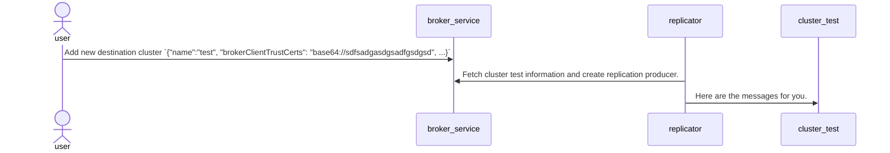

# PIP 296: Support storing brokerClient certificates in Metadata Store

# Background knowledge

The use case is under configuring the geo-replication to a remote cluster with TLS enabled and will require
setting `brokerClientTlsEnabled` as true and configuring the `brokerClientTrustCertsFilePath` when using
the [createCluster](https://pulsar.apache.org/admin-rest-api/?version=2.11.0#operation/createCluster) API. But this is
hard to maintain because users need to :

* Users need to copy and deploy the destination cluster trusted TLS certificate file to the local cluster for each
  broker.
* Users need to make sure the destination cluster trusted TLS certificate file location is consistent with each broker.
* Users need to record and maintain the certificate file path on brokers. Cleaning this location will impact the
  geo-replication.

# Motivation

So, I am proposing to support uploading the TLS certificates on the `createCluster` API, and the broker can help store
the destination cluster trusted TLS certificates in the metadata store since it's an existing data storage system. When
the local cluster needs to connect to the destination cluster, local cluster brokers can extract the trusted TLS
certificate file from the metadata store and set up the connection to the destination cluster.

# Goals

## In Scope

* Introduce a new field `brokerClientTrustCerts=<schema>://<data>` to support multiple format of data. such as
  file `file://<path>` or base64 encoded data `base64://<base64-encoded-data>`
* Deprecate the `brokerClientTrustCertsFilePath` field.

## Out of Scope

None.

# High-Level Design

To support this proposal, we can add a `brokerClientTrustCerts` field to the `ClusterDataImpl`. And this PIP will be
used like this way:

1. Users need to set the `brokerClientTlsEnabled` as `True` and `brokerClientTrustCerts=<schema>://<data>` to enable
   this feature and specify the TLS certificate trust certs file path or other data format.
2. When the replicator in the Broker tries to set up the connection to the destination cluster, the broker can extract
   the certificate in the target cluster metadata and decode it to use.
3. The stored certificate should be cleaned together if the user deletes the destination cluster by the `deleteCluster`
   API.

# Detailed Design



The whole workflow is pretty straightforward as follows:

1. User set `ClusterDataImpl` to broker by `createCluster` endpoint.
2. Replicator gets `ClusterDataImpl` from metadata and creates a replication producer.
3. Replicator replicates messages to the destination cluster.

## Pulsar ClusterDataImpl

```java

@ApiModel(
        value = "ClusterData",
        description = "The configuration data for a cluster"
)
@Data
@AllArgsConstructor
@NoArgsConstructor
@Slf4j
public final class ClusterDataImpl implements ClusterData, Cloneable {
    @ApiModelProperty(
            name = "brokerClientTrustCertsFilePath",
            value = "Path for the trusted TLS certificate file for outgoing connection to a server (broker)"
    )
    @Deprecated
    private String brokerClientTrustCertsFilePath;

    @ApiModelProperty(
            name = "brokerClientTrustCerts",
            value = "Trusted TLS certificate file for outgoing connection to a server (broker)"
                    + "The format should be <schema>://<data>  e.g: file:///your/cert/path, base64://<base64-encoded>"
    )
    private String brokerClientTrustCerts;
}
```

1. Deprecated the original field `brokerClientTrustCertsFilePath`.
2. Add a new multiple format supported configuration field `brokerClientTrustCerts`.

## Cli API

1. Deprecated the original parameter `--tls-trust-certs-filepath`
2. Adding a new parameter `--tls-trust-certs`

# Backward & Forward Compatibility

This PIP will keep compatibility.

1. If `brokerClientTrustCertsFilePath` is null and `brokerClientTrustCerts` is not null. we will
   adopt `brokerClientTrustCerts`
2. If `brokerClientTrustCertsFilePath` is not null and `brokerClientTrustCerts` is null. we will
   adopt `brokerClientTrustCertsFilePath`
3. If both of `brokerClientTrustCertsFilePath` and `brokerClientTrustCerts` not null. we will
   adopt `brokerClientTrustCerts`

# Links

* Mailing List discussion thread: https://lists.apache.org/thread/1r9hq2gxob801ttxypqvv8b2rxffzv80
* Vote
