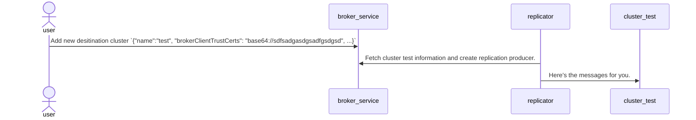

# PIP 296: Support storing brokerClient certificates in Metadata Store

# Background knowledge

The use case is under configuring the geo-replication to a remote cluster with TLS enabled and will require to set `brokerClientTlsEnabled` as true and configure the `brokerClientTrustCertsFilePath` when using the [createCluster](https://pulsar.apache.org/admin-rest-api/?version=2.11.0#operation/createCluster) API. But this is hard to maintain because users need to :

*  Users need to copy and deploy the destination cluster trusted TLS certificate file to the local cluster for each broker.
*  Users need to make sure the destination cluster trusted TLS certificate file location is consistent with each broker.
*  Users need to record and maintain the certificate file path on brokers, cleaning this location will impact the geo-replication.

# Motivation

So, I am proprosing to support uploading the TLS certificates on the `createCluster` API and the broker can help store the destination cluster trusted TLS certificates in metadata store since it's an existing data storage systems. When the local cluster needs to connect to the destination cluster, local cluster brokers can extract the trusted TLS certificate file from metadata store and setup the connection to the destination cluster.

# Goals

## In Scope

* Introduce a new field `brokerClientTrustCerts=<schema>://<data>` to support multiple format of data. such as file `file://<path>` or base64 encoded data `base64://<base64-encoded-data>`
* Deprecate the `brokerClientTrustCertsFilePath` field.
* Extend the `ClusterInfo` `create/read/update/delete` API to support setting different types of `brokerClientTrustCerts`.

## Out of Scope

None.

# High-Level Design

To support this PIP proposal, we can add a `brokerClientTrustCerts` field to the `clusterInfo`. And this PIP will be used like this way:

1. Users need to set the `brokerClientTlsEnabled` as `True` and `brokerClientTrustCerts=<schema>://<data>` to enable this feature and specify the TLS certificate trust certs file path or other data format. 
2. When the replicator in the Broker tries to set up the connection to the destination cluster, the broker can extract the certificate in the target cluster metadata and decode it to use. 
3. The stored certification should be cleaned together if the user deletes the destination cluster by the `deleteCluster` API. 

# Detailed Design

## Pulsar Cluster Info

## Broker Management API

## Admin API

## Cli API

# Backward & Forward Compatibility

This PIP will keep compatibility.

* `brokerClientTrustCerts` will be the new field instead of `brokerClientTrustCertsFilePath`.
*  Internal clients will check `brokerClientTrustCertsFilePath` if `brokerClientTrustCerts` does not exist

# Links

* Mailing List discussion thread: https://lists.apache.org/thread/1r9hq2gxob801ttxypqvv8b2rxffzv80
