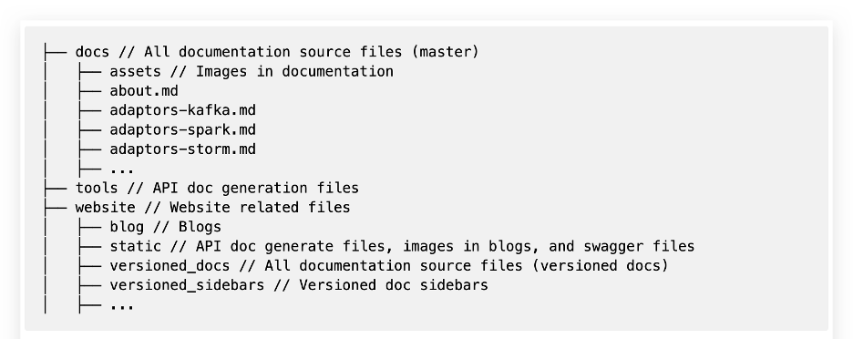
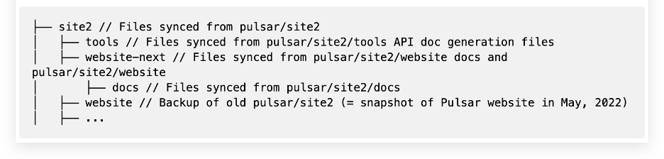
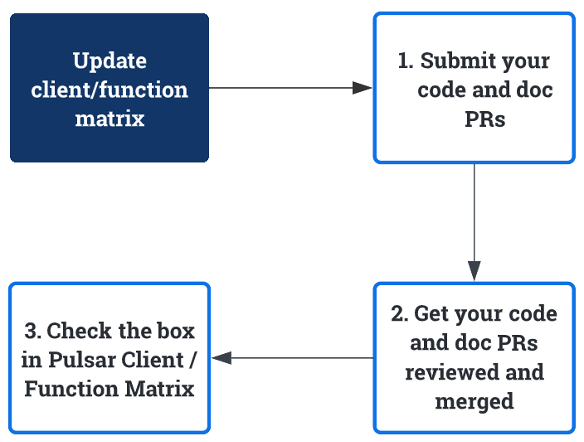

# Pulsar Documentation Contribution Guide

> 👩🏻‍🏫 **Summary**
> 
> This guide explains the organization of Pulsar documentation and website repos and the workflow of updating various Pulsar docs.


**TOC**

<!-- TOC -->

- [Pulsar Documentation Contribution Guide](#pulsar-documentation-contribution-guide)
  - [Documentation and website repos](#documentation-and-website-repos)
    - [Intro to doc and website repos](#intro-to-doc-and-website-repos)
    - [Relationships between doc and website repos](#relationships-between-doc-and-website-repos)
  - [Update versioned docs](#update-versioned-docs)
  - [Update reference docs](#update-reference-docs)
    - [Update Pulsar configuration docs](#update-pulsar-configuration-docs)
    - [Update client configuration docs](#update-client-configuration-docs)
    - [Update CLI tool docs](#update-cli-tool-docs)
  - [Update client/function matrix](#update-clientfunction-matrix)
  - [References](#references)

<!-- /TOC -->

## Documentation and website repos

This chapter shows the organization of Pulsar documentation and website repos.

### Intro to doc and website repos

The Pulsar website consists of two parts:

* **Documentation**

  Pulsar documentation repo: [pulsar/site2](https://github.com/apache/pulsar/tree/master/site2)

  
  
* **Website** 

  Pulsar website repo: [pulsar-site](https://github.com/apache/pulsar-site)

  

### Relationships between doc and website repos

Type|Repo|Description|PR example
|---|---|---|---
Documentation|[pulsar/site2](https://github.com/apache/pulsar/tree/master/site2)|All files related to Pulsar documentation (English) are stored in this repo.|[[feat][doc] add docs for shedding strategy](https://github.com/apache/pulsar/pull/13811)
Website|[pulsar-site](https://github.com/apache/pulsar-site)|- All files related to the Pulsar website are stored in the **main** branch in this repo. <br><br> - The website is built and put in in the **asf-site-next** branch in this repo.|- [[feat][workflow] add links of doc contribution guides to Pulsar contribution page](https://github.com/apache/pulsar-site/pull/114) <br><br> - [[improve][website] add download links for previous versions](https://github.com/apache/pulsar-site/pull/108)

Files in [pulsar/site2 (master branch)](https://github.com/apache/pulsar/tree/master/site2) are synced to [pulsar-site/website-next (main branch)](https://github.com/apache/pulsar-site/tree/main/site2/website-next) every 6 hours. You can check the sync status and progress at [pulsar-site Actions](https://github.com/apache/pulsar-site/actions/workflows/ci-pulsar-website-docs-sync.yaml).

> **Summary**
>
> * pulsar/site2/**website** = pulsar-site site2/**website-next** 
> 
> * pulsar/site2/**docs** = pulsar-site/site2/**website-next/docs**

## Update versioned docs

If you want to update versioned docs, go to [pulsar/site2/website/versioned_docs/](https://github.com/apache/pulsar/tree/master/site2/website/versioned_docs) to find your desired one.

>❗️**BREAKING CHANGE**
>
> If you want to update docs for 2.8.x and later versions, follow the steps below.

1. Update the correct doc set. 
   
   For example, [version-2.8.x](https://github.com/apache/pulsar/tree/master/site2/website/versioned_docs/version-2.8.x), [version-2.9.x](https://github.com/apache/pulsar/tree/master/site2/website/versioned_docs/version-2.9.x), or [version-2.10.x](https://github.com/apache/pulsar/tree/master/site2/website/versioned_docs/version-2.10.x).
   
   For why and how we make this change, see [PIP-190: Simplify documentation release and maintenance strategy](https://github.com/apache/pulsar/issues/16637).

2. Add specific instructions.

    For example, if you want to add docs for an improvement introduced in 2.8.2, you can add the following instructions.

    ```
    :::note

    This <feature / configuration / xx> is available for 2.8.2 and later versions.

    :::
    ```

## Update reference docs

If you want to update [Pulsar configuration docs](https://pulsar.apache.org/reference/#/latest/), pay attention to the doc source files.

- Some docs are generated from code **automatically**. If you want to update the docs, you need to update the source code files.

- Some configuration docs are updated **manually** using .md files.

### Update Pulsar configuration docs

<table>
  <tr>
   <td><strong>Components</strong>
   </td>
   <td><strong>Update where…</strong>
   </td>
   <td><strong>Notes</strong>
   </td>
  </tr>
  <tr>
   <td>Broker
   </td>
   <td>org.apache.pulsar.broker.ServiceConfiguration
   </td>
   <td rowspan="5" >These components are <strong>internal</strong>. 
<p>
These configuration docs are generated from code <strong>automatically</strong>.
   </td>
  </tr>
  <tr>
   <td>Client
   </td>
   <td>org.apache.pulsar.client.impl.conf.ClientConfigurationData
   </td>
  </tr>
  <tr>
   <td>WebSocket
   </td>
   <td>org.apache.pulsar.websocket.service.WebSocketProxyConfiguration
   </td>
  </tr>
  <tr>
   <td>Proxy
   </td>
   <td>org.apache.pulsar.proxy.server.ProxyConfiguration
   </td>
  </tr>
  <tr>
   <td>Standalone
   </td>
   <td>org.apache.pulsar.broker.ServiceConfiguration
   </td>
  </tr>
  <tr>
   <td>BookKeeper
   </td>
   <td><a href="https://github.com/apache/pulsar/blob/master/site2/docs/reference-configuration-bookkeeper.md">reference-configuration-bookkeeper.md</a>
   </td>
   <td rowspan="4" >These components are <strong>external</strong>. 
<p>
These configuration docs are updated <strong>manually</strong>.
   </td>
  </tr>
  <tr>
   <td>Log4j
   </td>
   <td><a href="https://github.com/apache/pulsar/blob/master/site2/docs/reference-configuration-log4j.md">reference-configuration-log4j.md</a>
   </td>
  </tr>
  <tr>
   <td>Log4j shell
   </td>
   <td><a href="https://github.com/apache/pulsar/blob/master/site2/docs/reference-configuration-log4j-shell.md">reference-configuration-log4j-shell.md</a>
   </td>
  </tr>
  <tr>
   <td>ZooKeeper
   </td>
   <td><a href="https://github.com/apache/pulsar/blob/master/site2/docs/reference-configuration-zookeeper.md">reference-configuration-zookeeper.md</a>
   </td>
  </tr>
</table>

### Update client configuration docs

Pulsar Java configuration docs are generated from code automatically.

Components|Update where…
|---|---
Client|org.apache.pulsar.client.impl.conf.ClientConfigurationData
Producer|org.apache.pulsar.client.impl.conf.ProducerConfigurationData 
Consumer|org.apache.pulsar.client.impl.conf.ConsumerConfigurationData
Reader|org.apache.pulsar.client.impl.conf.ReaderConfigurationData 

### Update CLI tool docs

Components|Update where…
|---|---
pulsar-admin| [pulsar/pulsar-client-tools/src/main/java/org/apache/pulsar/admin/cli/](https://github.com/apache/pulsar/tree/master/pulsar-client-tools/src/main/java/org/apache/pulsar/admin/cli)
pulsar| Different commands are updated in different code files.<br>Details see [pulsar/bin/pulsar](https://github.com/apache/pulsar/blob/master/bin/pulsar).
pulsar-client|[pulsar/pulsar-client-tools/src/main/java/org/apache/pulsar/client/cli/](https://github.com/apache/pulsar/tree/master/pulsar-client-tools/src/main/java/org/apache/pulsar/client/cli)
pulsar-perf|- `websocket-producer`: [pulsar/pulsar-testclient/src/main/java/org/apache/pulsar/proxy/socket/client/](https://github.com/apache/pulsar/tree/master/pulsar-testclient/src/main/java/org/apache/pulsar/proxy/socket/client)<br><br> - Other commands: [pulsar/pulsar-testclient/src/main/java/org/apache/pulsar/testclient/](https://github.com/apache/pulsar/tree/master/pulsar-testclient/src/main/java/org/apache/pulsar/testclient)
pulsar-shell| reference-cli-pulsar-shell.md 
pulsar-daemon|reference-cli-pulsar-daemon.md <br><br> (It's almost not updated and only contains 3 commands, so it's managed in `md` file rather than being generated automatically)
bookkeeper|reference-cli-bookkeeper.md

## Update client/function matrix

[Pulsar Feature Matrix](https://docs.google.com/spreadsheets/d/1YHYTkIXR8-Ql103u-IMI18TXLlGStK8uJjDsOOA0T20/edit#gid=1784579914) outlines every feature supported by the Pulsar client and function. 

> ❗️ **Note** 
>
> - It’s public and everyone has access to edit it. Feel free to reach out to `liuyu@apache.org` if you have problems in editing.
>
> - This matrix will be moved to the Pulsar website (instead of the spreadsheet) in the future. 

If you want to update the Pulsar Feature Matrix, follow the steps below.

1. Submit your code and doc PRs.

2. Get your PR reviewed and merged. 

3. In the [Pulsar Feature Matrix](https://docs.google.com/spreadsheets/d/1YHYTkIXR8-Ql103u-IMI18TXLlGStK8uJjDsOOA0T20/edit#gid=1784579914), check the box in the corresponding cell with the links of PRs and doc site.

  

## References

For more guides on how to make contributions to Pulsar docs, see [Pulsar Documentation Contribution Overview](./../README.md).