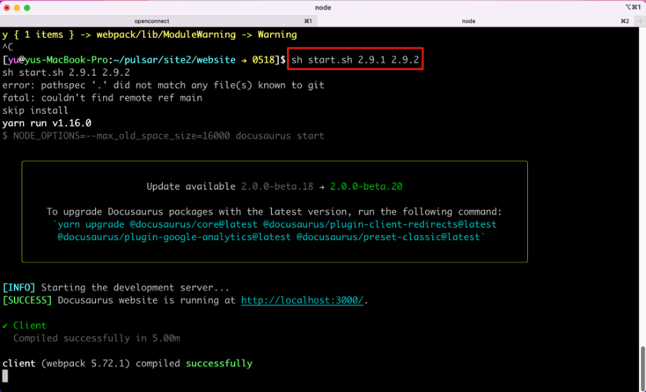
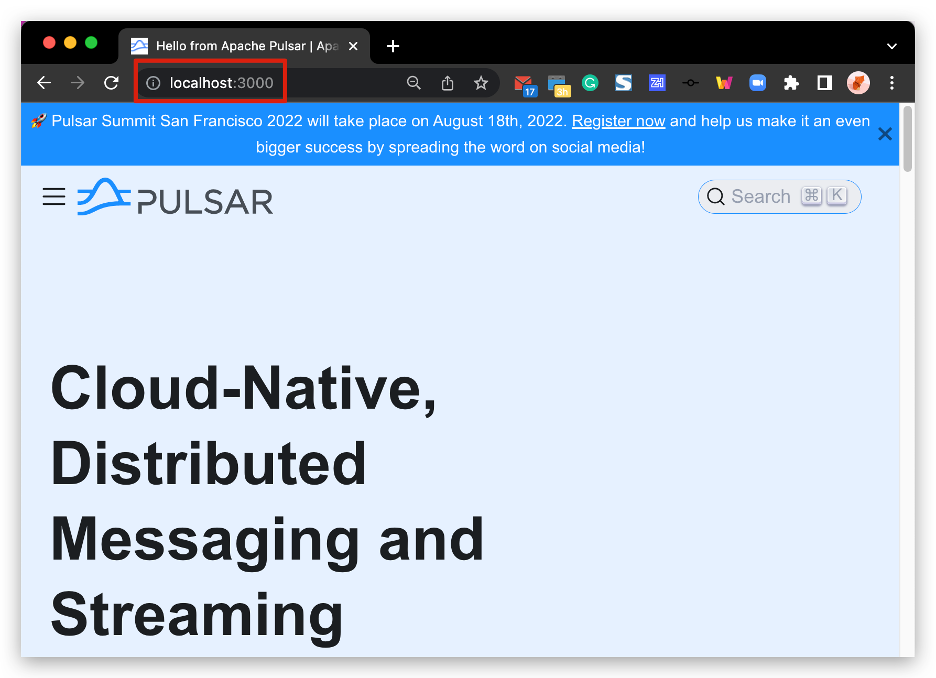

# Pulsar Content Preview Guide

> 👩🏻‍🏫 **Summary**
> 
> This guide explains why and how to preview Pulsar content locally with detailed steps and various examples. 

**TOC**

<!-- TOC -->

- [Pulsar Content Preview Guide](#pulsar-content-preview-guide)
  - [Why preview changes locally?](#why-preview-changes-locally)
  - [How to preview changes locally?](#how-to-preview-changes-locally)
    - [Prerequisites](#prerequisites)
    - [Preview doc (markdown) changes](#preview-doc-markdown-changes)
    - [Preview doc (Java API) changes](#preview-doc-java-api-changes)
    - [Preview website changes](#preview-website-changes)
    - [Stop preview](#stop-preview)
    - [Maintenance info](#maintenance-info)
  - [References](#references)

<!-- /TOC -->

## Why preview changes locally?

It is **required** to preview your changes locally and attach the preview screenshots in your PR description. It brings many benefits, including but not limited to:

* You can test your writings 

    It’s a way to check whether you use the correct [Pulsar Documentation Writing Syntax](./syntax.md) and debug issues. You **must ensure** docs can be compiled and published correctly.

* You can get your PR merged more quickly.

    Reviewers know your changes clearly and can speed up the review process.

## How to preview changes locally?

Pulsar documentation is built using Docusaurus. To preview your changes as you edit the files, you can run a local development server that serves your website and reflect the latest changes.

### Prerequisites

To verify docs are built correctly before submitting a contribution, you should set up your local environment to build and display the docs locally.

* Node >= 16.14
  
* Yarn >= 1.5
  
* Although you can use Linux, macOS, or Windows to build locally the Pulsar documentation, macOS is the preferred build environment as it offers the most complete support for documentation building.

### Preview doc (markdown) changes

Follow these steps to build the doc (markdown) preview on your local machine.

1. Go to the correct repo.


    ```
    cd pulsar/site2/website
    ```

2. Run the following command to preview changes.

* Preview **master** changes

	If you update master docs, use the following command.

    ```
    sh start.sh
    ```

* Preview **historical** changes

    If you update versioned docs, use the following command. 
    
    It may take a few more minutes to complete the process.

    ```
    sh start.sh <version-number> <version-number>
    ```

    

3. By default, a browser window will open at [http://localhost:3000](http://localhost:3000) to show the changes.

    

### Preview doc (Java API) changes

Follow these steps to build the doc (Java API) preview on your local machine on the **master** branch.

1. Go to the correct repo.

    ```
    cd pulsar/site2/tools
    ```

2. Run the following command to generate the `.html` files.

    ```
    sh javadoc-gen.sh
    ```

3. Open the target `.html` file to preview the updates.

    For example, if you change the [ConsumerBuilder.java](http://pulsar-client-api/src/main/java/org/apache/pulsar/client/api/ConsumerBuilder.java) for [Pulsar Java docs](https://pulsar.apache.org/api/client/2.11.0/org/apache/pulsar/client/api/ConsumerBuilder.html), you can navigate to the `generated-site/api/client/{version}/org/apache/pulsar/client/api/` directory and open the `ConsumerBuilder.html` file to preview the updates.

### Preview website changes

Pulsar website changes refer to all the changes made to the Pulsar website, including but not limited to the following pages:

* [Release Notes page](https://pulsar.apache.org/release-notes/) ✅
* [Ecosystem page](https://pulsar.apache.org/ecosystem) ✅
* [Case studies page](https://pulsar.apache.org/case-studies) ✅
* …
* (except docs ❌)

Follow these steps to build the website preview on your local machine.

1. Go to the correct repo.

    ```
    cd pulsar-site/site2/website-next
    ```

2️. Run the following command to preview changes.

   * Preview **master** changes

      If you submit changes to master, use the following command.


        ```
        ./preview.sh 
        ```

   * Preview **historical** changes

      ```
      ./preview.sh <version-number> <version-number> …
      ```

      > ❗️ **Note**
      >
      > * Use a space between `<version-number> <version-number>`.
      > 
      > * If you want to preview multiple version changes, append `<version-number>` with blanks. 
      > 
      > For example, `./preview.sh 2.9.1 2.9.2 2.9.3`.

### Stop preview

If you want to stop the preview, use one of the following methods.

* Method 1: Switch to your command-line interface and press **Control+C**.
  
* Method 2: Switch to your browser and close the preview page.

### Maintenance info

* For the old Pulsar website, using ` yarn start` can preview all (master + historical) changes. However, to speed up the build process, for the new Pulsar website, using `./preview.sh `only preview master changes.

## References

For more guides on how to make contributions to Pulsar docs, see [Pulsar Documentation Contribution Overview](./../README.md).