# Pulsar Documentation Writing Syntax Guide

> 👩🏻‍🏫 **Summary**
> 
> This guide explains how to write Pulsar documentation using the MDX-compatible markdown syntax.

**TOC**

<!-- TOC -->

- [Pulsar Documentation Writing Syntax Guide](#pulsar-documentation-writing-syntax-guide)
  - [Background](#background)
    - [Why use new markdown syntax?](#why-use-new-markdown-syntax)
    - [How to test doc changes?](#how-to-test-doc-changes)
  - [Syntax](#syntax)
    - [Markdown](#markdown)
    - [Tab](#tab)
    - [Code blocks](#code-blocks)
    - [Admonitions](#admonitions)
    - [Assets](#assets)
    - [Indentation & space](#indentation--space)
    - [Metadata](#metadata)
    - [Tables](#tables)
    - [Links](#links)
      - [Anchor links](#anchor-links)
      - [Links to internal documentation](#links-to-internal-documentation)
      - [Links to external documentation](#links-to-external-documentation)
      - [Link to a specific line of code](#link-to-a-specific-line-of-code)
    - [Authoritative sources](#authoritative-sources)
    - [Escape](#escape)
    - [Headings](#headings)
  - [References](#references)

<!-- /TOC -->

## Background

The Pulsar documentation uses [Markdown](https://www.markdownguide.org/basic-syntax/) as its markup language and [Docusaurus](https://docusaurus.io/) for generating the documentation and website.

> 🔴 **BREAKING CHANGE**
>
> From 2022/5/18, you need to use **Markdown syntax that is compatible with MDX**. Otherwise, your changes can not be recognized by MDX and rendered properly. In this case, your PR can not be merged. 

### Why use new markdown syntax?

The new Pulsar website is launched on 2022/5/11. It is upgraded to Docusaurus V2, which uses MDX as the parsing engine. MDX can do much more than just parsing standard Markdown syntax, like rendering React components inside your documents as well. However, **some previous documentation using Markdown syntax is incompatible with MDX**。 Consequently, you need to change the way you write. 

### How to test doc changes?

- You can play with the MDX format in **[MDX Playground](https://mdxjs.com/playground/)** . Write some MDX to find out what it turns into. You can see the rendered result, the generated code, and the intermediary ASTs. This can be helpful for debugging or exploring. 

- For how to test doc changes locally, see [Pulsar Content Preview Guide](./preview.md).

## Syntax

> ❗️**Note**
> 
> This guide just highlights **some** important rules and frequently used syntax that is **different from the Markdown syntax used in the previous docs**. For the complete syntax guide, see [Docusaurus - Markdown Features](https://docusaurus.io/docs/next/markdown-features) and [MDX - Markdown](https://mdxjs.com/docs/what-is-mdx/#markdown).

### Markdown 

* **Use Markdown rather than HTML** as much as possible, or else MDX may not recognize it.

    For example, when constructing complex tables, do not use HTML (`<table>`). 

* Use **closing** tags.

   `<li></li>` and `<br></br>` are especially useful for constructing complex tables, such as _creating a list_ and _adding a blank line_.

    🙌 **Examples**
  
    ```
    <li>xxx ❌
    <br>xxx ❌
    <li>xxx</li> ✅
    ```
    
    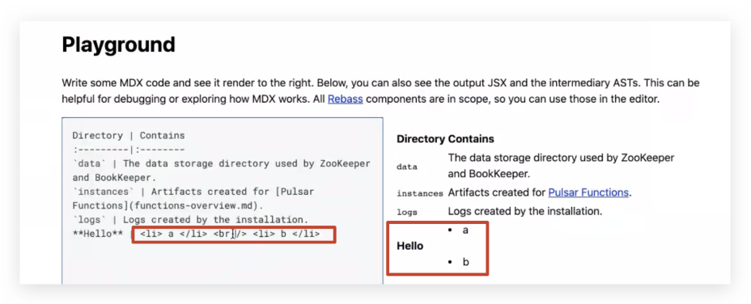
    
    ```
    <br />xxx → wrap text in "next" line ✅
    <br /><br />xxx → wrap text in "next next" line ✅ 
    ```

    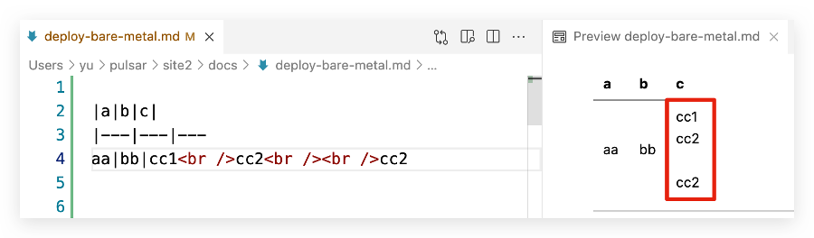

* If you need to use HTML, use **React** syntax for HTML tags.

    🙌 **Examples**

    ```
    <span style="color: #bb3b3e;"></span> ❌

    <span style={{color: "#bb3b3e"}}>deleted</span> ✅
    ```

### Tab

The image below shows the differences in writing multiple tabs before and after. For how to write multiple tabs, see [Tabs](https://docusaurus.io/docs/next/markdown-features/tabs).

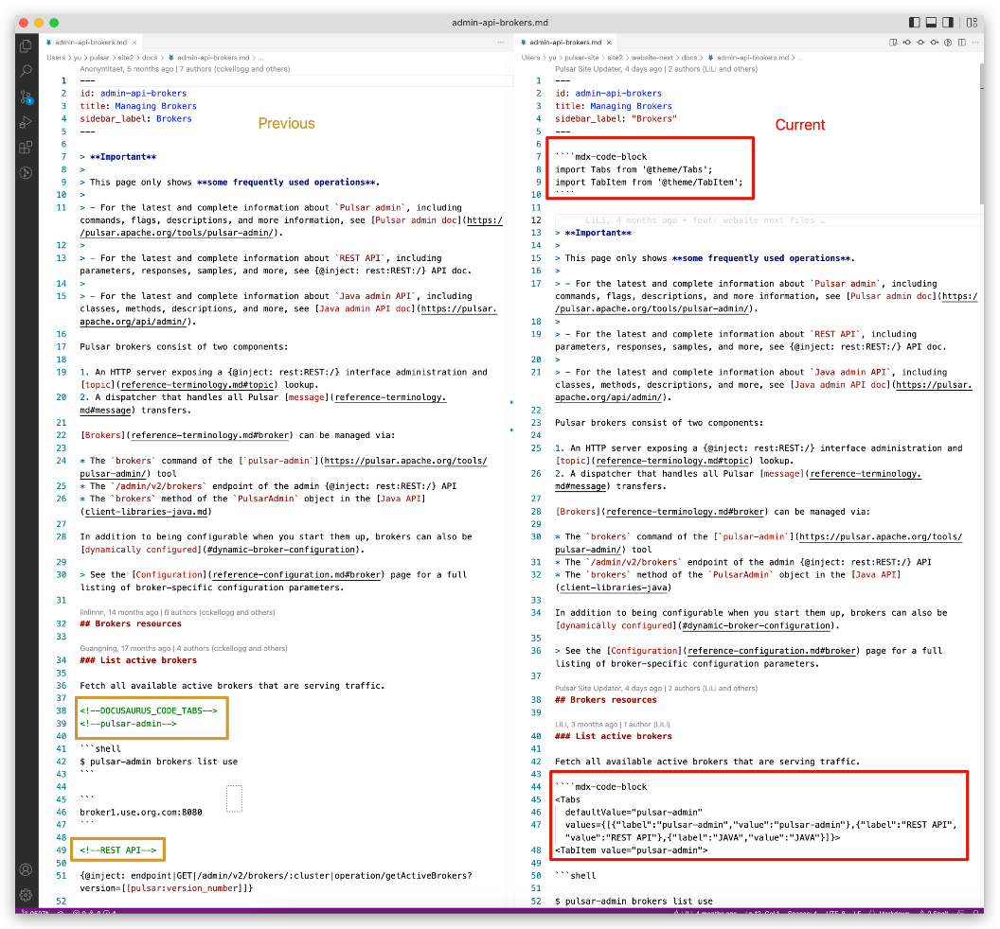

### Code blocks

For how to use syntax highlighting and supported languages, see [Syntax highlighting](https://docusaurus.io/docs/next/markdown-features/code-blocks#syntax-highlighting).

### Admonitions

The image below shows the differences to write admonitions before and after. 

For how to write admonitions, see [Admonitions](https://docusaurus.io/docs/next/markdown-features/admonitions).

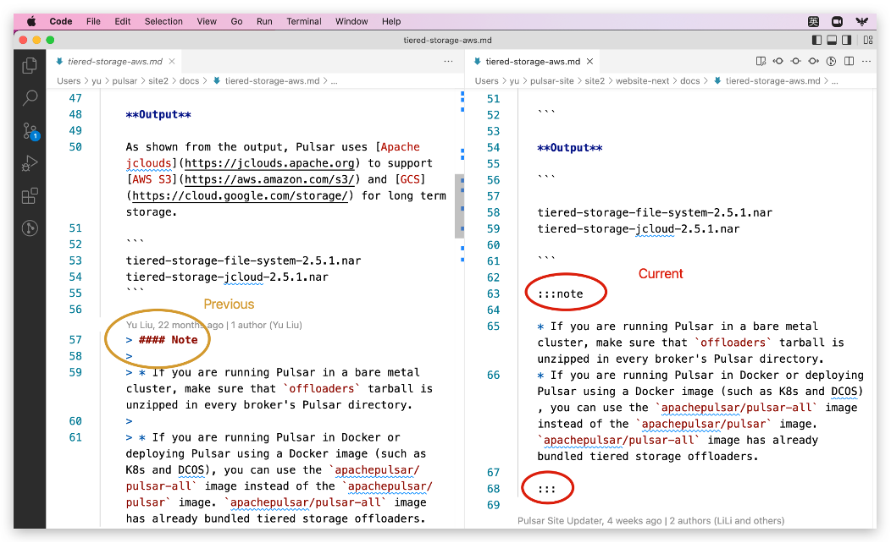

### Assets

Add dash `/` before the asset path.

🙌 **Examples**

```

```

### Indentation & space

* Use the same indentation for running texts and code blocks. 

  🙌 **Examples**

  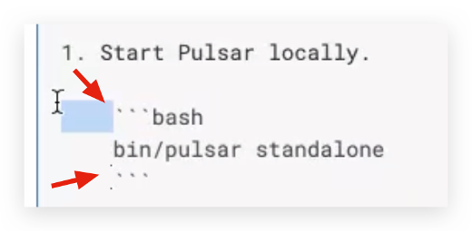


* For the content block after an **ordered list**, indent the content block by only 3 spaces (not 4 spaces).
  
* For the content block after an **unordered list**, indent the content block by only 2 spaces. 

  🙌 **Examples**

  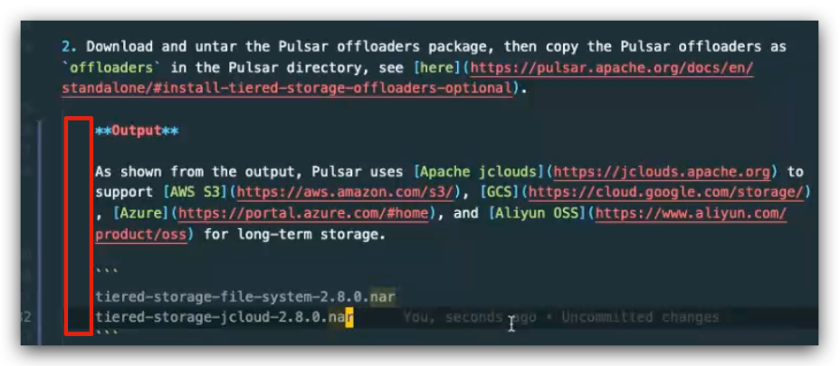

  > 💡 **Tip**
  >
  > You can set the **Tab Size** in VS Code settings.
  > 
  > 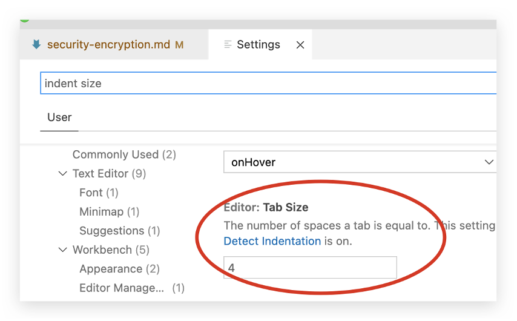

* Insert **only an** empty line (not two empty lines or more) between code blocks and running texts. 

  🙌 **Examples**

  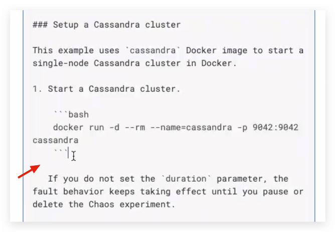

  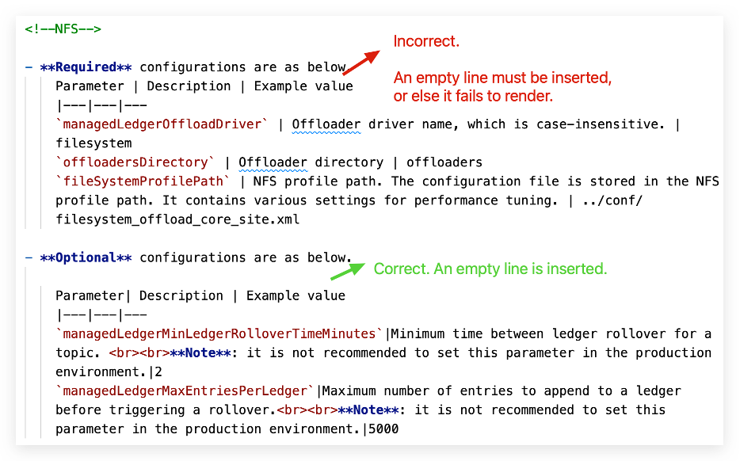

  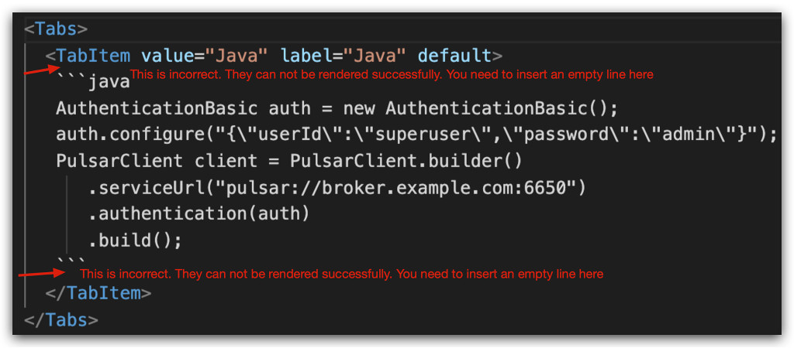

### Metadata

If you create a new `.md` file, add quotes for the value of sidebar_label.

🙌 **Examples**

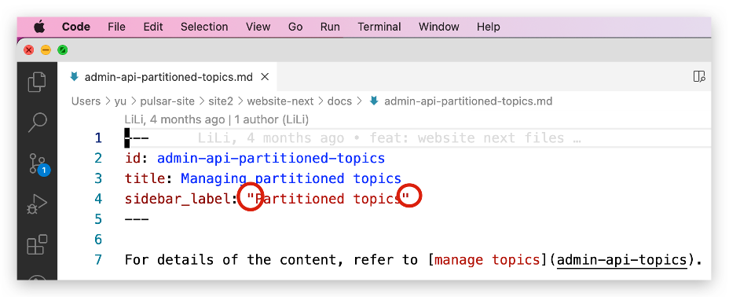

### Tables

To help tables be easier to maintain, consider adding additional spaces to the column widths to make them consistent.

🙌 **Examples**

```
| App name | Description          | Requirements   |
|:---------|:---------------------|:---------------|
| App 1    | Description text 1.  | Requirements 1 |
| App 2    | Description text 2.  | None           |
```

To format tables easily, you can install a plugin or extension in your editor as below:

* Visual Studio Code: [Markdown Table Prettifier](https://marketplace.visualstudio.com/items?itemName=darkriszty.markdown-table-prettify)
  
* Sublime Text: [Markdown Table Formatter](https://packagecontrol.io/packages/Markdown%20Table%20Formatter)  
  
*  Atom: [Markdown Table Formatter](https://atom.io/packages/markdown-table-formatter) 

### Links

Use links instead of summarizing to help preserve a single source of truth in Pulsar documentation.

#### Anchor links

Headings generate anchor links when rendered. 

🙌 **Examples**

`## This is an example` generates the anchor `#this-is-an-example`.

> ❗️ **Note**
>
> * Avoid crosslinking docs to headings unless you need to link to a specific section of the document. This avoids breaking anchors in the future in case the heading is changed.
>
> * If possible, avoid changing headings, because they’re not only linked internally. There are various links to Pulsar documentation on the internet, such as tutorials, presentations, StackOverflow posts, and other sources.

#### Links to internal documentation

Internal refers to documentation in the same Pulsar project. 

General rules:

* Use relative links rather than absolute URLs.
  
* Don’t prepend ./ or ../../ to links to files or directories.

🙌 **Examples**

Scenario| ✅| ❌
|---|---|---
Crosslink to other markdown file <br><br> (/path/xx/ is not needed)|`[Function overview](function-overview.md)`|- `[Function overview](functions-overview)` <br><br> - `[Function overview](https://pulsar.apache.org/docs/next/functions-overview/)` <br><br> - `[Function overview](../../function-overview.md)`
Crosslink to other chapters in the same markdown file <br><br> (# and - are needed)|`[Install builtin connectors (optional)](#install-builtin-connectors-optional)`|N/A

#### Links to external documentation

When describing interactions with external software, it’s often helpful to include links to external documentation. When possible, make sure that you’re linking to an [authoritative source](#authoritative-sources). 

For example, if you’re describing a feature in Microsoft’s Active Directory, include a link to official Microsoft documentation.

#### Link to a specific line of code

Use a **permalink **when linking to a specific line in a file to ensure users land on the line you’re referring to though lines of code change over time. 

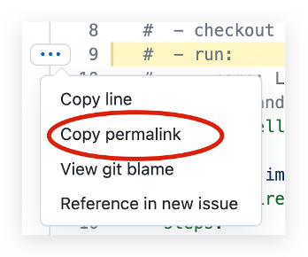

### Authoritative sources

When citing external information, use sources that are written by the people who created the item or product in question. These sources are the most likely to be accurate and remain up to date.

🙌 **Examples**

- Authoritative sources include the following ✅ 

  * Official documentation for a product. 

      For example, if you’re setting up an interface with the Google OAuth 2 authorization server, include a link to Google’s documentation.

  * Official documentation for a project. 

      For example, if you’re citing NodeJS functionality, refer directly to [NodeJS documentation](https://nodejs.org/en/docs/).

  * Books from an authoritative publisher.

- Authoritative sources do not include the following ❌ 

  * Personal blog posts.
    
  * Documentation from a company that describes another company’s product.
    
  * Non-trustworthy articles.
    
  * Discussions on forums such as Stack Overflow.

While many of these sources to avoid can help you learn skills and or features, they can become obsolete quickly. Nobody is obliged to maintain any of these sites. Therefore, we should avoid using them as reference literature.

Non-authoritative sources are acceptable only if there is no equivalent authoritative source. Even then, focus on non-authoritative sources that are extensively cited or peer-reviewed.

### Escape

Use the following characters to escape special characters.

🙌 **Examples**

✅ | ❌
|---|---
`List<String>` <br><br>This error shows up 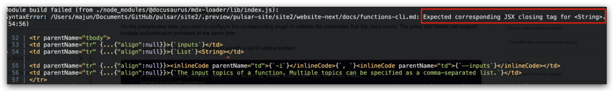|List`<String>`<br><br>Here is an [example PR](https://github.com/apache/pulsar/pull/15389/files#diff-472b2cb6fc28a0845d2f1d397dc4e6e7fa083dfe4f91d6f9dca88ad01d06a971).


### Headings

* Each documentation page begins with a **level 2** heading (##). This becomes the h1 element when the page is rendered to HTML. 
  
* Do not skip a level. For example: ## > ####.
  
* Leave one blank line before and after the heading.
  
* Do not use links as part of heading text.
  
* When you change the heading text, the anchor link changes. To avoid broken links:
  
    * Do not use step numbers in headings.
  
    * When possible, do not use words that might change in the future.

## References

For more guides on how to make contributions to Pulsar docs, see [Pulsar Documentation Contribution Overview](./../README.md).