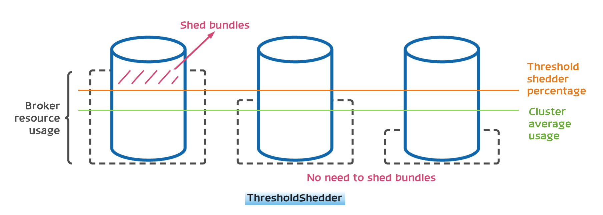
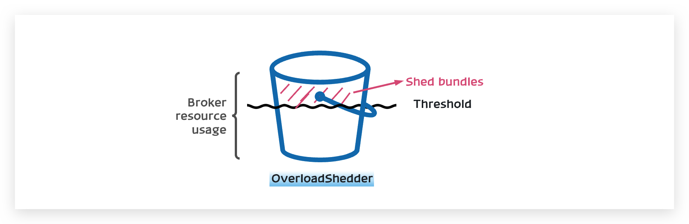
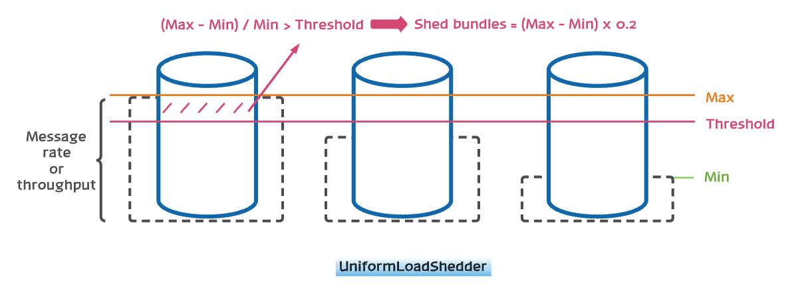

## Load balance across Pulsar brokers

Pulsar is an horizontally scalable messaging system, so the traffic in a logical cluster must be balanced across all the available Pulsar brokers as evenly as possible, which is a core requirement.

You can use multiple settings and tools to control the traffic distribution which require a bit of context to understand how the traffic is managed in Pulsar. Though, in most cases, the core requirement mentioned above is true out of the box and you should not worry about it. 

## Pulsar load manager architecture

The following part introduces the basic architecture of the Pulsar load manager.

### Assign topics to brokers dynamically

Topics are dynamically assigned to brokers based on the load conditions of all brokers in the cluster.

When a client starts using new topics that are not assigned to any broker, a process is triggered to choose the best suited broker to acquire ownership of these topics according to the load conditions. 

In case of partitioned topics, different partitions are assigned to different brokers. Here "topic" means either a non-partitioned topic or one partition of a topic.

The assignment is "dynamic" because the assignment changes quickly. For example, if the broker owning the topic crashes, the topic is reassigned immediately to another broker. Another scenario is that the broker owning the topic becomes overloaded. In this case, the topic is reassigned to a less loaded broker.

The stateless nature of brokers makes the dynamic assignment possible, so you can quickly expand or shrink the cluster based on usage.

#### Assignment granularity

The assignment of topics or partitions to brokers is not done at the topics or partitions level, but done at the Bundle level (a higher level). The reason is to amortize the amount of information that you need to keep track. Based on CPU, memory, traffic load and other indexes, topics are assigned to a particular broker dynamically. 

Instead of individual topic or partition assignment, each broker takes ownership of a subset of the topics for a namespace. This subset is called a "*bundle*" and effectively this subset is a sharding mechanism.

The namespace is the "administrative" unit: many config knobs or operations are done at the namespace level.

For assignment, a namespaces is sharded into a list of "bundles", with each bundle comprising a portion of overall hash range of the namespace.

Topics are assigned to a particular bundle by taking the hash of the topic name and checking in which bundle the hash falls into.

Each bundle is independent of the others and thus is independently assigned to different brokers.

### Create namespaces and bundles

When you create a new namespace, the new namespace sets to use the default number of bundles. You can set this in `conf/broker.conf`:

```properties
# When a namespace is created without specifying the number of bundle, this
# value will be used as the default
defaultNumberOfNamespaceBundles=4
```

You can either change the system default, or override it when you create a new namespace:

```shell
$ bin/pulsar-admin namespaces create my-tenant/my-namespace --clusters us-west --bundles 16
```

With this command, you create a namespace with 16 initial bundles. Therefore the topics for this namespaces can immediately be spread across up to 16 brokers.

In general, if you know the expected traffic and number of topics in advance, you had better start with a reasonable number of bundles instead of waiting for the system to auto-correct the distribution.

On the same note, it is beneficial to start with more bundles than the number of brokers, because of the hashing nature of the distribution of topics into bundles. For example, for a namespace with 1000 topics, using something like 64 bundles achieves a good distribution of traffic across 16 brokers.

### Unload topics and bundles

You can "unload" a topic in Pulsar with admin operation. Unloading means to close the topics, release ownership and reassign the topics to a new broker, based on current load.

When unloading happens, the client experiences a small latency blip, typically in the order of tens of milliseconds, while the topic is reassigned.

Unloading is the mechanism that the load-manager uses to perform the load shedding, but you can also trigger the unloading manually, for example to correct the assignments and redistribute traffic even before having any broker overloaded.

Unloading a topic has no effect on the assignment, but just closes and reopens the particular topic:

```shell
pulsar-admin topics unload persistent://tenant/namespace/topic
```

To unload all topics for a namespace and trigger reassignments:

```shell
pulsar-admin namespaces unload tenant/namespace
```

### Split namespace bundles 

Since the load for the topics in a bundle might change over time and predicting the load might be hard, bundle split is designed to deal with these issues. The broker splits a bundle into two and the new smaller bundles can be reassigned to different brokers.

The splitting is based on some tunable thresholds. Any existing bundle that exceeds any of the threshold is a candidate to be split. By default the newly split bundles are also immediately offloaded to other brokers, to facilitate the traffic distribution. 

You can split namespace bundles in two ways, by setting `supportedNamespaceBundleSplitAlgorithms` to `range_equally_divide` or `topic_count_equally_divide` in `broker.conf` file. The former splits the bundle into two parts with the same hash range size; the latter splits the bundle into two parts with the same number of topics. You can also configure other parameters for namespace bundles.

```properties
# enable/disable namespace bundle auto split
loadBalancerAutoBundleSplitEnabled=true

# enable/disable automatic unloading of split bundles
loadBalancerAutoUnloadSplitBundlesEnabled=true

# maximum topics in a bundle, otherwise bundle split will be triggered
loadBalancerNamespaceBundleMaxTopics=1000

# maximum sessions (producers + consumers) in a bundle, otherwise bundle split will be triggered
loadBalancerNamespaceBundleMaxSessions=1000

# maximum msgRate (in + out) in a bundle, otherwise bundle split will be triggered
loadBalancerNamespaceBundleMaxMsgRate=30000

# maximum bandwidth (in + out) in a bundle, otherwise bundle split will be triggered
loadBalancerNamespaceBundleMaxBandwidthMbytes=100

# maximum number of bundles in a namespace (for auto-split)
loadBalancerNamespaceMaximumBundles=128
```

### Shed load automatically

The support for automatic load shedding is available in the load manager of Pulsar. This means that whenever the system recognizes a particular broker is overloaded, the system forces some traffic to be reassigned to less loaded brokers.

When a broker is identified as overloaded, the broker forces to "unload" a subset of the bundles, the ones with higher traffic, that make up for the overload percentage.

For example, the default threshold is 85% and if a broker is over quota at 95% CPU usage, then the broker unloads the percent difference plus a 5% margin: `(95% - 85%) + 5% = 15%`.

Given the selection of bundles to offload is based on traffic (as a proxy measure for cpu, network and memory), broker unloads bundles for at least 15% of traffic.

The automatic load shedding is enabled by default and you can disable the automatic load shedding with this setting:

```properties
# Enable/disable automatic bundle unloading for load-shedding
loadBalancerSheddingEnabled=true
```

Additional settings that apply to shedding:

```properties
# Load shedding interval. Broker periodically checks whether some traffic should be offload from
# some over-loaded broker to other under-loaded brokers
loadBalancerSheddingIntervalMinutes=1

# Prevent the same topics to be shed and moved to other brokers more that once within this timeframe
loadBalancerSheddingGracePeriodMinutes=30
```

Pulsar supports the following types of shedding strategies. From Pulsar 2.10, the **default** shedding strategy is `ThresholdShedder`.

##### ThresholdShedder
This strategy tends to shed the bundles if any broker's usage is above the configured threshold. It does this by first computing the average resource usage per broker for the whole cluster. The resource usage for each broker is calculated using the following method: LocalBrokerData#getMaxResourceUsageWithWeight. The weights for each resource are configurable. Historical observations are included in the running average based on the broker's setting for loadBalancerHistoryResourcePercentage. Once the average resource usage is calculated, a broker's current/historical usage is compared to the average broker usage. If a broker's usage is greater than the average usage per broker plus the loadBalancerBrokerThresholdShedderPercentage, this load shedder proposes removing enough bundles to bring the unloaded broker 5% below the current average broker usage. Note that recently unloaded bundles are not unloaded again. Configure broker with below value to use this strategy.
`loadBalancerLoadSheddingStrategy=org.apache.pulsar.broker.loadbalance.impl.ThresholdShedder`



##### OverloadShedder
This strategy will attempt to shed exactly one bundle on brokers which are overloaded, that is, whose maximum system resource usage exceeds loadBalancerBrokerOverloadedThresholdPercentage. To see which resources are considered when determining the maximum system resource. A bundle is recommended for unloading off that broker if and only if the following conditions hold: The broker has at least two bundles assigned and the broker has at least one bundle that has not been unloaded recently according to LoadBalancerSheddingGracePeriodMinutes. The unloaded bundle will be the most expensive bundle in terms of message rate that has not been recently unloaded. Note that this strategy does not take into account "underloaded" brokers when determining which bundles to unload. If you are looking for a strategy that spreads load evenly across all brokers, see ThresholdShedder. Configure broker with below value to use this strategy.
`loadBalancerLoadSheddingStrategy=org.apache.pulsar.broker.loadbalance.impl.OverloadShedder`



##### UniformLoadShedder
This strategy tends to distribute load uniformly across all brokers. This strategy checks laod difference between broker with highest load and broker with lowest load. If the difference is higher than configured thresholds `loadBalancerMsgRateDifferenceShedderThreshold` and `loadBalancerMsgThroughputMultiplierDifferenceShedderThreshold` then it finds out bundles which can be unloaded to distribute traffic evenly across all brokers. Configure broker with below value to use this strategy.
`loadBalancerLoadSheddingStrategy=org.apache.pulsar.broker.loadbalance.impl.UniformLoadShedder`



#### Broker overload thresholds

The determinations of when a broker is overloaded is based on threshold of CPU, network and memory usage. Whenever either of those metrics reaches the threshold, the system triggers the shedding (if enabled).

By default, overload threshold is set at 85%:

```properties
# Usage threshold to determine a broker as over-loaded
loadBalancerBrokerOverloadedThresholdPercentage=85
```

Pulsar gathers the usage stats from the system metrics.

In case of network utilization, in some cases the network interface speed that Linux reports is not correct and needs to be manually overridden. This is the case in AWS EC2 instances with 1Gbps NIC speed for which the OS reports 10Gbps speed.

Because of the incorrect max speed, the Pulsar load manager might think the broker has not reached the NIC capacity, while in fact the broker already uses all the bandwidth and the traffic is slowed down.

You can use the following setting to correct the max NIC speed:

```properties
# Override the auto-detection of the network interfaces max speed.
# This option is useful in some environments (eg: EC2 VMs) where the max speed
# reported by Linux is not reflecting the real bandwidth available to the broker.
# Since the network usage is employed by the load manager to decide when a broker
# is overloaded, it is important to make sure the info is correct or override it
# with the right value here. The configured value can be a double (eg: 0.8) and that
# can be used to trigger load-shedding even before hitting on NIC limits.
loadBalancerOverrideBrokerNicSpeedGbps=
```

When the value is empty, Pulsar uses the value that the OS reports.

