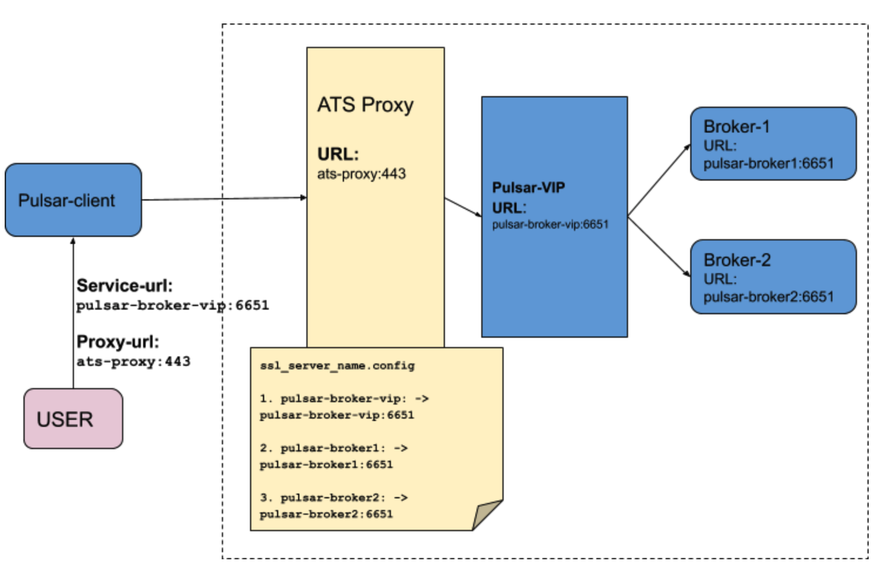
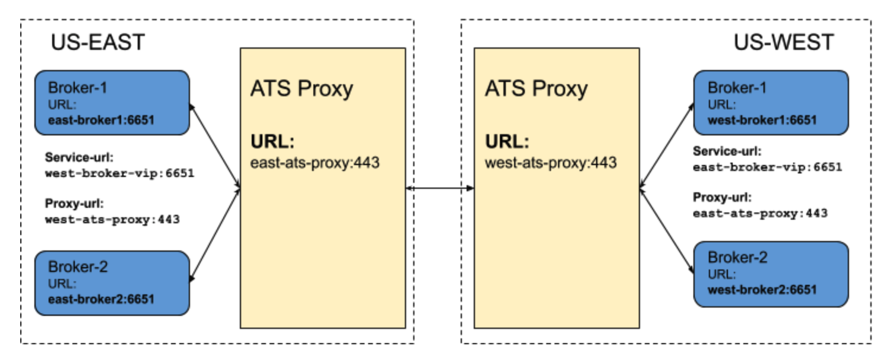

## Pulsar Proxy with SNI routing

A proxy server is an intermediary server that forwards requests from multiple clients to different servers across the Internet. The proxy server acts as a "traffic cop" in both forward and reverse proxy scenarios, and brings various benefits to your system such as load balancing, performance, security, auto-scaling, etc. There are already many proxy servers available in the market which are fast and scalable. More importantly, these proxy servers cover various essential security aspects that are needed by large organizations to securely share their confidential data over the network. Pulsar provides a proxy implementation which acts as a reverse proxy and creates a gateway in front of brokers. However, pulsar does not supports using other proxies such as Apache Traffic Server (ATS), HAProxy, Nginx, and Envoy. These proxies are more scalable and secured. Most of these proxy-servers support **SNI routing** which is used to route traffic to a destination without terminating the SSL connection. Routing at layer 4 provides greater transparency because the outbound connection is determined by examining the destination address in the client TCP packets.

[PIP-60](https://github.com/apache/pulsar/wiki/PIP-60:-Support-Proxy-server-with-SNI-routing) explains SNI routing protocol and how Pulsar clients support SNI routing protocol to connect to brokers through the proxy. This document explains how to set up the ATS proxy and the Pulsar client to enable SNI routing and connect Pulsar client to the broker through the ATS proxy.

### ATS-SNI Routing in Pulsar
[ATS supports layer-4 SNI routing](https://docs.trafficserver.apache.org/en/latest/admin-guide/layer-4-routing.en.html) with the requirement that inbound connection must be a TLS connection. The Pulsar client also supports SNI routing protocol on TLS connection and that allows Pulsar to use ATS as a reverse proxy when Pulsar client wants to connect to broker through ATS proxy. Therefore, this section explains how to set up and use ATS as a reverse proxy so pulsar clients can connect to brokers through the ATS proxy using SNI routing protocol on TLS connection. Pulsar also supports SNI routing for geo-replication, so brokers can connect to cross cluster brokers through the ATS proxy.


#### ATS Proxy setup for layer-4 SNI routing

This section explains how to set up ATS proxy to enable layer 4 SNI routing which will be used by Pulsar to use ATS as a reverse proxy.




To  support SNI routing, you need to configure two files: `records.conf` and `ssl_server_name.conf`.


- `records.conf`: 
The [records.config fil](https://docs.trafficserver.apache.org/en/latest/admin-guide/files/records.config.en.html) (By default, it is located in `/usr/local/etc/trafficserver/`.) is a list of configurable variables used by the Apache Traffic Server and we have to update this file with TLS port (`http.server_ports`) on which proxy can listen and proxy certs (`ssl.client.cert.path` and `ssl.client.cert.filename`) for secure TLS tunneling. We also have to configure a range of server ports (`http.connect_ports`) that can be used for tunneling to the broker. If Pulsar brokers are listening on ports 4443 and 6651 then add the brokers’ service port in http.connect_ports configuration.

**Example:**

```
# PROXY TLS PORT
CONFIG proxy.config.http.server_ports STRING 4443:ssl 4080
# PROXY CERTS FILE PATH
CONFIG proxy.config.ssl.client.cert.path STRING /proxy-cert.pem
# PROXY KEY FILE PATH
CONFIG proxy.config.ssl.client.cert.filename STRING /proxy-key.pem


# The range of origin server ports that can be used for tunneling via CONNECT. # Traffic Server allows tunnels only to the specified ports. Supports both wildcards (*) and ranges (e.g. 0-1023).
CONFIG proxy.config.http.connect_ports STRING 4443 6651
```

- `ssl_server_name.conf`: 
The [ssl_server_name file](https://docs.trafficserver.apache.org/en/8.0.x/admin-guide/files/ssl_server_name.yaml.en.html) is used to configure aspects of TLS connection handling for both inbound and outbound connections. The configuration is driven by the SNI values provided by the inbound connection. The file consists of a set of configuration items, each identified by an SNI value (`fqdn`). When an inbound TLS connection is made, the SNI value from the TLS negotiation is matched against the items specified by this file and if there is a match, the values specified in that item override the default values. 

The following example shows mapping of inbound SNI hostname coming from the client and the actual broker’s service URL where request should be redirected. For example, if the client sends the SNI header `pulsar-broker1`, the  proxy creates a TLS tunnel by redirecting request to the service URL `pulsar-broker1:6651` 

**Example:**

```
server_config = {
  {
     fqdn = 'pulsar-broker-vip',
     # Forward to Pulsar broker which is listening on 6651
     tunnel_route = 'pulsar-broker-vip:6651'
  },
  {
     fqdn = 'pulsar-broker1',
     # Forward to Pulsar broker-1 which is listening on 6651
     tunnel_route = 'pulsar-broker1:6651'
  },
  {
     fqdn = 'pulsar-broker2',
     # Forward to Pulsar broker-2 which is listening on 6651
     tunnel_route = 'pulsar-broker2:6651'
  },
}
```
Once, `ssl_server_name.config` and `records.config` are configured, ATS-proxy server is ready to handle SNI routing and can create TCP tunnel between the client and the broker.

#### Pulsar-client Configuration with SNI routing

Now, the ATS proxy server is configured and ready to handle SNI routing and create the TCP tunnel between the client and the broker. Here, we have to note that ATS SNI-routing works only with TLS. Therefore, the ATS proxy and brokers must have TLS enabled before the Pulsar client configures the SNI routing protocol to connect to the broker through ATS proxy. With [PIP-60](https://github.com/apache/pulsar/wiki/PIP-60:-Support-Proxy-server-with-SNI-routing), the pulsar client supports SNI routing by connecting to the proxy and sending target the broker URL into the SNI header. The Pulsar client handles SNI routing internally and the entire connection handling is abstracted from the user. Users only need to configure the following proxy configuration initially when the user creates a Pulsar client to use the SNI routing protocol.

```
String brokerServiceUrl = “pulsar+ssl://pulsar-broker-vip:6651/”;
String proxyUrl = “pulsar+ssl://ats-proxy:443”;
ClientBuilder clientBuilder = PulsarClient.builder()
		.serviceUrl(brokerServiceUrl)
        .tlsTrustCertsFilePath(TLS_TRUST_CERT_FILE_PATH)
        .enableTls(true)
        .allowTlsInsecureConnection(false)
        .proxyServiceUrl(proxyUrl, ProxyProtocol.SNI)
        .operationTimeout(1000, TimeUnit.MILLISECONDS);

Map<String, String> authParams = new HashMap<>();
authParams.put("tlsCertFile", TLS_CLIENT_CERT_FILE_PATH);
authParams.put("tlsKeyFile", TLS_CLIENT_KEY_FILE_PATH);
clientBuilder.authentication(AuthenticationTls.class.getName(), authParams);

PulsarClient pulsarClient = clientBuilder.build();
```

#### Pulsar geo-replication with SNI routing

We can also use ATS proxy for geo-replication. The Pulsar broker can connect to cross colo brokers for geo-replication using SNI routing. In order to enable SNI routing for cross cluster broker connection, we have to configure SNI proxy URL to the cluster metadata. If the cluster metadata has SNI proxy URL configured, the broker connects to cross cluster broker through the proxy over SNI routing.



In this example, we have a Pulsar cluster deployed into two separate regions, us-west and us-east. We have also configured ATS proxy in both regions and brokers in each region run behind this ATS proxy. Now, we configure the cluster metadata for both the clusters, so brokers in one cluster can use SNI routing and connect to brokers in other clusters through the ATS proxy.

(a) Configure the cluster metadata for us-east with us-east broker service URL and us-east ATS proxy URL with SNI proxy-protocol.

```
./pulsar-admin clusters update \
--broker-url-secure pulsar+ssl://east-broker-vip:6651 \
--url http://east-broker-vip:8080 \
--proxy-protocol SNI \
--proxy-url pulsar+ssl://east-ats-proxy:443
```

(b) Configure the cluster metadata for us-west with us-west broker service URL and us-west ATS proxy URL with SNI proxy-protocol.

```
./pulsar-admin clusters update \
--broker-url-secure pulsar+ssl://west-broker-vip:6651 \
--url http://west-broker-vip:8080 \
--proxy-protocol SNI \
--proxy-url pulsar+ssl://west-ats-proxy:443
```
