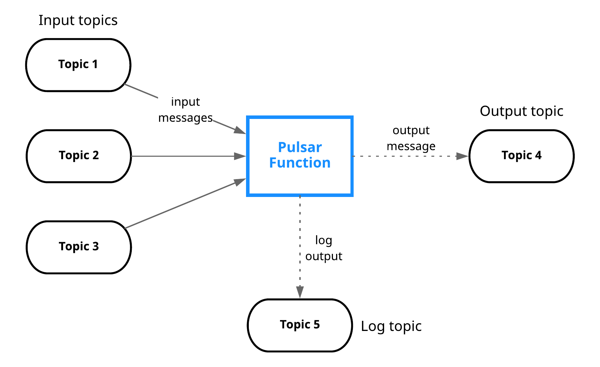
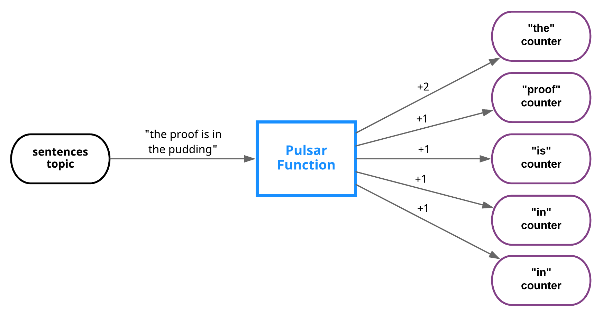

**Pulsar Functions** are lightweight compute processes that

* consume messages from one or more Pulsar topics,
* apply a user-supplied processing logic to each message,
* publish the results of the computation to another topic.


## Goals
With Pulsar Functions, you can create complex processing logic without deploying a separate neighboring system (such as [Apache Storm](http://storm.apache.org/), [Apache Heron](https://heron.incubator.apache.org/), [Apache Flink](https://flink.apache.org/)). Pulsar Functions are computing infrastructure of Pulsar messaging system. The core goal is tied to a series of other goals:

* Developer productivity (language-native vs Pulsar Functions SDK functions)
* Easy troubleshooting
* Operational simplicity (no need for an external processing system)

## Inspirations
Pulsar Functions are inspired by (and take cues from) several systems and paradigms:

* Stream processing engines such as [Apache Storm](http://storm.apache.org/), [Apache Heron](https://apache.github.io/incubator-heron), and [Apache Flink](https://flink.apache.org)
* "Serverless" and "Function as a Service" (FaaS) cloud platforms like [Amazon Web Services Lambda](https://aws.amazon.com/lambda/), [Google Cloud Functions](https://cloud.google.com/functions/), and [Azure Cloud Functions](https://azure.microsoft.com/en-us/services/functions/)

Pulsar Functions can be described as

* [Lambda](https://aws.amazon.com/lambda/)-style functions that are
* specifically designed to use Pulsar as a message bus.

## Programming model
Pulsar Functions provide a wide range of functionality, and the core programming model is simple. Functions receive messages from one or more **input [topics](reference-terminology.md#topic)**. Each time a message is received, the function will complete the following tasks.   

  * Apply some processing logic to the input and write output to:
    * An **output topic** in Pulsar
    * [Apache BookKeeper](functions-develop.md#state-storage)
  * Write logs to a **log topic** (potentially for debugging purposes)
  * Increment a [counter](#word-count-example)



You can use Pulsar Functions to set up the following processing chain:

* A Python function listens for the `raw-sentences` topic and "sanitizes" incoming strings (removing extraneous whitespace and converting all characters to lowercase) and then publishes the results to a `sanitized-sentences` topic.
* A Java function listens for the `sanitized-sentences` topic, counts the number of times each word appears within a specified time window, and publishes the results to a `results` topic
* Finally, a Python function listens for the `results` topic and writes the results to a MySQL table.


### Word count example

If you implement the classic word count example using Pulsar Functions, it looks something like this:



To write the function in Java with [Pulsar Functions SDK for Java](functions-develop.md#available-apis), you can write the function as follows.

```java
package org.example.functions;

import org.apache.pulsar.functions.api.Context;
import org.apache.pulsar.functions.api.Function;

import java.util.Arrays;

public class WordCountFunction implements Function<String, Void> {
    // This function is invoked every time a message is published to the input topic
    @Override
    public Void process(String input, Context context) throws Exception {
        Arrays.asList(input.split(" ")).forEach(word -> {
            String counterKey = word.toLowerCase();
            context.incrCounter(counterKey, 1);
        });
        return null;
    }
}
```

Bundle and build the JAR file to be deployed, and then deploy it in your Pulsar cluster using the [command line](functions-deploy.md#command-line-interface) as follows.

```bash
$ bin/pulsar-admin functions create \
  --jar target/my-jar-with-dependencies.jar \
  --classname org.example.functions.WordCountFunction \
  --tenant public \
  --namespace default \
  --name word-count \
  --inputs persistent://public/default/sentences \
  --output persistent://public/default/count
```

### Content-based routing example

Pulsar Functions are used in many cases. The following is a sophisticated example that involves content-based routing.

For example, a function takes items (strings) as input and publishes them to either a `fruits` or `vegetables` topic, depending on the item. Or, if an item is neither fruit nor vegetable, a warning is logged to a [log topic](functions-develop.md#logger). The following is a visual representation.


If you implement this routing functionality in Python, it looks something like this:

```python
from pulsar import Function

class RoutingFunction(Function):
    def __init__(self):
        self.fruits_topic = "persistent://public/default/fruits"
        self.vegetables_topic = "persistent://public/default/vegetables"

    @staticmethod
    def is_fruit(item):
        return item in [b"apple", b"orange", b"pear", b"other fruits..."]

    @staticmethod
    def is_vegetable(item):
        return item in [b"carrot", b"lettuce", b"radish", b"other vegetables..."]

    def process(self, item, context):
        if self.is_fruit(item):
            context.publish(self.fruits_topic, item)
        elif self.is_vegetable(item):
            context.publish(self.vegetables_topic, item)
        else:
            warning = "The item {0} is neither a fruit nor a vegetable".format(item)
            context.get_logger().warn(warning)
```

If this code is stored in `~/router.py`, then you can deploy it in your Pulsar cluster using the [command line](functions-deploy.md#command-line-interface) as follows.

```bash
$ bin/pulsar-admin functions create \
  --py ~/router.py \
  --classname router.RoutingFunction \
  --tenant public \
  --namespace default \
  --name route-fruit-veg \
  --inputs persistent://public/default/basket-items
```

### Functions, messages and message types
Pulsar Functions take byte arrays as inputs and spit out byte arrays as output. However in languages that support typed interfaces(Java), you can write typed Functions, and bind messages to types in the following ways. 
* [Schema Registry](functions-develop.md#schema-registry)
* [SerDe](functions-develop.md#serde)


## Fully Qualified Function Name (FQFN)
Each Pulsar Function has a **Fully Qualified Function Name** (FQFN) that consists of three elements: the function tenant, namespace, and function name. FQFN looks like this:

```http
tenant/namespace/name
```

FQFNs enable you to create multiple functions with the same name provided that they are in different namespaces.

## Supported languages
Currently, you can write Pulsar Functions in Java, Python, and Go. For details, refer to [Develop Pulsar Functions](functions-develop.md).

## Processing guarantees
Pulsar Functions provide three different messaging semantics that you can apply to any function.

Delivery semantics | Description
:------------------|:-------
**At-most-once** delivery | Each message sent to the function is likely to be processed, or not to be processed (hence "at most").
**At-least-once** delivery | Each message sent to the function can be processed more than once (hence the "at least").
**Effectively-once** delivery | Each message sent to the function will have one output associated with it.


### Apply processing guarantees to a function
You can set the processing guarantees for a Pulsar Function when you create the Function. The following [`pulsar-function create`](reference-pulsar-admin.md#create-1) command creates a function with effectively-once guarantees applied.

```bash
$ bin/pulsar-admin functions create \
  --name my-effectively-once-function \
  --processing-guarantees EFFECTIVELY_ONCE \
  # Other function configs
```

The available options for `--processing-guarantees` are:

* `ATMOST_ONCE`
* `ATLEAST_ONCE`
* `EFFECTIVELY_ONCE`

> By default, Pulsar Functions provide at-least-once delivery guarantees. So if you create a function without supplying a value for the `--processingGuarantees` flag, the function provides at-least-once guarantees.

### Update the processing guarantees of a function
You can change the processing guarantees applied to a function using the [`update`](reference-pulsar-admin.md#update-1) command. The following is an example.

```bash
$ bin/pulsar-admin functions update \
  --processing-guarantees ATMOST_ONCE \
  # Other function configs
```
