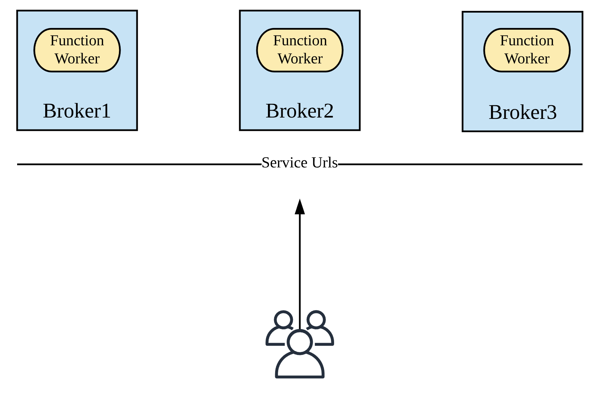
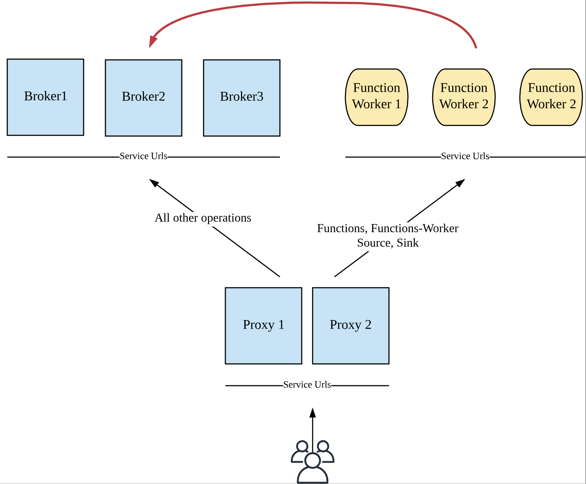
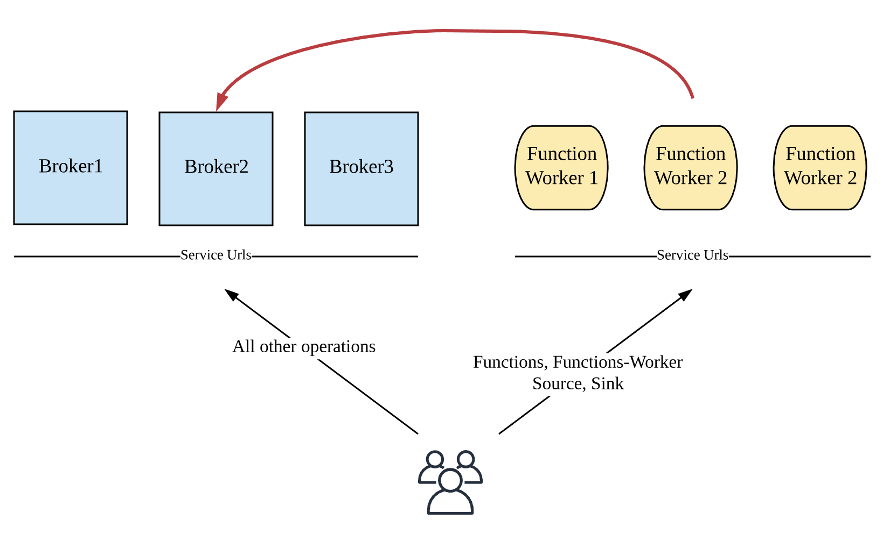

Pulsar `functions-worker` is the component to run Pulsar Functions in cluster mode.
This document describes the options, steps and configurations to set up Pulsar
`functions-worker`.

Before continuing the documentation, please be noted with a few things:

1. The `--- Service Urls---` lines in the following diagrams represents that Pulsar
   service urls that Pulsar client and admin use to connect to a Pulsar cluster.
   
## Deployment options

Pulsar `functions-worker` is designed as a logic component. It can run as part of
a broker or as a complete different process in a different broker. This section
explores these two different options and how to configure them.

### Run Functions-Worker with brokers

The following diagram illustrates a deployment of functions-workers running along with
brokers.



To enable functions-worker running as part of a broker, `functionsWorkerEnabled` should
be set to `true` in the broker configuration `broker.conf`.

```conf
functionsWorkerEnabled=true
```

Changing `functionsWorkerEnabled` to `true` only tells broker to start functions-worker
as part of it. You need to configure `conf/functions_worker.yml` to customize your functions_worker.

#### Configure Functions-Worker for running with brokers

In this mode, since `functions-worker` is running as part of broker, most of the settings
already inherit from your broker configuration (e.g. configurationStore settings, authentication settings, and etc).

Below are the required settings you need to pay attentions to in configuring functions-worker in this mode.

- `numFunctionPackageReplicas`: The number of replicas for storing function packages. The default value is 1, which
  is good for a standalone deployment. For a production deployment, you should change it to be more than `2` to ensure
  high availability.
- `pulsarFunctionsCluster`: Set the value to your Pulsar cluster name (same as the `clusterName` setting in broker configuration).


If authentication is enabled on the BookKeeper cluster, you should also configure the BookKeeper authentication settings.
They are:

- `bookkeeperClientAuthenticationPlugin`: the BookKeeper client authentication plugin name.
- `bookkeeperClientAuthenticationParametersName`: the BookKeeper client authentication plugin parameters name.
- `bookkeeperClientAuthenticationParameters`: the BookKeeper client authentication plugin parameters.

#### Start Functions-Worker with broker

Once you have configured the `functions_worker.yml`, you can just (re)start your broker. 

After that you can use following command to verify if `functions-worker` is running well.

```bash
curl <broker-ip>:8080/admin/v2/worker/cluster
```

It should return the list of function workers alive in the cluster. Similar output is shown below as a reference. 

```json
[{"workerId":"<worker-id>","workerHostname":"<worker-hostname>","port":8080}]
```

### Run Functions-Worker separately

This section illustrates how to run `functions-worker` as a separated process in separated machines.



> NOTE: In this mode, you need to make sure `functionsWorkerEnabled` is set to `false` so that your brokers
don't start `functions-worker` by mistake.

#### Configure Functions-Worker for running separately

Following are the instructions for configuring function-worker.

##### Worker settings

- `workerId`: A string value. It should be unique across the cluster, since it would be used for identifying a worker
  machine.
- `workerHostname`: The hostname of the worker machine.
- `workerPort`: The port that worker server listens on. Keep it as default if you don't customize it.
- `workerPortTls`: The tls port that worker server listens on. Keep it as default if you don't customize it.

##### Function package management

- `numFunctionPackageReplicas`: The number of replicas for storing function packages. The default value is 1, which

##### Function metadata management

- `pulsarServiceUrl`: The Pulsar service url for your broker cluster.
- `pulsarWebServiceUrl`: The pulser web service url for your broker cluster.
- `pulsarFunctionsCluster`: Set the value to your Pulsar cluster name (same as the `clusterName` setting in broker configuration).

If your broker cluster enables authentication, you *should* also configure the authentication
plugin and parameters for the functions worker to talk to the brokers.

- `clientAuthenticationPlugin`
- `clientAuthenticationParameters`

##### Security Settings

If you want to enable security on functions workers, you *should* configure followings:

*Enable TLS transport encryption*

You should configure following settings to enable TLS transport encryption.

```
tlsEnabled: true
tlsCertificateFilePath: /path/to/functions-worker.cert.pem
tlsKeyFilePath:         /path/to/functions-worker.key-pk8.pem
tlsTrustCertsFilePath:  /path/to/ca.cert.pem
```

See [Transport Encryption using TLS](security-tls-transport.md) for more details about TLS encryption.

*Enable Authentication Provider*

You should configure following settings to enable authentication on Functions Worker
(substituting the providers list with the providers you would like to enable).

```
authenticationEnabled: true
authenticationProviders: [ provider1, provider2 ]
```

For *SASL Authentication* provider, add `saslJaasClientAllowedIds` and `saslJaasBrokerSectionName`
under `properties` if needed. 

```
properties:
  saslJaasClientAllowedIds: .*pulsar.*
  saslJaasBrokerSectionName: Broker
```

For *Token Authentication* prodivder, add necessary settings under `properties` if needed.
See [Token Authentication](security-token-admin.md) for more details.
```
properties:
  tokenSecretKey:       file://my/secret.key 
  # If using public/private
  # tokenPublicKey:     file:///path/to/public.key 
```

*Enable Authorization Provider*

You should configure `authorizationEnabled` and `configurationStoreServers` to enable
authorization on Functions Worker. The authentication provider will connect to
`configurationStoreServers` to receive namespace policies.

```yaml
authorizationEnabled: true
configurationStoreServers: <configuration-store-servers>
```

You should also configure a list of superuser roles. The superuser roles are able to access
any admin apis. Example configuration is shown as below:

```yaml
superUserRoles:
  - role1
  - role2
  - role3
```

##### BookKeeper Authentication

If authentication is enabled on the BookKeeper cluster, you should also configure the BookKeeper authentication settings.
They are:

- `bookkeeperClientAuthenticationPlugin`: the BookKeeper client authentication plugin name.
- `bookkeeperClientAuthenticationParametersName`: the BookKeeper client authentication plugin parameters name.
- `bookkeeperClientAuthenticationParameters`: the BookKeeper client authentication plugin parameters.

#### Start Functions-Worker

Once you have finished configuring the `functions_worker.yml` configuration file, you can use following
command to start a `functions-worker`:

```bash
bin/pulsar functions-worker
```

#### Configure Proxies for Functions-Workers

When you are running `functions-worker` in a separated cluster, the admin rest endpoints are now
split into two clusters. `functions`, `function-worker`, `source` and `sink` endpoints are now served
by the `functions-worker` cluster, while all the other remaining endpoints are served by the broker cluster.
Hence you need to configure your `pulsar-admin` to use the right service url accordingly.

In order to address this inconvenience, you can choose to start a proxy cluster for routing the admin rest
requests accordingly. Hence you will have one central entry point for your admin service.

If you already have a proxy cluster, continue the reading. If you haven't setup a proxy
cluster before, you can follow the [instructions](http://pulsar.apache.org/docs/en/administration-proxy/) to
start proxies.    



To enable routing functions related admin requests to `functions-worker` in a proxy, you can edit `proxy.conf` to modify
following settings:

```conf
functionWorkerWebServiceURL=<pulsar-functions-worker-web-service-url>
functionWorkerWebServiceURLTLS=<pulsar-functions-worker-web-service-url>
```

### Run-with-Broker vs Run-separately

As described above, it is much convenient to run functions-workers along with brokers. However running functions-workers
in a separated cluster provides better resource isolation for running functions in `Process` or `Thread` mode.

The recommendation is listed as below:

- `Run-with-Broker`: Choose this mode when a) if you don't care about resource isolation when running functions in
  `Process` or `Thread` mode; or b) if you configure the functions-worker to run functions on Kubernetes (where the 
  resource isolation problem is addressed by Kubernetes).
  
- `Run-separatedly`: Choose this mode when a) you don't have a kubernetes cluster; and b) if you want to separate
  running functions from brokers.

## Troubleshooting

### Namespace missing local cluster name in clusters list

```
Failed to get partitioned topic metadata: org.apache.pulsar.client.api.PulsarClientException$BrokerMetadataException: Namespace missing local cluster name in clusters list: local_cluster=xyz ns=public/functions clusters=[standalone]
```

The error message is seen when either a) a broker is started with `functionsWorkerEnabled=true`
but the `pulsarFunctionsCluster` is not set to the correct cluster in `conf/functions_worker.yaml`;
or b) setting up a geo-replicated Pulsar cluster with `functionsWorkerEnabled=true`, the brokers in one cluster run well but not the brokers in the other cluster.

If any of these cases happens, follow the instructions below to fix the problem:

1. Get the current clusters list of `public/functions` namespace.

```bash
bin/pulsar-admin namespaces get-clusters public/functions
```

2. Check if the cluster is in the clusters list. If the cluster doesn't exist in the list, add it to the list and update the clusters list.

```bash
bin/pulsar-admin namespaces set-clusters --cluster=<existing-clusters>,<new-cluster> public/functions
```

3. Set the correct cluster name in setting `pulsarFunctionsCluster` in `conf/functions_worker.yml` file. 
