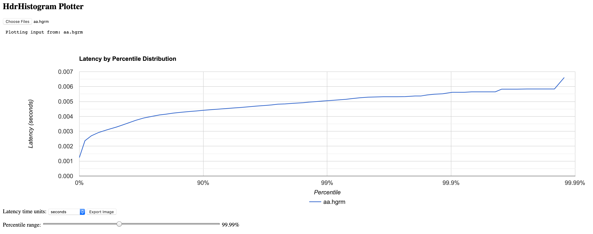

The Pulsar Perf is a built-in performance test tool for Apache Pulsar. You can use the Pulsar Perf to test message writing or reading performance. For detailed information about performance tuning, see [here](https://streamnative.io/en/blog/tech/2021-01-14-pulsar-architecture-performance-tuning).

## Produce messages

> **Tip**
> 
> For the latest and complete information about `pulsar-perf`, including commands, flags, descriptions, and more, see [`pulsar-perf`](https://pulsar.apache.org/tools/pulsar-perf/) or [here](reference-cli-tools.md#pulsar-perf).

- This example shows how the Pulsar Perf produces messages with **default** options. 

    **Input**
    
    ```
    bin/pulsar-perf produce my-topic
    ```

    After the command is executed, the test data is continuously output on the Console.

    **Output**

    ```
    19:53:31.459 [pulsar-perf-producer-exec-1-1] INFO  org.apache.pulsar.testclient.PerformanceProducer - Created 1 producers
    19:53:31.482 [pulsar-timer-5-1] WARN  com.scurrilous.circe.checksum.Crc32cIntChecksum - Failed to load Circe JNI library. Falling back to Java based CRC32c provider
    19:53:40.861 [main] INFO  org.apache.pulsar.testclient.PerformanceProducer - Throughput produced:     93.7  msg/s ---      0.7 Mbit/s --- failure      0.0 msg/s --- Latency: mean:   3.575 ms - med:   3.460 - 95pct:   4.790 - 99pct:   5.308 - 99.9pct:   5.834 - 99.99pct:   6.609 - Max:   6.609
    19:53:50.909 [main] INFO  org.apache.pulsar.testclient.PerformanceProducer - Throughput produced:    100.0  msg/s ---      0.8 Mbit/s --- failure      0.0 msg/s --- Latency: mean:   3.437 ms - med:   3.328 - 95pct:   4.656 - 99pct:   5.071 - 99.9pct:   5.519 - 99.99pct:   5.588 - Max:   5.588
    19:54:00.926 [main] INFO  org.apache.pulsar.testclient.PerformanceProducer - Throughput produced:    100.0  msg/s ---      0.8 Mbit/s --- failure      0.0 msg/s --- Latency: mean:   3.376 ms - med:   3.276 - 95pct:   4.520 - 99pct:   4.939 - 99.9pct:   5.440 - 99.99pct:   5.490 - Max:   5.490
    19:54:10.940 [main] INFO  org.apache.pulsar.testclient.PerformanceProducer - Throughput produced:    100.0  msg/s ---      0.8 Mbit/s --- failure      0.0 msg/s --- Latency: mean:   3.298 ms - med:   3.220 - 95pct:   4.474 - 99pct:   4.926 - 99.9pct:   5.645 - 99.99pct:   5.654 - Max:   5.654
    19:54:20.956 [main] INFO  org.apache.pulsar.testclient.PerformanceProducer - Throughput produced:    100.1  msg/s ---      0.8 Mbit/s --- failure      0.0 msg/s --- Latency: mean:   3.308 ms - med:   3.199 - 95pct:   4.532 - 99pct:   4.871 - 99.9pct:   5.291 - 99.99pct:   5.323 - Max:   5.323
    19:54:30.972 [main] INFO  org.apache.pulsar.testclient.PerformanceProducer - Throughput produced:    100.0  msg/s ---      0.8 Mbit/s --- failure      0.0 msg/s --- Latency: mean:   3.249 ms - med:   3.144 - 95pct:   4.437 - 99pct:   4.970 - 99.9pct:   5.329 - 99.99pct:   5.414 - Max:   5.414
    19:54:40.987 [main] INFO  org.apache.pulsar.testclient.PerformanceProducer - Throughput produced:    100.0  msg/s ---      0.8 Mbit/s --- failure      0.0 msg/s --- Latency: mean:   3.435 ms - med:   3.361 - 95pct:   4.772 - 99pct:   5.150 - 99.9pct:   5.373 - 99.99pct:   5.837 - Max:   5.837
    ^C19:54:44.325 [Thread-1] INFO  org.apache.pulsar.testclient.PerformanceProducer - Aggregated throughput stats --- 7286 records sent --- 99.140 msg/s --- 0.775 Mbit/s
    19:54:44.336 [Thread-1] INFO  org.apache.pulsar.testclient.PerformanceProducer - Aggregated latency stats --- Latency: mean:   3.383 ms - med:   3.293 - 95pct:   4.610 - 99pct:   5.059 - 99.9pct:   5.588 - 99.99pct:   5.837 - 99.999pct:   6.609 - Max:   6.609
    ```

    From the above test data, you can get the throughput statistics and the write latency statistics. The aggregated statistics is printed when the Pulsar Perf is stopped. You can press **Ctrl**+**C** to stop the Pulsar Perf. After the Pulsar Perf is stopped, the [HdrHistogram](http://hdrhistogram.github.io/HdrHistogram/) formatted test result appears under your directory. The document looks like `perf-producer-1589370810837.hgrm`. You can also check the test result through [HdrHistogram Plotter](https://hdrhistogram.github.io/HdrHistogram/plotFiles.html). For details about how to check the test result through [HdrHistogram Plotter](https://hdrhistogram.github.io/HdrHistogram/plotFiles.html), see [HdrHistogram Plotter](#hdrhistogram-plotter).

- This example shows how the Pulsar Perf produces messages with `transaction` option.

    **Input**
    
    ```shell
    bin/pulsar-perf produce my-topic -r 10 -m 100 -txn
    ```

    **Output**

    ```shell
    2021-10-11T13:36:15,595+0800 INFO  [Thread-3] o.a.p.t.PerformanceProducer@499 - --- Transaction : 2 transaction end successfully ---0 transaction end failed --- 0.200 Txn/s 

    2021-10-11T13:36:15,614+0800 INFO  [Thread-3] o.a.p.t.PerformanceProducer@503 - Throughput produced:     100 msg ---      0.0 msg/s ---      0.1 Mbit/s  --- failure      0.0 msg/s --- Latency: mean:   3.067 ms - med:   3.104 - 95pct:   3.747 - 99pct:   4.619 - 99.9pct:   6.760 - 99.99pct:   6.760 - Max:   6.760 

    2021-10-11T13:36:15,710+0800 INFO  [pulsar-perf-producer-exec-46-1] o.a.p.t.PerformanceProducer@834 - Aggregated latency stats --- Latency: mean:   3.067 ms - med:   3.104 - 95pct:   3.747 - 99pct:   4.619 - 99.9pct:   6.760 - 99.99pct:   6.760 - 99.999pct:   6.760 - Max:   6.760 

    2021-10-11T13:36:29,976+0800 INFO  [Thread-4] o.a.p.t.PerformanceProducer@815 - --- Transaction : 2 transaction end successfully --- 0 transaction end failed --- 2 transaction open successfully --- 0 transaction open failed --- 12.237 Txn/s 
    
    2021-10-11T13:36:29,976+0800 INFO  [Thread-4] o.a.p.t.PerformanceProducer@824 - Aggregated throughput stats --- 102 records sent --- 4.168 msg/s --- 0.033 Mbit/s
    ``` 
    
## Consume messages

> **Tip**
> 
> For the latest and complete information about `pulsar-perf`, including commands, flags, descriptions, and more, see [`pulsar-perf`](https://pulsar.apache.org/tools/pulsar-perf/) or [here](reference-cli-tools.md#pulsar-perf).

- This example shows how the Pulsar Perf consumes messages with **default** options.

    **Input**

    > **Note** 
    >
    > If you have not created a topic (in this example, it is _my-topic_) before, the broker creates a new topic without partitions and messages, then the consumer can not receive any messages. Consequently, before using `pulsar-perf consume`, make sure your topic has enough messages to consume.

    ```
    bin/pulsar-perf consume my-topic
    ```

    After the command is executed, the test data is continuously output on the Console.

    **Output**

    ```
    20:35:37.071 [main] INFO  org.apache.pulsar.testclient.PerformanceConsumer - Start receiving from 1 consumers on 1 topics
    20:35:41.150 [pulsar-client-io-1-9] WARN  com.scurrilous.circe.checksum.Crc32cIntChecksum - Failed to load Circe JNI library. Falling back to Java based CRC32c provider
    20:35:47.092 [main] INFO  org.apache.pulsar.testclient.PerformanceConsumer - Throughput received: 59.572  msg/s -- 0.465 Mbit/s --- Latency: mean: 11.298 ms - med: 10 - 95pct: 15 - 99pct: 98 - 99.9pct: 137 - 99.99pct: 152 - Max: 152
    20:35:57.104 [main] INFO  org.apache.pulsar.testclient.PerformanceConsumer - Throughput received: 99.958  msg/s -- 0.781 Mbit/s --- Latency: mean: 9.176 ms - med: 9 - 95pct: 15 - 99pct: 16 - 99.9pct: 17 - 99.99pct: 18 - Max: 18
    20:36:07.115 [main] INFO  org.apache.pulsar.testclient.PerformanceConsumer - Throughput received: 100.006  msg/s -- 0.781 Mbit/s --- Latency: mean: 9.316 ms - med: 9 - 95pct: 15 - 99pct: 16 - 99.9pct: 17 - 99.99pct: 17 - Max: 17
    20:36:17.125 [main] INFO  org.apache.pulsar.testclient.PerformanceConsumer - Throughput received: 100.085  msg/s -- 0.782 Mbit/s --- Latency: mean: 9.327 ms - med: 9 - 95pct: 15 - 99pct: 16 - 99.9pct: 17 - 99.99pct: 17 - Max: 17
    20:36:27.136 [main] INFO  org.apache.pulsar.testclient.PerformanceConsumer - Throughput received: 99.900  msg/s -- 0.780 Mbit/s --- Latency: mean: 9.404 ms - med: 9 - 95pct: 15 - 99pct: 16 - 99.9pct: 17 - 99.99pct: 17 - Max: 17
    20:36:37.147 [main] INFO  org.apache.pulsar.testclient.PerformanceConsumer - Throughput received: 99.985  msg/s -- 0.781 Mbit/s --- Latency: mean: 8.998 ms - med: 9 - 95pct: 15 - 99pct: 16 - 99.9pct: 17 - 99.99pct: 17 - Max: 17
    ^C20:36:42.755 [Thread-1] INFO  org.apache.pulsar.testclient.PerformanceConsumer - Aggregated throughput stats --- 6051 records received --- 92.125 msg/s --- 0.720 Mbit/s
    20:36:42.759 [Thread-1] INFO  org.apache.pulsar.testclient.PerformanceConsumer - Aggregated latency stats --- Latency: mean: 9.422 ms - med: 9 - 95pct: 15 - 99pct: 16 - 99.9pct: 98 - 99.99pct: 137 - 99.999pct: 152 - Max: 152
    ```

    From the output test data, you can get the throughput statistics and the end-to-end latency statistics. The aggregated statistics is printed after the Pulsar Perf is stopped. You can press **Ctrl**+**C** to stop the Pulsar Perf.

- This example shows how the Pulsar Perf consumes messages with `transaction` option.

    **Input**
    
    ```shell
    bin/pulsar-perf consume my-topic -r 10 -txn -ss mysubName -st Exclusive -sp Earliest -ntxn 10
    ```

    > **Note** 
    >
    > If you have not created a topic (in this example, it is _my-topic_) before, the broker creates a new topic without partitions and messages, then the consumer can not receive any messages. Consequently, before using `pulsar-perf consume`, make sure your topic has enough messages to consume.
    
    **Output**

    ```shell
    2021-10-11T13:43:36,052+0800 INFO  [Thread-3] o.a.p.t.PerformanceConsumer@538 - --- Transaction: 6 transaction end successfully --- 0 transaction end failed --- 0.199  Txn/s --- AckRate: 9.952 msg/s 

    2021-10-11T13:43:36,065+0800 INFO  [Thread-3] o.a.p.t.PerformanceConsumer@545 - Throughput received:     306 msg --- 9.952  msg/s -- 0.000 Mbit/s  --- Latency: mean: 26177.380 ms - med: 26128 - 95pct: 30531 - 99pct: 30923 - 99.9pct: 31021 - 99.99pct: 31021 - Max: 31021 

    2021-10-11T13:43:59,854+0800 INFO  [Thread-5] o.a.p.t.PerformanceConsumer@579 - -- Transaction: 10  transaction end successfully --- 0 transaction end failed --- 10 transaction open successfully --- 0 transaction open failed --- 0.185 Txn/s  

    2021-10-11T13:43:59,854+0800 INFO  [Thread-5] o.a.p.t.PerformanceConsumer@588 - Aggregated throughput stats --- 505 records received --- 9.345 msg/s --- 0.000 Mbit/s--- AckRate: 9.27065308842743  msg/s --- ack failed 4 msg 

    2021-10-11T13:43:59,882+0800 INFO  [Thread-5] o.a.p.t.PerformanceConsumer@601 - Aggregated latency stats --- Latency: mean: 50593.000 ms - med: 50593 - 95pct: 50593 - 99pct: 50593 - 99.9pct: 50593 - 99.99pct: 50593 - 99.999pct: 50593 - Max: 50593 
    ``` 

## Transactions

This section shows how Pulsar Perf runs transactions. For more information, see [Pulsar transactions](txn-why.md).

### Use transaction

This example executes 50 transactions. Each transaction sends and receives 1 message (default). 

**Input**

```shell
bin/pulsar-perf transaction --topics-c myConsumerTopic --topics-p MyproduceTopic -threads 1 -ntxn 50 -ss testSub  -nmp 1 -nmc 1
```

> **Note** 
>
> If you have not created a topic (in this example, it is _myConsumerTopic_) before, the broker creates a new topic without partitions and messages, then the consumer can not receive any messages. Consequently, before using `pulsar-perf transaction`, make sure your topic has enough messages to consume.

**Output**

```shell
2021-10-11T14:37:27,863+0800 INFO  [Thread-5] o.a.p.t.PerformanceProducer@613 - Messages ack aggregated latency stats --- Latency: mean:  29.239 ms - med:  26.799 - 95pct:  46.696 - 99pct:  55.660 - 99.9pct:  55.660 - 99.99pct:  55.660 - 99.999pct:  55.660 - Max:  55.660 {}

2021-10-11T14:37:19,391+0800 INFO  [Thread-4] o.a.p.t.PerformanceProducer@525 - Throughput transaction:      50 transaction executes ---   4.999 transaction/s  ---send Latency: mean:  31.368 ms - med:  28.369 - 95pct:  55.631 - 99pct:  57.764 - 99.9pct:  57.764 - 99.99pct:  57.764 - Max:  57.764---ack Latency: mean:  29.239 ms - med:  26.799 - 95pct:  46.696 - 99pct:  55.660 - 99.9pct:  55.660 - 99.99pct:  55.660 - Max:  55.660 {}

2021-10-11T14:37:26,625+0800 INFO  [Thread-5] o.a.p.t.PerformanceProducer@571 - Aggregated throughput stats --- 50 transaction executed ---   2.718 transaction/s  --- 50 transaction open successfully --- 0 transaction open failed --- 50 transaction end successfully --- 0 transaction end failed--- 0 message ack failed --- 0 message send failed--- 50 message ack success --- 50 message send success  {}
```

### Disable Transaction

This example disables transactions.

**Input**

```shell
bin/pulsar-perf transaction --topics-c myConsumerTopic --topics-p myproduceTopic -threads 1 -ntxn 50 -ss testSub --txn-disEnable
```

> **Note** 
>
> If you have not created a topic (in this example, it is _myConsumerTopic_) before, the broker creates a new topic without partitions and messages, then the consumer can not receive any messages. Consequently, before using `pulsar-perf transaction --txn-disEnable`, make sure your topic has enough messages to consume.

**Output**

```shell
2021-10-11T16:48:26,876+0800 INFO  [Thread-4] o.a.p.t.PerformanceProducer@529 - Throughput task:      50 task executes ---   4.999 task/s  ---send Latency: mean:  10.002 ms - med:   9.875 - 95pct:  11.733 - 99pct:  15.995 - 99.9pct:  15.995 - 99.99pct:  15.995 - Max:  15.995---ack Latency: mean:   0.051 ms - med:   0.020 - 95pct:   0.059 - 99pct:   1.377 - 99.9pct:   1.377 - 99.99pct:   1.377 - Max:   1.377 

2021-10-11T16:48:29,222+0800 INFO  [Thread-5] o.a.p.t.PerformanceProducer@617 - Messages ack aggregated latency stats --- Latency: mean:   0.051 ms - med:   0.020 - 95pct:   0.059 - 99pct:   1.377 - 99.9pct:   1.377 - 99.99pct:   1.377 - 99.999pct:   1.377 - Max:   1.377 

2021-10-11T16:48:29,246+0800 INFO  [Thread-5] o.a.p.t.PerformanceProducer@629 - Messages send aggregated latency stats --- Latency: mean:  10.002 ms - med:   9.875 - 95pct:  11.733 - 99pct:  15.995 - 99.9pct:  15.995 - 99.99pct:  15.995 - 99.999pct:  15.995 - Max:  15.995

2021-10-11T16:48:29,117+0800 INFO  [Thread-5] o.a.p.t.PerformanceProducer@602 - Aggregated throughput stats --- 50 task executed --- 4.025 task/s --- 0 message ack failed --- 0 message send failed--- 50 message ack success --- 50 message send success 
```

## Configurations

By default, the Pulsar Perf uses `conf/client.conf` as the default configuration and uses `conf/log4j2.yaml` as the default Log4j configuration. If you want to connect to other Pulsar clusters, you can update the `brokerServiceUrl` in the client configuration.

You can use the following commands to change the configuration file and the Log4j configuration file.

```
export PULSAR_CLIENT_CONF=<your-config-file>
export PULSAR_LOG_CONF=<your-log-config-file>
```

In addition, you can use the following command to configure the JVM configuration through environment variables:

```
export PULSAR_EXTRA_OPTS='-Xms4g -Xmx4g -XX:MaxDirectMemorySize=4g'
```

## HdrHistogram Plotter

The [HdrHistogram Plotter](https://hdrhistogram.github.io/HdrHistogram/plotFiles.html) is a visualization tool for checking Pulsar Perf test results, which makes it easier to observe the test results.

To check test results through the HdrHistogram Plotter, follow these steps:

1. Clone the HdrHistogram repository from GitHub to the local.

    ```
    git clone https://github.com/HdrHistogram/HdrHistogram.git
    ```

2. Switch to the HdrHistogram folder.

    ```
    cd HdrHistogram
    ```
3. Install the HdrHistogram Plotter.

    ```
    mvn clean install -DskipTests
    ```
4. Transform the file generated by the Pulsar Perf.

    ```
    ./HistogramLogProcessor -i <hgrm file path that pulsar-perf generated> -o <output file>
    ```

5. You will get two output files. Upload the output file with the filename extension of .hgrm to the [HdrHistogram Plotter](https://hdrhistogram.github.io/HdrHistogram/plotFiles.html).

6. Check the test result through the Graphical User Interface of the HdrHistogram Plotter, as shown blow.

    
