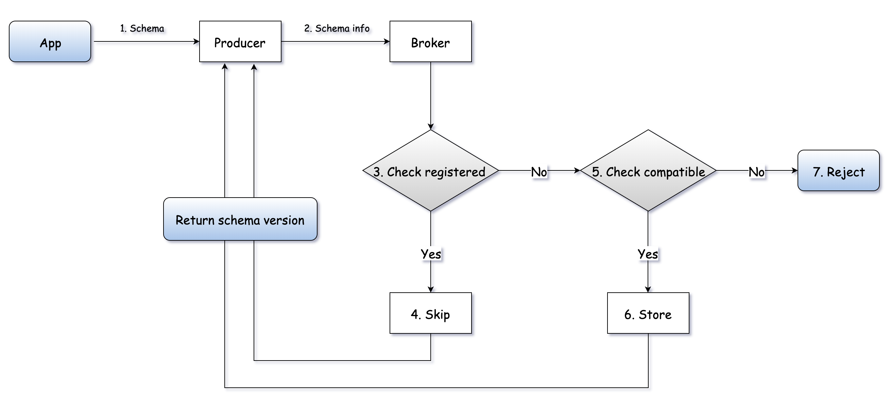
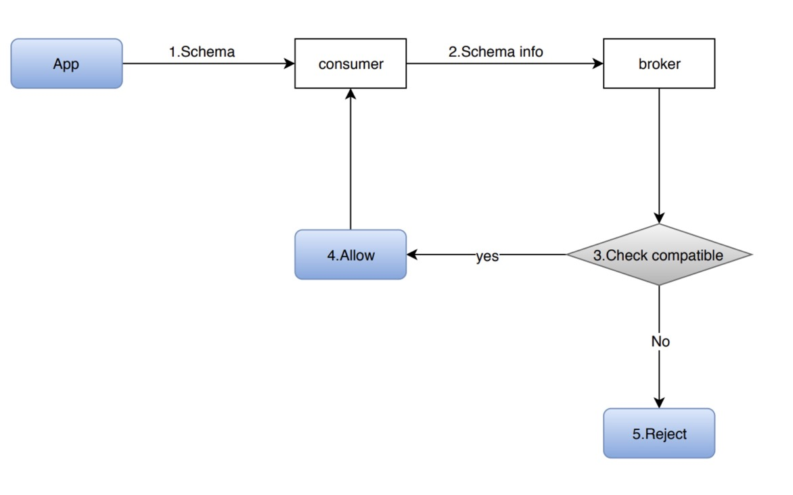

This guide demonstrates the ways to manage schemas:

* Automatically 
  
  * [Schema AutoUpdate](#schema-autoupdate)

* Manually
  
  * [Schema manual management](#schema-manual-management)
  
  * [Custom schema storage](#custom-schema-storage)

## Schema AutoUpdate

If a schema passes the schema compatibility check, Pulsar producer automatically updates this schema to the topic it produces by default. 

### AutoUpdate for producer

For a producer, the `AutoUpdate` happens in the following cases:

* If a **topic doesn’t have a schema**, Pulsar registers a schema automatically.

* If a **topic has a schema**:

  * If a **producer doesn’t carry a schema**:

    * If `isSchemaValidationEnforced` or `schemaValidationEnforced` is **disabled** in the namespace to which the topic belongs, the producer is allowed to connect to the topic and produce data. 
    
    * If `isSchemaValidationEnforced` or `schemaValidationEnforced` is **enabled** in the namespace to which the topic belongs, the producer is rejected and disconnected.

  * If a **producer carries a schema**:
  
    A broker performs the compatibility check based on the configured compatibility check strategy of the namespace to which the topic belongs.
    
    * If the schema is registered, a producer is connected to a broker. 
    
    * If the schema is not registered:
    
        * If `isAllowAutoUpdateSchema` sets to **false**, the producer is rejected to connect to a broker.
    
        * If `isAllowAutoUpdateSchema` sets to **true**:
     
            * If the schema passes the compatibility check, then the broker registers a new schema automatically for the topic and the producer is connected.
        
            * If the schema does not pass the compatibility check, then the broker does not register a schema and the producer is rejected to connect to a broker.



### AutoUpdate for consumer

For a consumer, the `AutoUpdate` happens in the following cases:

* If a **consumer connects to a topic without a schema** (which means the consumer receiving raw bytes), the consumer can connect to the topic successfully without doing any compatibility check.

* If a **consumer connects to a topic with a schema**.

    * If a topic does not have all of them (a schema/data/a local consumer and a local producer):
    
        * If `isAllowAutoUpdateSchema` sets to **true**, then the consumer registers a schema and it is connected to a broker.
        
        * If `isAllowAutoUpdateSchema` sets to **false**, then the consumer is rejected to connect to a broker.
        
    * If a topic has one of them (a schema/data/a local consumer and a local producer), then the schema compatibility check is performed.
    
        * If the schema passes the compatibility check, then the consumer is connected to the broker.
        
        * If the schema does not pass the compatibility check, then the consumer is rejected to connect to the broker.
        

        

### Manage AutoUpdate strategy

You can use the `pulsar-admin` command to manage the `AutoUpdate` strategy as below:

* [Enable AutoUpdate](#enable-autoupdate)

* [Disable AutoUpdate](#disable-autoupdate)

* [Adjust compatibility](#adjust-compatibility)

#### Enable AutoUpdate

To enable `AutoUpdate` on a namespace, you can use the `pulsar-admin` command.

```bash
bin/pulsar-admin namespaces set-is-allow-auto-update-schema --enable tenant/namespace
```

#### Disable AutoUpdate 

To disable `AutoUpdate` on a namespace, you can use the `pulsar-admin` command.

```bash
bin/pulsar-admin namespaces set-is-allow-auto-update-schema --disable tenant/namespace
```

Once the `AutoUpdate` is disabled, you can only register a new schema using the `pulsar-admin` command.

#### Adjust compatibility

To adjust the schema compatibility level on a namespace, you can use the `pulsar-admin` command.

```bash
bin/pulsar-admin namespaces set-schema-compatibility-strategy --compatibility <compatibility-level> tenant/namespace
```

### Schema validation

By default, `schemaValidationEnforced` is **disabled** for producers:

* This means a producer without a schema can produce any kind of messages to a topic with schemas, which may result in producing trash data to the topic. 

* This allows non-java language clients that don’t support schema can produce messages to a topic with schemas.

However, if you want a stronger guarantee on the topics with schemas, you can enable `schemaValidationEnforced` across the whole cluster or on a per-namespace basis.

#### Enable schema validation

To enable `schemaValidationEnforced` on a namespace, you can use the `pulsar-admin` command.

```bash
bin/pulsar-admin namespaces set-schema-validation-enforce --enable tenant/namespace
```

#### Disable schema validation

To disable `schemaValidationEnforced` on a namespace, you can use the `pulsar-admin` command.

```bash
bin/pulsar-admin namespaces set-schema-validation-enforce --disable tenant/namespace
```

## Schema manual management

To manage schemas, you can use one of the following methods.

<table style="table">
  <tr>
    <th>Method</th>
    <th>Description</th> 
  </tr>
  <tr>
    <td>

**Admin CLI**
    </td>
    <td>
You can use the `pulsar-admin` tool to manage Pulsar schemas, brokers, clusters, sources, sinks, topics, tenants and so on.

For more information about how to use the `pulsar-admin` tool, see [here](reference-pulsar-admin.md).
    </td> 
  </tr>
  <tr>
    <td>
    
**REST API**
    </td>
    <td>
    
Pulsar exposes schema related management API in Pulsar’s admin RESTful API. You can access the admin RESTful endpoint directly to manage schemas.

For more information about how to use the Pulsar REST API, see [here](http://pulsar.apache.org/admin-rest-api/).
    </td>
 </tr>
 <tr>
    <td>
    
**Java Admin API**
    </td>
    <td>Pulsar provides Java admin library.</td>
 </tr>
</table>

### Upload a schema

To upload (register) a new schema for a topic, you can use one of the following methods.

<!--DOCUSAURUS_CODE_TABS-->

<!--Admin CLI-->

Use the `upload` subcommand.

```bash
$ pulsar-admin schemas upload --filename <schema-definition-file> <topic-name>
```

The `schema-definition-file` is in JSON format. 

```json
{
    "type": "<schema-type>",
    "schema": "<an-utf8-encoded-string-of-schema-definition-data>",
    "properties": {} // the properties associated with the schema
}
```

The `schema-definition-file` includes the following fields:

<table style="table">
  <tr>
    <th>Field</th>
    <th>Description</th> 
  </tr>
  <tr>
    <td>

`type`
    </td>
    <td>
    The schema type.</td> 
  </tr>
  <tr>
    <td>
    
`schema`
    </td>
    <td>

The schema definition data, which is encoded in UTF 8 charset.
    
* If the schema is a **primitive** schema, this field should be blank.
  
* If the schema is a **struct** schema, this field should be a JSON string of the Avro schema definition.
  </td> 
  </tr>
  <tr>
    <td>
    
    `properties`
    </td>
    <td>The additional properties associated with the schema.</td> 
  </tr>  
</table>

Here are examples of the `schema-definition-file` for a JSON schema.

**Example 1**

```json
{
    "type": "JSON",
    "schema": "{\"type\":\"record\",\"name\":\"User\",\"namespace\":\"com.foo\",\"fields\":[{\"name\":\"file1\",\"type\":[\"null\",\"string\"],\"default\":null},{\"name\":\"file2\",\"type\":\"string\",\"default\":null},{\"name\":\"file3\",\"type\":[\"null\",\"string\"],\"default\":\"dfdf\"}]}",
    "properties": {}
}
```

**Example 2**

```json
{
    "type": "STRING",
    "schema": "",
    "properties": {
        "key1": "value1"
    }
}
```

<!--REST API-->

Send a `POST` request to this endpoint: {@inject: endpoint|POST|/admin/v2/schemas/:tenant/:namespace/:topic/schema|operation/uploadSchem?version=[[pulsar:version_number]]a}

The post payload is in JSON format.

```json
{
    "type": "<schema-type>",
    "schema": "<an-utf8-encoded-string-of-schema-definition-data>",
    "properties": {} // the properties associated with the schema
}
```

The post payload includes the following fields:

<table style="table">
  <tr>
    <th>Field</th>
    <th>Description</th> 
  </tr>
  <tr>
    <td>

`type`
    </td>
    <td>
    The schema type.</td> 
  </tr>
  <tr>
    <td>
    
`schema`
    </td>
    <td>
The schema definition data, which is encoded in UTF 8 charset.
    
* If the schema is a **primitive** schema, this field should be blank.
  
* If the schema is a **struct** schema, this field should be a JSON string of the Avro schema definition.
  </td> 
  </tr>
  <tr>
    <td>
    
    `properties`
    </td>
    <td>The additional properties associated with the schema.</td> 
  </tr>  
</table>

<!--Java Admin API-->

```java
void createSchema(String topic, PostSchemaPayload schemaPayload)
```

The `PostSchemaPayload` includes the following fields:

<table style="table">
  <tr>
    <th>Field</th>
    <th>Description</th> 
  </tr>
  <tr>
    <td>

`type`
    </td>
    <td>
    The schema type.</td> 
  </tr>
  <tr>
    <td>
    
`schema`
    </td>
    <td>
The schema definition data, which is encoded in UTF 8 charset.
    
* If the schema is a **primitive** schema, this field should be blank.
  
* If the schema is a **struct** schema, this field should be a JSON string of the Avro schema definition.
  </td> 
  </tr>
  <tr>
    <td>
    
    `properties`
    </td>
    <td>The additional properties associated with the schema.</td> 
  </tr>  
</table>

Here is an example of `PostSchemaPayload`:

```java
PulsarAdmin admin = …;

PostSchemaPayload payload = new PostSchemaPayload();
payload.setType("INT8");
payload.setSchema("");

admin.createSchema("my-tenant/my-ns/my-topic", payload); 
```
<!--END_DOCUSAURUS_CODE_TABS-->

### Get a schema (latest)

To get the latest schema for a topic, you can use one of the following methods. 

<!--DOCUSAURUS_CODE_TABS-->

<!--Admin CLI-->

Use the `get` subcommand.

```bash
$ pulsar-admin schemas get <topic-name>

{
    "version": 0,
    "type": "String",
    "timestamp": 0,
    "data": "string",
    "properties": {
        "property1": "string",
        "property2": "string"
    }
}
```

<!--REST API-->

Send a `GET` request to this endpoint: {@inject: endpoint|GET|/admin/v2/schemas/:tenant/:namespace/:topic/schema|operation/getSchem?version=[[pulsar:version_number]]a}

Here is an example of a response, which is returned in JSON format.

```json
{
    "version": "<the-version-number-of-the-schema>",
    "type": "<the-schema-type>",
    "timestamp": "<the-creation-timestamp-of-the-version-of-the-schema>",
    "data": "<an-utf8-encoded-string-of-schema-definition-data>",
    "properties": {} // the properties associated with the schema
}
```

The response includes the following fields:

<table style="table">
  <tr>
    <th>Field</th>
    <th>Description</th> 
  </tr>
  <tr>
    <td>

`version`
    </td>
    <td>
    The schema version, which is a long number.</td> 
  </tr>
  <tr>
    <td>

`type`
    </td>
    <td>
    The schema type.</td> 
  </tr>
  <tr>
    <td>

`timestamp` 
    </td>
    <td>
    The timestamp of creating this version of schema.</td> 
  </tr>
  <tr>
    <td>
    
`data`
    </td>
    <td>
The schema definition data, which is encoded in UTF 8 charset.
    
* If the schema is a **primitive** schema, this field should be blank.
  
* If the schema is a **struct** schema, this field should be a JSON string of the Avro schema definition.
  </td> 
  </tr>
  <tr>
    <td>
    
    `properties`
    </td>
    <td>The additional properties associated with the schema.</td> 
  </tr>  
</table>

<!--Java Admin API-->

```java
SchemaInfo createSchema(String topic)
```

The `SchemaInfo` includes the following fields:

<table style="table">
  <tr>
    <th>Field</th>
    <th>Description</th> 
  </tr>
  <tr>
    <td>

`name`
    </td>
    <td>
    The schema name.</td> 
  </tr>
  <tr>
    <td>

`type`
    </td>
    <td>
    The schema type.</td> 
  </tr>
  <tr>
    <td>
    
`schema`
    </td>
    <td>
A byte array of the schema definition data, which is encoded in UTF 8 charset. 
    
* If the schema is a **primitive** schema, this byte array should be empty. 
  
* If the schema is a **struct** schema, this field should be a JSON string of the Avro schema definition converted to a byte array.
  </td> 
  </tr>
  <tr>
    <td>
    
    `properties`
    </td>
    <td>The additional properties associated with the schema.</td> 
  </tr>  
</table>

Here is an example of `SchemaInfo`:

```java
PulsarAdmin admin = …;

SchemaInfo si = admin.getSchema("my-tenant/my-ns/my-topic"); 
```

<!--END_DOCUSAURUS_CODE_TABS-->

### Get a schema (specific)

To get a specific version of a schema, you can use one of the following methods.

<!--DOCUSAURUS_CODE_TABS-->

<!--Admin CLI-->

Use the `get` subcommand.

```bash
$ pulsar-admin schemas get <topic-name> --version=<version> 
```

<!--REST API-->

Send a `GET` request to a schema endpoint: {@inject: endpoint|GET|/admin/v2/schemas/:tenant/:namespace/:topic/schema/:version|operation/getSchem?version=[[pulsar:version_number]]a}

Here is an example of a response, which is returned in JSON format.

```json
{
    "version": "<the-version-number-of-the-schema>",
    "type": "<the-schema-type>",
    "timestamp": "<the-creation-timestamp-of-the-version-of-the-schema>",
    "data": "<an-utf8-encoded-string-of-schema-definition-data>",
    "properties": {} // the properties associated with the schema
}
```

The response includes the following fields:

<table style="table">
  <tr>
    <th>Field</th>
    <th>Description</th> 
  </tr>
  <tr>
    <td>

`version`
    </td>
    <td>
    The schema version, which is a long number.</td> 
  </tr>
  <tr>
    <td>

`type`
    </td>
    <td>
    The schema type.</td> 
  </tr>
  <tr>
    <td>

`timestamp` 
    </td>
    <td>
    The timestamp of creating this version of schema.</td> 
  </tr>
  <tr>
    <td>
    
`data`
    </td>
    <td>
The schema definition data, which is encoded in UTF 8 charset.
    
* If the schema is a **primitive** schema, this field should be blank.
  
* If the schema is a **struct** schema, this field should be a JSON string of the Avro schema definition.
  </td> 
  </tr>
  <tr>
    <td>
    
    `properties`
    </td>
    <td>The additional properties associated with the schema.</td> 
  </tr>  
</table>

<!--Java Admin API-->

```java
SchemaInfo createSchema(String topic, long version)
```

The `SchemaInfo` includes the following fields:

<table style="table">
  <tr>
    <th>Field</th>
    <th>Description</th> 
  </tr>
  <tr>
    <td>

`name`
    </td>
    <td>The schema name.</td> 
  </tr>
  <tr>
    <td>

`type`
    </td>
    <td>The schema type.</td> 
  </tr>
  <tr>
    <td>
    
`schema`
    </td>
    <td>
A byte array of the schema definition data, which is encoded in UTF 8.
    
* If the schema is a **primitive** schema, this byte array should be empty.
  
* If the schema is a **struct** schema, this field should be a JSON string of the Avro schema definition converted to a byte array.
  </td> 
  </tr>
  <tr>
    <td>
    
    `properties`
    </td>
    <td>The additional properties associated with the schema.</td> 
  </tr>  
</table>

Here is an example of `SchemaInfo`:

```java
PulsarAdmin admin = …;

SchemaInfo si = admin.getSchema("my-tenant/my-ns/my-topic", 1L);
```

<!--END_DOCUSAURUS_CODE_TABS-->

### Extract a schema

To provide a schema via a topic, you can use the following method.

<!--DOCUSAURUS_CODE_TABS-->

<!--Admin CLI-->

Use the `extract` subcommand.

```bash
$ pulsar-admin schemas extract --classname <class-name> --jar <jar-path> --type <type-name>
```

<!--END_DOCUSAURUS_CODE_TABS-->

### Delete a schema

To delete a schema for a topic, you can use one of the following methods.

> #### Note
> 
> In any case, the **delete** action deletes **all versions** of a schema registered for a topic.

<!--DOCUSAURUS_CODE_TABS-->

<!--Admin CLI-->

Use the `delete` subcommand.

```bash
$ pulsar-admin schemas delete <topic-name>
```

<!--REST API-->

Send a `DELETE` request to a schema endpoint: {@inject: endpoint|DELETE|/admin/v2/schemas/:tenant/:namespace/:topic/schema|operation/deleteSchema?version=[[pulsar:version_number]]} 

Here is an example of a response, which is returned in JSON format.

```json
{
    "version": "<the-latest-version-number-of-the-schema>",
}
```

The response includes the following field:

Field | Description |
---|---|
`version` | The schema version, which is a long number. | 

<!--Java Admin API-->

```java
void deleteSchema(String topic)
```

Here is an example of deleting a schema.

```java
PulsarAdmin admin = …;

admin.deleteSchema("my-tenant/my-ns/my-topic"); 
```

<!--END_DOCUSAURUS_CODE_TABS-->

## Custom schema storage

By default, Pulsar stores various data types of schemas in [Apache BookKeeper](https://bookkeeper.apache.org) deployed alongside Pulsar. 

However, you can use another storage system if needed. 

### Implement

To use a non-default (non-BookKeeper) storage system for Pulsar schemas, you need to implement the following Java interfaces: 

* [SchemaStorage interface](#schemastorage-interface) 

* [SchemaStorageFactory interface](#schemastoragefactory-interface)

#### SchemaStorage interface

The `SchemaStorage` interface has the following methods:

```java
public interface SchemaStorage {
    // How schemas are updated
    CompletableFuture<SchemaVersion> put(String key, byte[] value, byte[] hash);

    // How schemas are fetched from storage
    CompletableFuture<StoredSchema> get(String key, SchemaVersion version);

    // How schemas are deleted
    CompletableFuture<SchemaVersion> delete(String key);

    // Utility method for converting a schema version byte array to a SchemaVersion object
    SchemaVersion versionFromBytes(byte[] version);

    // Startup behavior for the schema storage client
    void start() throws Exception;

    // Shutdown behavior for the schema storage client
    void close() throws Exception;
}
```

> #### Tip
> 
> For a complete example of **schema storage** implementation, see [BookKeeperSchemaStorage](https://github.com/apache/pulsar/blob/master/pulsar-broker/src/main/java/org/apache/pulsar/broker/service/schema/BookkeeperSchemaStorage.java) class.

#### SchemaStorageFactory interface 

The `SchemaStorageFactory` interface has the following method:

```java
public interface SchemaStorageFactory {
    @NotNull
    SchemaStorage create(PulsarService pulsar) throws Exception;
}
```

> Tip
> 
> For a complete example of **schema storage factory** implementation, see [BookKeeperSchemaStorageFactory](https://github.com/apache/pulsar/blob/master/pulsar-broker/src/main/java/org/apache/pulsar/broker/service/schema/BookkeeperSchemaStorageFactory.java) class.

### Deploy

To use your custom schema storage implementation, perform the following steps.

1. Package the implementation in a [JAR](https://docs.oracle.com/javase/tutorial/deployment/jar/basicsindex.html) file.
   
2. Add the JAR file to the `lib` folder in your Pulsar binary or source distribution.
   
3. Change the `schemaRegistryStorageClassName` configuration in `broker.conf` to your custom factory class.
      
4. Start Pulsar.
