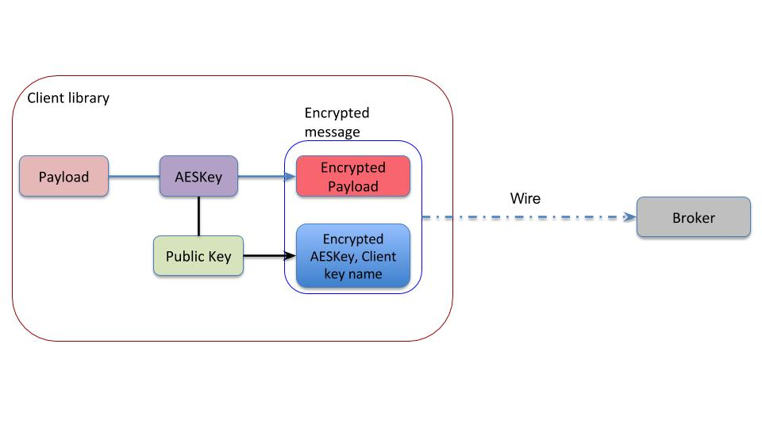
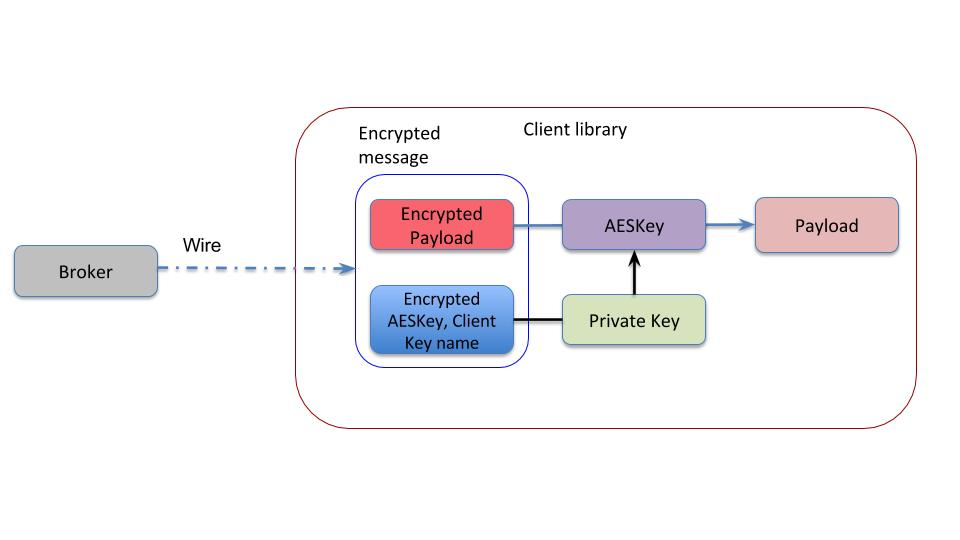

Applications can use Pulsar encryption to encrypt messages at the producer side and decrypt messages at the consumer side. You can use the public and private key pair that the application configures to perform encryption. Only the consumers with a valid key can decrypt the encrypted messages.

## Asymmetric and symmetric encryption

Pulsar uses dynamically generated symmetric AES key to encrypt messages(data). You can use the application provided ECDSA/RSA key pair to encrypt the AES key(data key), so you do not have to share the secret with everyone.

Key is a public and private key pair used for encryption or decryption. The producer key is the public key of the key pair, and the consumer key is the private key of the key pair.

The application configures the producer with the public key. You can use this key to encrypt the AES data key. The encrypted data key is sent as part of message header. Only entities with the private key (in this case the consumer) are able to decrypt the data key which is used to decrypt the message.

You can encrypt a message with more than one key. Any one of the keys used for encrypting the message is sufficient to decrypt the message.

Pulsar does not store the encryption key anywhere in the Pulsar service. If you lose or delete the private key, your message is irretrievably lost, and is unrecoverable.

## Producer


## Consumer


## Get started

1. Enter the commands below to create your ECDSA or RSA public and private key pair.

```shell
openssl ecparam -name secp521r1 -genkey -param_enc explicit -out test_ecdsa_privkey.pem
openssl ec -in test_ecdsa_privkey.pem -pubout -outform pem -out test_ecdsa_pubkey.pem
```

2. Add the public and private key to the key management and configure your producers to retrieve public keys and consumers clients to retrieve private keys.

3. Implement the CryptoKeyReader interface, specifically CryptoKeyReader.getPublicKey() for producer and CryptoKeyReader.getPrivateKey() for consumer, which Pulsar client invokes to load the key.

4. Add encryption key name to producer builder: PulsarClient.newProducer().addEncryptionKey("myapp.key").

5. Add CryptoKeyReader implementation to producer or consumer builder: PulsarClient.newProducer().cryptoKeyReader(keyReader) / PulsarClient.newConsumer().cryptoKeyReader(keyReader).

6. Sample producer application:

```java
class RawFileKeyReader implements CryptoKeyReader {

    String publicKeyFile = "";
    String privateKeyFile = "";

    RawFileKeyReader(String pubKeyFile, String privKeyFile) {
        publicKeyFile = pubKeyFile;
        privateKeyFile = privKeyFile;
    }

    @Override
    public EncryptionKeyInfo getPublicKey(String keyName, Map<String, String> keyMeta) {
        EncryptionKeyInfo keyInfo = new EncryptionKeyInfo();
        try {
            keyInfo.setKey(Files.readAllBytes(Paths.get(publicKeyFile)));
        } catch (IOException e) {
            System.out.println("ERROR: Failed to read public key from file " + publicKeyFile);
            e.printStackTrace();
        }
        return keyInfo;
    }

    @Override
    public EncryptionKeyInfo getPrivateKey(String keyName, Map<String, String> keyMeta) {
        EncryptionKeyInfo keyInfo = new EncryptionKeyInfo();
        try {
            keyInfo.setKey(Files.readAllBytes(Paths.get(privateKeyFile)));
        } catch (IOException e) {
            System.out.println("ERROR: Failed to read private key from file " + privateKeyFile);
            e.printStackTrace();
        }
        return keyInfo;
    }
}

PulsarClient pulsarClient = PulsarClient.builder().serviceUrl("pulsar://localhost:6650").build();

Producer producer = pulsarClient.newProducer()
                .topic("persistent://my-tenant/my-ns/my-topic")
                .addEncryptionKey("myappkey")
                .cryptoKeyReader(new RawFileKeyReader("test_ecdsa_pubkey.pem", "test_ecdsa_privkey.pem"))
                .create();

for (int i = 0; i < 10; i++) {
    producer.send("my-message".getBytes());
}

producer.close();
pulsarClient.close();
```
7. Sample Consumer Application:

```java
class RawFileKeyReader implements CryptoKeyReader {

    String publicKeyFile = "";
    String privateKeyFile = "";

    RawFileKeyReader(String pubKeyFile, String privKeyFile) {
        publicKeyFile = pubKeyFile;
        privateKeyFile = privKeyFile;
    }

    @Override
    public EncryptionKeyInfo getPublicKey(String keyName, Map<String, String> keyMeta) {
        EncryptionKeyInfo keyInfo = new EncryptionKeyInfo();
        try {
            keyInfo.setKey(Files.readAllBytes(Paths.get(publicKeyFile)));
        } catch (IOException e) {
            System.out.println("ERROR: Failed to read public key from file " + publicKeyFile);
            e.printStackTrace();
        }
        return keyInfo;
    }

    @Override
    public EncryptionKeyInfo getPrivateKey(String keyName, Map<String, String> keyMeta) {
        EncryptionKeyInfo keyInfo = new EncryptionKeyInfo();
        try {
            keyInfo.setKey(Files.readAllBytes(Paths.get(privateKeyFile)));
        } catch (IOException e) {
            System.out.println("ERROR: Failed to read private key from file " + privateKeyFile);
            e.printStackTrace();
        }
        return keyInfo;
    }
}

PulsarClient pulsarClient = PulsarClient.builder().serviceUrl("pulsar://localhost:6650").build();
Consumer consumer = pulsarClient.newConsumer()
                .topic("persistent://my-tenant/my-ns/my-topic")
                .subscriptionName("my-subscriber-name")
                .cryptoKeyReader(new RawFileKeyReader("test_ecdsa_pubkey.pem", "test_ecdsa_privkey.pem"))
                .subscribe();
Message msg = null;

for (int i = 0; i < 10; i++) {
    msg = consumer.receive();
    // do something
    System.out.println("Received: " + new String(msg.getData()));
}

// Acknowledge the consumption of all messages at once
consumer.acknowledgeCumulative(msg);
consumer.close();
pulsarClient.close();
```

## Key rotation
Pulsar generates a new AES data key every 4 hours or after publishing a certain number of messages. A producer fetches the asymmetric public key every 4 hours by calling CryptoKeyReader.getPublicKey() to retrieve the latest version.

## Enable encryption at the producer application
If you produce messages that are consumed across application boundaries, you need to ensure that consumers in other applications have access to one of the private keys that can decrypt the messages. You can do this in two ways:
1. The consumer application provides you access to their public key, which you add to your producer keys.
2. You grant access to one of the private keys from the pairs that producer uses. 

When producers want to encrypt the messages with multiple keys, producers add all such keys to the config. Consumer can decrypt the message as long as the consumer has access to at least one of the keys.

If you need to encrypt the messages using 2 keys (myapp.messagekey1 and myapp.messagekey2), refer to the following example.

```java
PulsarClient.newProducer().addEncryptionKey("myapp.messagekey1").addEncryptionKey("myapp.messagekey2");
```
## Decrypt encrypted messages at the consumer application
Consumers require access one of the private keys to decrypt messages that the producer produces. If you want to receive encrypted messages, create a public or private key and give your public key to the producer application to encrypt messages using your public key.

## Handle failures
* Producer/ Consumer loses access to the key
  * Producer action fails indicating the cause of the failure. Application has the option to proceed with sending unencrypted message in such cases. Call PulsarClient.newProducer().cryptoFailureAction(ProducerCryptoFailureAction) to control the producer behavior. The default behavior is to fail the request.
  * If consumption fails due to decryption failure or missing keys in consumer, application has the option to consume the encrypted message or discard it. Call PulsarClient.newConsumer().cryptoFailureAction(ConsumerCryptoFailureAction) to control the consumer behavior. The default behavior is to fail the request. Application is never able to decrypt the messages if the private key is permanently lost.
* Batch messaging
  * If decryption fails and the message contains batch messages, client is not able to retrieve individual messages in the batch, hence message consumption fails even if cryptoFailureAction() is set to ConsumerCryptoFailureAction.CONSUME.
* If decryption fails, the message consumption stops and application notices backlog growth in addition to decryption failure messages in the client log. If application does not have access to the private key to decrypt the message, the only option is to skip or discard backlogged messages. 
