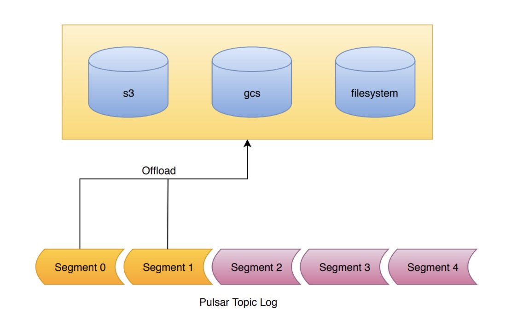

A topic in Pulsar is backed by a log, i.e. a managed ledger, which is composed of an ordered list of segments. Pulsar only writes to the final segment of the log. All previous segments are sealed. The data within the segment is immutable, which is known as a segment oriented architecture.

The Tiered Storage offloading mechanism takes advantage of this segment oriented architecture. When offloading is requested, the segments of the log are copied one by one to tiered storage. All segments of the log, apart from the segment currently being written to can be offloaded.

On the broker, the administrator must configure the bucket and credentials for the cloud storage service.
The configured bucket must exist before attempting to offload. If it does not exist, the offloading operation will fail.

Pulsar uses multi-part objects to upload the segment data. It is possible that a broker could crash while uploading the data.
We recommend you add a life cycle rule to your bucket to expire incomplete multi-part upload after a day or two to avoid
getting charged for incomplete uploads.

