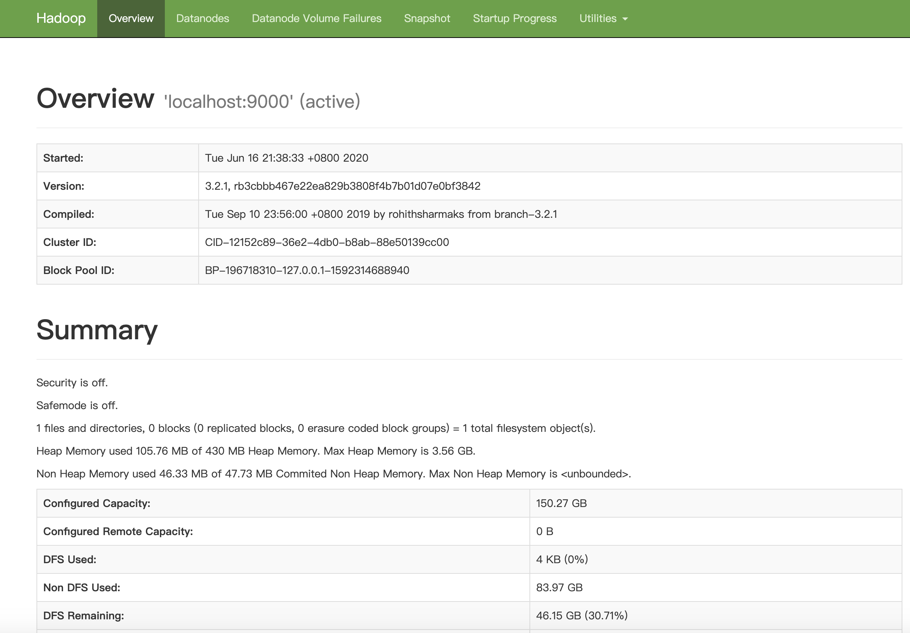
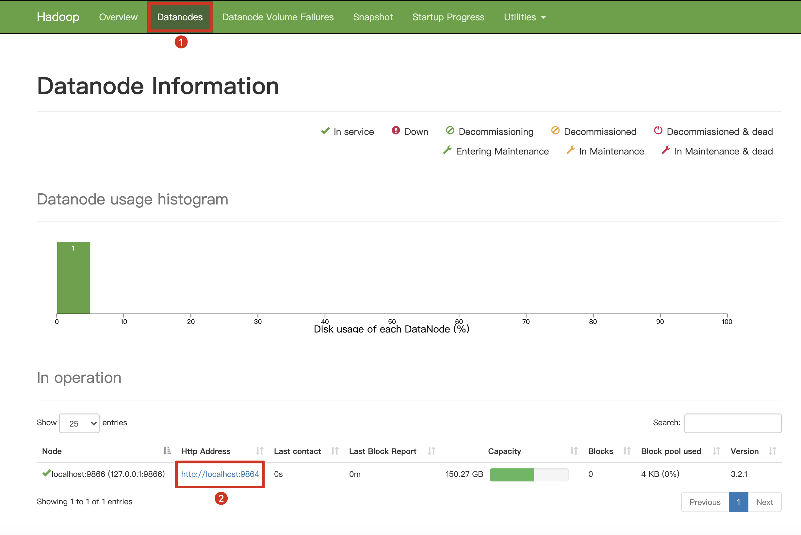
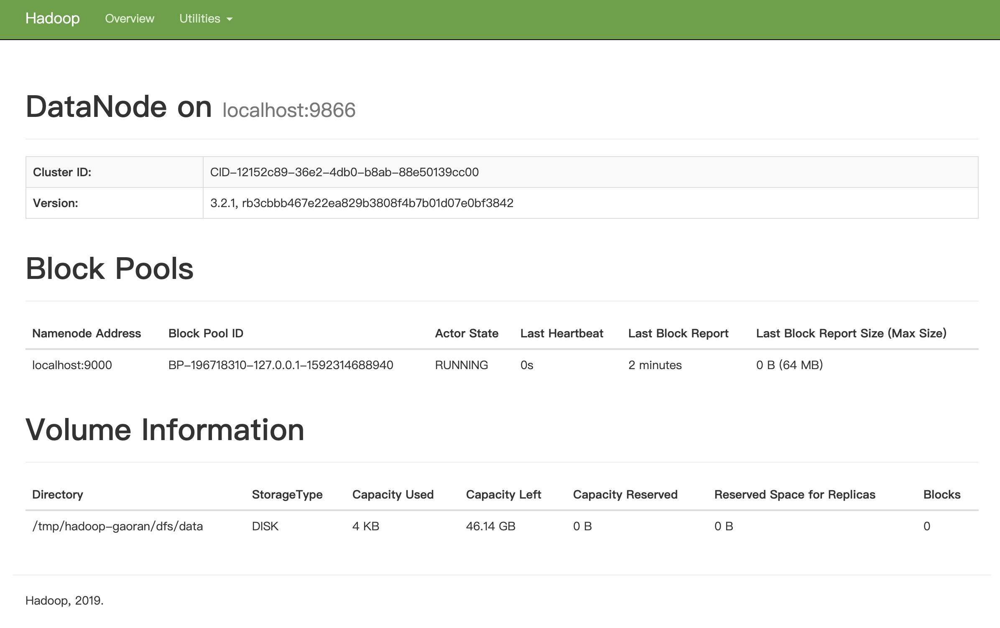
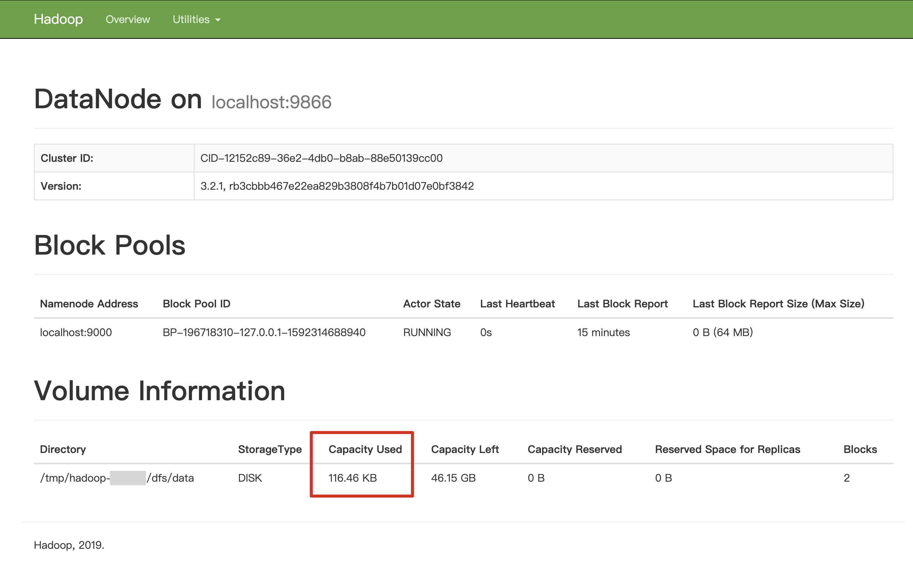

This chapter guides you through every step of installing and configuring the filesystem offloader and using it with Pulsar.

## Installation

This section describes how to install the filesystem offloader.

### Prerequisite

- Pulsar: 2.4.2 or higher versions

### Step

This example uses Pulsar 2.5.1.

1. Download the Pulsar tarball using one of the following ways:

   * Download the Pulsar tarball from the [Apache mirror](https://archive.apache.org/dist/pulsar/pulsar-2.5.1/apache-pulsar-2.5.1-bin.tar.gz)

   * Download the Pulsar tarball from the Pulsar [download page](https://pulsar.apache.org/download)

   * Use the [wget](https://www.gnu.org/software/wget) command to dowload the Pulsar tarball.

     ```shell
     wget https://archive.apache.org/dist/pulsar/pulsar-2.5.1/apache-pulsar-2.5.1-bin.tar.gz
     ```

2. Download and untar the Pulsar offloaders package. 

    ```bash
    wget https://downloads.apache.org/pulsar/pulsar-2.5.1/apache-pulsar-offloaders-2.5.1-bin.tar.gz

    tar xvfz apache-pulsar-offloaders-2.5.1-bin.tar.gz
    ```

    > **Note**
    >
    > * If you run Pulsar in a bare metal cluster, ensure that the `offloaders` tarball is unzipped in every broker's Pulsar directory.
    > 
    > * If you run Pulsar in Docker or deploying Pulsar using a Docker image (such as K8S and DCOS), you can use the `apachepulsar/pulsar-all` image. The `apachepulsar/pulsar-all` image has already bundled tiered storage offloaders.

3. Copy the Pulsar offloaders as `offloaders` in the Pulsar directory.

    ```
    mv apache-pulsar-offloaders-2.5.1/offloaders apache-pulsar-2.5.1/offloaders

    ls offloaders
    ```

    **Output**

    ```
    tiered-storage-file-system-2.5.1.nar
    tiered-storage-jcloud-2.5.1.nar
    ```

    > **Note**
    >
    > * If you run Pulsar in a bare metal cluster, ensure that `offloaders` tarball is unzipped in every broker's Pulsar directory.
    > 
    > * If you run Pulsar in Docker or deploying Pulsar using a Docker image (such as K8s and DCOS), you can use the `apachepulsar/pulsar-all` image. The `apachepulsar/pulsar-all` image has already bundled tiered storage offloaders.

## Configuration

> **Note**
> 
> Before offloading data from BookKeeper to filesystem, you need to configure some properties of the filesystem offloader driver. 

Besides, you can also configure the filesystem offloader to run it automatically or trigger it manually.

### Configure filesystem offloader driver

You can configure the filesystem offloader driver in the `broker.conf` or `standalone.conf` configuration file.

<!--DOCUSAURUS_CODE_TABS-->
<!--HDFS-->

- **Required** configurations are as below.

    Parameter | Description | Example value
    |---|---|---
    `managedLedgerOffloadDriver` | Offloader driver name, which is case-insensitive. | filesystem
    `fileSystemURI` | Connection address, which is the URI to access the default Hadoop distributed file system. | hdfs://127.0.0.1:9000
    `offloadersDirectory` | Hadoop profile path. The configuration file is stored in the Hadoop profile path. It contains various settings for Hadoop performance tuning. | ../conf/filesystem_offload_core_site.xml

- **Optional** configurations are as below.

    Parameter| Description | Example value
    |---|---|---
    `managedLedgerMinLedgerRolloverTimeMinutes`|Minimum time between ledger rollover for a topic. <br><br>**Note**: it is not recommended to set this parameter in the production environment.|2
    `managedLedgerMaxEntriesPerLedger`|Maximum number of entries to append to a ledger before triggering a rollover.<br><br>**Note**: it is not recommended to set this parameter in the production environment.|5000

<!--NFS-->

- **Required** configurations are as below. 
    Parameter | Description | Example value
    |---|---|---
    `managedLedgerOffloadDriver` | Offloader driver name, which is case-insensitive. | filesystem
    `offloadersDirectory` | Offloader directory. The configuration file is stored in the offloader directory. It contains various settings for performance tuning. | ../conf/filesystem_offload_core_site.xml

- **Optional** configurations are as below.

    Parameter| Description | Example value
    |---|---|---
    `managedLedgerMinLedgerRolloverTimeMinutes`|Minimum time between ledger rollover for a topic. <br><br>**Note**: it is not recommended to set this parameter in the production environment.|2
    `managedLedgerMaxEntriesPerLedger`|Maximum number of entries to append to a ledger before triggering a rollover.<br><br>**Note**: it is not recommended to set this parameter in the production environment.|5000

<!--END_DOCUSAURUS_CODE_TABS-->

### Run filesystem offloader automatically

You can configure the namespace policy to offload data automatically once a threshold is reached. The threshold is based on the size of data that a topic has stored on a Pulsar cluster. Once the topic storage reaches the threshold, an offload operation is triggered automatically. 

Threshold value|Action
|---|---
| > 0 | It triggers the offloading operation if the topic storage reaches its threshold.
= 0|It causes a broker to offload data as soon as possible.
< 0 |It disables automatic offloading operation.

Automatic offload runs when a new segment is added to a topic log. If you set the threshold on a namespace, but few messages are being produced to the topic, the filesystem offloader does not work until the current segment is full.

You can configure the threshold using CLI tools, such as pulsar-admin.

#### Example

This example sets the filesystem offloader threshold to 10 MB using pulsar-admin.

```bash
pulsar-admin namespaces set-offload-threshold --size 10M my-tenant/my-namespace
```

> **Tip**
>
> For more information about the `pulsar-admin namespaces set-offload-threshold options` command, including flags, descriptions, default values, and shorthands, see [here](reference-pulsar-admin.md#set-offload-threshold). 

### Run filesystem offloader manually

For individual topics, you can trigger the filesystem offloader manually using one of the following methods:

- Use the REST endpoint.

- Use CLI tools (such as pulsar-admin). 

To manually trigger the filesystem offloader via CLI tools, you need to specify the maximum amount of data (threshold) that should be retained on a Pulsar cluster for a topic. If the size of the topic data on the Pulsar cluster exceeds this threshold, segments from the topic are offloaded to the filesystem until the threshold is no longer exceeded. Older segments are offloaded first.

#### Example

- This example manually run the filesystem offloader using pulsar-admin.

    ```bash
    pulsar-admin topics offload --size-threshold 10M persistent://my-tenant/my-namespace/topic1
    ``` 

    **Output**

    ```bash
    Offload triggered for persistent://my-tenant/my-namespace/topic1 for messages before 2:0:-1
    ```

    > **Tip**
    >
    > For more information about the `pulsar-admin topics offload options` command, including flags, descriptions, default values, and shorthands, see [here](reference-pulsar-admin.md#offload). 

- This example checks filesystem offloader status using pulsar-admin.

    ```bash
    pulsar-admin topics offload-status persistent://my-tenant/my-namespace/topic1
    ```

    **Output**

    ```bash
    Offload is currently running
    ```

    To wait for the filesystem to complete the job, add the `-w` flag.

    ```bash
    pulsar-admin topics offload-status -w persistent://my-tenant/my-namespace/topic1
    ```

    **Output**
    
    ```
    Offload was a success
    ```

    If there is an error in the offloading operation, the error is propagated to the `pulsar-admin topics offload-status` command.

    ```bash
    pulsar-admin topics offload-status persistent://my-tenant/my-namespace/topic1
    ```

    **Output**

    ```
    Error in offload
    null

    Reason: Error offloading: org.apache.bookkeeper.mledger.ManagedLedgerException: java.util.concurrent.CompletionException: com.amazonaws.services.s3.model.AmazonS3Exception: Anonymous users cannot initiate multipart uploads.  Please authenticate. (Service: Amazon S3; Status Code: 403; Error Code: AccessDenied; Request ID: 798758DE3F1776DF; S3 Extended Request ID: dhBFz/lZm1oiG/oBEepeNlhrtsDlzoOhocuYMpKihQGXe6EG8puRGOkK6UwqzVrMXTWBxxHcS+g=), S3 Extended Request ID: dhBFz/lZm1oiG/oBEepeNlhrtsDlzoOhocuYMpKihQGXe6EG8puRGOkK6UwqzVrMXTWBxxHcS+g=
    ```

    > **Tip**
    >
    > For more information about the `pulsar-admin topics offload-status options` command, including flags, descriptions, default values, and shorthands, see [here](reference-pulsar-admin.md#offload-status). 

## Tutorial

This section provides step-by-step instructions on how to use the filesystem offloader to move data from Pulsar to Hadoop Distributed File System (HDFS) or Network File system (NFS).

<!--DOCUSAURUS_CODE_TABS-->
<!--HDFS-->

To move data from Pulsar to HDFS, follow these steps.

### Step 1: Prepare the HDFS environment

This tutorial sets up a Hadoop single node cluster and uses Hadoop 3.2.1.

> **Tip**
>
> For details about how to set up a Hadoop single node cluster, see [here](https://hadoop.apache.org/docs/stable/hadoop-project-dist/hadoop-common/SingleCluster.html).

1. Download and uncompress Hadoop 3.2.1. 

    ```
    wget https://mirrors.bfsu.edu.cn/apache/hadoop/common/hadoop-3.2.1/hadoop-3.2.1.tar.gz  

    tar -zxvf hadoop-3.2.1.tar.gz -C $HADOOP_HOME
    ```

2. Configure Hadoop.

    ```
    # $HADOOP_HOME/etc/hadoop/core-site.xml
    <configuration>
        <property>
            <name>fs.defaultFS</name>
            <value>hdfs://localhost:9000</value>
        </property>
    </configuration>

    # $HADOOP_HOME/etc/hadoop/hdfs-site.xml
    <configuration>
        <property>
            <name>dfs.replication</name>
            <value>1</value>
        </property>
    </configuration>
    ```

3. Set passphraseless ssh.

    ```
    # Now check that you can ssh to the localhost without a passphrase:
    $ ssh localhost
    # If you cannot ssh to localhost without a passphrase, execute the following commands
    $ ssh-keygen -t rsa -P '' -f ~/.ssh/id_rsa
    $ cat ~/.ssh/id_rsa.pub >> ~/.ssh/authorized_keys
    $ chmod 0600 ~/.ssh/authorized_keys
    ```

4. Start HDFS.

    ```
    # don't execute this command repeatedly, repeat execute will cauld the clusterId of the datanode is not consistent with namenode
    $HADOOP_HOME/bin/hadoop namenode -format
    $HADOOP_HOME/sbin/start-dfs.sh
    ```

5. Navigate to the [HDFS website](http://localhost:9870/).

    You can see the **Overview** page.

    


    1. At the top navigation bar, click **Datanodes** to check DataNode information.

        

    2. Click **HTTP Address** to get more detailed information about localhost:9866.

        As can be seen below, the size of **Capacity Used** is 4 KB, which is the initial value.

        

### Step 2: Install the filesystem offloader

For details, see [installation](#installation).

### Step 3: Configure the filesystem offloader

As indicated in the [configuration](#configuration) section, you need to configure some properties for the filesystem offloader driver before using it. This tutorial assumes that you have configured the filesystem offloader driver as below and run Pulsar in **standalone** mode.

Set the following configurations in the `conf/standalone.conf` file.

```conf
managedLedgerOffloadDriver=filesystem
fileSystemURI=hdfs://127.0.0.1:9000
fileSystemProfilePath=../conf/filesystem_offload_core_site.xml
```

> **Note**
>
> For testing purposes, you can set the following two configurations to speed up ledger rollover, but it is not recommended that you set them in the production environment.

```
managedLedgerMinLedgerRolloverTimeMinutes=1
managedLedgerMaxEntriesPerLedger=100
```

<!--NFS-->

> **Note**
>
> In this section, it is assumed that you have enabled NFS service and set the shared path of your NFS service. In this section, `/Users/test` is used as the shared path of NFS service.

To offload data to NFS, follow these steps.

### Step 1: Install the filesystem offloader

For details, see [installation](#installation).

### Step 2: Mont your NFS to your local filesystem

This example mounts mounts */Users/pulsar_nfs* to */Users/test*.

```
mount -e 192.168.0.103:/Users/test/Users/pulsar_nfs
```

### Step 3: Configure the filesystem offloader driver

As indicated in the [configuration](#configuration) section, you need to configure some properties for the filesystem offloader driver before using it. This tutorial assumes that you have configured the filesystem offloader driver as below and run Pulsar in **standalone** mode.

1. Set the following configurations in the `conf/standalone.conf` file.

    ```conf
    managedLedgerOffloadDriver=filesystem
    fileSystemProfilePath=../conf/filesystem_offload_core_site.xml
    ```

2. Modify the *filesystem_offload_core_site.xml* as follows.

    ```
    <property>
        <name>fs.defaultFS</name>
        <value>file:///</value>
    </property>

    <property>
        <name>hadoop.tmp.dir</name>
        <value>file:///Users/pulsar_nfs</value>
    </property>

    <property>
        <name>io.file.buffer.size</name>
        <value>4096</value>
    </property>

    <property>
        <name>io.seqfile.compress.blocksize</name>
        <value>1000000</value>
    </property>
    <property>

        <name>io.seqfile.compression.type</name>
        <value>BLOCK</value>
    </property>

    <property>
        <name>io.map.index.interval</name>
        <value>128</value>
    </property>
    ```

<!--END_DOCUSAURUS_CODE_TABS-->

### Step 4: Offload data from BookKeeper to filesystem

Execute the following commands in the repository where you download Pulsar tarball. For example, `~/path/to/apache-pulsar-2.5.1`.

1. Start Pulsar standalone.

    ```
    ./bin/pulsar standalone -a 127.0.0.1
    ```

2. To ensure the data generated is not deleted immediately, it is recommended to set the [retention policy](https://pulsar.apache.org/docs/en/next/cookbooks-retention-expiry/#retention-policies), which can be either a **size** limit or a **time** limit. The larger value you set for the retention policy, the longer the data can be retained.

    ```
    ./bin/pulsarctl namespaces set-retention public/default --size 100M --time 2d
    ```

    > **Tip**
    >
    > For more information about the `pulsarctl namespaces set-retention options` command, including flags, descriptions, default values, and shorthands, see [here](https://docs.streamnative.io/pulsarctl/v2.7.0.6/#-em-set-retention-em-). 

3. Produce data using pulsar-client.

    ```
    ./bin/pulsar-client produce -m "Hello FileSystem Offloader" -n 1000 public/default/fs-test
    ```

4. The offloading operation starts after a ledger rollover is triggered. To ensure offload data successfully, it is recommended that you wait until several ledger rollovers are triggered. In this case, you might need to wait for a second. You can check the ledger status using pulsarctl.

    ```
    ./bin/pulsarctl topics internal-stats public/default/fs-test
    ```

    **Output**

    The data of the ledger 696 is not offloaded.

    ```
    {
    "version": 1,
    "creationDate": "2020-06-16T21:46:25.807+08:00",
    "modificationDate": "2020-06-16T21:46:25.821+08:00",
    "ledgers": [
    {
        "ledgerId": 696,
        "isOffloaded": false
    }
    ],
    "cursors": {}
    }
    ```

5. Wait a second and send more messages to the topic.

    ```
    ./bin/pulsar-client produce -m "Hello FileSystem Offloader" -n 1000 public/default/fs-test
    ```

6. Check the ledger status using pulsarctl.

    ```
    ./bin/pulsarctl topics internal-stats public/default/fs-test
    ```

    **Output**

    The ledger 696 is rollovered.

    ```
    {
    "version": 2,
    "creationDate": "2020-06-16T21:46:25.807+08:00",
    "modificationDate": "2020-06-16T21:48:52.288+08:00",
    "ledgers": [
    {
        "ledgerId": 696,
        "entries": 1001,
        "size": 81695,
        "isOffloaded": false
    },
    {
        "ledgerId": 697,
        "isOffloaded": false
    }
    ],
    "cursors": {}
    }
    ```

7. Trigger the offloading operation manually using pulsarctl.

    ```
    ./bin/pulsarctl topic offload -s 0 public/default/fs-test
    ```

    **Output**

    Data in ledgers before the ledge 697 is offloaded.

    ```
    # offload info, the ledgers before 697 will be offloaded
    Offload triggered for persistent://public/default/fs-test3 for messages before 697:0:-1
    ```

8.  Check the ledger status using pulsarctl.

    ```
    ./bin/pulsarctl topic internal-info public/default/fs-test
    ```

    **Output**

    The data of the ledger 696 is offloaded.

    ```
    {
    "version": 4,
    "creationDate": "2020-06-16T21:46:25.807+08:00",
    "modificationDate": "2020-06-16T21:52:13.25+08:00",
    "ledgers": [
    {
        "ledgerId": 696,
        "entries": 1001,
        "size": 81695,
        "isOffloaded": true
    },
    {
        "ledgerId": 697,
        "isOffloaded": false
    }
    ],
    "cursors": {}
    }
    ```

    And the **Capacity Used** is changed from 4 KB to 116.46 KB.

    