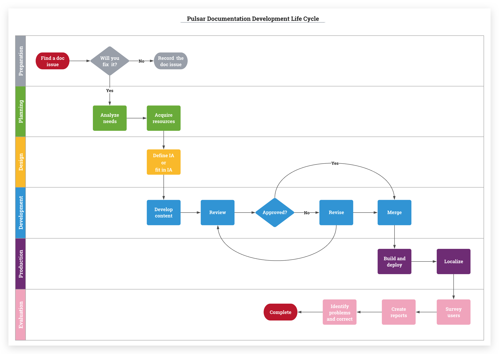

# Pulsar website and documentation

Pulsar website is comprised of two parts: website pages (including blog posts) and documentation.

You can run the website locally to test your updates. The documentation is written in English, and we also encourage contributions in different languages.


## Website

Pulsar website framework adopts [Docusaurus](https://docusaurus.io/). Website pages are non-versioned. They are placed in the `/site2/website` directory. Ensure that you have installed the latest version of [Node](https://nodejs.org/en/download/) and [Yarn](https://yarnpkg.com/en/docs/install) before running the site locally.

> You have to be on Node >= 8.x and Yarn >= 1.5.

### Run the site locally

To run the site locally, enter the following commands.

```bash 
git clone https://github.com/apache/pulsar.git
cd pulsar/site2/website
yarn install
yarn start
```
> Notes
> 
> 1. If you have installed `yarn`, you can skip the `yarn install` command.
> 2. After you enter the `yarn start` command, you will be navigated to a local address, for example, `http://localhost:3000`. Click `Docs` to see documentation for the latest release of Pulsar. 
> 3. The `http://localhost:3000/en/versions` path shows the documentation for all versions. To view your local changes, click `Documentation` in **Latest Version**, or enter `http://localhost:3000/docs/en/next/standalone` in a browser.

### Tests

To run tests locally, enter the following commands
```bash
cd pulsar/site2/website
yarn test
```

### Check

Before submitting a pull request, run the following command to make sure no broken links exist.

```
cd pulsar/site2/website
yarn build
```

If warning messages are shown as below, it means broken links exist.

```
[WARN] unresolved links in file 'version-2.4.1/getting-started-standalone.md' > [ 'security-overview.md' ]

[WARN] unresolved links in file 'version-2.4.0/io-managing.md' > [ 'functions-overview.md' ]
```

Fix the broken links manually and then send a pull request.

Besides, you can use an automatic checker tool to crawl through the Pulsar website and identify dead links, for example, [Dr. Link Checker](https://www.drlinkcheck.com/).

## Documentation

This is the **Pulsar Document Development Life Cycle** (DDLC). It is essential for developing a document to enhance the precision and understandability for users. In general, documentation contributors involve themselves in the following phases.



Pulsar documents are written in English. Documentation related pages are placed in the `/site2/docs` directory. All documentation pages are versioned. For more details, refer to [versioning](#versioning).

### Contribute to documentation

We welcome contributions to help improve Pulsar documentation. The documents are written in [Markdown](http://daringfireball.net/projects/markdown/syntax) and follow [Google Developer Documentation Style Guide](https://developers.google.com/style/). If you are not familiar with the writing styles, we are happy to guide you along the way.

For workflow on how to contribute to Pulsar, refer to [contribution](http://pulsar.apache.org/en/contributing/) guidelines.

To learn more about Pulsar documents, read the following instructions.

### Layout

The markdown files placed in the `docs` directory adopt a flat structure.

```
├── docs
│   ├── adaptors-kafka.md
│   ├── adaptors-spark.md
│   ├── adaptors-storm.md
│   ├── admin-api-brokers.md
│   ├── admin-api-clusters.md
│   ├── admin-api-namespaces.md
│   ├── admin-api-overview.md
│   ├── admin-api-permissions.md
│   ├── admin-api-topics.md
│   ├── admin-api-tenants.md
│   ├── administration-dashboard.md
│   ├── administration-geo.md
│   ├── administration-load-distribution.md
│   ├── administration-proxy.md
...
```

All the files are named in the following convention:

```
<category>-<page-name>.md
```

`<category>` is the category within the sidebar that this file belongs to, while `<page-name>` is the string to name the file within this category.

### Markdown Headers

All the documents are usual Markdown files. However you need to add some Docusaurus-specific fields in Markdown headers in order to link them correctly to the [Sidebar](#sidebar) and [Navigation Bar](#navigation).

`id`: A unique document ID. If this field is not specified, the document ID defaults to its file name (without the extension).

`title`: The title of the document. If this field is not specified, the document title defaults to its id.

`hide_title`: Whether to hide the title at the top of the doc.

`sidebar_label`: The text shown in the document sidebar for this document. If this field is not specified, the document `sidebar_label` defaults to its title.

For example:

```bash
---
id: io-overview
title: Pulsar IO Overview
sidebar_label: Overview
---
```

### Link to another document

To link to other documentation files, you can use relative URLs, which will be automatically converted to the corresponding HTML links when they are rendered.

Example:

```md
[This links to another document](other-document.md)
```

The markdown file will be automatically converted into a link to /docs/other-document.html (or the appropriately translated/versioned link) once it is rendered.

This helps when you want to navigate through docs on GitHub since the links there are functional links to other documents (still on GitHub), and the documents have the correct HTML links when they are rendered.

### Link to javadoc of Pulsar class

We have a [remarkable plugin](https://github.com/jonschlinkert/remarkable) to generate links to the javadoc for Pulsar classes.
You can write them in the following syntax:

```shell
{@inject: javadoc:<Display Name>:<Relative-Path-To-Javadoc-Html-File>}
```

For example, the following line generates a hyperlink to the javadoc of `PulsarAdmin` class.

```shell
{@inject: javadoc:PulsarAdmin:/admin/org/apache/pulsar/client/admin/PulsarAdmin.html}
```

### Link to files in Pulsar GitHub repository

We use the same [remarkable plugin](https://github.com/jonschlinkert/remarkable) to generate links to files in Pulsar GitHub repository.

You can write it using similar syntax:

```shell
{@inject: github:<Display Text>:<Relative-Path-To-Files>}
```

For example, the following line generates a hyperlink to the dashboard Dockerfile.

```
{@inject: github:`Dockerfile`:/dashboard/Dockerfile}
```

For more details about markdown features, read [here](https://docusaurus.io/docs/en/doc-markdown).

### Sidebar

All the sidebars are defined in a `sidebars.json` file in the `website` directory. The documentation sidebar is named `docs` in the JSON structure.

When you want to add a page to sidebar, you can add the document `id` you used in the document header to the existing sidebar/category. In the example below,
`docs` is the name of the sidebar, "Getting started" is a category within the sidebar, and "pulsar-2.0" is the `id` of a document.

```bash
{
  "docs": {
    "Getting started": [
      "pulsar-2.0",
      "standalone",
      "standalone-docker",
      "client-libraries",
      "concepts-architecture"
    ],
    ...
  }
}
```

### Navigation

To add links to the top navigation bar, you can add entries to the `headerLinks` of `siteConfig.js` under `website` directory.

To learn different types of links you can add to the top navigation bar, refer to [Navigation and Sidebars](https://docusaurus.io/docs/en/navigation).

### Versioning

Documentation versioning with Docusaurus becomes simpler. When done with a new release, just simply run the following command.

```shell
yarn run version ${version}
```

This preserves all markdown files in the `docs` directory and make them available as documentation for version `${version}`.
Versioned documents are placed into `website/versioned_docs/version-${version}`, where `${version}` is the version number
you supplied in the command above.

Versioned sidebars are also copied into `website/versioned_sidebars` and are named as `version-${version}-sidebars.json`.

If you want to change the documentation for a previous version, you can access files for that respective version.

For more details about versioning, refer to [Versioning](https://docusaurus.io/docs/en/versioning).

## C++ client API doc

You can use the C++ client API to connect to a Pulsar cluster and handles data. [Pulsar C++ client API doc](https://pulsar.apache.org/api/cpp/https://pulsar.apache.org/api/cpp/) provides extensive implementation details and usage conventions for the C++ client. 

If you want to modify the C++ client API doc, follow the steps below.

**Prerequisite**

- [Doxygen](http://www.doxygen.nl/)
  
  Pulsar uses [Doxygen](http://www.doxygen.nl/) to generate the C++ client API doc. Before submitting doc changes, you need to preview the docs using Doxygen. 
  
  1. Install Doxygen.
   
     Go to the directory `pulsar/pulsar-client-cpp` and run the command `brew install doxygen` (MacOS). 
  
  2. Create a folder for the generated HTML files.

     Go to the directory `pulsar` and run the command `mkdir -p ../target/doxygen`.
  
- [clang-format](https://www.electronjs.org/docs/development/clang-format#:~:text=clang%2Dformat%20is%20a%20tool,style%20issues%20during%20code%20reviews)

  Long code lines might cause C++ API tests to fail. Consequently, before submitting doc changes, you can break long lines of code automatically using `clang-format`.

  To install clang-format, go to the directory `pulsar` and run the command `brew install clang-format` (MacOS).

**Step**

1. Modify your desired code file.
   
   All C++ API code files are stored at [here](https://github.com/apache/pulsar/tree/master/pulsar-client-cpp/include/pulsar). 
   
   > #### Tip
   >
   > - Each class has its corresponding `h` file. For example, if you want to update the [ProducerConfiguration class](https://pulsar.apache.org/api/cpp/classpulsar_1_1_producer_configuration.html), you need to modify the file [ProducerConfiguration.h](https://github.com/apache/pulsar/blob/master/pulsar-client-cpp/include/pulsar/ProducerConfiguration.h).
   > 
   > - If you want to update descriptions for member functions, you can take [Pulsar Java API doc](https://github.com/apache/pulsar/tree/master/pulsar-client-api/src/main/java/org/apache/pulsar/client/api) as references.

2. Format the code file.
   
   Go to the directory `pulsar/pulsar-client-cpp` and run the command `clang-format -i include/pulsar/<your-file-name>`.

   Check your file to make sure that the long lines are broken into short lines.

3. Preview the code changes.
   
   Go to the directory `pulsar/pulsar-client-cpp` and run the command `doxygen`. 
   
   All HTML files are stored at the folder `pulsar/target/doxygen/html`. Check your file to make sure that all changes take effect. 

4. Submit your doc PR. 
   
   [Here](https://github.com/apache/pulsar/pull/9822) is an example.

## Translation and localization

Docusaurus makes it easy to use translation functionality using [Crowdin](https://crowdin.com/).
All the markdown files are written in English. These markdown files are uploaded to Crowdin for translation by users within a community. Top-level pages are also written in English.
The strings that are needed to be translated are wrapped in a `<translate>` tag.

[Pulsar Website Build](https://builds.apache.org/job/pulsar-website-build/) pulls down and uploads translation for all the Pulsar website documentation files automatically. Once it pulls down translation from Crowdin, it will build the translation into the website.

### Contribute translation

Translation is stored and managed in the [Pulsar Crowdin project](https://crowdin.com/project/apache-pulsar).
To contribute translation, you can simply create a Crowdin account, join the project and make contributions.
Crowdin provides very good documentation for translators. You can read [Crowdin Knowledge Base](https://support.crowdin.com/crowdin-intro/) before contributing.

Translation you contribute is licensed under [Apache License V2](https://www.apache.org/licenses/LICENSE-2.0).
Pulsar Committers will review translation. If your translation is not reviewed or approved by any committer, feel free to reach out via [slack channel](https://apache-pulsar.herokuapp.com/) or [mailing lists](https://pulsar.apache.org/contact/).

### Download translated docs

When you find display issues on the translated pages, you can download the translated docs from Crowdin, and follow the instructions below to debug and fix issues.

1. Install Java (optional)
If you have installed Java, skip this step. If you have not installed [Java](https://java.com/en/), install the latest version.
If you are using Mac OS, you can use the following command to install Java:  

```
brew cask install java
```

2. Install Crowdin CLI

To download the translated markdown files, you need to install [Crowdin CLI](https://support.crowdin.com/cli-tool/#installation).

3. Set environment variables

You need to set the following environment variables:

```
export CROWDIN_DOCUSAURUS_PROJECT_ID="apache-pulsar"
export CROWDIN_DOCUSAURUS_API_KEY=<crowdin-pulsar-api-key>
```

You can find the API Key of Pulsar Crowdin project [here](https://crowdin.com/project/apache-pulsar/settings#api). Only PMC members and
committers are able to retrieve the API key. If the API key is invalid, regenerate.

4. Download the translated docs

Now you are ready to download the translated docs from Crowdin.

```
$ cd ${PULSAR_HOME}/site2/website
# download all translated docs
$ yarn crowdin-download
# download the translated docs for `zh-CN`
$ yarn crowdin-download -l zh-CN
```

The translated docs are downloaded to the `site2/website/translated_docs` directory.

### Check issues, fix and verify

After downloading the translated documents, you can open the target markdown file, check issues and fix them.
To verify if you have fixed the issues correctly, [run the site locally](#run-the-site-locally).
