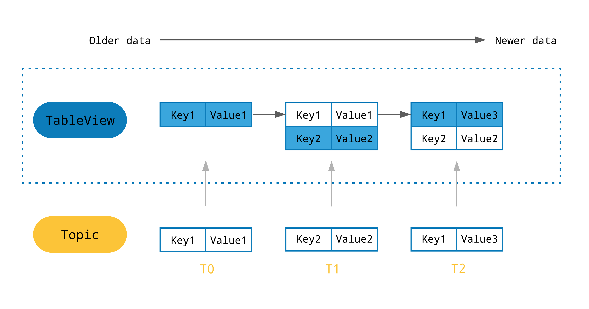

You can use a Pulsar Java client to create the Java [producer](#producer), [consumer](#consumer), [readers](#reader) and [TableView](#tableview) of messages and to perform [administrative tasks](admin-api-overview.md). The current Java client version is **{{pulsar:version}}**.

All the methods in [producer](#producer), [consumer](#consumer), [readers](#reader) and [TableView](#tableview) of a Java client are thread-safe.

Javadoc for the Pulsar client is divided into two domains by package as follows.

Package | Description | Maven Artifact
:-------|:------------|:--------------
[`org.apache.pulsar.client.api`](/api/client) | The producer and consumer API | [org.apache.pulsar:pulsar-client:{{pulsar:version}}](http://search.maven.org/#artifactdetails%7Corg.apache.pulsar%7Cpulsar-client%7C{{pulsar:version}}%7Cjar)
[`org.apache.pulsar.client.admin`](/api/admin) | The Java [admin API](admin-api-overview.md) | [org.apache.pulsar:pulsar-client-admin:{{pulsar:version}}](http://search.maven.org/#artifactdetails%7Corg.apache.pulsar%7Cpulsar-client-admin%7C{{pulsar:version}}%7Cjar)
`org.apache.pulsar.client.all` |Include both `pulsar-client` and `pulsar-client-admin`<br /> Both `pulsar-client` and `pulsar-client-admin` are shaded packages and they shade dependencies independently. Consequently, the applications using both `pulsar-client` and `pulsar-client-admin` have redundant shaded classes. It would be troublesome if you introduce new dependencies but forget to update shading rules. <br /> In this case, you can use `pulsar-client-all`, which shades dependencies only one time and reduces the size of dependencies.  |[org.apache.pulsar:pulsar-client-all:{{pulsar:version}}](http://search.maven.org/#artifactdetails%7Corg.apache.pulsar%7Cpulsar-client-all%7C{{pulsar:version}}%7Cjar)

This document focuses only on the client API for producing and consuming messages on Pulsar topics. For how to use the Java admin client, see [Pulsar admin interface](admin-api-overview.md).

## Installation

The latest version of the Pulsar Java client library is available via [Maven Central](http://search.maven.org/#artifactdetails%7Corg.apache.pulsar%7Cpulsar-client%7C{{pulsar:version}}%7Cjar). To use the latest version, add the `pulsar-client` library to your build configuration.

### Maven

If you use Maven, add the following information to the `pom.xml` file.

```xml
<!-- in your <properties> block -->
<pulsar.version>{{pulsar:version}}</pulsar.version>

<!-- in your <dependencies> block -->
<dependency>
  <groupId>org.apache.pulsar</groupId>
  <artifactId>pulsar-client</artifactId>
  <version>${pulsar.version}</version>
</dependency>
```

### Gradle

If you use Gradle, add the following information to the `build.gradle` file.

```groovy
def pulsarVersion = '{{pulsar:version}}'

dependencies {
    compile group: 'org.apache.pulsar', name: 'pulsar-client', version: pulsarVersion
}
```

## Connection URLs

To connect to Pulsar using client libraries, you need to specify a [Pulsar protocol](developing-binary-protocol.md) URL.

You can assign Pulsar protocol URLs to specific clusters and use the `pulsar` scheme. The default port is `6650`. The following is an example of `localhost`.

```http
pulsar://localhost:6650
```

If you have multiple brokers, the URL is as follows.

```http
pulsar://localhost:6550,localhost:6651,localhost:6652
```

A URL for a production Pulsar cluster is as follows.

```http
pulsar://pulsar.us-west.example.com:6650
```

If you use [TLS](security-tls-authentication.md) authentication, the URL is as follows. 

```http
pulsar+ssl://pulsar.us-west.example.com:6651
```

## Client 

You can instantiate a {@inject: javadoc:PulsarClient:/client/org/apache/pulsar/client/api/PulsarClient} object using just a URL for the target Pulsar [cluster](reference-terminology.md#cluster) like this:

```java
PulsarClient client = PulsarClient.builder()
        .serviceUrl("pulsar://localhost:6650")
        .build();
```

If you have multiple brokers, you can initiate a PulsarClient like this:
```java
PulsarClient client = PulsarClient.builder()
        .serviceUrl("pulsar://localhost:6650,localhost:6651,localhost:6652")
        .build();
```

> ### Default broker URLs for standalone clusters
> If you run a cluster in [standalone mode](getting-started-standalone.md), the broker is available at the `pulsar://localhost:6650` URL by default.

If you create a client, you can use the `loadConf` configuration. The following parameters are available in `loadConf`.

| Name | Type |  <div style="width:260px">Description</div> | Default
|---|---|---|---
`serviceUrl` | String | Service URL provider for Pulsar service | None
`authPluginClassName` | String | Name of the authentication plugin | None
 `authParams` | String | Parameters for the authentication plugin <br /><br />**Example**<br /> key1:val1,key2:val2|None
`operationTimeoutMs`|long|`operationTimeoutMs`|Operation timeout |30000
`statsIntervalSeconds`|long|Interval between each stats information<br /><br />Stats is activated with positive `statsInterval`<br /><br />Set `statsIntervalSeconds` to 1 second at least. |60
`numIoThreads`| int| The number of threads used for handling connections to brokers | 1 
`numListenerThreads`|int|The number of threads used for handling message listeners. The listener thread pool is shared across all the consumers and readers using the "listener" model to get messages. For a given consumer, the listener is always invoked from the same thread to ensure ordering. If you want multiple threads to process a single topic, you need to create a [`shared`](https://pulsar.apache.org/docs/en/next/concepts-messaging/#shared) subscription and multiple consumers for this subscription. This does not ensure ordering.| 1 
`useTcpNoDelay`| boolean| Whether to use TCP no-delay flag on the connection to disable Nagle algorithm |true
`useTls` |boolean |Whether to use TLS encryption on the connection| false
 `tlsTrustCertsFilePath` |string |Path to the trusted TLS certificate file|None
`tlsAllowInsecureConnection`|boolean|Whether the Pulsar client accepts untrusted TLS certificate from broker | false
`tlsHostnameVerificationEnable` |boolean |  Whether to enable TLS hostname verification|false
`concurrentLookupRequest`|int|The number of concurrent lookup requests allowed to send on each broker connection to prevent overload on broker|5000
`maxLookupRequest`|int|The maximum number of lookup requests allowed on each broker connection to prevent overload on broker | 50000
`maxNumberOfRejectedRequestPerConnection`|int|The maximum number of rejected requests of a broker in a certain time frame (30 seconds) after the current connection is closed and the client creates a new connection to connect to a different broker|50
`keepAliveIntervalSeconds`|int|Seconds of keeping alive interval for each client broker connection|30
`connectionTimeoutMs`|int|Duration of waiting for a connection to a broker to be established <br /><br />If the duration passes without a response from a broker, the connection attempt is dropped|10000
`requestTimeoutMs`|int|Maximum duration for completing a request |60000
`defaultBackoffIntervalNanos`|int| Default duration for a backoff interval | TimeUnit.MILLISECONDS.toNanos(100);
`maxBackoffIntervalNanos`|long|Maximum duration for a backoff interval|TimeUnit.SECONDS.toNanos(30)
`socks5ProxyAddress`|SocketAddress|SOCKS5 proxy address | None
`socks5ProxyUsername`|string|SOCKS5 proxy username | None
`socks5ProxyPassword`|string|SOCKS5 proxy password | None

Check out the Javadoc for the {@inject: javadoc:PulsarClient:/client/org/apache/pulsar/client/api/PulsarClient} class for a full list of configurable parameters.

> In addition to client-level configuration, you can also apply [producer](#configure-producer) and [consumer](#configure-consumer) specific configuration as described in sections below.

### Client memory allocator configuration
You can set the client memory allocator configurations through Java properties.<br/>

| Property | Type |  <div>Description</div> | Default | Available values
|---|---|---|---|---
`pulsar.allocator.pooled` | String | If set to `true`, the client uses a direct memory pool. </br> If set to `false`, the client uses a heap memory without pool | true | <li> true </li> <li> false </li> 
`pulsar.allocator.exit_on_oom` | String | Whether to exit the JVM when OOM happens | false |  <li> true </li> <li> false </li>
`pulsar.allocator.leak_detection` | String | Service URL provider for Pulsar service | Disabled | <li> Disabled </li> <li> Simple </li> <li> Advanced </li> <li> Paranoid </li>
`pulsar.allocator.out_of_memory_policy` | String | When an OOM occurs, the client throws an exception or fallbacks to heap | FallbackToHeap | <li> ThrowException </li> <li> FallbackToHeap </li>

**Example**:
```
-Dpulsar.allocator.pooled=true
-Dpulsar.allocator.exit_on_oom=false
-Dpulsar.allocator.leak_detection=Disabled
-Dpulsar.allocator.out_of_memory_policy=ThrowException
```

## Producer

In Pulsar, producers write messages to topics. Once you've instantiated a {@inject: javadoc:PulsarClient:/client/org/apache/pulsar/client/api/PulsarClient} object (as in the section [above](#client-configuration)), you can create a {@inject: javadoc:Producer:/client/org/apache/pulsar/client/api/Producer} for a specific Pulsar [topic](reference-terminology.md#topic).

```java
Producer<byte[]> producer = client.newProducer()
        .topic("my-topic")
        .create();

// You can then send messages to the broker and topic you specified:
producer.send("My message".getBytes());
```

By default, producers produce messages that consist of byte arrays. You can produce different types by specifying a message [schema](#schema).

```java
Producer<String> stringProducer = client.newProducer(Schema.STRING)
        .topic("my-topic")
        .create();
stringProducer.send("My message");
```

> Make sure that you close your producers, consumers, and clients when you do not need them.
> ```java
> producer.close();
> consumer.close();
> client.close();
> ```
>
> Close operations can also be asynchronous:
> ```java
> producer.closeAsync()
>    .thenRun(() -> System.out.println("Producer closed"))
>    .exceptionally((ex) -> {
>        System.err.println("Failed to close producer: " + ex);
>        return null;
>    });
> ```

### Configure producer

If you instantiate a `Producer` object by specifying only a topic name as the example above, the default configuration of producer is used.

If you create a producer, you can use the `loadConf` configuration. The following parameters are available in `loadConf`.

Name| Type |  <div style="width:300px">Description</div>|  Default
|---|---|---|---
`topicName`| string|		Topic name| null|
`producerName`| string|Producer name| null
`sendTimeoutMs`| long|Message send timeout in ms.<br />If a message is not acknowledged by a server before the `sendTimeout` expires, an error occurs.|30000
`blockIfQueueFull`|boolean|If it is set to `true`, when the outgoing message queue is full, the `Send` and `SendAsync` methods of producer block, rather than failing and throwing errors. <br />If it is set to `false`, when the outgoing message queue is full, the `Send` and `SendAsync` methods of producer fail and `ProducerQueueIsFullError` exceptions occur.<br /><br />The `MaxPendingMessages` parameter determines the size of the outgoing message queue.|false
`maxPendingMessages`| int|The maximum size of a queue holding pending messages.<br /><br />For example, a message waiting to receive an acknowledgment from a [broker](reference-terminology.md#broker). <br /><br />By default, when the queue is full, all calls to the `Send` and `SendAsync` methods fail **unless** you set `BlockIfQueueFull` to `true`.|1000
`maxPendingMessagesAcrossPartitions`|int|The maximum number of pending messages across partitions. <br /><br />Use the setting to lower the max pending messages for each partition ({@link #setMaxPendingMessages(int)}) if the total number exceeds the configured value.|50000
`messageRoutingMode`| MessageRoutingMode|Message routing logic for producers on [partitioned topics](concepts-architecture-overview.md#partitioned-topics).<br /> Apply the logic only when setting no key on messages. <br />Available options are as follows: <br /><li>`pulsar.RoundRobinDistribution`: round robin</li><li>`pulsar.UseSinglePartition`: publish all messages to a single partition</li><li>`pulsar.CustomPartition`: a custom partitioning scheme|`pulsar.RoundRobinDistribution`</li>
`hashingScheme`| HashingScheme|Hashing function determining the partition where you publish a particular message (**partitioned topics only**).<br />Available options are as follows:<br /><li> `pulsar.JavastringHash`: the equivalent of `string.hashCode()` in Java</li><li> `pulsar.Murmur3_32Hash`: applies the [Murmur3](https://en.wikipedia.org/wiki/MurmurHash) hashing function</li><li>`pulsar.BoostHash`: applies the hashing function from C++'s [Boost](https://www.boost.org/doc/libs/1_62_0/doc/html/hash.html) library</li> |`HashingScheme.JavastringHash`
`cryptoFailureAction`| ProducerCryptoFailureAction|Producer should take action when encryption fails.<br /><li>**FAIL**: if encryption fails, unencrypted messages fail to send.</li><li> **SEND**: if encryption fails, unencrypted messages are sent.</li> |`ProducerCryptoFailureAction.FAIL`
`batchingMaxPublishDelayMicros`| long|Batching time period of sending messages.|TimeUnit.MILLISECONDS.toMicros(1)
`batchingMaxMessages` |int|The maximum number of messages permitted in a batch.|1000
`batchingEnabled`| boolean|Enable batching of messages. |true
`chunkingEnabled` | boolean | Enable chunking of messages. |false
`compressionType`|CompressionType|Message data compression type used by a producer. <br />Available options:<li>[`LZ4`](https://github.com/lz4/lz4)</li><li>[`ZLIB`](https://zlib.net/)<br /><li>[`ZSTD`](https://facebook.github.io/zstd/)</li><li>[`SNAPPY`](https://google.github.io/snappy/)</li>| No compression
`initialSubscriptionName`|string|Use this configuration to automatically create an initial subscription when creating a topic. If this field is not set, the initial subscription is not created.|null

You can configure parameters if you do not want to use the default configuration.

For a full list, see the Javadoc for the {@inject: javadoc:ProducerBuilder:/client/org/apache/pulsar/client/api/ProducerBuilder} class. The following is an example.

```java
Producer<byte[]> producer = client.newProducer()
    .topic("my-topic")
    .batchingMaxPublishDelay(10, TimeUnit.MILLISECONDS)
    .sendTimeout(10, TimeUnit.SECONDS)
    .blockIfQueueFull(true)
    .create();
```

### Message routing

When using partitioned topics, you can specify the routing mode whenever you publish messages using a producer. For more information on specifying a routing mode using the Java client, see the [Partitioned Topics cookbook](cookbooks-partitioned.md).

### Async send

You can publish messages [asynchronously](concepts-messaging.md#send-modes) using the Java client. With async send, the producer puts the message in a blocking queue and returns it immediately. Then the client library sends the message to the broker in the background. If the queue is full (max size configurable), the producer is blocked or fails immediately when calling the API, depending on arguments passed to the producer.

The following is an example.

```java
producer.sendAsync("my-async-message".getBytes()).thenAccept(msgId -> {
    System.out.println("Message with ID " + msgId + " successfully sent");
});
```

As you can see from the example above, async send operations return a {@inject: javadoc:MessageId:/client/org/apache/pulsar/client/api/MessageId} wrapped in a [`CompletableFuture`](http://www.baeldung.com/java-completablefuture).

### Configure messages

In addition to a value, you can set additional items on a given message:

```java
producer.newMessage()
    .key("my-message-key")
    .value("my-async-message".getBytes())
    .property("my-key", "my-value")
    .property("my-other-key", "my-other-value")
    .send();
```

You can terminate the builder chain with `sendAsync()` and get a future return.

### Enable chunking

Message [chunking](concepts-messaging.md#chunking) enables Pulsar to process large payload messages by splitting the message into chunks at the producer side and aggregating chunked messages at the consumer side. 

The message chunking feature is OFF by default. The following is an example about how to enable message chunking when creating a producer.

```java
Producer<byte[]> producer = client.newProducer()
        .topic(topic)
        .enableChunking(true)
        .enableBatching(false)
        .create();
```
> **Note:** To enable chunking, you need to disable batching (`enableBatching`=`false`) concurrently.

## Consumer

In Pulsar, consumers subscribe to topics and handle messages that producers publish to those topics. You can instantiate a new [consumer](reference-terminology.md#consumer) by first instantiating a {@inject: javadoc:PulsarClient:/client/org/apache/pulsar/client/api/PulsarClient} object and passing it a URL for a Pulsar broker (as [above](#client-configuration)).

Once you've instantiated a {@inject: javadoc:PulsarClient:/client/org/apache/pulsar/client/api/PulsarClient} object, you can create a {@inject: javadoc:Consumer:/client/org/apache/pulsar/client/api/Consumer} by specifying a [topic](reference-terminology.md#topic) and a [subscription](concepts-messaging.md#subscription-types).

```java
Consumer consumer = client.newConsumer()
        .topic("my-topic")
        .subscriptionName("my-subscription")
        .subscribe();
```

The `subscribe` method will auto subscribe the consumer to the specified topic and subscription. One way to make the consumer listen on the topic is to set up a `while` loop. In this example loop, the consumer listens for messages, prints the contents of any received message, and then [acknowledges](reference-terminology.md#acknowledgment-ack) that the message has been processed. If the processing logic fails, you can use [negative acknowledgement](reference-terminology.md#acknowledgment-ack) to redeliver the message later.

```java
while (true) {
  // Wait for a message
  Message msg = consumer.receive();

  try {
      // Do something with the message
      System.out.println("Message received: " + new String(msg.getData()));

      // Acknowledge the message so that it can be deleted by the message broker
      consumer.acknowledge(msg);
  } catch (Exception e) {
      // Message failed to process, redeliver later
      consumer.negativeAcknowledge(msg);
  }
}
```
        
If you don't want to block your main thread and rather listen constantly for new messages, consider using a `MessageListener`.

```java
MessageListener myMessageListener = (consumer, msg) -> {
  try {
      System.out.println("Message received: " + new String(msg.getData()));
      consumer.acknowledge(msg);
  } catch (Exception e) {
      consumer.negativeAcknowledge(msg);
  }
}

Consumer consumer = client.newConsumer()
     .topic("my-topic")
     .subscriptionName("my-subscription")
     .messageListener(myMessageListener)
     .subscribe();
```

### Configure consumer

If you instantiate a `Consumer` object by specifying only a topic and subscription name as in the example above, the consumer uses the default configuration. 

When you create a consumer, you can use the `loadConf` configuration. The following parameters are available in `loadConf`.

 Name|Type | <div style="width:300px">Description</div>|  Default
|---|---|---|---
`topicNames`| Set&lt;String&gt;|		Topic name|	Sets.newTreeSet()
 `topicsPattern`|Pattern|  	Topic pattern	|None
`subscriptionName`|String|		Subscription name|	None
`subscriptionType`|SubscriptionType| 	Subscription type <br />Four subscription types are available:<li>Exclusive</li><li>Failover</li><li>Shared</li><li>Key_Shared</li>|SubscriptionType.Exclusive
`receiverQueueSize` |int |  Size of a consumer's receiver queue. <br /><br />For example, the number of messages accumulated by a consumer before an application calls `Receive`. <br /><br />A value higher than the default value increases consumer throughput, though at the expense of more memory utilization.| 1000
`acknowledgementsGroupTimeMicros`|long|Group a consumer acknowledgment for a specified time.<br /><br />By default, a consumer uses 100ms grouping time to send out acknowledgments to a broker.<br /><br />Setting a group time of 0 sends out acknowledgments immediately. <br /><br />A longer ack group time is more efficient at the expense of a slight increase in message re-deliveries after a failure.|TimeUnit.MILLISECONDS.toMicros(100)
`negativeAckRedeliveryDelayMicros`|long|Delay to wait before redelivering messages that failed to be processed.<br /><br /> When an application uses {@link Consumer#negativeAcknowledge(Message)}, failed messages are redelivered after a fixed timeout. |TimeUnit.MINUTES.toMicros(1)
`maxTotalReceiverQueueSizeAcrossPartitions`|int |The max total receiver queue size across partitions.<br /><br />This setting reduces the receiver queue size for individual partitions if the total receiver queue size exceeds this value.|50000
`consumerName`|String|Consumer name|null
`ackTimeoutMillis`|long|Timeout of unacked messages|0
`tickDurationMillis`|long|Granularity of the ack-timeout redelivery.<br /><br />Using an higher `tickDurationMillis` reduces the memory overhead to track messages when setting ack-timeout to a bigger value (for example, 1 hour).|1000
`priorityLevel`|int|Priority level for a consumer to which a broker gives more priority while dispatching messages in Shared subscription type. <br /><br />The broker follows descending priorities. For example, 0=max-priority, 1, 2,...<br /><br />In Shared subscription type, the broker **first dispatches messages to the max priority level consumers if they have permits**. Otherwise, the broker considers next priority level consumers.<br /><br /> **Example 1**<br />If a subscription has consumerA with `priorityLevel` 0 and consumerB with `priorityLevel` 1, then the broker **only dispatches messages to consumerA until it runs out permits** and then starts dispatching messages to consumerB.<br /><br />**Example 2**<br />Consumer Priority, Level, Permits<br />C1, 0, 2<br />C2, 0, 1<br />C3, 0, 1<br />C4, 1, 2<br />C5, 1, 1<br /><br />Order in which a broker dispatches messages to consumers is: C1, C2, C3, C1, C4, C5, C4.|0
`cryptoFailureAction`|ConsumerCryptoFailureAction|Consumer should take action when it receives a message that can not be decrypted.<br /><li>**FAIL**: this is the default option to fail messages until crypto succeeds.</li><li> **DISCARD**:silently acknowledge and not deliver message to an application.</li><li>**CONSUME**: deliver encrypted messages to applications. It is the application's responsibility to decrypt the message.</li><br />The decompression of message fails. <br /><br />If messages contain batch messages, a client is not be able to retrieve individual messages in batch.<br /><br />Delivered encrypted message contains {@link EncryptionContext} which contains encryption and compression information in it using which application can decrypt consumed message payload.|ConsumerCryptoFailureAction.FAIL</li>
`properties`|SortedMap<String, String>|A name or value property of this consumer.<br /><br />`properties` is application defined metadata attached to a consumer. <br /><br />When getting a topic stats, associate this metadata with the consumer stats for easier identification.|new TreeMap<>()
`readCompacted`|boolean|If enabling `readCompacted`, a consumer reads messages from a compacted topic rather than reading a full message backlog of a topic.<br /><br /> A consumer only sees the latest value for each key in the compacted topic, up until reaching the point in the topic message when compacting backlog. Beyond that point, send messages as normal.<br /><br />Only enabling `readCompacted` on subscriptions to persistent topics, which have a single active consumer (like failure or exclusive subscriptions). <br /><br />Attempting to enable it on subscriptions to non-persistent topics or on shared subscriptions leads to a subscription call throwing a `PulsarClientException`.|false
`subscriptionInitialPosition`|SubscriptionInitialPosition|Initial position at which to set cursor when subscribing to a topic at first time.|SubscriptionInitialPosition.Latest
`patternAutoDiscoveryPeriod`|int|Topic auto discovery period when using a pattern for topic's consumer.<br /><br />The default and minimum value is 1 minute.|1
`regexSubscriptionMode`|RegexSubscriptionMode|When subscribing to a topic using a regular expression, you can pick a certain type of topics.<br /><br /><li>**PersistentOnly**: only subscribe to persistent topics.</li><li>**NonPersistentOnly**: only subscribe to non-persistent topics.</li><li>**AllTopics**: subscribe to both persistent and non-persistent topics.</li>|RegexSubscriptionMode.PersistentOnly
`deadLetterPolicy`|DeadLetterPolicy|Dead letter policy for consumers.<br /><br />By default, some messages are probably redelivered many times, even to the extent that it never stops.<br /><br />By using the dead letter mechanism, messages have the max redelivery count. **When exceeding the maximum number of redeliveries, messages are sent to the Dead Letter Topic and acknowledged automatically**.<br /><br />You can enable the dead letter mechanism by setting `deadLetterPolicy`.<br /><br />**Example**<br /><br /><code>client.newConsumer()<br />.deadLetterPolicy(DeadLetterPolicy.builder().maxRedeliverCount(10).build())<br />.subscribe();</code><br /><br />Default dead letter topic name is `{TopicName}-{Subscription}-DLQ`.<br /><br />To set a custom dead letter topic name:<br /><code>client.newConsumer()<br />.deadLetterPolicy(DeadLetterPolicy.builder().maxRedeliverCount(10)<br />.deadLetterTopic("your-topic-name").build())<br />.subscribe();</code><br /><br />When specifying the dead letter policy while not specifying `ackTimeoutMillis`, you can set the ack timeout to 30000 millisecond.|None
`autoUpdatePartitions`|boolean|If `autoUpdatePartitions` is enabled, a consumer subscribes to partition increasement automatically.<br /><br />**Note**: this is only for partitioned consumers.|true
`replicateSubscriptionState`|boolean|If `replicateSubscriptionState` is enabled, a subscription state is replicated to geo-replicated clusters.|false
`negativeAckRedeliveryBackoff`|RedeliveryBackoff|Interface for custom message is negativeAcked policy. You can specify `RedeliveryBackoff` for a consumer.| `MultiplierRedeliveryBackoff`
`ackTimeoutRedeliveryBackoff`|RedeliveryBackoff|Interface for custom message is ackTimeout policy. You can specify `RedeliveryBackoff` for a consumer.| `MultiplierRedeliveryBackoff`
`autoAckOldestChunkedMessageOnQueueFull`|boolean|Whether to automatically acknowledge pending chunked messages when the threashold of `maxPendingChunkedMessage` is reached. If set to `false`, these messages will be redelivered by their broker. |true
`maxPendingChunkedMessage`|int| The maximum size of a queue holding pending chunked messages. When the threshold is reached, the consumer drops pending messages to optimize memory utilization.|10
`expireTimeOfIncompleteChunkedMessageMillis`|long|The time interval to expire incomplete chunks if a consumer fails to receive all the chunks in the specified time period. The default value is 1 minute. | 60000

You can configure parameters if you do not want to use the default configuration. For a full list, see the Javadoc for the {@inject: javadoc:ConsumerBuilder:/client/org/apache/pulsar/client/api/ConsumerBuilder} class. 

The following is an example.

```java
Consumer consumer = client.newConsumer()
        .topic("my-topic")
        .subscriptionName("my-subscription")
        .ackTimeout(10, TimeUnit.SECONDS)
        .subscriptionType(SubscriptionType.Exclusive)
        .subscribe();
```

### Async receive

The `receive` method receives messages synchronously (the consumer process is blocked until a message is available). You can also use [async receive](concepts-messaging.md#receive-modes), which returns a [`CompletableFuture`](http://www.baeldung.com/java-completablefuture) object immediately once a new message is available.

The following is an example.

```java
CompletableFuture<Message> asyncMessage = consumer.receiveAsync();
```

Async receive operations return a {@inject: javadoc:Message:/client/org/apache/pulsar/client/api/Message} wrapped inside of a [`CompletableFuture`](http://www.baeldung.com/java-completablefuture).

### Batch receive

Use `batchReceive` to receive multiple messages for each call. 

The following is an example.

```java
Messages messages = consumer.batchReceive();
for (Object message : messages) {
  // do something
}
consumer.acknowledge(messages)
```

> Note:
>
> Batch receive policy limits the number and bytes of messages in a single batch. You can specify a timeout to wait for enough messages.
>
> The batch receive is completed if any of the following condition is met: enough number of messages, bytes of messages, wait timeout.
>
> ```java
> Consumer consumer = client.newConsumer()
>         .topic("my-topic")
>         .subscriptionName("my-subscription")
>         .batchReceivePolicy(BatchReceivePolicy.builder()
>              .maxNumMessages(100)
>              .maxNumBytes(1024 * 1024)
>              .timeout(200, TimeUnit.MILLISECONDS)
>              .build())
>         .subscribe();
> ```
> The default batch receive policy is:
> ```java
> BatchReceivePolicy.builder()
>     .maxNumMessage(-1)
>     .maxNumBytes(10 * 1024 * 1024)
>     .timeout(100, TimeUnit.MILLISECONDS)
>     .build();
> ```

### Configure chunking

You can limit the maximum number of chunked messages a consumer maintains concurrently by configuring the `maxPendingChunkedMessage` and `autoAckOldestChunkedMessageOnQueueFull` parameters. When the threshold is reached, the consumer drops pending messages by silently acknowledging them or asking the broker to redeliver them later. The `expireTimeOfIncompleteChunkedMessage` parameter decides the time interval to expire incomplete chunks if the consumer fails to receive all chunks of a message within the specified time period.

The following is an example of how to configure message chunking.

```java
Consumer<byte[]> consumer = client.newConsumer()
        .topic(topic)
        .subscriptionName("test")
        .autoAckOldestChunkedMessageOnQueueFull(true)
        .maxPendingChunkedMessage(100)
        .expireTimeOfIncompleteChunkedMessage(10, TimeUnit.MINUTES)
        .subscribe();
```

### Negative acknowledgment redelivery backoff

The `RedeliveryBackoff` introduces a redelivery backoff mechanism. You can achieve redelivery with different delays by setting `redeliveryCount ` of messages. 

```java
Consumer consumer =  client.newConsumer()
        .topic("my-topic")
        .subscriptionName("my-subscription")
        .negativeAckRedeliveryBackoff(MultiplierRedeliveryBackoff.builder()
                .minDelayMs(1000)
                .maxDelayMs(60 * 1000)
                .build())
        .subscribe();
```
### Acknowledgement timeout redelivery backoff

The `RedeliveryBackoff` introduces a redelivery backoff mechanism. You can redeliver messages with different delays by setting the number
of times the messages is retried.

```java
Consumer consumer =  client.newConsumer()
        .topic("my-topic")
        .subscriptionName("my-subscription")
        .ackTimeout(10, TimeUnit.SECOND)
        .ackTimeoutRedeliveryBackoff(MultiplierRedeliveryBackoff.builder()
                .minDelayMs(1000)
                .maxDelayMs(60000)
                .multiplier(2)
                .build())
        .subscribe();
```
The message redelivery behavior should be as follows.

Redelivery count | Redelivery delay
:--------------------|:-----------
1 | 10 + 1 seconds
2 | 10 + 2 seconds
3 | 10 + 4 seconds
4 | 10 + 8 seconds
5 | 10 + 16 seconds
6 | 10 + 32 seconds
7 | 10 + 60 seconds
8 | 10 + 60 seconds

> **Note** 
>   - The `negativeAckRedeliveryBackoff` does not work with `consumer.negativeAcknowledge(MessageId messageId)` because you are not able to get the redelivery count from the message ID.
>   - If a consumer crashes, it triggers the redelivery of unacked messages. In this case, `RedeliveryBackoff` does not take effect and the messages might get redelivered earlier than the delay time from the backoff.

### Multi-topic subscriptions

In addition to subscribing a consumer to a single Pulsar topic, you can also subscribe to multiple topics simultaneously using [multi-topic subscriptions](concepts-messaging.md#multi-topic-subscriptions). To use multi-topic subscriptions you can supply either a regular expression (regex) or a `List` of topics. If you select topics via regex, all topics must be within the same Pulsar namespace.

The followings are some examples.

```java
import org.apache.pulsar.client.api.Consumer;
import org.apache.pulsar.client.api.PulsarClient;

import java.util.Arrays;
import java.util.List;
import java.util.regex.Pattern;

ConsumerBuilder consumerBuilder = pulsarClient.newConsumer()
        .subscriptionName(subscription);

// Subscribe to all topics in a namespace
Pattern allTopicsInNamespace = Pattern.compile("public/default/.*");
Consumer allTopicsConsumer = consumerBuilder
        .topicsPattern(allTopicsInNamespace)
        .subscribe();

// Subscribe to a subsets of topics in a namespace, based on regex
Pattern someTopicsInNamespace = Pattern.compile("public/default/foo.*");
Consumer allTopicsConsumer = consumerBuilder
        .topicsPattern(someTopicsInNamespace)
        .subscribe();
```

In the above example, the consumer subscribes to the `persistent` topics that can match the topic name pattern. If you want the consumer subscribes to all `persistent` and `non-persistent` topics that can match the topic name pattern, set `subscriptionTopicsMode` to `RegexSubscriptionMode.AllTopics`.

```java
Pattern pattern = Pattern.compile("public/default/.*");
pulsarClient.newConsumer()
        .subscriptionName("my-sub")
        .topicsPattern(pattern)
        .subscriptionTopicsMode(RegexSubscriptionMode.AllTopics)
        .subscribe();
```

> **Note**  
> By default, the `subscriptionTopicsMode` of the consumer is `PersistentOnly`. Available options of `subscriptionTopicsMode` are `PersistentOnly`, `NonPersistentOnly`, and `AllTopics`.

You can also subscribe to an explicit list of topics (across namespaces if you wish):

```java
List<String> topics = Arrays.asList(
        "topic-1",
        "topic-2",
        "topic-3"
);

Consumer multiTopicConsumer = consumerBuilder
        .topics(topics)
        .subscribe();

// Alternatively:
Consumer multiTopicConsumer = consumerBuilder
        .topic(
            "topic-1",
            "topic-2",
            "topic-3"
        )
        .subscribe();
```

You can also subscribe to multiple topics asynchronously using the `subscribeAsync` method rather than the synchronous `subscribe` method. The following is an example.

```java
Pattern allTopicsInNamespace = Pattern.compile("persistent://public/default.*");
consumerBuilder
        .topics(topics)
        .subscribeAsync()
        .thenAccept(this::receiveMessageFromConsumer);

private void receiveMessageFromConsumer(Object consumer) {
    ((Consumer)consumer).receiveAsync().thenAccept(message -> {
                // Do something with the received message
                receiveMessageFromConsumer(consumer);
            });
}
```

### Subscription types

Pulsar has various [subscription types](concepts-messaging#subscription-types) to match different scenarios. A topic can have multiple subscriptions with different subscription types. However, a subscription can only have one subscription type at a time.

A subscription is identical with the subscription name; a subscription name can specify only one subscription type at a time. To change the subscription type, you should first stop all consumers of this subscription.

Different subscription types have different message distribution types. This section describes the differences of subscription types and how to use them.

In order to better describe their differences, assuming you have a topic named "my-topic", and the producer has published 10 messages.

```java
Producer<String> producer = client.newProducer(Schema.STRING)
        .topic("my-topic")
        .enableBatching(false)
        .create();
// 3 messages with "key-1", 3 messages with "key-2", 2 messages with "key-3" and 2 messages with "key-4"
producer.newMessage().key("key-1").value("message-1-1").send();
producer.newMessage().key("key-1").value("message-1-2").send();
producer.newMessage().key("key-1").value("message-1-3").send();
producer.newMessage().key("key-2").value("message-2-1").send();
producer.newMessage().key("key-2").value("message-2-2").send();
producer.newMessage().key("key-2").value("message-2-3").send();
producer.newMessage().key("key-3").value("message-3-1").send();
producer.newMessage().key("key-3").value("message-3-2").send();
producer.newMessage().key("key-4").value("message-4-1").send();
producer.newMessage().key("key-4").value("message-4-2").send();
```

#### Exclusive

Create a new consumer and subscribe with the `Exclusive` subscription type.

```java
Consumer consumer = client.newConsumer()
        .topic("my-topic")
        .subscriptionName("my-subscription")
        .subscriptionType(SubscriptionType.Exclusive)
        .subscribe()
```

Only the first consumer is allowed to the subscription, other consumers receive an error. The first consumer receives all 10 messages, and the consuming order is the same as the producing order.

> Note:
>
> If topic is a partitioned topic, the first consumer subscribes to all partitioned topics, other consumers are not assigned with partitions and receive an error. 

#### Failover

Create new consumers and subscribe with the`Failover` subscription type.

```java
Consumer consumer1 = client.newConsumer()
        .topic("my-topic")
        .subscriptionName("my-subscription")
        .subscriptionType(SubscriptionType.Failover)
        .subscribe()
Consumer consumer2 = client.newConsumer()
        .topic("my-topic")
        .subscriptionName("my-subscription")
        .subscriptionType(SubscriptionType.Failover)
        .subscribe()
//conumser1 is the active consumer, consumer2 is the standby consumer.
//consumer1 receives 5 messages and then crashes, consumer2 takes over as an  active consumer.

  
```

Multiple consumers can attach to the same subscription, yet only the first consumer is active, and others are standby. When the active consumer is disconnected, messages will be dispatched to one of standby consumers, and the standby consumer then becomes active consumer. 

If the first active consumer is disconnected after receiving 5 messages, the standby consumer becomes active consumer. Consumer1 will receive:

```
("key-1", "message-1-1")
("key-1", "message-1-2")
("key-1", "message-1-3")
("key-2", "message-2-1")
("key-2", "message-2-2")
```

consumer2 will receive:

```
("key-2", "message-2-3")
("key-3", "message-3-1")
("key-3", "message-3-2")
("key-4", "message-4-1")
("key-4", "message-4-2")
```

> Note:
>
> If a topic is a partitioned topic, each partition has only one active consumer, messages of one partition are distributed to only one consumer, and messages of multiple partitions are distributed to multiple consumers. 

#### Shared

Create new consumers and subscribe with `Shared` subscription type.

```java
Consumer consumer1 = client.newConsumer()
        .topic("my-topic")
        .subscriptionName("my-subscription")
        .subscriptionType(SubscriptionType.Shared)
        .subscribe()
  
Consumer consumer2 = client.newConsumer()
        .topic("my-topic")
        .subscriptionName("my-subscription")
        .subscriptionType(SubscriptionType.Shared)
        .subscribe()
//Both consumer1 and consumer 2 is active consumers.
```

In Shared subscription type, multiple consumers can attach to the same subscription and messages are delivered in a round robin distribution across consumers.

If a broker dispatches only one message at a time, consumer1 receives the following information.

```
("key-1", "message-1-1")
("key-1", "message-1-3")
("key-2", "message-2-2")
("key-3", "message-3-1")
("key-4", "message-4-1")
```

consumer2 receives the following information.

```
("key-1", "message-1-2")
("key-2", "message-2-1")
("key-2", "message-2-3")
("key-3", "message-3-2")
("key-4", "message-4-2")
```

`Shared` subscription is different from `Exclusive` and `Failover` subscription types. `Shared` subscription has better flexibility, but cannot provide order guarantee.

#### Key_shared

This is a new subscription type since 2.4.0 release. Create new consumers and subscribe with `Key_Shared` subscription type.

```java
Consumer consumer1 = client.newConsumer()
        .topic("my-topic")
        .subscriptionName("my-subscription")
        .subscriptionType(SubscriptionType.Key_Shared)
        .subscribe()
  
Consumer consumer2 = client.newConsumer()
        .topic("my-topic")
        .subscriptionName("my-subscription")
        .subscriptionType(SubscriptionType.Key_Shared)
        .subscribe()
//Both consumer1 and consumer2 are active consumers.
```

Just like in `Shared` subscription, all consumers in `Key_Shared` subscription type can attach to the same subscription. But `Key_Shared` subscription type is different from the `Shared` subscription. In `Key_Shared` subscription type, messages with the same key are delivered to only one consumer in order. The possible distribution of messages between different consumers (by default we do not know in advance which keys will be assigned to a consumer, but a key will only be assigned to a consumer at the same time).

consumer1 receives the following information.

```
("key-1", "message-1-1")
("key-1", "message-1-2")
("key-1", "message-1-3")
("key-3", "message-3-1")
("key-3", "message-3-2")
```

consumer2 receives the following information.

```
("key-2", "message-2-1")
("key-2", "message-2-2")
("key-2", "message-2-3")
("key-4", "message-4-1")
("key-4", "message-4-2")
```

If batching is enabled at the producer side, messages with different keys are added to a batch by default. The broker will dispatch the batch to the consumer, so the default batch mechanism may break the Key_Shared subscription guaranteed message distribution semantics. The producer needs to use the `KeyBasedBatcher`.

```java
Producer producer = client.newProducer()
        .topic("my-topic")
        .batcherBuilder(BatcherBuilder.KEY_BASED)
        .create();
```
Or the producer can disable batching.

```java
Producer producer = client.newProducer()
        .topic("my-topic")
        .enableBatching(false)
        .create();
```

> Note:
>
> If the message key is not specified, messages without key are dispatched to one consumer in order by default.

## Reader 

With the [reader interface](concepts-clients.md#reader-interface), Pulsar clients can "manually position" themselves within a topic and reading all messages from a specified message onward. The Pulsar API for Java enables you to create {@inject: javadoc:Reader:/client/org/apache/pulsar/client/api/Reader} objects by specifying a topic and a {@inject: javadoc:MessageId:/client/org/apache/pulsar/client/api/MessageId}.

The following is an example.

```java
byte[] msgIdBytes = // Some message ID byte array
MessageId id = MessageId.fromByteArray(msgIdBytes);
Reader reader = pulsarClient.newReader()
        .topic(topic)
        .startMessageId(id)
        .create();

while (true) {
    Message message = reader.readNext();
    // Process message
}
```

In the example above, a `Reader` object is instantiated for a specific topic and message (by ID); the reader iterates over each message in the topic after the message is identified by `msgIdBytes` (how that value is obtained depends on the application).

The code sample above shows pointing the `Reader` object to a specific message (by ID), but you can also use `MessageId.earliest` to point to the earliest available message on the topic of `MessageId.latest` to point to the most recent available message.

### Configure reader
When you create a reader, you can use the `loadConf` configuration. The following parameters are available in `loadConf`.

| Name | Type|  <div style="width:300px">Description</div> | Default
|---|---|---|---
`topicName`|String|Topic name. |None
`receiverQueueSize`|int|Size of a consumer's receiver queue.<br /><br />For example, the number of messages that can be accumulated by a consumer before an application calls `Receive`.<br /><br />A value higher than the default value increases consumer throughput, though at the expense of more memory utilization.|1000
`readerListener`|ReaderListener&lt;T&gt;|A listener that is called for message received.|None
`readerName`|String|Reader name.|null
`subscriptionName`|String| Subscription name|When there is a single topic, the default subscription name is `"reader-" + 10-digit UUID`.<br />When there are multiple topics, the default subscription name is `"multiTopicsReader-" + 10-digit UUID`.
`subscriptionRolePrefix`|String|Prefix of subscription role. |null
`cryptoKeyReader`|CryptoKeyReader|Interface that abstracts the access to a key store.|null
`cryptoFailureAction`|ConsumerCryptoFailureAction|Consumer should take action when it receives a message that can not be decrypted.<br /><li>**FAIL**: this is the default option to fail messages until crypto succeeds.</li><li> **DISCARD**: silently acknowledge and not deliver message to an application.</li><li>**CONSUME**: deliver encrypted messages to applications. It is the application's responsibility to decrypt the message.</li><br />The message decompression fails. <br /><br />If messages contain batch messages, a client is not be able to retrieve individual messages in batch.<br /><br />Delivered encrypted message contains {@link EncryptionContext} which contains encryption and compression information in it using which application can decrypt consumed message payload.|ConsumerCryptoFailureAction.FAIL</li>
`readCompacted`|boolean|If enabling `readCompacted`, a consumer reads messages from a compacted topic rather than a full message backlog of a topic.<br /><br /> A consumer only sees the latest value for each key in the compacted topic, up until reaching the point in the topic message when compacting backlog. Beyond that point, send messages as normal.<br /><br />`readCompacted` can only be enabled on subscriptions to persistent topics, which have a single active consumer (for example, failure or exclusive subscriptions). <br /><br />Attempting to enable it on subscriptions to non-persistent topics or on shared subscriptions leads to a subscription call throwing a `PulsarClientException`.|false
`resetIncludeHead`|boolean|If set to true, the first message to be returned is the one specified by `messageId`.<br /><br />If set to false, the first message to be returned is the one next to the message specified by `messageId`.|false

### Sticky key range reader

In sticky key range reader, broker will only dispatch messages which hash of the message key contains by the specified key hash range. Multiple key hash ranges can be specified on a reader.

The following is an example to create a sticky key range reader.

```java
pulsarClient.newReader()
        .topic(topic)
        .startMessageId(MessageId.earliest)
        .keyHashRange(Range.of(0, 10000), Range.of(20001, 30000))
        .create();
```

Total hash range size is 65536, so the max end of the range should be less than or equal to 65535.


## TableView

The TableView interface serves an encapsulated access pattern, providing a continuously updated key-value map view of the compacted topic data. Messages without keys will be ignored.

With TableView, Pulsar clients can fetch all the message updates from a topic and construct a map with the latest values of each key. These values can then be used to build a local cache of data. In addition, you can register consumers with the TableView by specifying a listener to perform a scan of the map and then receive notifications when new messages are received. Consequently, event handling can be triggered to serve use cases, such as event-driven applications and message monitoring.

> **Note:** Each TableView uses one Reader instance per partition, and reads the topic starting from the compacted view by default. It is highly recommended to enable automatic compaction by [configuring the topic compaction policies](cookbooks-compaction.md#configuring-compaction-to-run-automatically) for the given topic or namespace. More frequent compaction results in shorter startup times because less data is replayed to reconstruct the TableView of the topic.

The following figure illustrates the dynamic construction of a TableView updated with newer values of each key.


### Configure TableView
 
The following is an example of how to configure a TableView.

```java
TableView<String> tv = client.newTableViewBuilder(Schema.STRING)
  .topic("my-tableview")
  .create()
```

You can use the available parameters in the `loadConf` configuration or related [API](https://pulsar.apache.org/api/client/2.10.0-SNAPSHOT/org/apache/pulsar/client/api/TableViewBuilder.html) to customize your TableView.

| Name | Type| Required? |  <div style="width:300px">Description</div> | Default
|---|---|---|---|---
| `topic` | string | yes | The topic name of the TableView. | N/A
| `autoUpdatePartitionInterval` | int | no | The interval to check for newly added partitions. | 60 (seconds)

### Register listeners
 
You can register listeners for both existing messages on a topic and new messages coming into the topic by using `forEachAndListen`, and specify to perform operations for all existing messages by using `forEach`.

The following is an example of how to register listeners with TableView.

```java
// Register listeners for all existing and incoming messages
tv.forEachAndListen((key, value) -> /*operations on all existing and incoming messages*/)

// Register action for all existing messages
tv.forEach((key, value) -> /*operations on all existing messages*/)
```

## Schema

In Pulsar, all message data consists of byte arrays "under the hood." [Message schemas](schema-get-started.md) enable you to use other types of data when constructing and handling messages (from simple types like strings to more complex, application-specific types). If you construct, say, a [producer](#producer) without specifying a schema, then the producer can only produce messages of type `byte[]`. The following is an example.

```java
Producer<byte[]> producer = client.newProducer()
        .topic(topic)
        .create();
```

The producer above is equivalent to a `Producer<byte[]>` (in fact, you should *always* explicitly specify the type). If you'd like to use a producer for a different type of data, you'll need to specify a **schema** that informs Pulsar which data type will be transmitted over the [topic](reference-terminology.md#topic).

### AvroBaseStructSchema example

Let's say that you have a `SensorReading` class that you'd like to transmit over a Pulsar topic:

```java
public class SensorReading {
    public float temperature;

    public SensorReading(float temperature) {
        this.temperature = temperature;
    }

    // A no-arg constructor is required
    public SensorReading() {
    }

    public float getTemperature() {
        return temperature;
    }

    public void setTemperature(float temperature) {
        this.temperature = temperature;
    }
}
```

You could then create a `Producer<SensorReading>` (or `Consumer<SensorReading>`) like this:

```java
Producer<SensorReading> producer = client.newProducer(JSONSchema.of(SensorReading.class))
        .topic("sensor-readings")
        .create();
```

The following schema formats are currently available for Java:

* No schema or the byte array schema (which can be applied using `Schema.BYTES`):

  ```java
  Producer<byte[]> bytesProducer = client.newProducer(Schema.BYTES)
        .topic("some-raw-bytes-topic")
        .create();
  ```

  Or, equivalently:

  ```java
  Producer<byte[]> bytesProducer = client.newProducer()
        .topic("some-raw-bytes-topic")
        .create();
  ```

* `String` for normal UTF-8-encoded string data. Apply the schema using `Schema.STRING`:

  ```java
  Producer<String> stringProducer = client.newProducer(Schema.STRING)
        .topic("some-string-topic")
        .create();
  ```

* Create JSON schemas for POJOs using `Schema.JSON`. The following is an example.

  ```java
  Producer<MyPojo> pojoProducer = client.newProducer(Schema.JSON(MyPojo.class))
        .topic("some-pojo-topic")
        .create();
  ```

* Generate Protobuf schemas using `Schema.PROTOBUF`. The following example shows how to create the Protobuf schema and use it to instantiate a new producer:

  ```java
  Producer<MyProtobuf> protobufProducer = client.newProducer(Schema.PROTOBUF(MyProtobuf.class))
        .topic("some-protobuf-topic")
        .create();
  ```

* Define Avro schemas with `Schema.AVRO`. The following code snippet demonstrates how to create and use Avro schema.
  
  ```java
  Producer<MyAvro> avroProducer = client.newProducer(Schema.AVRO(MyAvro.class))
        .topic("some-avro-topic")
        .create();
  ```

### ProtobufNativeSchema example

For example of ProtobufNativeSchema, see [`SchemaDefinition` in `Complex type`](schema-understand.md#complex-type).

## Authentication

Pulsar currently supports three authentication schemes: [TLS](security-tls-authentication.md), [Athenz](security-athenz.md), and [Oauth2](security-oauth2.md). You can use the Pulsar Java client with all of them.

### TLS Authentication

To use [TLS](security-tls-authentication.md), you need to set TLS to `true` using the `setUseTls` method, point your Pulsar client to a TLS cert path, and provide paths to cert and key files.

The following is an example.

```java
Map<String, String> authParams = new HashMap<>();
authParams.put("tlsCertFile", "/path/to/client-cert.pem");
authParams.put("tlsKeyFile", "/path/to/client-key.pem");

Authentication tlsAuth = AuthenticationFactory
        .create(AuthenticationTls.class.getName(), authParams);

PulsarClient client = PulsarClient.builder()
        .serviceUrl("pulsar+ssl://my-broker.com:6651")
        .enableTls(true)
        .tlsTrustCertsFilePath("/path/to/cacert.pem")
        .authentication(tlsAuth)
        .build();
```

### Athenz

To use [Athenz](security-athenz.md) as an authentication provider, you need to [use TLS](#tls-authentication) and provide values for four parameters in a hash:

* `tenantDomain`
* `tenantService`
* `providerDomain`
* `privateKey`

You can also set an optional `keyId`. The following is an example.

```java
Map<String, String> authParams = new HashMap<>();
authParams.put("tenantDomain", "shopping"); // Tenant domain name
authParams.put("tenantService", "some_app"); // Tenant service name
authParams.put("providerDomain", "pulsar"); // Provider domain name
authParams.put("privateKey", "file:///path/to/private.pem"); // Tenant private key path
authParams.put("keyId", "v1"); // Key id for the tenant private key (optional, default: "0")

Authentication athenzAuth = AuthenticationFactory
        .create(AuthenticationAthenz.class.getName(), authParams);

PulsarClient client = PulsarClient.builder()
        .serviceUrl("pulsar+ssl://my-broker.com:6651")
        .enableTls(true)
        .tlsTrustCertsFilePath("/path/to/cacert.pem")
        .authentication(athenzAuth)
        .build();
```

> #### Supported pattern formats
> The `privateKey` parameter supports the following three pattern formats:
> * `file:///path/to/file`
> * `file:/path/to/file`
> * `data:application/x-pem-file;base64,<base64-encoded value>`

### Oauth2

The following example shows how to use [Oauth2](security-oauth2.md) as an authentication provider for the Pulsar Java client.

You can use the factory method to configure authentication for Pulsar Java client.

```java
PulsarClient client = PulsarClient.builder()
    .serviceUrl("pulsar://broker.example.com:6650/")
    .authentication(
        AuthenticationFactoryOAuth2.clientCredentials(this.issuerUrl, this.credentialsUrl, this.audience))
    .build();
```

In addition, you can also use the encoded parameters to configure authentication for Pulsar Java client.

```java
Authentication auth = AuthenticationFactory
    .create(AuthenticationOAuth2.class.getName(), "{"type":"client_credentials","privateKey":"...","issuerUrl":"...","audience":"..."}");
PulsarClient client = PulsarClient.builder()
    .serviceUrl("pulsar://broker.example.com:6650/")
    .authentication(auth)
    .build();
```
