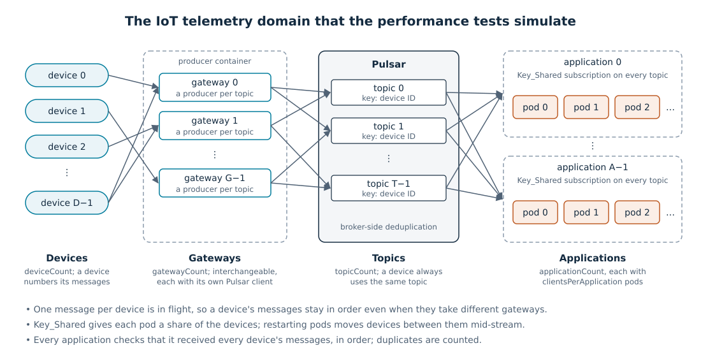

<!--

    Licensed to the Apache Software Foundation (ASF) under one
    or more contributor license agreements.  See the NOTICE file
    distributed with this work for additional information
    regarding copyright ownership.  The ASF licenses this file
    to you under the Apache License, Version 2.0 (the
    "License"); you may not use this file except in compliance
    with the License.  You may obtain a copy of the License at

      http://www.apache.org/licenses/LICENSE-2.0

    Unless required by applicable law or agreed to in writing,
    software distributed under the License is distributed on an
    "AS IS" BASIS, WITHOUT WARRANTIES OR CONDITIONS OF ANY
    KIND, either express or implied.  See the License for the
    specific language governing permissions and limitations
    under the License.

-->

# Performance testing

The performance tests are for running performance test experiments: measuring a change, comparing two revisions
and finding what to optimize. They run a Pulsar cluster and its client workloads in Docker containers on one host, as
a [scenario](scenarios/README.md) describes them, and write a report for every run: throughput, latency, delivery and
ordering checks, and the host's CPU temperature. A run can also be profiled with async-profiler, JDK Flight Recorder
and jonoffcpu at the same time, which gives CPU, allocation and off-CPU flame graphs of the broker and the clients:
both where threads use CPU and where they wait. Everything runs from the command line and writes its results to
files, so that experiments can be automated, including tuning by AI agents, which [`AGENTS.md`](AGENTS.md) guides.

For the performance of a single class or method, use [the JMH microbenchmarks](../../microbench/README.md) instead.

## How the tests work

The testing strategy is to simulate real-world use cases of Pulsar. A domain models a use case: who sends messages,
who consumes them, and what they need from the delivery, such as ordering. Scenarios then set the domain's scale and
behavior, such as the number of devices, the message rate or restarting clients, so that each scenario maps to a kind
of real-world deployment. A run shows how Pulsar performs for it, and whether the domain's delivery guarantees held.

Simulating a domain keeps the tests from becoming synthetic. A synthetic benchmark, such as a `pulsar-perf` producer
and consumer pair, measures one path through Pulsar under conditions that real deployments seldom have, so an
improvement in its results doesn't directly carry over to real-world use. A real deployment uses many features at
the same time, such as many producers and topics, keyed messages, batching, deduplication, Key_Shared subscriptions
and clients that restart, and it relies on delivery guarantees such as ordering. A simulated use case exercises the
same combination, so that:

- an improvement measured in a scenario is likely to show in the deployments that the scenario maps to, and
  bottlenecks that only appear when the features interact show up in the tests too
- every run checks the guarantees that the use case relies on, so that a change can't trade correctness for speed
  unnoticed
- the results are stated in the domain's terms, such as the number of devices and their message rate, which relate to
  sizing a real deployment

The scenarios can grow toward the operations of real deployments too. Today they restart application pods, and later
scenarios can add, for example, rolling restarts and upgrades of the Pulsar cluster while the traffic runs.

The current tests simulate an IoT telemetry domain. More domains can be added later, but that will need refactoring:
the workload applications in [`tools`](tools), the workload settings of the scenarios and the checks and sections of
the run report are written for the IoT domain.



### IoT domain glossary

- **Device**: a sensor or a machine that sends telemetry. It has an ID and numbers its messages, which have to be
  processed in the order it sent them.
- **Telemetry message**: a small reading from a device, with the device's ID and the message's sequence number.
- **Gateway**: an edge gateway that forwards the devices' messages to Pulsar. Gateways are interchangeable: a device's
  next message can go through another gateway.
- **Application**: a backend service, such as storage, alerting or analytics, that consumes the telemetry of every
  device, independently of the other applications.
- **Pod**: an instance of an application. An application's pods share its devices between them, and pods come and
  go, as in a rolling restart.

### How the domain is simulated

| Domain | Simulation |
|---|---|
| Device | A device ID, which is the message key. `deviceCount` sets the number of devices |
| Telemetry message | A message with the device ID, the device's sequence number and the send time, `payloadBytes` long |
| Gateway | A Pulsar client in the producer container, with a producer named `iot-gateway-<gateway>-topic-<topic>` for each topic. `gatewayCount` sets the number of gateways; their clients share I/O threads and memory, as the clients of one process can since PIP-234 |
| Topics | `topicCount` topics; a device's messages always go to the same topic, the device ID modulo `topicCount` |
| Application | A Key_Shared subscription on every topic, named `iot-application-<index>`, in a container of its own. `applicationCount` sets the number of applications |
| Pod | A Pulsar client with a consumer of the application's subscription, named `iot-application-<index>-pod-<pod>`. `clientsPerApplication` sets the number of pods per application |

- The producer sends each message from a random device through a random gateway, at `rate` messages per second, or as
  fast as it can when the rate is 0. It keeps one message per device in flight, as a device waits for its message to
  be acknowledged, so that a device's messages reach Pulsar in order even through different gateways. The producers
  batch messages by key, and the broker deduplicates them by producer name and sequence ID.
- `clientRestartFraction` and `clientRestartIntervalSeconds` restart some of each application's pods periodically,
  which moves devices between the pods mid-stream.
- Each application tracks the sequence of every device: it counts ordering violations, invalid messages and
  duplicates, which at-least-once delivery allows. At the end, the launcher compares each application's last
  sequence per device with the producer's, which catches messages missing at the end. A run fails when a check
  fails.
- Warmup messages take the same path as the measured ones before the measurement starts, and the delivery checks
  include them.

[The IoT telemetry scenario](scenarios/docs/iot-telemetry.md) describes the workload's settings and the maintained
scenarios in detail.

## Before you start

- **Docker** installed and running, and a JDK that builds Pulsar, see
  [the contributing guide](../../CONTRIBUTING.md).
- **Disk space**: keep the disk that holds Docker's data less than 90 % full. BookKeeper bookies switch to read-only
  mode when it is 95 % full. [`docker-cleanup.sh`](environment/scripts/docker-cleanup.sh) frees the space that test
  runs and image builds use up.
- **A host configured for consistent results** (Linux): turbo frequencies depend on the CPU's temperature, and power
  management changes CPU settings during a run, so results vary between runs of the same code.
  [The performance testing environment setup](environment/README.md) fixes the CPU frequency with a TuneD profile
  for the duration of the tests. Install it once, and start it before a series of runs:

  ```bash
  sudo tests/performance/environment/scripts/configure-perf-test-environment.sh install  # once
  sudo tests/performance/environment/scripts/configure-perf-test-environment.sh start    # before the runs
  sudo tests/performance/environment/scripts/configure-perf-test-environment.sh stop     # after the runs
  ```

  `tests/performance/environment/scripts/configure-perf-test-environment.sh validate` checks, without root, that the
  host is ready: that it's on AC power, has disk space and runs with the profile's settings.

Run the commands in the root directory of the repository.

## Tutorial

### 1. Run a scenario

Run the workstation-sized IoT telemetry scenario:

```bash
./gradlew :tests:performance:launcher:run \
  --args='--config tests/performance/scenarios/iot-telemetry-local.yaml'
```

Gradle builds the Pulsar test image and the workload applications first, when they are out of date. Then the
launcher starts a cluster of one broker and three bookies, and runs the workload:
[`iot-telemetry-local.yaml`](scenarios/iot-telemetry-local.yaml) sends keyed telemetry messages from 10 gateways to 30
topics, which 20 applications consume on Key_Shared subscriptions, for 20 seconds of warmup and 120 seconds of
measurement at 1,000 messages per second. It restarts some of the applications' clients every 30 seconds, and checks
that every application receives every message of every device in order.

The launcher prints the run directory when it starts, and the run report when it has finished:

```
Run directory: .../build/performance/2026-09-26/master/iot-telemetry-local/09-26-12-00-00
...
Run report: .../build/performance/2026-09-26/master/iot-telemetry-local/09-26-12-00-00/index.html
```

Every run gets a directory of its own under `build/performance`, by day, git branch, scenario and start time:
`build/performance/<yyyy-MM-dd>/<branch>/<scenario>/<MM-dd-HH-mm-ss>/`. To find the newest run later:

```bash
ls -dt build/performance/*/*/*/*/ | head -n 1
```

To keep the reports somewhere else, such as a directory that several checkouts share, set `performance.reportsDir`,
see [Where runs are written](docs/running-scenarios.md#where-runs-are-written).
[Finding the results of a run](docs/run-reports.md#finding-the-results-of-a-run) and
[Layout of a run directory](docs/run-reports.md#layout-of-a-run-directory) describe what's in a run directory.

### 2. Read the report

Open the run report, `index.html` in the run directory, in a browser; `README.md` beside it is the same report as
Markdown. Read it from the top:

1. **Correctness**: every application should have received every message, with no ordering violations and no
   invalid messages. A run that fails these checks isn't a valid measurement.
2. **Throughput** and **Latency**: the producer and delivered throughput, and the publish and end-to-end latency
   percentiles, with charts over the run.
3. **Host**: the CPU temperature and frequency during the measurement. The report says in bold when the CPU
   throttled; such a run isn't comparable to one that didn't throttle.

A run that fails, for example because an application didn't receive every message, stops with an error and writes no
report. [When a run fails](docs/run-reports.md#when-a-run-fails) describes where to look for the cause.

When the tests run on another machine, serve its reports over HTTP and browse them from your own:

```bash
./gradlew :tests:performance:report-tool:serveReports
```

[Run reports](docs/run-reports.md) describes every section and file of a run, and how to reach the server through
an SSH tunnel.

### 3. Change the workload

Try a single value with an environment variable, which overrides a setting of the scenario for one run:

```bash
PULSAR_PERFORMANCE_WORKLOADS_IOTTELEMETRY_RATE=5000 \
./gradlew :tests:performance:launcher:run \
  --args='--config tests/performance/scenarios/iot-telemetry-local.yaml'
```

To keep a workload, write it as a scenario that extends an existing one with the settings it changes.
[The scenarios](scenarios/README.md) lists the maintained scenarios and describes writing one.

### 4. Profile a run

The `profile` task runs a scenario with three recorders running at the same time in the broker and the clients:
[async-profiler](https://github.com/async-profiler/async-profiler) samples CPU time and allocations, JDK Flight
Recorder records the JVM's own events into the same recording, and
[jonoffcpu](https://github.com/jonoffcpu/jonoffcpu) records from the kernel the time each thread spent blocked. It
needs a Linux Docker engine. The profiling scenario saturates one topic from 500 producers:

```bash
./gradlew :tests:performance:launcher:profile \
  --args='--config tests/performance/scenarios/iot-telemetry-high-rate-profile.yaml'
```

The launcher renders the flame graphs itself when the run has finished, into the run directory next to the
recordings: the broker's under `broker-profile/`, and the producer's under `producer/`. The run report links to a
profile report for each of them. Start from the broker's: it links to the CPU, allocation and off-CPU flame graphs,
cut to the measurement, and to a digest that ranks the time threads spent blocked by the Pulsar or BookKeeper method
that waited. [Profiling](docs/profiling.md) describes the
requirements, the profiler options and the files, and [Analyzing profiles](docs/analyzing-profiles.md) how to find
what to optimize.

### 5. Compare two revisions

To find out whether a change makes Pulsar faster, run the same scenario on the baseline and on the candidate, a few
times each, alternating between them. Use a worktree for each revision, a separate Docker image tag for each, and the
same experiment name, so that the runs of both land next to each other:

```bash
# In the baseline worktree
./gradlew :tests:performance:launcher:run -Pdocker.tag=baseline \
  --args='--config tests/performance/scenarios/iot-telemetry-high-rate.yaml --name my-change-ab'

# In the candidate worktree
./gradlew :tests:performance:launcher:run -Pdocker.tag=candidate \
  --args='--config tests/performance/scenarios/iot-telemetry-high-rate.yaml --name my-change-ab'
```

[Comparing revisions](docs/comparing-revisions.md) describes preparing the worktrees and what to compare.

## Reference

- [Running scenarios](docs/running-scenarios.md): the Gradle tasks, the launcher's options and Gradle properties,
  where runs are written, and waiting for the CPU to cool down between runs.
- [Run reports](docs/run-reports.md): the sections and files of a run, the latency logs, and serving the reports over
  HTTP.
- [Scenarios](scenarios/README.md) and [the scenario format](scenarios/docs/scenario-format.md): the maintained
  scenarios, inheritance, environment overrides and the warmup.
- [Profiling](docs/profiling.md): the jonoffcpu profiler, its requirements and options, the files of a profiled run
  and the measurement recording.
- [Analyzing profiles](docs/analyzing-profiles.md): finding what to optimize, comparing profiles, the tools that
  read the recordings, including JDK Mission Control, the Jafar MCP server and its jafar-perf plugin, and
  [analyzing heap dumps](docs/analyzing-profiles.md#heap-dumps-and-memory-leaks).
- [Comparing revisions](docs/comparing-revisions.md): running an A/B comparison.
- [The performance testing environment setup](environment/README.md): configuring a Linux host for consistent
  results, and freeing Docker disk space.
- [The legacy TestNG profiling runner](docs/legacy-testng-runner.md): the deprecated `pulsar-perf` based runner
  and its scenarios.

## What's in this directory

| Directory | Contents |
|---|---|
| [`scenarios`](scenarios/README.md) | The scenario files and their guides |
| [`launcher`](launcher) | The standalone launcher, which runs a scenario's cluster and workloads with Testcontainers and collects the run |
| [`tools`](tools) | The workload applications, which run in the workload containers |
| [`common`](common) | The scenario loader, shared by the launcher and the workload applications |
| [`report-tool`](report-tool) | Writes the run and profile reports, charts and flame graphs, and serves the reports over HTTP |
| [`environment`](environment/README.md) | Scripts that configure the host for performance testing and free Docker disk space |
| [`docs`](docs) | The reference documentation |
