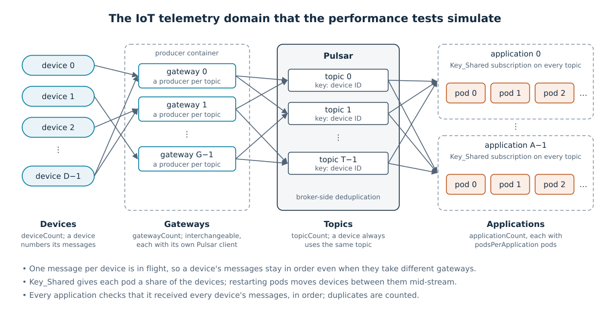

<!--

    Licensed to the Apache Software Foundation (ASF) under one
    or more contributor license agreements.  See the NOTICE file
    distributed with this work for additional information
    regarding copyright ownership.  The ASF licenses this file
    to you under the Apache License, Version 2.0 (the
    "License"); you may not use this file except in compliance
    with the License.  You may obtain a copy of the License at

      http://www.apache.org/licenses/LICENSE-2.0

    Unless required by applicable law or agreed to in writing,
    software distributed under the License is distributed on an
    "AS IS" BASIS, WITHOUT WARRANTIES OR CONDITIONS OF ANY
    KIND, either express or implied.  See the License for the
    specific language governing permissions and limitations
    under the License.

-->

# Performance testing

The performance tests are for running performance test experiments: measuring a change, comparing two revisions
and finding what to optimize. They run a Pulsar cluster and its client workloads in Docker containers on one host, as
a [scenario](scenarios/README.md) describes them, and write a report for every run: throughput, latency, delivery and
ordering checks, and the host's CPU temperature. A run can also be profiled with
[async-profiler](https://github.com/async-profiler/async-profiler),
[JDK Flight Recorder](https://docs.oracle.com/en/java/javase/25/troubleshoot/diagnostic-tools.html#GUID-D38849B6-61C7-4ED6-A395-EA4BC32A9FD6)
and [jonoffcpu](https://github.com/jonoffcpu/jonoffcpu) at the same time, which gives CPU, allocation and off-CPU
flame graphs of the broker and the clients: both where threads use CPU and where they wait. Everything runs from the
command line and writes its results to files, so that experiments can be automated, including tuning by AI agents,
which [`AGENTS.md`](AGENTS.md) guides.

The performance tests aren't currently used as automated regression tests: no CI job runs the scenarios, and no run
is checked against a baseline automatically. A person or an agent compares revisions, as
[Compare two revisions](#5-compare-two-revisions) describes. A future improvement is to evolve the tests into an
automated regression test suite, which would prevent performance regressions by checking changes against a baseline,
and set the new baseline when a change improves performance.

For the performance of a single class or method, use [the JMH microbenchmarks](../../microbench/README.md) instead.

## How the tests work

The testing strategy is to simulate real-world use cases of Pulsar. A domain models a use case: who sends messages,
who consumes them, and what they need from the delivery, such as ordering. Scenarios then set the domain's scale and
behavior, such as the number of devices, the message rate or restarting clients, so that each scenario maps to a kind
of real-world deployment. A run shows how Pulsar performs for it, and whether the domain's delivery guarantees held.

Simulating a domain keeps the tests from becoming synthetic. A synthetic benchmark, such as a `pulsar-perf` producer
and consumer pair, measures one path through Pulsar under conditions that real deployments seldom have, so an
improvement in its results doesn't directly carry over to real-world use. A real deployment uses many features at
the same time, such as many producers and topics, keyed messages, batching, deduplication, Key_Shared subscriptions
and clients that restart, and it relies on delivery guarantees such as ordering. A simulated use case exercises the
same combination, so that:

- an improvement measured in a scenario is likely to show in the deployments that the scenario maps to, and
  bottlenecks that only appear when the features interact show up in the tests too
- every run checks the guarantees that the use case relies on, so that a change can't trade correctness for speed
  unnoticed
- the results are stated in the domain's terms, such as the number of devices and their message rate, which relate to
  sizing a real deployment

The scenarios can grow toward the operations of real deployments too. Today they restart application pods, and later
scenarios can add, for example, rolling restarts and upgrades of the Pulsar cluster while the traffic runs.

The current tests simulate an IoT telemetry domain. More domains can be added later, but that will need refactoring:
the workload applications in [`tools`](tools), the workload settings of the scenarios and the checks and sections of
the run report are written for the IoT domain.



### IoT domain glossary

- **Device**: a sensor or a machine that sends telemetry. It has an ID and numbers its messages, which have to be
  processed in the order it sent them.
- **Telemetry message**: a small reading from a device, with the device's ID and the message's sequence number.
- **Gateway**: an edge gateway that forwards the devices' messages to Pulsar. Gateways are interchangeable: a device's
  next message can go through another gateway.
- **Application**: a backend service, such as storage, alerting or analytics, that consumes the telemetry of every
  device, independently of the other applications.
- **Pod**: an instance of an application. An application's pods share its devices between them, and pods come and
  go, as in a rolling restart.

### How the domain is simulated

| Domain | Simulation |
|---|---|
| Device | A device ID, which is the message key. `devices.count` sets the number of devices |
| Telemetry message | A message with the device ID, the device's sequence number and the send time, `payload.size` bytes long |
| Gateway | A Pulsar client in the gateways' container, with a producer named `iot-gateway-<gateway>-topic-<topic>` for each topic. `gateways.count` sets the number of gateways; their clients share I/O threads and memory, as the clients of one process can since PIP-234 |
| Topics | `topics.count` topics; a device's messages always go to the same topic, the device ID modulo `topics.count` |
| Application | A Key_Shared subscription on every topic, named `iot-application-<index>`, in the applications' container, which runs every application as the gateways' container runs every gateway. `applications.count` sets the number of applications; they differ only in their subscription |
| Pod | A Pulsar client in the applications' container, with a consumer of the application's subscription, named `iot-application-<index>-pod-<pod>`. `applications.podsPerApplication` sets the number of pods per application; the clients of every application's pods share I/O threads and memory, as the gateways' clients do |

- The gateways send each message from a random device through a random gateway, at `rate` messages per second, or as
  fast as they can when the rate is 0. It keeps one message per device in flight, as a device waits for its message to
  be acknowledged, so that a device's messages reach Pulsar in order even through different gateways. The producers
  batch messages by key, and the broker deduplicates them by producer name and sequence ID.
- `behaviors.podRestarts` restarts some of each application's pods periodically, which moves devices between the pods
  mid-stream.
- Each application tracks the sequence of every device: it counts ordering violations, invalid messages and
  duplicates, which at-least-once delivery allows. At the end, the launcher compares each application's last
  sequence per device with the gateways', which catches messages missing at the end. A run fails when a check
  fails.
- Warmup messages take the same path as the measured ones before the measurement starts, and the delivery checks
  include them.

[The IoT telemetry scenario](scenarios/docs/iot-telemetry.md) describes the workload's settings and the maintained
scenarios in detail.

## Before you start

- **A host with Docker**: the cluster and the workloads run in Linux containers, so the tests run on Linux and on
  macOS, and should on Windows with WSL 2 too. Both Linux and macOS work, including profiling with async-profiler,
  jonoffcpu's off-CPU profiling and JDK Flight Recorder, which were also tested on macOS arm64 with the
  [OrbStack](https://orbstack.dev/) Docker engine. Linux x86_64 is recommended: it is Pulsar's main target platform,
  and on dedicated hardware configured for performance testing a run has no noisy neighbours, such as the host
  operating system that shares a virtual machine's CPUs, and less thermal and power throttling and CPU frequency
  variance, as *Recommended: A Linux host configured for consistent results* below describes. jonoffcpu's off-CPU
  profiling needs a kernel with BTF, which not every Docker engine's kernel has; there, profile with async-profiler
  and JDK Flight Recorder only, see [Profiling](docs/profiling.md#requirements). The tooling was tested with these
  Docker engines:

  | Docker engine | Host | Status |
  |---|---|---|
  | [Docker Engine](https://docs.docker.com/engine/) | Pop!_OS 24.04 (Ubuntu-based) Linux, x86_64, 32 GB RAM | Tested: runs, profiling with async-profiler, jonoffcpu and JDK Flight Recorder, and metrics |
  | [OrbStack](https://orbstack.dev/) | macOS, Apple M3 Max (arm64), 36 GB RAM, with a 20 GB memory limit for OrbStack | Tested: runs, profiling with async-profiler, jonoffcpu and JDK Flight Recorder, and metrics |
  | [Docker Desktop](https://www.docker.com/products/docker-desktop/) | | Untested |
  | [Podman Desktop](https://podman-desktop.io/) | | Untested |
- **Memory**: 32 GB of RAM on the host is recommended, although testing may be possible with less. A scenario's memory
  configuration sets the heap and direct memory of the cluster's and the workloads' JVMs, and so the memory that the
  host has to have available to Docker, which on macOS and Windows is the memory of Docker's virtual machine. The IoT telemetry scenarios use the medium-memory configuration by default; see
  [Memory configurations](scenarios/README.md#memory-configurations):

  | Configuration | Recommended memory available to Docker | Used by |
  |---|---|---|
  | [`iot-telemetry-low-mem.yaml`](scenarios/configs/iot-telemetry-low-mem.yaml) | about 3 GB; not meant for profiling | `iot-telemetry-small.yaml` and `iot-telemetry-small-restarts.yaml` |
  | [`iot-telemetry-medium-mem.yaml`](scenarios/configs/iot-telemetry-medium-mem.yaml) | about 11 GB | the other IoT telemetry scenarios, by default |
  | [`iot-telemetry-high-mem.yaml`](scenarios/configs/iot-telemetry-high-mem.yaml) | about 14 GB | `iot-telemetry-high-rate.yaml` |
- **Disk space**: keep the disk that holds Docker's data less than 90 % full. BookKeeper bookies switch to read-only
  mode when it is 95 % full. [`docker-cleanup.sh`](environment/scripts/docker-cleanup.sh) frees the space that test
  runs and image builds use up.
- **Recommended: A Linux host configured for consistent results**: turbo frequencies depend on the CPU's temperature,
  and power management changes CPU settings during a run, so results vary between runs of the same code, and a change
  smaller than that variance can't be detected. [The performance testing environment setup](environment/README.md) fixes
  the CPU frequency with a [TuneD](https://tuned-project.org/) profile for the duration of the tests. Install it once,
  and start it before a series of runs:

  ```bash
  sudo tests/performance/environment/scripts/configure-perf-test-environment.sh install  # once
  sudo tests/performance/environment/scripts/configure-perf-test-environment.sh start    # before the runs
  sudo tests/performance/environment/scripts/configure-perf-test-environment.sh stop     # after the runs
  ```

  `tests/performance/environment/scripts/configure-perf-test-environment.sh validate` checks that the host is ready:
  that Docker's disk has space, on Linux and macOS, and on Linux also that the host is on AC power and runs with the
  profile's settings.
- **A reports root** that your checkouts share. Without one, each checkout writes its runs to its own
  `build/performance`, so the runs of two revisions in separate worktrees end up apart, and removing a worktree
  removes its runs. Set `performance.reportsDir` in `~/.gradle/gradle.properties`, which applies to every checkout
  and worktree on the machine. Use an absolute path, since a relative one resolves in each checkout, and Gradle
  doesn't expand `~` or `$HOME` in the file; the shell expands `$HOME` in this command:

  ```bash
  mkdir -p ~/.gradle
  echo "performance.reportsDir=$HOME/pulsar-performance-reports" >> ~/.gradle/gradle.properties
  ```

  The launcher creates the directory, and `serveReports` serves it. `-Pperformance.reportsDir=<dir>` overrides the
  setting for one command.

Run the commands in the root directory of the repository.

## Tutorial

### 1. Run a scenario

Run the IoT telemetry scenario:

```bash
./gradlew :tests:performance:launcher:run \
  --args='--scenario tests/performance/scenarios/iot-telemetry.yaml'
```

Gradle builds the Pulsar test image and the workload applications first, when they are out of date. Then the
launcher starts a cluster of one broker and two bookies, and runs the workload:
[`iot-telemetry.yaml`](scenarios/iot-telemetry.yaml) sends keyed telemetry messages from 100 gateways to 30 topics,
which 20 applications with 100 pods each consume on Key_Shared subscriptions, for 20 seconds of warmup and 120
seconds of measurement at 1,000 messages per second. It checks that every application receives every message of every
device in order. It extends [`iot-telemetry-base.yaml`](scenarios/iot-telemetry-base.yaml), which holds the defaults
of every IoT scenario: the workload's settings, with one gateway and one application with one pod, and the
medium-memory configuration, which sets the cluster and the memory of every container and needs about 11 GB of memory
available to Docker. On a host with less, run the smaller topology,
[`iot-telemetry-small.yaml`](scenarios/iot-telemetry-small.yaml), which needs about 3 GB.

The launcher prints the run directory and the scenario's resolved configuration when it starts, the phases of the
run as it goes, and the run report when it has finished. While the workload runs, it prints the gateways' and the
applications' progress every 10 seconds, as pulsar-perf does: the messages so far, the throughput, the latency
percentiles of the last 10 seconds, merged over every application, and the subscriptions' backlog. The logs of
Testcontainers and of the Pulsar containers go to `launcher.log` in the run directory instead of the console. A
successful run deletes the log at the end, since the containers' logs make it large, unless you pass
`-Pperformance.keepLauncherLog`; a failed run keeps it. What the launcher prints on the console, as below, is kept in
`console.log.txt` in the run directory:

```
Run directory: .../build/performance/2026-09-26/master/iot-telemetry/09-26-12-00-00
12:00:00 Logs: .../build/performance/2026-09-26/master/iot-telemetry/09-26-12-00-00/launcher.log
12:00:00 Scenario iot-telemetry (iot-telemetry.yaml), resolved:
  cluster:
    brokers:
      replicas: 1
      ...
12:00:00 Starting the Pulsar cluster: 1 broker(s), 2 bookie(s)
12:00:23 Started the Pulsar cluster in 23 s
12:00:23 Metrics: starting the metrics stack for this run, since it doesn't run
12:00:34 Metrics: VictoriaMetrics scrapes the brokers, the bookies and ZooKeeper every 5 s, as the cluster 2026-09-26/master/iot-telemetry/09-26-12-00-00
12:00:34 Starting 20 application(s) with 100 pod(s) each
12:00:40 The applications have opened 1,107 of 2,000 pods
12:00:45 The applications have opened 1,784 of 2,000 pods
12:00:49 Started the applications in 15 s
12:00:49 Starting the gateways: 20,000 warmup and 120,000 measured message(s) at 1,000 msg/s from 100 gateway(s) to 30 topic(s)
...
[01:12 measurement 40 s] Produced: 60,548 msg of 140,000 (43%) --- 1,000.9 msg/s --- 0.5 Mbit/s --- pending: 1 --- Latency: mean: 2.038 ms - med: 1.392 - 95pct: 5.463 - 99pct: 11.647 - 99.9pct: 22.079 - 99.99pct: 28.031 - Max: 28.063
[01:12 measurement 40 s] Received: 1,215,940 msg of 2,800,000 (43%) --- 20,016.4 msg/s --- 10.2 Mbit/s --- backlog: 1,161 msg (max per application: 66) --- Latency: mean: 5.361 ms - med: 2.000 - 95pct: 16.007 - 99pct: 40.031 - 99.9pct: 70.015 - 99.99pct: 81.023 - Max: 94.015
...
12:03:26 The gateways have finished; waiting for the applications to receive every message
12:03:34 Every application has received every message; verifying the device sequences
12:03:51 Metrics in Grafana: http://127.0.0.1:3000/d/EetmjdhnA/pulsar-messaging?orgId=1&var-cluster=2026-09-26%2Fmaster%2Fiot-telemetry%2F09-26-12-00-00&from=...&to=... (start the metrics stack with ./gradlew :tests:performance:metrics:up to view it)
12:03:52 Stopping the Pulsar cluster
Run report: .../build/performance/2026-09-26/master/iot-telemetry/09-26-12-00-00/index.html
Run report URL: http://127.0.0.1:8000/2026-09-26/master/iot-telemetry/09-26-12-00-00/
Deleted .../build/performance/2026-09-26/master/iot-telemetry/09-26-12-00-00/launcher.log of the successful run; --keep-launcher-log keeps it
```

Every run gets a directory of its own under the reports root, by day, git branch, scenario and start time:
`<reports root>/<yyyy-MM-dd>/<branch>/<scenario>/<MM-dd-HH-mm-ss>/`. The reports root is `performance.reportsDir`
when you set it as [Before you start](#before-you-start) describes, or else `build/performance` in the repository.
To find the newest run later, with the reports root in place of `build/performance` when you set one:

```bash
ls -dt build/performance/*/*/*/*/ | head -n 1
```

[Where runs are written](docs/running-scenarios.md#where-runs-are-written) describes the run directories' names.
[Finding the results of a run](docs/run-reports.md#finding-the-results-of-a-run) and
[Layout of a run directory](docs/run-reports.md#layout-of-a-run-directory) describe what's in a run directory.

### 2. Read the report

Open the run report, `index.html` in the run directory, in a browser; `README.md` beside it is the same report as
Markdown. Read it from the top:

1. **Correctness**: every application should have received every message, with no ordering violations and no
   invalid messages. A run that fails these checks isn't a valid measurement.
2. **Throughput** and **Latency**: the gateways' and the delivered throughput, and the publish and end-to-end latency
   percentiles, with charts over the run.
3. **Host**: the CPU temperature and frequency during the measurement. The report says in bold when the CPU
   throttled; such a run isn't comparable to one that didn't throttle.

A run that fails, for example because an application didn't receive every message, stops with an error and writes no
report. [When a run fails](docs/run-reports.md#when-a-run-fails) describes where to look for the cause.

To browse the reports in a browser, serve the reports root over HTTP:

```bash
./gradlew :tests:performance:report-tool:serveReports
```

Then open [http://127.0.0.1:8000/](http://127.0.0.1:8000/) and follow the directory listings to a run. These
properties in `~/.gradle/gradle.properties`, or `-P` options on the command line, configure the server:

| Property | Default | Sets |
|---|---|---|
| `performance.reportsDir` | `build/performance` | The reports root that it serves |
| `performance.reportsServer.bindAddress` | `127.0.0.1` | The address that it binds to |
| `performance.reportsServer.port` | `8000` | The port that it listens on |
| `performance.reportsServer.baseUrl` | from the address and port | The URL that the reports are reached at, such as `http://192.168.1.123:8000/` |

The default address makes the server reachable only from the machine that it runs on. When the tests run on another
machine, run `serveReports` there, and to browse the reports from your own machine, do one of these:

- Set `performance.reportsServer.bindAddress=0.0.0.0` in `~/.gradle/gradle.properties` on the machine that runs the
  tests, or pass it with `-P`, which makes the server available on the network, at the machine's host name or IP
  address. The server has no authentication, so do that only on a trusted network.
- Keep the default address and reach the server through an SSH tunnel, as
  [Browsing the reports over HTTP](docs/run-reports.md#browsing-the-reports-over-http) describes.

The launcher prints each report's URL on the server beside its file, as `Run report URL:`, which opens with a click
in most terminals. It is the base URL with the report's path in the reports root appended:
`performance.reportsServer.baseUrl`, else `http://<bind address>:<port>/`. With the bind address `0.0.0.0`, it is the
address of the host's first network interface with an IPv4 address; on a host with several interfaces, set
`performance.reportsServer.baseUrl` to the one that you reach it at.

[Run reports](docs/run-reports.md) describes every section and file of a run.

To see a run's broker, bookie and ZooKeeper metrics on Grafana's Pulsar dashboards, start the metrics stack, before or
after the run, which keeps running in the background until `./gradlew :tests:performance:metrics:down` stops it:

```bash
./gradlew :tests:performance:metrics:up
```

A run collects its metrics into the stack, or starts the stack for itself when it doesn't run. At its end, it marks
its events in Grafana, such as the end of the warmup, renders panels of the dashboards into its report, and prints a
link to the run in Grafana, `Metrics in Grafana:`, which opens while the stack runs. [Metrics](docs/metrics.md)
describes the stack, what a run collects, and `metrics.json`, with which scripts and agents query the run's metrics.

### 3. Change the workload

Try a single value with `--set`, which changes a setting of the scenario for one run:

```bash
./gradlew :tests:performance:launcher:run \
  --args='--scenario tests/performance/scenarios/iot-telemetry.yaml --set workloads.iotTelemetry.rate=5000'
```

[Settings on the command line](scenarios/docs/scenario-format.md#settings-on-the-command-line) describes `--set`, and
the environment variables that set a value too.

To keep a workload, write it as a scenario that extends an existing one with the settings it changes.
[The scenarios](scenarios/README.md) lists the maintained scenarios and describes writing one.

### 4. Profile a run

The `profile` task runs a scenario with three recorders running at the same time in the broker and the clients:
[async-profiler](https://github.com/async-profiler/async-profiler) samples CPU time and allocations,
[JDK Flight Recorder](https://docs.oracle.com/en/java/javase/25/troubleshoot/diagnostic-tools.html#GUID-D38849B6-61C7-4ED6-A395-EA4BC32A9FD6)
records the JVM's own events into the same recording, and
[jonoffcpu](https://github.com/jonoffcpu/jonoffcpu) records from the kernel the time each thread spent blocked. It
needs a Docker engine whose kernel has BTF, such as a Linux host's or [OrbStack](https://orbstack.dev/)'s on macOS, see
[Requirements](docs/profiling.md#requirements). The profiling scenario publishes 30,000 messages per second to one topic from 500
producers, and needs about 14 GB of memory available to Docker:

```bash
./gradlew :tests:performance:launcher:profile \
  --args='--scenario tests/performance/scenarios/iot-telemetry-high-rate.yaml --extends configs/profile-broker --extends configs/profile-gateways'
```

The launcher renders the flame graphs itself when the run has finished, into the run directory next to the
recordings: the broker's under `broker-profile/`, and the gateways' under `gateways/`. The run report's Profiles
section links each of them directly: its jonoffcpu report (off-CPU summary), its profile report, and its blocked
time, CPU and allocation flame graphs, cut to the measurement. The broker's jonoffcpu report is a digest that ranks the
time threads spent blocked by the Pulsar or BookKeeper method that waited. The blocked time flame graphs show the same
time as call trees, to inspect visually which code paths lead to the blocking methods.

Each of the profile files in the scenarios' `configs` directory profiles one component: `configs/profile-broker`,
`configs/profile-gateways` and `configs/profile-applications`;
[`profile-broker.yaml`](scenarios/configs/profile-broker.yaml) is an example of the settings. To study the performance
of Pulsar's Java client, profile the gateways and the applications, which are its producers and consumers under the
workload, with `--extends configs/profile-gateways --extends configs/profile-applications`. Don't profile a scenario
that uses the low-memory configuration, such as `iot-telemetry-small.yaml`.
[Profiling](docs/profiling.md) describes the requirements, the profiler options and the files, and
[Analyzing profiles](docs/analyzing-profiles.md) how to find what to optimize.

#### Inspect profile artifacts

The flame graphs' collapsed stacktrace files (`.collapsed`), also called folded stacktrace files (`.folded`), can be
handled with multiple tools. jonoffcpu's jfr-converter renders them as HTML flame graphs and runs through Gradle
with no separate installation. Pass any converter options with `--args`; use `--args='--help'` to list them:

```bash
./gradlew -q :tests:performance:report-tool:runJfrConverter \
  --args='/path/to/recording-offcpu/offcpu-no-idle-app-root.collapsed /path/to/offcpu.html'
```

Another particularly useful option is [flameshow](https://github.com/laixintao/flameshow), a terminal user interface
(TUI) for exploring flame graphs, with keyboard navigation and zooming. After installing it as its README describes,
open a collapsed stack file:

```bash
flameshow /path/to/recording-offcpu/offcpu-no-idle-app-root.collapsed
```

[Inferno](https://github.com/jonhoo/inferno) includes `inferno-flamegraph`, which converts collapsed stacks to SVG
flame graphs. With Rust's Cargo installed, install Inferno and convert a file:

```bash
cargo install inferno
inferno-flamegraph < /path/to/recording-offcpu/offcpu-no-idle-app-root.collapsed > offcpu.svg
```

For SQL analysis, DuckDB's [quack_flamegraph](https://github.com/kevintruong/quack-flamegraph) community extension
reads collapsed stacks as tables. See [Analysing collapsed stacktrace files with DuckDB and quack_flamegraph](docs/analyzing-profiles.md#analysing-collapsed-stacktrace-files-with-quack_flamegraph)
for setup and examples that rank stacks, methods and call edges, and attribute samples to application frames.

The JFR recordings also open in JDK Mission Control, whose OpenJDK distribution is
[Eclipse Mission Control](https://adoptium.net/jmc). The JDK's
[Troubleshoot Performance Issues Using Flight Recorder](https://docs.oracle.com/en/java/javase/25/troubleshoot/troubleshoot-performance-issues-using-jfr.html#GUID-0FE29092-18B5-4BEB-8D8D-0CBA7A4FEA1D)
guide describes finding performance issues in a recording with it.

### 5. Compare two revisions

To find out whether a change makes Pulsar faster, run the same scenario on the baseline and on the candidate, a few
times each, alternating between them. Use a worktree for each revision, a separate Docker image tag for each, and the
same experiment name, so that the runs of both land next to each other in the reports root that the worktrees share,
as [Before you start](#before-you-start) describes:

```bash
# In the baseline worktree
./gradlew :tests:performance:launcher:run -Pdocker.tag=baseline \
  --args='--scenario tests/performance/scenarios/iot-telemetry-high-rate.yaml --name my-change-ab'

# In the candidate worktree
./gradlew :tests:performance:launcher:run -Pdocker.tag=candidate \
  --args='--scenario tests/performance/scenarios/iot-telemetry-high-rate.yaml --name my-change-ab'
```

[Comparing revisions](docs/comparing-revisions.md) describes preparing the worktrees and what to compare.

To compare with a released Pulsar instead, run the baseline from the same checkout with
`-Pperformance.clusterPulsarImage`, which runs ZooKeeper, the bookies and the brokers on an Alpine-based Pulsar image,
such as the latest release or a particular one. The workloads, and so the Pulsar client, stay on the checkout:

```bash
# The latest release
./gradlew :tests:performance:launcher:run -Pperformance.clusterPulsarImage=apachepulsar/pulsar:latest \
  --args='--scenario tests/performance/scenarios/iot-telemetry-high-rate.yaml --name my-change-ab'

# A particular release
./gradlew :tests:performance:launcher:run -Pperformance.clusterPulsarImage=apachepulsar/pulsar:4.0.13 \
  --args='--scenario tests/performance/scenarios/iot-telemetry-high-rate.yaml --name my-change-ab'
```

[Comparing with a released Pulsar](docs/comparing-revisions.md#comparing-with-a-released-pulsar) describes the
details.

## Reference

- [Running scenarios](docs/running-scenarios.md): the Gradle tasks, the launcher's options and Gradle properties,
  where runs are written, and waiting for the CPU to cool down between runs.
- [Run reports](docs/run-reports.md): the sections and files of a run, the latency logs, and serving the reports over
  HTTP.
- [Scenarios](scenarios/README.md) and [the scenario format](scenarios/docs/scenario-format.md): the maintained
  scenarios, inheritance, environment overrides and the warmup.
- [Profiling](docs/profiling.md): the jonoffcpu profiler, its requirements and options, the files of a profiled run
  and the measurement recording.
- [Metrics](docs/metrics.md): the metrics stack, VictoriaMetrics and Grafana with the Pulsar dashboards, which collects
  the metrics of the brokers, the bookies and ZooKeeper during runs, and renders Grafana's panels as images.
- [Heap dumps](docs/heap-dumps.md): heap dumps of the broker, the gateways and the applications when they run out of
  memory, at the highest heap usage and at given times.
- [Analyzing profiles](docs/analyzing-profiles.md): finding what to optimize, comparing profiles,
  [flame graphs of other recordings](docs/analyzing-profiles.md#flame-graphs-of-other-recordings), such as those of
  profiled tests, integration tests and benchmarks, the tools that read the recordings, including JDK Mission Control
  and [AI agents](docs/analyzing-profiles.md#ai-agent-analysis), and
  [analyzing heap dumps](docs/analyzing-profiles.md#heap-dumps-and-memory-leaks).
- [Comparing revisions](docs/comparing-revisions.md): running an A/B comparison.
- [The performance testing environment setup](environment/README.md): configuring a Linux host for consistent
  results, and freeing Docker disk space.
- [The legacy TestNG profiling runner](docs/legacy-testng-runner/README.md): the deprecated `pulsar-perf` based runner
  and its scenarios.

## What's in this directory

| Directory | Contents |
|---|---|
| [`scenarios`](scenarios/README.md) | The scenario files and their guides |
| [`launcher`](launcher) | The standalone launcher, which runs a scenario's cluster and workloads with Testcontainers and collects the run |
| [`tools`](tools) | The workload applications, which run in the workload containers |
| [`common`](common) | The scenario loader, shared by the launcher and the workload applications |
| [`metrics`](metrics) | The metrics stack, VictoriaMetrics and Grafana, which Docker Compose runs from its compose file, and the collection of a run's metrics |
| [`report-tool`](report-tool) | Writes the run and profile reports, charts and flame graphs, and serves the reports over HTTP |
| [`environment`](environment/README.md) | Scripts that configure the host for performance testing and free Docker disk space |
| [`docs`](docs) | The reference documentation |
