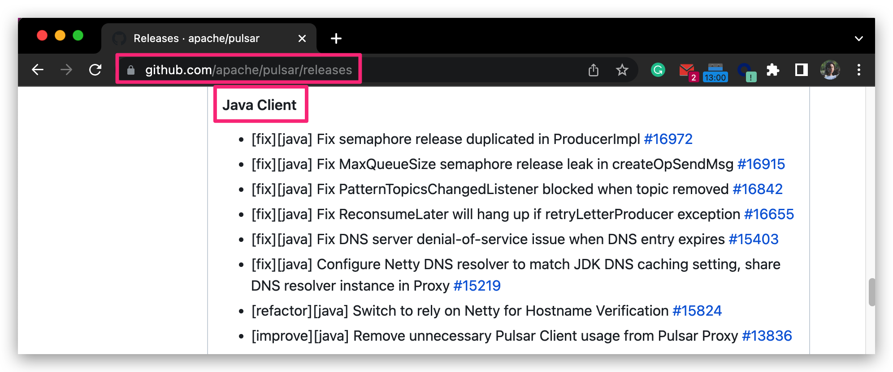

# Pulsar Release Note Guide

This guide explains everything about Pulsar release notes.

<!-- TOC -->
- [Intro to release notes](#intro-to-release-notes)
  - [Basic info](#basic-info)
  - [Maintenance info](#maintenance-info)
- [Submit release notes](#submit-release-notes)

<!-- /TOC -->

## Intro to release notes

This chapter gives an overview of Pulsar release notes.

### Basic info

[Pulsar release notes](https://pulsar.apache.org/release-notes/) consist of the following parts.

Release note | Component
---|---
[Pulsar core](https://pulsar.apache.org/release-notes/#pulsar-release-notes)| Pulsar
[Pulsar clients](../../site2/docs/client-libraries.md) |- Java    - WebSocket    - C++    - Python    - Go    - NodeJs    - C#

### Maintenance info

For the [Pulsar Release Note page](https://pulsar.apache.org/release-notes/):

- It is generated automatically using [release-json-gen.sh](https://github.com/apache/pulsar-site/blob/main/site2/tools/release-json-gen.sh).
  
  For implementation details, see [PIP 112: Generate Release Notes Automatically](https://github.com/apache/pulsar/wiki/PIP-112:-Generate-Release-Notes-Automatically).

- The info is fetched from the [Pulsar Releases Page - GitHub](https://github.com/apache/pulsar/releases).
  
- It is updated when one of the following conditions is met:

  - A commit is pushed to the [pulsar-site repo](https://github.com/apache/pulsar-site). 
  
  - A [Pulsar site sync job](https://github.com/apache/pulsar-site/actions/workflows/ci-pulsar-website-docs-sync.yaml) is performed (every 6 hours).

## Submit release notes

Follow the steps below to submit release notes for Pulsar and clients (**Java and WebSocket**).

> **Note**
>
> For **C++, Python, Go, Node.js, and C#**, you do not need to take care of them since their release notes are synced from their repos to the [Pulsar Release Note page](https://pulsar.apache.org/release-notes).

1. Submit a PR to add **separate** release notes for Pulsar and clients (**Java and WebSocket**) to [pulsar-site/site2/website-next/release-notes/versioned/](https://github.com/apache/pulsar-site/tree/main/site2/website-next/release-notes/versioned). 

    Get this PR reviewed and merged.

2. Copy the release note to the [Pulsar Releases Page - GitHub](https://github.com/apache/pulsar/releases).

    <table>
    <thead>
      <tr>
        <th colspan="2">Component</th>
        <th>Step</th>
      </tr>
    </thead>
    <tbody>
      <tr>
        <td colspan="2">Pulsar core</td>
        <td>Copy the release note content.</td>
      </tr>
      <tr>
        <td rowspan="2">Pulsar clients</td>
        <td> - Java   - WebSocket    
        <td>Create independent sections for each client and copy release note content.  Example  </td>
      </tr>
    </tbody>
    </table>

    After the new release is published, all the information about the release is automatically added to the [Pulsar Release Note page](https://pulsar.apache.org/release-notes/).

3. Check whether the release information is shown on the [Pulsar Release Note page](https://pulsar.apache.org/release-notes/) after the website is updated and built successfully.